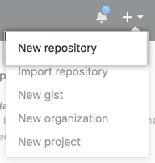

# GitHub

## Hello World

GitHub 是一个用于**版本控制和协作的代码托管平台**。它允许您和其他人从任何地方共同处理项目。

本教程教你 GitHub 基础知识，如存储库、分支、提交和拉取请求。您将创建自己的 Hello World 存储库，并了解 GitHub 的拉取请求工作流，这是一种创建和审查代码的常用方法。

在本快速入门指南中，你将：

-   创建和使用存储库
-   启动和管理新分支
-   对文件进行更改并将其作为提交推送到 GitHub
-   打开并合并拉取请求

若要完成本教程，需要 [GitHub 帐户](http://github.com/)和互联网访问权限。你不需要知道如何编码、使用命令行或安装 Git（GitHub 构建的版本控制软件）。如果您对本指南中使用的任何表达方式有疑问，请前往[词汇表](https://docs.github.com/en/get-started/quickstart/github-glossary)以了解有关我们术语的更多信息。

## 创建存储库

存储库通常用于组织单个项目。存储库可以包含文件夹和文件、图像、视频、电子表格和数据集 - 您的项目需要的任何内容。通常，存储库包括一个自述文件，一个包含有关项目信息的文件。自述文件以纯文本Markdown语言编写。您可以使用此[备忘单](https://www.markdownguide.org/cheat-sheet/)开始使用 Markdown 语法。GitHub 允许您在创建新存储库的同时添加自述文件。GitHub 还提供其他常见选项，例如许可证文件，但您现在不必选择其中任何一个。

您的仓库可以是您存储想法、资源甚至与他人共享和讨论内容的地方。`hello-world`

1.   在任何页面的右上角，使用下拉菜单，然后选择新建**存储库**

     

2.   在“**存储库名称**”框中，输入 。`hello-world`

3.   在“说明”框中，编写简短**说明**。

4.   选择**添加自述文件**。

5.   选择您的仓库是**“公共**”还是**“私有**”。

6.   单击**创建存储库**。

     

## 创建分支

分支允许您同时拥有存储库的不同版本。

默认情况下，您的存储库有一个名为`main`的分支，该分支被视为最终分支。您可以在存储库中创建其他分支。可以使用分支一次拥有项目的不同版本。当您想要在不更改主代码源的情况下向项目添加新功能时，这非常有用。在合并主分支之前，在不同分支上完成的工作不会显示在主分支上，我们将在本指南的后面介绍。您可以使用分支进行试验和编辑，然后再将其提交到`main` 。

当您从分支创建分支时，您正在创建当时的副本或快照。如果其他人在您处理分支时对分支进行了更改，则可以提取这些更新。`main``main``main`

下图显示：

-   分行`main`
-   一个名为`feature`
-   合并到之前所经历的旅程`feature``main`

您是否曾经保存过文件的不同版本？像这样：

-   `story.txt`
-   `story-edit.txt`
-   `story-edit-reviewed.txt`

分支在 GitHub 存储库中实现类似的目标。

在 GitHub，我们的开发人员、作家和设计师使用分支将错误修复和功能工作与我们的（生产）分支分开。更改准备就绪后，他们将其分支合并到 .`main`

### 创建分支

1.  单击存储库**的代码选项卡。**`hello-world`

2.  在文件列表上方，单击显示 **main** 的下拉菜单。

    

3.  在文本框中键入分支名称 。`readme-edits`

4.  单击**创建分支：从主目录编辑自述文件**。

现在您有两个分支，现在，它们看起来一模一样。接下来，您将向新分支添加更改。`main``readme-edits`

## 进行更改和提交更改

在上一步中创建新分支时，GitHub 会将您带到新分支的代码页，该代码页是 `main`的副本。

您可以对存储库中的文件进行更改并保存更改。在 GitHub 上，保存的更改称为提交。每个提交都有一个关联的提交消息，该消息是解释为什么进行特定更改的描述。提交消息捕获更改的历史记录，以便其他贡献者可以了解您所做的工作和原因。

1.  在您创建的分支下，单击 *README.md* 文件。`readme-edits`

2.  单击以编辑文件。

3.  在编辑器中，写一些关于你自己的信息。尝试使用不同的 Markdown 元素。

4.  在“提交更改”框中，编写描述**更改的提交**消息。

5.  单击提交**更改**。

    

这些更改将仅对分支上的自述文件进行，因此现在此分支包含与 `main`不同的内容。

## 打开拉取请求

现在，您在`main` 的分支中发生了更改，您可以打开拉取请求。

拉取请求是 GitHub 上协作的核心。当您打开拉取请求时，您正在提出您的更改，并请求某人审阅和拉取您的贡献并将其合并到他们的分支中。拉取请求显示来自两个分支的内容的差异或差异。更改、添加和减少以不同的颜色显示。

提交后，即使在代码完成之前，也可以打开拉取请求并开始讨论。

通过在拉取请求消息中使用 GitHub 的功能，您可以向特定人员或团队征求反馈，无论他们是在大厅里还是 10 个时区之外。`@mention`

您甚至可以在自己的存储库中打开拉取请求并自行合并它们。这是在处理大型项目之前学习 GitHub 流程的好方法。

1.  单击存储库的**拉取请求**选项卡。`hello-world`

2.  单击**“新建拉取请求**”

3.  在“**示例比较**”框中，选择要与（原始）进行比较的分支。`readme-edits``main`

4.  在“比较”页面上查看差异中的更改，确保它们是您要提交的内容。

    

5.  单击创建**拉取请求**。

6.  为您的拉取请求指定标题，并简要说明您的更改。您可以包含表情符号以及拖放图像和 GIF。

7.  （可选）在标题和说明的右侧，单击审阅者旁边的**审阅者**。**被分派人**、**标签**、**项目**或**里程碑**，以将这些选项中的任何一个添加到拉取请求中。您还不需要添加任何内容，但这些选项提供了使用拉取请求进行协作的不同方式。更多信息请参阅“[关于拉取请求](https://docs.github.com/en/pull-requests/collaborating-with-pull-requests/proposing-changes-to-your-work-with-pull-requests/about-pull-requests)”。

8.  单击创建**拉取请求**。

您的协作者现在可以查看您的编辑并提出建议。

## 合并拉取请求

在最后一步中，您将分支合并到分支中。合并拉取请求后，分支上的更改将合并到 .`readme-edits``main``readme-edits``main`

有时，拉取请求可能会引入与 上的现有代码冲突的代码更改。如果存在任何冲突，GitHub 将提醒您有关冲突代码的信息，并阻止合并，直到冲突得到解决。您可以提交以解决冲突，也可以使用拉取请求中的注释与团队成员讨论冲突。`main`

在本演练中，您应该没有任何冲突，因此您已准备好将分支合并到主分支中。

1.  单击“合并**拉取请求**”将更改合并到 。`main`
2.  单击**确认合并**。您将收到一条消息，指出请求已成功合并，请求已关闭。
3.  单击**删除分支**。现在您的拉取请求已合并并且您的更改已打开，您可以安全地删除分支。如果要对项目进行更多更改，可以随时创建新分支并重复此过程。`main``readme-edits`

# 设置 Git

## 在本文中

-   使用 Git
-   设置 Git
-   从 Git 使用 GitHub 进行身份验证
-   后续步骤

GitHub的核心是一个名为Git的开源版本控制系统（VCS）。**Git 负责在您的计算机上本地发生的所有与 GitHub 相关的事情。**

## 使用 Git

要在命令行上使用 Git，您需要在计算机上下载、安装和配置 Git。您还可以安装 GitHub CLI 以从命令行使用 GitHub。更多信息请参阅“[关于 GitHub CLI](https://docs.github.com/en/github-cli/github-cli/about-github-cli)”。

如果您想在本地使用 Git，但不想使用命令行，则可以下载并安装 [GitHub Desktop](https://desktop.github.com/) 客户端。更多信息请参阅“[安装和配置 GitHub 桌面](https://docs.github.com/en/desktop/installing-and-configuring-github-desktop)”。

如果您不需要在本地处理文件，GitHub 允许您直接在浏览器中完成许多与 Git 相关的操作，包括：

-   [创建存储库](https://docs.github.com/en/get-started/quickstart/create-a-repo)
-   [分叉存储库](https://docs.github.com/en/get-started/quickstart/fork-a-repo)
-   [管理文件](https://docs.github.com/en/repositories/working-with-files/managing-files)
-   [善于社交](https://docs.github.com/en/get-started/quickstart/be-social)

## 设置 Git

1.  [下载并安装最新版本的 Git](https://git-scm.com/downloads)。

    **注意**：如果您使用的是 Chrome 操作系统设备，则需要进行其他设置：

    1.  在您的 Chrome OS 设备上安装终端模拟器，例如 Google Play 商店中的 Termux。
    2.  从您安装的终端模拟器中，安装 Git。例如，在 Termux 中，输入，然后在出现提示时键入。`apt install git``y`

2.  [在 Git 中设置您的用户名](https://docs.github.com/en/get-started/getting-started-with-git/setting-your-username-in-git)。

3.  [在 Git 中设置提交电子邮件地址](https://docs.github.com/en/account-and-profile/setting-up-and-managing-your-personal-account-on-github/managing-email-preferences/setting-your-commit-email-address)。

## 从 Git 使用 GitHub 进行身份验证

当您从 Git 连接到 GitHub 存储库时，您需要使用 HTTPS 或 SSH 向 GitHub 进行身份验证。

**注意：**您可以使用 GitHub CLI 对 HTTP 或 SSH 进行身份验证。有关详细信息，请参阅 [`gh 身份验证登录`](https://cli.github.com/manual/gh_auth_login)。

### 通过 HTTPS 连接（推荐）

如果使用 HTTPS 克隆，则可以使用凭据帮助程序在 Git 中缓存 GitHub 凭据。更多信息请参阅“[关于远程仓库](https://docs.github.com/en/get-started/getting-started-with-git/about-remote-repositories#cloning-with-https-urls)”和“[在 Git 中缓存 GitHub 凭据](https://docs.github.com/en/get-started/getting-started-with-git/caching-your-github-credentials-in-git)”。

### 通过 SSH 连接

如果使用 SSH 克隆，则必须在用于从 GitHub 推送或拉取的每台计算机上生成 SSH 密钥。更多信息请参阅“[关于远程存储库](https://docs.github.com/en/get-started/getting-started-with-git/about-remote-repositories#cloning-with-ssh-urls)”和“[生成新的 SSH 密钥并将其添加到 ssh-agent](https://docs.github.com/en/authentication/connecting-to-github-with-ssh/generating-a-new-ssh-key-and-adding-it-to-the-ssh-agent)”。

## 后续步骤

您现在已经设置了 Git 和 GitHub。您现在可以选择创建一个存储库，您可以在其中放置项目。通过将代码保存在存储库中，您可以备份代码并在全球范围内共享。

-   通过为项目创建存储库，可以在 GitHub 中存储代码。这提供了您的工作备份，您可以选择与其他开发人员共享。更多信息请参阅“[创建存储库](https://docs.github.com/en/get-started/quickstart/create-a-repo)”。
-   分叉存储库将允许您对另一个存储库进行更改，而不会影响原始存储库。更多信息请参阅“分[叉存储库](https://docs.github.com/en/get-started/quickstart/fork-a-repo)”。
-   GitHub 上的每个仓库都归个人或组织所有。您可以通过在 GitHub 上连接和关注人员、仓库和组织来与他们进行交互。更多信息请参阅“[社交”。](https://docs.github.com/en/get-started/quickstart/be-social)
-   GitHub 有一个很棒的支持社区，您可以在其中寻求帮助并与来自世界各地的人们交谈。加入 [GitHub 社区](https://github.com/orgs/community/discussions)的对话。