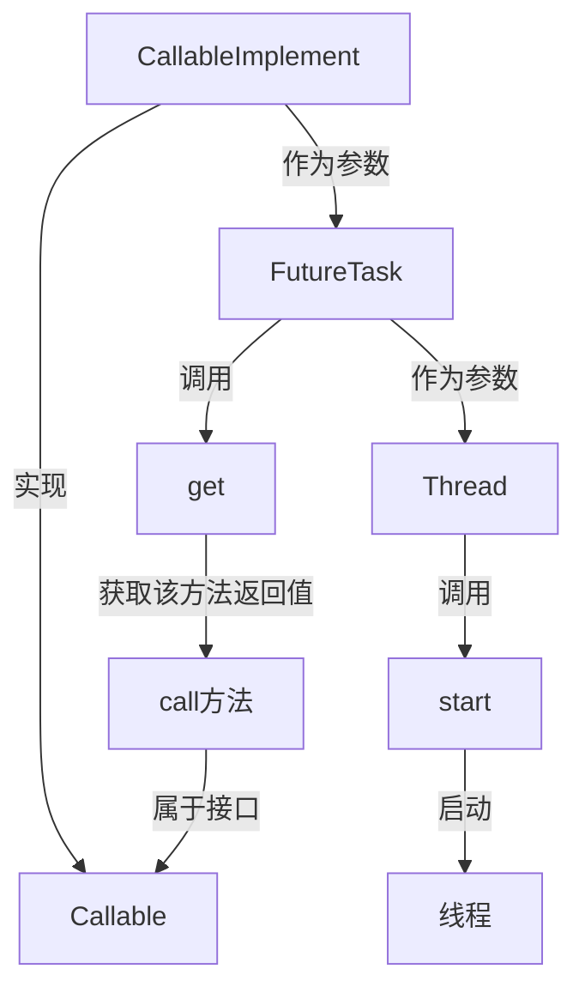

[TOC]

# Java 基础


## 一、Java语言概述

### 1.1 Java技术体系平台

**Java SE(Java Standard Edition)标准版**

​		支持面向桌面级应用（如Windows下的应用程序）的Java平台，提供了完整的Java核 

心API，此版本以前称为J2SE

**Java EE(Java Enterprise Edition)企业版**

​		是为开发企业环境下的应用程序提供的一套解决方案。该技术体系中包含的技术如

:Servlet 、Jsp等，主要针对于Web应用程序开发。版本以前称为J2EE

**Java ME(Java Micro Edition)小型版**

​		支持Java程序运行在移动终端（手机、PDA）上的平台，对Java API有所精简，并加

入了针对移动终端的支持，此版本以前称为J2ME

**Java Card**

​		支持一些Java小程序（Applets）运行在小内存设备（如智能卡）上的平台

### 1.2 Java语言的特点

==**特点一：面向对象**==

​		两个基本概念：类、对象

​		三大特性：封装、继承、多态

==**特点二：健壮性**==

​		吸收了C/C++语言的优点，但去掉了其影响程序健壮性的部分（如指针、内存的申请与

释放等），提供了一个相对安全的内存管理和访问机制

==**特点三：跨平台性**==

​		跨平台性：通过Java语言编写的应用程序在不同的系统平台上都可以运行。“Write 

once , Run Anywhere” 

​		原理：只要在需要运行 java 应用程序的操作系统上，先安装一个Java虚拟机 (JVM Java 

Virtual Machine) 即可。由JVM来负责Java程序在该系统中的运行。


> 因为有了 JVM ，同一个 Java 程序在三个不同的操作系统中都可以执行。这样就实现了 Java 程序的跨平台性

**Java两种核心机制**

- Java虚拟机 (Java Virtal Machine) 

- 垃圾收集机制 (Garbage Collection)

**什么是JDK，JRE**

==JDK(Java Development Kit Java开发工具包)==

JDK是提供给Java开发人员使用的，其中包含了java的开发工具，也包括了JRE。所以安装了JDK，就不用在单独安装JRE了。

其中的开发工具：编译工具(javac.exe) 打包工具(jar.exe)等

==JRE(Java Runtime Environment Java运行环境)==

包括Java虚拟机(JVM Java Virtual Machine)和Java程序所需的核心类库等，如果想要运行一个开发好的Java程序，计算机中只需要安装JRE即可。


### 1.3 Java编译运行过程

步骤：

1. 将 Java 代码**编写**到扩展名为 .java 的文件中。

2. 通过 javac 命令对该 java 文件进行**编译**,生成.class文件。

3. 通过 java 命令对生成的 .class 文件进行**运行**。


> 字节码文件名是.java文件的**类名**

### 1.4 第一个Java程序

```java
public class Test{
	public static void main(String[] args) {
		System.out.println(“Hello World!”);
	} 
}
```

### 1.5 注释

> 用于注解说明解释程序的文字就是注释。

Java中的注释类型：

​	 **单行注释**

​	 **多行注释**

​	 **文档注释 (java特有)** 

提高了代码的阅读性；调试程序的重要方法。 注释是一个程序员必须要具有的良好编程习惯。将自己的思想通过注释先整理出来，再用代码去体现

#### 1.5.1 单行注释

```java
 //注释文字
```

#### 1.5.2 多行注释

```java
/* 注释文字 */ 
```

#### 1.5.3 文档注释（Java特有）

```java
/**
@author 指定java程序的作者
@version 指定源文件的版本
*/
```

> 注释内容可以被JDK提供的工具 javadoc 所解析，生成一套以网页文件形式体现的该程序的说明文档。


### 1.6 总结

>在一个java源文件中可以声明多个类，但是只有一个类可以被修饰为public的，而且要求声明为public的类的类名和源文件名相同
>
>程序的入口是main()方法
>
>编译的过程会生成一个或多个字节码文件。字节码文件的文件名与java源文件中的类名相同 (那么是一个类对应一个字节码文件？)

------


## 二、Java基本语法

### 2.1 关键字和保留字

**关键字(keyword)的定义和特点**

定义：被Java语言赋予了特殊含义，用做专门用途的字符串（单词）

特点：关键字中所有字母都为小写

[官方地址](https://docs.oracle.com/javase/tutorial/java/nutsandbolts/_keywords.html)

**Java保留字：**现有Java版本尚未使用，但以后版本可能会作为关键字使用。自己命名标识符时要避免使用这些保留字     `goto` 、`const`

### 2.2 标识符

标识符：

​		==Java 对各种变量、方法和类等要素命名时使用的字符序列称为标识符== 

定义合法标识符规则：

- **由26个英文字母大小写，0-9 ，_或 $ 组成**

- 数字不可以开头。

- 不可以使用关键字和保留字，但能包含关键字和保留字。

- Java中严格区分大小写，长度无限制。

- 标识符不能包含空格。

**==Java中的名称命名规范==**

1. **包名**：多单词组成时**所有字母都小写：`xxxyyyzzz`**

2. **类名、接口名**：多单词组成时，**所有单词的首字母大写：`XxxYyyZzz`**

3. **变量名、方法名**：多单词组成时，**第一个单词首字母小写，第二个单词开始每个单词首字母大写：`xxxYyyZzz`**

4. **常量名**：**所有字母都大写**。多单词时每个单词用下划线连接：`XXX_YYY_ZZZ`

​	 注意1：在起名字时，为了提高阅读性，要尽量有意义，“见名知意”。

​	 注意2：java采用`unicode`字符集，因此标识符也可以使用汉字声明，但是不建议使用。

### 2.3 变量

#### 2.3.1 变量的使用

1. java定义变量的格式：==数据类型 变量名 = 变量值;==

2. 说明：
   ① 变量必须先声明，后使用
   ② 变量都定义在其作用域内。在作用域内，它是有效的。换句话说，出了作用域，就失效了
   ③ 同一个作用域内，不可以声明两个同名的变量

#### 2.3.2 Java定义的数据类型


**一、变量按照数据类型来分：**

1. **整型：`byte`(1字节=8bit) \ `short`(2字节) \ `int`(4字节) \ `long`(8字节)**
   ① `byte`范围：-128 ~ 127

   ② 声明`long`型变量，**必须以"l"或"L"结尾**

   ③ 通常，定义整型变量时，使用`int`型。

   

2. **浮点型：`float`(4字节) \ `double`(8字节)**
   ① 浮点型，表示带小数点的数值

   ② `float`表示数值的范围比`long`还大（精度应该并不太好）

   ③ 定义`float`类型变量时，变量要以"f"或"F"结尾，没有后缀"f","F"的浮点数值默认为`double`类型

   ④ 通常，定义浮点型变量时，使用`double`型

   ⑤`float`的有效位数大约为==6-7位==，`double`的有效位数大约为==15位==

   

   ⑥所有的浮点数值计算都遵循`IEEE 754`规范。具体来说，下面是用于表示溢出和出错情况的三个特殊的浮点数值：

   - 正无穷大
   - 负无穷大
   - NaN（不是一个数字）

   常量`Double.POSITIVE_INFINITY`、`Double.NEGATIVE_INFINITY`和`Double.NaN`（以及相应的`float`类型的常量)分别表示这三个特殊的值。

3. **字符型：`char` (1字符=2字节)  2个`byte`大小**
   ① 定义`char`型变量，通常使用一对'',内部只能写一个字符

   ② 表示方式：

   1. 声明一个字符 

   2. 转义字符 `'\n'` 

   3. 直接使用 `Unicode` 值来表示字符型常量

      `\uXXXX’`。其中，XXXX代表一个十六进制整数。如：`\u000a` 表示`\n`。 

   > `char`类型是可以进行运算的。因为它都对应有`Unicode`码。

4. **布尔型：`boolean`**
   ① 只能取两个值之一：`true` 、 `false`

   ② 在条件判断、循环结构中使用

**二、变量在类中声明的位置来分：**
		成员变量  vs  局部变量

#### 2.3.3 基本数据类型之间的运算规则

> 前提：这里讨论只是7种基本数据类型变量间的运算。不包含boolean类型的。

1. **自动类型提升：**
   	结论：当容量小的数据类型的变量与容量大的数据类型的变量做运算时，结果自动提升为容量大的数据类型。
   	`byte` 、`char` 、`short` -->` int` --> `long` --> `float` --> `double` 

   ​	特别的：当`byte`、`char`、`short`三种类型的变量做运算时，结果为`int`型（同种类型做计算也需要`int`型接收）

2. **强制类型转换：**（自动类型提升运算的逆运算）

   - 需要使用强转符
   - 可能导致精度损失

整形常量默认为`int`，浮点型常量默认为`double`

> 此时的容量大小指的是，表示数的范围的大和小。比如：`float`容量要大于`long`的容量

#### 2.3.4 `String`类型变量的使用

1. `String`属于**引用**数据类型

2. 使用`String`类型变量时，使用一对 `""`

   String s1 = ""; √

   char c1 = ''; ×

3. `String`可以和8种基本数据类型变量做运算，且运算只能是连接运算“+”，运算的结果仍然为`String`类型

```java
class StringTest{
    char c = 'a';//97   A:65
    int num = 10;
    String str = "hello";
	//注意各种类型之间“+”的含义
    System.out.println(c + num + str);//107hello
    System.out.println(c + str + num);//ahello10
    System.out.println(c + (num + str));//a10hello
    System.out.println((c + num) + str);//107hello
    System.out.println(str + num + c);//hello10a

    System.out.println("*	*");   //可以
    System.out.println('*' + '\t' + '*'); //不行
    System.out.println('*' + "\t" + '*'); //可以
    System.out.println('*' + '\t' + "*"); //不行
    System.out.println('*' + ('\t' + "*"));//可以
}
```

#### 2.3.5 进制

对于整数，有四种表示方式：

**二进制**(binary)：0,1 ，满2进1 以0b或0B开头。

**十进制**(decimal)：0-9 ，满10进1。 

**八进制**(octal)：0-7 ，满8进1. 以数字0开头表示。

**十六进制**(hex)：0-9及A-F，满16进1. 以0x或0X开头表示。此处的A-F不区分大小写。如：0x21AF + 1 = 0X21B0

### 2.4 运算符

#### 2.4.1 算数运算符

| 运算符 | 运算                                                   | 范例                       | 结果                   |
| ------ | ------------------------------------------------------ | -------------------------- | ---------------------- |
| %      | 取余                                                   | 7%5                        | 2                      |
| ++     | 自增（前）：先运算后取值<br />自增（后）：先取值后运算 | a=2;b=++a;<br />a=2;b=a++; | a=3;b=3;<br />a=3;b=2; |
| --     | 自减（前）：先运算后取值<br />自减（后）：先取值后运算 | a=2;b=--a;<br />a=2;b=a--; | a=1;b=1;<br />a=1;b=2; |
| +      | 字符串连接                                             | "Hello"+"123"              | "Hello123"             |

%:取余运算

​	结果的符号与被模数的符号相同；经常用来判断能否被除尽

#### 2.4.2 赋值运算符

**符号：=** 

​	当“=”两侧数据类型不一致时，可以使用自动类型转换或使用强制类型转换原则进行处理。 

​	支持连续赋值。 

​	==扩展赋值运算符： +=, -=, *=, /=, %===

#### 2.4.3 比较运算符


> 比较运算符的结果都是boolean型，也就是要么是true，要么是false。 比较运算符“==”不能误写成“=”

#### 2.4.4 逻辑运算符


1. 逻辑运算符操作的都是`boolean`类型的变量

**区分&和&&：**

​		相同点1：&和&&的运算结果是相同的

​		相同点2：当符号左边是`true`时，二者都会执行符号右边的运算

​		不同点：当符号左边是`false`时，&会继续执行符号右边的运算。&&不再执行符号右边的运算

**区分 | 和 || ：**

​		相同点1：| 和 || 的运算结果是相同的

​		相同点2：当符号左边是`false`时，二者都会执行符号右边的运算

​		不同点：当符号左边是`ture`时，| 会继续执行符号右边的运算。|| 不再执行符号右边的运算

#### 2.4.5 位运算符


> 位运算符是直接对整数的二进制进行的运算
>
> <<在一定范围内每向左移一位，相当于*2；>>在一定范围内，每向右移一位，相当于/2
>
> 无符号右移不管最高位0还是1都补0 (高位为1时，右移补0就变成正数了？)
>
> 取反运算是包括符号位的

##### **位运算用于交换数值**

```java
class HelloWorld{
  public static void main(String[] args) {
    int num1 = 10;
    int num2 = 20;
    //m = (m^n)^n
    num1 = num1 ^ num2;  //相当于m^n
    num2 = num1 ^ num2;  //相当于(m^n)^n = m  赋值给了最初的n
    num1 = num1 ^ num2;  //相当于(m^n)^m = n  复制给了最初的m
    //实现了n和m的交换
    System.out.println("num1:"+num1+",num2:"+num2);
  }
}
```

#### 2.4.6 三元运算符


1. 结构：(条件表达式)? 表达式1：表达式2;

2. 说明：

   ①条件表达式的结果为`boolean`型

   ②根据条件表达式真或假，决定执行表达式1，还是表达式2。如果条件表达式为`ture`则执行表达式1，否则执行表达式2。

   ③表达式1和表达式2的类型要能够统一

   ④三元运算符可以嵌套

```java
String maxStr = (m>n)?"m大":(m==n)?"m和n一样大":"n大";
System.out.println(maxStr); //m和n一样大
```

3. 凡是使用三元运算符的地方都可以改写成if--else

#### 2.4.7 运算符的优先级

运算符有不同的优先级，所谓优先级就是表达式运算中的运算顺序。

如右表，上一行运算符总优先于下一行。只有**单目运算符、三元运算符、赋值运算符是从右向左**运算的


### 2.5 程序流程控制

#### 2.5.1 顺序结构

##### 2.5.1.1 扩展内容`Scanner`类，从键盘输入

如何从键盘获取不同类型的变量：需要使用`Scanner`类

**具体实现步骤：**

1. 导包：import java.util.Scanner;
2. `Scanner`的实例化:Scanner scan = new Scanner(System.in);
3. 调用`Scanner`类的相关方法（next() / nextXxx()），来获取指定类型的变量

注意：
		需要根据相应的方法，来输入指定类型的值。如果输入的数据类型与要求的类型不匹配时，会报异常：InputMisMatchException导致程序终止。

```java
import java.util.Scanner;
class ScannerTest{
	public static void main(String[] args){
		//2.Scanner的实例化
		Scanner scan = new Scanner(System.in);
		
		//3.调用Scanner类的相关方法
		System.out.println("请输入你的姓名：");
		String name = scan.next();
		System.out.println(name);

		System.out.println("请输入你的年龄：");
		int age = scan.nextInt();
		System.out.println(age);

		System.out.println("请输入你的体重：");
		double weight = scan.nextDouble();
		System.out.println(weight);

		System.out.println("你是否相中我了呢？(true/false)");
		boolean isLove = scan.nextBoolean();
		System.out.println(isLove);

		//对于char型的获取，Scanner没有提供相关的方法。只能获取一个字符串
		System.out.println("请输入你的性别：(男/女)");
		String gender = scan.next();//"男"
		char genderChar = gender.charAt(0);//获取索引为0位置上的字符
		System.out.println(genderChar);
	}
}
```

#### 2.5.2 分支结构

##### 2.5.2.1 if-else

==if语句三种结构==

```java
//第一种
if(条件表达式){
   执行代码块; 
}
//第二种
if(条件表达式){
    执行语句;
}else{
    执行语句;
}
//第三种
if(条件表达式1){
    执行语句;
}else if(条件表达式2){
    执行语句;
}else{
    执行语句;
}
```

> 1. else 结构是可选的。
>
> 2. 针对于条件表达式：
>
>    ​	如果多个条件表达式之间是“互斥”关系(或没有交集的关系),哪个判断和执行语句声明在上面还是下面，无所谓。
>    ​	如果多个条件表达式之间有交集的关系，需要根据实际情况，考虑清楚应该将哪个结构声明在上面。
>    ​	如果多个条件表达式之间有包含的关系，通常情况下，需要将范围小的声明在范围大的上面。否则，范围小的就没机会执行了。

##### 2.5.2.2 switch-case结构(多分支选择结构)

```java
switch(表达式){
	case 常量1:
		语句1;// break;
	case 常量2:
		语句2;// break; 
    //… …
	case 常量N:
		语句N;// break;
	default:
		语句;// break;
}
```


① 根据`switch`表达式中的值，依次匹配各个case中的常量。一旦匹配成功，则进入相应case结构中，调用其执行语句。当调用完执行语句以后，则仍然继续向下执行其他case结构中的执行语句，直到遇到break关键字或此switch-case结构末尾结束为止。

② `break`,可以使用在switch-case结构中，表示一旦执行到此关键字，就跳出switch-case结构。 break关键字是可选的。

③ `switch`结构中的表达式，只能是如下的6种数据类型之一： byte 、short、char、int、枚举类型(JDK5.0新增)、String类型(JDK7.0新增)

④ `case`之后只能声明常量。不能声明范围。

⑤ `default`:相当于if-else结构中的else。  `default`结构是可选的，而且**位置是灵活**的

##### 2.5.2.3 分支结构的选择

1. 凡是可以使用switch-case的结构，都可以转换为if-else。反之，不成立。
2. 我们写分支结构时，当发现既可以使用switch-case,（同时，switch中表达式的取值情况不太多），又可以使用if-else时，我们优先选择使用switch-case。原因：switch-case执行效率稍高

#### 2.5.3 循环结构

==循环语句的四个组成部分==

- 初始化
- 循环条件
- 循环体
- 迭代条件

##### 2.5.3.1 for循环

```java
for(初始化;循环条件;迭代条件){
    循环体
}
```

##### 2.5.3.2 while循环

```java
初始化
while(循环条件){
    循环体
    迭代条件
}
```

> for循环和while循环互相转换 √

##### 2.5.3.3 `do-while`循环

```java
初始化
do{
    循环体
    迭代条件
}while(循环条件);
```

> 先执行一次循环体和迭代条件，然后才判断

#### 2.5.4 `break`和`continue`

|          | 使用范围                    | 循环中使用的作用（不同点）              | 相同点                           |
| -------- | --------------------------- | --------------------------------------- | -------------------------------- |
| break    | switch-case<br />循环结构中 | 跳出switch-case结构<br /><br />结束循环 | <br />关键字后面不能声明执行语句 |
| continue | 循环结构中                  | 结束当次循环                            | 关键字后面不能声明执行语句       |

> break默认跳出包裹此关键字的最近的一层循环，也可以使用label指定跳出的循环结构
>
> continue默认结束包裹此关键字的最近的一层循环，也可以使用label指定跳出的循环结构

```java
label:for(int i = 1;i <= 4;i++){
		for(int j = 1;j <= 10;j++){
			if(j % 4 == 0){
				//break;//默认跳出包裹此关键字最近的一层循环。
				//continue;
                //break label;//结束指定标识的一层循环结构
				continue label;//结束指定标识的一层循环结构当次循环
				}
				System.out.print(j);
			}
			System.out.println();
		}
```

> 可以通过添加标签的方式更改跳出循环的层次

#### 2.5.5 return

return：并非专门用于结束循环的，它的功能是结束一个方法（并且可以选择返回一个值）。当一个方法执行到一个return语句时，这个方法将被结束。

与break和continue不同的是，return直接结束整个方法，不管这个return处于多少层循环之内

## 三、数组

### 3.1 数组的概述

> 数组(Array)，是多个相同类型数据按一定顺序排列的集合，并使用一个名字命名，并通过编号的方式对这些数据进行统一管理。

1、数组是==有序==排列的

2、数组本身是==引用数据类型==，但是数组的元素可以是基本数据类型和引用数据类型

3、创建数组对象会在内存中开辟一整块连续的空间，而数组名中引用的是这块连续空间的首地址。==数组的长度一旦确定，就不能修改==

4、我们可以直接通过下标(或索引)的方式调用指定位置的元素，==速度很快== 

5、数组的分类：

- ==按照维度==：一维数组、二维数组、三维数组、… 

- ==按照元素的数据类型分：==基本数据类型元素的数组、引用数据类型元素的数组(即对象数组)

### 3.2 一维数组的使用

① 一维数组的声明和初始化

```java
int[] ids;//声明
ids = new int[]{1001,1002,1003,1004}; //静态初始化  初始化和赋值同时进行
String[] names = new String[4]; //动态初始化 初始化和赋值操作分开进行
```

>  初始化完成之后数组长度就确定了（是否可以与C++一样认为数组长度是数组类型的一部分）

② 如何调用数组的指定位置的元素

```java
//通过索引的方式调用
//数组的角标从0开始到数组长度-1结束
names[0] = "wzh";  
```

③ 如何获取数组的长度

```java
int nlength = names.length;//获取数组长度
```

④ 如何遍历数组

```java
for(int i=0; i<names,length; i++){
    System.out.println(names[i]);
}
```

**⑤ 数组元素的默认初始化值** (属性的默认初始化值)

| 数组元素类型 |         默认值         |
| :----------: | :--------------------: |
|     整型     |           0            |
|    浮点型    |          0.0           |
|    char型    | 0 (ASCII码值而不是'0') |
|   boolean    |         false          |
|    String    |          null          |

⑥ 数组的内存解析 

JVM内存结构：


> 0x78cd会被Java的垃圾回收机制回收

### 3.3 多维数组的使用

> 多维数组可以认为是数组的数组

①二维数组的声明和初始化

```java
int[][] arr1 = new int[][]{{1,2,3},{4,5},{6,7,8}};  //静态初始化
String[][] arr2 = new String[3][2]; //动态初始化
String[][] arr3 = new String[3][];
```

②如何调用二维数组指定位置的元素

```java
System.out.println(arr2[0][0]);
```

### 3.4 Arrays工具类的使用

java.util.Arrays:操作数组的工具类

|  boolean equals(int[] a,int[] b)  |         判断两个数组是否相等         |
| :-------------------------------: | :----------------------------------: |
|     String toString(int[] a)      |             输出数组信息             |
|        void sort(int[] a)         |            对数组进行排序            |
|   void full(int[] a,int value)    |        将指定值填充到数组之中        |
| int binarySearch(int[] a,int key) | 对排序后的数组进行二分法检索指定的值 |

## 四、面向对象编程（`OOP`）

一、Java面向对象学习的三条主线

1. Java类及类的成员：属性、方法、构造器；代码块、内部类
2. 面向对象的三大特征：封装性、继承性、多态性、（抽象性）
3. 其他关键字：this、super、static、final、abstract、interface、package、import

### 4.1 面向过程(POP)与面向对象(OOP)

二者都是一种思想，**面向对象**是相对于面向过程而言的。**面向过程，强调的是功能行为，以函数为最小单位，考虑怎么做。面向对象，将功能封装进对象，强调具备了功能的对象，以类/对象为最小单位，考虑谁来做。**

面向对象更加强调运用人类在日常的思维逻辑中采用的思想方法与原则，如抽象、分类、继承、聚合、多态等。

程序员从面向过程的执行者转化成了面向对象的指挥者

面向对象分析方法分析问题的思路和步骤： 

1. 根据问题需要，选择问题所针对的**现实世界中的实体**。 
2. 从实体中寻找解决问题相关的属性和功能，这些属性和功能就形成了**概念世界中的类**。 

3. 把抽象的实体用计算机语言进行描述，**形成计算机世界中类的定义**。即借助某种程序语言，把类构造成计算机能够识别和处理的数据结构。

4. 将**类实例化成计算机世界中的对象**。对象是计算机世界中解决问题的最终工具。

### 4.2 Java语言的基本元素：类和对象

#### 4.2.1 类和对象的概念

==类(Class)==和==对象(Object)==是面向对象的核心概念。

类是对一类事物的描述，是==抽象的、概念上==的定义

对象是==实际存在==的该类事物的每个个体，因而也称为实例(instance)。

==属性(field、域、字段==)：对应类中的**成员变量**

==行为(函数、方法、method)==：对应类中的**成员方法**

```java
class Person{
    String name;
    int age= 0;
    boolean isMale;
    public void eat(){
        //
    }
    public void sleep(){
        //
    }
    public void tale(String language){
        //
    }
}
```

创建类的对象 = 类的实例化 = 实例化类

调用方法:"对象.方法"

一、设计类，其实就是设计类的成员

​	属性 = 成员变量 = field = 域、字段

​	方法 = 成员方法 = 函数 = method

​	创建类的对象 = 类的实例化 = 实例化类

二、==类和对象的使用（面向对象思想落地的实现）==：

1. 创建类，设计类的成员
2. 创建类的对象

3. 通过“对象.属性”或“对象.方法”调用对象的结构

三、如果创建了一个类的多个对象，则每个对象都==独立的拥有一套类的属性。==**（非static的）**

意味着：如果我们修改一个对象的属性a，则不影响另外一个对象属性a的值。

#### ==4.2.2 内存区域==

==堆（Heap）==，此内存区域的唯一目的就是==存放对象实例==，几乎所有的对象实例都在这里分配内存。这一点在Java虚拟机规范中的描述是：==所有的对象实例以及数组都要在堆上分配。== 

==通常所说的栈（Stack）==，是指虚拟机栈。虚拟机栈用于==存储局部变量==等。局部变量表存放了编译期可知长度的各种基本数据类型（boolean、byte、char 、 short 、 int 、 float 、 long 、double）、对象引用（reference类型，它不等同于对象本身，是对象在堆内存的首地址）。 方法执行完，自动释放。 

==方法区（Method Area）==，用于存储已被==虚拟机加载的类信息、常量、静态变量、即时编译器编译后的代码等数据。==


#### ==4.2.3 属性（成员变量） vs  局部变量==

1. 相同点：

   1.1  定义变量的格式：数据类型  变量名 = 变量值

   1.2  先声明，后使用

   1.3  变量都有其对应的作用域 

2. 不同点：

   2.1  在类中声明的位置的不同

   ​      - 属性：直接定义在类的一对{}内

   ​      - 局部变量：声明在方法内、方法形参、代码块内、构造器形参、构造器内部的变量

​		2.2 关于权限修饰符的不同

​             - 属性：可以在声明属性时，指明其权限，使用权限修饰符。

​             - 常用的权限修饰符：private、public、缺省、protected  --->封装性

​             目前，大家声明属性时，都使用缺省就可以了。

​             - 局部变量：不可以使用权限修饰符。

​		2.3 默认初始化值的情况：

​             - 属性：类的属性，根据其类型，都有默认初始化值。

​                       整型（byte、short、int、long）：0

​                       浮点型（float、double）：0.0

​                       字符型（char）：0  （或'\u0000'）

​                       布尔型（boolean）：false

​                       引用数据类型（类、数组、接口）：null

​              - 局部变量：没有默认初始化值。

​                         意味着，我们在调用局部变量之前，一定要显式赋值。

​                         特别地：形参在调用时，我们赋值即可。

​		2.4 在内存中加载的位置：

​				- 属性：加载到堆空间中（非static）

​				- 局部变量：加载到栈空间

#### 4.2.4 类中方法的声明和使用

方法：描述类应该具有的功能

比如：Math类：sqrt()、random()、。。。

​		  Scanner类：nextXxx()

​         Arrays类:sort()、binarySearch()、toString()、equals()、。。。

1.举例：

```java
public void eat(){}
public void sleep(int hours){}
public String getName(){}
public String getNation(String Nation){}
```

2.方法的声明：权限修饰符 返回值类型 方法名(形参列表){

​	                         方法体

​						}

static、final、abstract也可以修饰方法

3.说明：

​	3.1关于权限修饰符，默认方法的权限修饰符都先使用public

​		Java规定的4种权限修饰符：private、public、缺省、protected  --->封装性

​	3.2返回值类型：有返回值 vs 没返回值

​		3.2.1如果方法有返回值，则必须在方法声明时指定返回值类型，同时方法中需要使用return xxx;相应类型的值；如果方法没有返回值，使用void表示。可以使用 return；

​	3.3方法名：属于标识符，遵循标识符的规则和规范

​	3.4形参列表：方法可以声明0个、1个、多个形参

​		3.4.1格式：数据类型1 形参1,数据类型2 形参2, 。。。

​	3.5方法体：方法功能的实现

4.return关键字的使用：

	1. 使用在方法中
	1. 作用为 结束一个方法和返回一个值
	1. return关键字后面不可以声明执行语句

5.方法的使用中可以调用当前类的属性或方法

​	方法中不可以定义方法

### 4.3 理解"万事万物皆对象"

1. 在Java语言范畴中，我们都将功能、结构等封装到类中，通过类的实例化，来调用具体的功能结构
   - Scanner、String等
   - 文件：File
   - 网络资源：URL
2. 涉及到Java语言与前端Html、后端的数据库交互时，前后端的结构在Java层面交互时都体现为类、对象

==内存解析的说明==

1. 引用类型的变量，只可能存储两类值：null 或 地址值（含变量的类型）

   

### 4.4 匿名对象的使用

1. 理解：我们创建的对象，没有显式的赋给一个变量名。即为匿名对象

2. 特征：匿名对象只能调用一次。

3. 使用：如下

```java
public class InstanceTest {
	public static void main(String[] args) {
		Phone p = new Phone();
//		p = null;
		System.out.println(p);		
		p.sendEmail();
		p.playGame();
				
		//匿名对象
//		new Phone().sendEmail();
//		new Phone().playGame();		
		new Phone().price = 1999;
		new Phone().showPrice();//0.0		
		//**********************************
		PhoneMall mall = new PhoneMall();
//		mall.show(p);
		//匿名对象的使用
		mall.show(new Phone());	 
	}
}

class PhoneMall{
	
	public void show(Phone phone){ //给到这里其实也是有名的对象
		phone.sendEmail();
		phone.playGame();
	}
}

class Phone{
	double price;//价格
	
	public void sendEmail(){
		System.out.println("发送邮件");
	}	
	public void playGame(){
		System.out.println("玩游戏");
	}	
	public void showPrice(){
		System.out.println("手机价格为：" + price);
	}	
}
```

### 4.5 方法

#### 4.5.1 方法的重载

==**重载的概念：**==

​	在同一个类中，允许存在一个以上的同名方法，只要它们的参数个数或者参数类型不同即可。

**重载的特点：**

​	与返回值类型无关，只看参数列表，且**参数列表必须不同**。(参数个数或参数类型)。调用时，根据方法参数列表的不同来区别。

```java
//返回两个整数的和
int add(int x,int y){return x+y;}
//返回三个整数的和
int add(int x,int y,int z){return x+y+z;}
//返回两个小数的和
double add(double x,double y){return x+y;}
```

定义："两同一不同"：同一个类、相同方法名、参数列表不同（参数类型、参数个数）

与权限修饰符、返回值类型、形参变量名、方法体都无关

**==方法名+参数列表 = 确定的方法==**

#### 4.5.2 可变个数的形参

1. jdk5.0新增内容

2. 具体使用：

   2.1 可变个数形参的格式：数据类型 ... 变量名

   2.2 调用时可以传0、1、2、多个参数

   2.3 可变个数形参在方法的形参中，必须声明在末尾；可变个数形参在方法的形参中，最多只能声明一个可变形参

#### 4.5.3 方法参数的值传递机制

形参：方法声明时的参数

实参：方法调用时实际传给形参的值

**如果变量（参数）是基本数据类型的，此时赋值的是变量所保存的数据值**

**如果变量（参数）是引用数据类型的，此时赋值的是变量所保存的数据的地址值**

#### 4.5.4 递归方法

一个方法内调用它自身。

==重点是停止条件==

### 4.6 面向对象特征之一：==封装与隐藏==

一、问题的引入：当我们创建一个类的对象以后，我们可以通过“对象.属性”的方式，对对象的属性进行赋值。这时赋值操作要受到属性的数据类型和存储范围的制约。但是除此之外没有其他制约条件。在实际问题当中我们需要给属性赋值加入额外的限制条件。这个条件就不能在属性声明时体现，我们只能通过方法进行限制条件的添加。同时我们需要避免用户再使用“对象.属性”的方式进行赋值，则需要将属性权限修改为private。这就是封装性的体现。

二、封装性的体现：我们将类的属性私有化，同时提供公共的方法来get、set属性

上述只是体现封装性的一种方式。我们还可以将方法私有化或者单例模式等等都是封装性的体现

#### 4.6.1 权限修饰符

1. Java规定的4种权限:private、default（缺省）、protected、public

|    修饰符     | 类内部 | 同一个包 | 不同包的子类 | 同一个工程 |
| :-----------: | :----: | :------: | :----------: | :--------: |
|    private    |  Yes   |          |              |            |
| default(缺省) |  Yes   |   Yes    |              |            |
|   protected   |  Yes   |   Yes    |     Yes      |            |
|    public     |  Yes   |   Yes    |     Yes      |    Yes     |

2. 4种权限可以用来修饰类及类的内部结构：属性、方法、构造器、内部类
3. **修饰类**（不包括内部类）的话只能使用：缺省、public


**总结封装性：**Java提供了四种权限修饰符来修饰类及类的内部结构，体现类及类的内部结构在被调用时的可见性的大小

```java
package com.atguigu.java2;
/*
 * 体会4种不同的权限修饰
 * 
 * 
 */
public class Order {
	
	private int orderPrivate;
	int orderDefault;
	protected int orderProtected;
	public int orderPublic;
	
	private void methodPrivate(){
		orderPrivate = 1;
		orderDefault = 2;
		orderProtected = 3;
		orderPublic = 4;
	}
	void methodDefault(){
		orderPrivate = 1;
		orderDefault = 2;
		orderProtected = 3;
		orderPublic = 4;
	}
	protected void methodProtected(){
		orderPrivate = 1;
		orderDefault = 2;
		orderProtected = 3;
		orderPublic = 4;
	}
	
	public void methodPublic(){
		orderPrivate = 1;
		orderDefault = 2;
		orderProtected = 3;
		orderPublic = 4;
	}
}
```

```java
package com.atguigu.java2;

public class OrderTest {
	public static void main(String[] args) {
		Order order = new Order();
		
		order.orderDefault = 1;
		order.orderProtected = 2;
		order.orderPublic = 3;
		
		order.methodDefault();
		order.methodProtected();
		order.methodPublic();
		
		//同一个包中的其他类，不可以调用Order类中私有的属性、方法
//		order.orderPrivate = 4;
//		order.methodPrivate();
	}
}
```

```java
package com.atguigu.java3;

import com.atguigu.java2.Order;

public class OrderTest {
	public static void main(String[] args) {
		
		Order order = new Order();
		order.orderPublic = 1;
		order.methodPublic();
		
		//不同包下的普通类（非子类）要使用Order类，不可以调用声明为private、缺省、protected权限的属性、方法
//		order.orderPrivate = 2;
//		order.orderDefault = 3;
//		order.orderProtected = 4;	
//		order.methodPrivate();
//		order.methodDefault();
//		order.methodProtected();
	}
}
```

### 4.7 构造器（或构造方法、constructor）

一、构造器的作用

	1. 创建对象
	1. 给属性做初始化

二、说明

	1. 如果没有显式的定义构造器的话，则系统默认一个空参构造器（与类的权限有关）
	1. 定义构造器的格式：权限修饰符 类名（形参列表）{   ... }
	1. 一旦显式的定义了类的构造器，系统不再提供默认的空参构造器
	1. 一个类中至少有一个构造器

### 4.8 属性的赋值过程

- 默认初始化（默认值0）
- 显式初始化（**类中声明时初始化**）
- 构造器中赋值
- 通过对象调方法或点属性赋值
- 在代码块中赋值（6.3）

以上操作的先后顺序：①-②/⑤-③-④（若声明⑤在②之前则先⑤，否则先②) 

> 上述的顺序不太理解（②是类声明时就已经给到的值，那么⑤如何在②之前完成呢？）

### 4.9 关键字：this

1. this可以用来修饰：属性、方法、构造器

2. this理解为：当前对象  或 当前正在创建的对象（构造器中）

   - 在类的**方法**中，我们可以使用"this.属性"或"this.方法"的方式，调用当前对象属性或方法。但是，通常情况下，我们都选择省略"this."。特殊情况下，如果方法的形参和类的属性同名时，我们必须显式的使用"this.变量"的方式，表明此变量是属性，而非形参。

   - 在类的**构造器**中，我们可以使用"this.属性"或"this.方法"的方式，调用当前对象属性或方法。但是，通常情况下，我们都选择省略"this."。特殊情况下，如果方法的形参和类的属性同名时，我们必须显式的使用"this.变量"的方式，表明此变量是属性，而非形参。

3. this调用构造器

   - 我们在类的构造器中，可以显式的使用"this(形参列表)"方式，调用本类中指定的其他构造器

   - 构造器中不能通过"this(形参列表)"方式调用自己（死循环了）

   - 如果一个类中有n个构造器，则最多有 n - 1构造器中使用了"this(形参列表)"

   - 规定："this(形参列表)"==必须声明在当前构造器的首行==

   - 构造器内部，==最多只能声明一个"this(形参列表)"，用来调用其他的构造器==

### 4.10 关键字：package、import的使用

==一、package关键字的使用：==

```java
package com.zwhy.java
```

1. 为了更好的实现项目中类的管理，提供包的概念
2. 使用package声明类或接口所属的包，声明在首行
3. 包，属于标识符遵循标识符命名规则(xxxyyyzzz，见名知意)

4. 每"."一次代表一层文件目录

同一个包下，不能命名同名的接口、类；不同的包下是可以的

==二、import关键字的使用：==

​	import：导入（落脚点是类）

1. 在源文件中显式的导入指定包下的某个类、接口

2. 声明在包的声明和类的声明之间

3. 需要导入多个结构，并列写出即可

4. 可以使用xxx.*的方式表示可以导入xxx包下的所有结构

5. 如果使用的类或接口是java.lang下的，可以省略

6. 使用同一个包下定义的类、接口也可以省略

7. 如果在源文件中使用了不同包下的同名类，则必须至少有一个类需要以全类名的方式显示

8. 如果使用"xxx.*"方式表明可以调用xxx包下的所有结构，如果使用的是xxx子包下的结构，仍需要导入

   import static：导入指定类或接口中的静态结构（落脚点是类里面）

## 五、面向对象编程（`OOP`）

### 5.1 ==继承性==

一、继承性的好处

- 减少了代码的冗余，提高了代码的复用性
- 便于功能的扩展
- 为之后多态性的使用，提供了前提

二、继承性的格式

```java
class A extends B{
    
}
```

​	A：子类、派生类、subclass

​	B：父类、超类、基类、superclass

​	一旦子类继承父类之后，子类中就获取了父类中声明的结构、属性、方法（即使是private修饰的属性也一样能够继承到，只是因为封装性的影响子类无法直接调用父类的结构）

​	子类继承父类以后，还可以声明自己特有的属性或方法，实现功能的扩展。

三、Java关于继承性的规定

	1. 一个类可以被多个子类继承
	1. 一个类只能有一个父类（单继承性）
	1. 可以多层继承

四、没有显式的声明父类，则此类的父类为java.lang.Object类；所有的java类都直接或间接的继承java.lang.Object

### 5.2 方法的重写

在子类中可以根据需要对从父类中继承来的方法进行改造，也称为方法的重置、覆盖。在程序执行时，子类的方法将覆盖父类的方法。

① 重写：子类继承父类之后，可以对父类中==同名同参==的方法进行覆盖

② 重写之后，通过子类对象调用同名同参方法时，实际执行的是子类的覆盖的方法

​	子类中的方法称为重写方法，父类中的为被重写的方法

​	==子类中重写方法的权限修饰符不小于父类被重写方法的权限修饰符==,只能更严格不能更轻松

​    \> 特殊情况：子类中不能重写父类中的private的方法

③ 返回值类型：

- 父类中方法为void，子类中的重写方法也只能是void
- 父类中方法的范围值类型为A类，则子类中重写的方法的返回值的类型可以是A类或A的子类（多态...）
- 父类中方法的范围值类型为基本数据类型（e.g. double），则子类中重写的方法的返回值的类型必须是相同的基本数据类型（double）
- 子类重写的方法抛出的异常类型不大于父类被重写的方法抛出的异常类型（7.2.2）
- 子类和父类中同名同参的方法要么都声明为非static的（考虑重写），要么都声明为static的（不是重写）

### 5.3 关键字：super

1. 可以在子类的方法或构造器中，通过使用super.属性或super.方法的方式，显式调用父类中声明的属性和方法，通常情况下我们省略super
2. 特殊情况：当子类和父类定义了同名的属性时，我们要调用父类的属性必须显式使用super
3. 当子类重写了父类中的方法以后，我们想在子类的方法中调用父类被重写的方法时，必须显式的使用super.方法
4. super调用构造器
   - 可以在子类的构造器中显式的使用super(形参列表)的方式，调用父类中声明的指定的构造器
   - super(形参列表)必须声明在==子类构造器的首行==
   - this(形参列表)、super(形参列表)只能二选一，不能同时出现(因为二者都需要出现在子类构造器的首行)
   - 若没有显式的写出this、super默认调用super()
   - 在类的多个构造器中**至少有一个类**的构造器中使用了super(形参列表)，调用父类中的构造器

### 5.4 子类对象实例化过程

1. 从结果上来看（继承性）：

   子类继承父类以后，就获取了父类中声明的属性或方法

   创建子类对象，在堆空间中，就会加载所有父类中声明的属性

2. 从过程上来看：

   当我们通过子类的构造器创建子类对象时，我们一定会直接或间接的调用其父类的构造器，直到调用了java.lang.Object类的构造器，然后才能够加载所有的父类的结构，才可以在内存中看到父类的结构。

   虽然创建子类对象时调用了父类的构造器但是自始至终只有一个对象被创建，即子类对象。（那么java的子类部分与父类部分是否是分开存放的？）

### 5.5 ==多态性==

> 可以理解为一个事物的多种形态

#### 5.5.1 多态性

1. 何为多态性

   对象的多态性：父类的引用指向子类对象，拿父类的引用调用方法时，调用的为子类重写的方法（动态属性的方法）

2. 多态的使用：虚拟方法调用

   有了对象的多态性以后，我们在编译期，只能调用父类中声明的方法，但在运行期间，我们实际执行的是子类重写父类的方法。总结：可见性依赖于静态声明类型，实际执行的是动态类型的方法

3. 多态性的使用前提：

   ①类的继承关系

   ②要有方法的重写

4. 对象的多态性：只适用于方法，不适用于属性（编译和运行都看左边）

==**虚拟方法调用(多态情况下)**==

子类中定义了与父类同名同参数的方法，在多态情况下，将此时父类的方法称为**虚拟方法**，父类根据赋给它的不同子类对象，动态调用属于子类的该方法。这样的方法调用在编译期是无法确定的。

> **多态是运行时行为**

#### 5.5.2 方法的重载与重写

**1.** **二者的定义细节：**略

**2.** **从编译和运行的角度看：**

1. 重载，是指**允许存在多个同名方法，而这些方法的参数不同**。编译器根据方法不同的参数表，对同名方法的名称做修饰。对于编译器而言，这些同名方法就成了不同的方法。它们的调用地址在编译期就绑定了。Java的重载是可以包括父类和子类的，即子类可以重载父类的同名不同参数的方法。所以：对于重载而言，在方法调用之前，编译器就已经确定了所要调用的方法，这称为**“早绑定”或“静态绑定”**； 

2. 而对于多态，只有等到方法调用的那一刻，解释运行器才会确定所要调用的具体方法，这称为**“晚绑定”或“动态绑定”**。

引用一句Bruce Eckel的话：“不要犯傻，如果它不是晚绑定，它就不是多态。”

#### 5.5.3 向下转型


#### 5.5.4 运算符：instanceof

```java
if(p instanceof Person){
    //
}
```

使用情景：为了避免在向下转型时出现ClassCastException的异常，我们在向下转型时先进行instanceof的判断，然后再进行转型

如果a instanceof A返回true，则a instacneof B 也返回true（B是A的父类）

### 5.6 Object类

> Object类是所有类的根父类

#### 5.6.1 Object类中定义的功能

1. clone（）

2. equals（）

   比较两个对象是否相等

3. finalize（）

   回收

4. getClass（）

5. hashCode（）

6. notify（）

7. wait（）

#### 5.6.2 ==和equals()的区别

====：运算符==

 1. 可以使用在基本数据类型变量和引用数据类型变量中

 2. 如果比较的是基本数据类型变量：比较两个变量保存的数据是否相等（不一定类型相同）

    如果比较的是引用数据类型变量：比较两个变量的地址值是否相同，即两个引用是否指向同一个对象实体

==equals()方法：==

1. 只能够适用于引用数据类型
2. Object类中的equals()的定义

```java
public boolean equals(Object obj){
    return (this == obj)
}
```

3. String、Date、File、包装类等都重写了equals()方法

#### 5.6.3 `toString()`

1. 当输出对象引用时，实际上就是调用当前的`toString()`方法
2. `String`、`Date`、`File`、包装了都重写了`toSting()`方法
3. 自定义类也可以重写`toString()`方法

### 5.7 包装类

| 基本数据类型 |  包装类   |
| :----------: | :-------: |
|     byte     |   Byte    |
|    short     |   Short   |
|     int      |  Integer  |
|     long     |   Long    |
|    float     |   Float   |
|    double    |  Double   |
|   boolean    |  Boolean  |
|     char     | Character |

```java
/*
 * 关于包装类使用的面试题
 */
public class InterviewTest {

	@Test
	public void test1() {
		Object o1 = true ? new Integer(1) : new Double(2.0);  //类型提升
		System.out.println(o1);// 1.0  

	}
	@Test
	public void test2() {
		Object o2;
		if (true)
			o2 = new Integer(1);
		else
			o2 = new Double(2.0);
		System.out.println(o2);// 1

	}
	@Test
	public void test3() {
		Integer i = new Integer(1);
		Integer j = new Integer(1);
		System.out.println(i == j);//false
		
		//Integer内部定义了IntegerCache结构，IntegerCache中定义了Integer[],
		//保存了从-128~127范围的整数。如果我们使用自动装箱的方式，给Integer赋值的范围在
		//-128~127范围内时，可以直接使用数组中的元素，不用再去new了。目的：提高效率
		
		Integer m = 1;
		Integer n = 1;
		System.out.println(m == n);//true

		Integer x = 128;//相当于new了一个Integer对象
		Integer y = 128;//相当于new了一个Integer对象
		System.out.println(x == y);//false
	}
}
```

## ==六、面向对象编程（`OOP`）==

### 6.1 关键字：`static`

1. `static`:静态的

2. 可以用来修饰：属性、方法、代码块、内部类

3. ==使用`static`修饰属性：==静态变量、类变量

   属性：按是否使用`static`修饰，又分为静态属性 vs 非静态属性（实例变量）

   ==实例变量：==当我们创建了类的多个对象，每个对象都独立有一套类中的非静态属性。修改其中一个对象的非静态属性时，不会影响其他对象。

   ==静态变量：==类的多个对象共享同一个静态变量

   `static`修饰属性的其他特点：

   ​	①静态变量随着类的加载而加载，可以通过"类名.静态变量"来调用

   ​	②静态变量的加载要早于对象的创建

   ​	③由于类只会加载一次，静态变量在内存中只会存在一份，存在方法区的静态域中

   

4. ==使用`static`修饰方法：==

   ①随着类的加载而加载"类名.方法名"来调用

   ②静态方法中只能调用静态方法或静态属性；非静态方法中可以调用静态方法、属性也可以调用非静态方法、属性

5. `static`注意点：

   在静态的方法内，不能使用`this`、`super`关键字

### 6.2 `main()`方法的语法

1. `main()`作为程序的入口
2. `main()`也是一个普通的静态方法

```java
public class MainTest {
	public static void main(String[] args) {//入口
		Main.main(new String[100]);
		MainTest test = new MainTest();
		test.show();//直接调用不可以	
	}	
	public void show(){}
}
class Main{	
	public static void main(String[] args) {
		for(int i = 0;i < args.length;i++){
			args[i] = "args_" + i;
			System.out.println(args[i]);
		}	
	}
}
```

3. `main()`可以作为与控制台交互的方式

### 6.3 代码块

1. 代码块的作用：用来初始化类、对象

2. 代码块只能使用`static`修饰

   静态代码块：

   - 内部可以有输出语句
   - 随着类的加载而执行，且只执行一次
   - 多个静态代码块，按照声明的先后顺序执行
   - 静态代码块内只能调用静态的属性、静态的方法

   非静态代码块：

   - 内部可以有输出语句
   - 随着对象的创建而执行，每创建一次对象执行一次非静态代码块
   - 可以在创建对象时，对对象的属性等进行初始化
   - 多个非静态代码块，按照声明的先后顺序执行
   - 非静态代码块可以调用静态的属性、静态的方法，或非静态的属性、非静态的方法

### 6.4 关键字`final`

1. `final`可以用来修饰的结构：类、方法、变量

2. `final`用来修饰一个类：此类就不能被其他类所继承

   比如：`String`类、`System`类、`StringBuffer`类

3. `final`用来修饰方法：此方法不能被重写

   比如：Object类中的getClass()

4. `final`用来修饰变量：此时的"变量"称为是一个常量

   可以考虑赋值的位置有：显示初始化、代码块中赋值、构造器中初始化（4.8）

   `final`修饰局部变量：尤其是`final`修饰形参时，表明此形参是一个常量，在生命周期内无法被改变

### 6.5 抽象类和抽象方法

随着继承层次中一个个新子类的定义，类变得越来越具体，而父类则更一般，更通用。类的设计应该保证父类和子类能够共享特征。有时将一个父类设计得非常抽象，以至于它没有具体的实例，这样的类叫做**抽象类**。

`abstract`可以用来修饰的结构：类、方法

1. abstract修饰类：抽象类

   - 类不能实例化

   - 抽象类中一定有构造器，便于子类实例化时调用

   - 开放中，都会提供抽象类的子类，让子类对象实例化

2. abstract修饰方法：

   - 抽象方法只有方法的声明没有方法体

   - 包含抽象方法的类一定是一个抽象类，抽象类中可以没有抽象方法
   - 若子类重写了父类的所有抽象方法后，此子类方可实例化；若子类没有重写父类的所有抽象方法，则子类是抽象类，需要使用abstract修饰

   ```java
   public abstract void eat();//没有{}
   ```

- abstract不能用来修饰属性、构造器等
- abstract不能用来修饰私有方法、静态方法（原因见5.2）、final的方法、final类

#### 创建抽象类的匿名子类对象

```java
/*
 * 抽象类的匿名子类
 */
public class PersonTest {
	public static void main(String[] args) {	
		method(new Student());//匿名对象	
		Worker worker = new Worker();
		method1(worker);//非匿名的类非匿名的对象
		method1(new Worker());//非匿名的类匿名的对象
		System.out.println("********************");		
		//创建了一匿名子类的对象：p
		Person p = new Person(){
			@Override
			public void eat() {
				System.out.println("吃东西");
			}
			@Override
			public void breath() {
				System.out.println("好好呼吸");
			}
		};
		method1(p);
		System.out.println("********************");
		//创建匿名子类的匿名对象
		method1(new Person(){
			@Override
			public void eat() {
				System.out.println("吃好吃东西");
			}
			@Override
			public void breath() {
				System.out.println("好好呼吸新鲜空气");
			}
		});
	}	
	public static void method1(Person p){
		p.eat();
		p.breath();
	}	
	public static void method(Student s){	
	}
}
class Worker extends Person{
	@Override
	public void eat() {
	}
	@Override
	public void breath() {
	}	
}
```


### 6.6 接口 

一方面，有时必须从几个类中派生出一个子类，继承它们所有的属性和方法。但是，Java不支持多重继承。有了接口，就可以得到多重继承的效果。 

另一方面，有时必须从几个类中抽取出一些共同的行为特征，而它们之间又没有is-a的关系，**仅仅是具有相同的行为特征而已**。例如：鼠标、键盘、打印机、扫描仪、摄像头、充电器、MP3机、手机、数码相机、移动硬盘等都支持USB连接。

接口就是规范，定义的是一组规则，体现了现实世界中“如果你是/要...则必须能...”的思想。继承是一个"是不是"的关系，而接口实现则是 "能不能"的关系。 

接口的本质是契约，标准，规范，就像我们的法律一样。制定好后大家都要遵守。


1. 使用`interface`定义结构

2. Java中接口和类是并列的两个结构

3. 如何定义接口：定义接口的成员

   ​	JDK7及以前：只能够定义全局常量和抽象方法

   ​			->全局常量:public static final的（可以省略不写，但是仍是public static final的）

   ​			->抽象方法 public abstract的（可以省略不写，但是仍是public abstract的）

   ​	JDK8：除了定义全局常量和抽象方法之外，还可以定义静态方法、默认方法（略）

   ​			->接口中定义的静态方法，只能通过接口来调用

   ​			->通过实现类的对象，可以调用接口中的默认方法

   ​			->如果子类（实现类）继承的父类和实现的接口中声明了同名同参的方法，那么子类再没有重写此方法的情况下默认调用的是父类中的同名同参的方法。--->类优先原则

   ​			->如果实现类实现了多个接口，多个接口中定义了同名同参数的默认方法，那么实现类没有重写此方法的情况下，报错--->接口冲突。这就要求我们必须重写此方法。

   ```java
   //静态方法
   	public static void method1(){
   		System.out.println("CompareA:北京");
   	}
   	//默认方法
   	public default void method2(){
   		System.out.println("CompareA：上海");
   	}	
   	default void method3(){
   		System.out.println("CompareA：上海");
   	}
   class SubClass extends SuperClass implements CompareA,CompareB{
   	public void method2(){
   		System.out.println("SubClass：上海");
   	}
   	public void method3(){
   		System.out.println("SubClass：深圳");
   	}
   	//知识点5：如何在子类(或实现类)的方法中调用父类、接口中被重写的方法
   	public void myMethod(){
   		method3();//调用自己定义的重写的方法
   		super.method3();//调用的是父类中声明的
   		//调用接口中的默认方法
   		CompareA.super.method3(); //规定写法
   		CompareB.super.method3();
   	}
   }
   ```

4. 接口中不能定义构造器，接口不可以实例化

5. Java开发中，接口通过让类去实现（`implements`）的方式使用，如果实现了覆盖了接口中的所有抽象方法，则此类可以实例化，否则仍为抽象类

6. Java类可以实现多个接口---->弥补了Java单继承性的局限

7. 接口和接口之间可以继承而且可以多继承（这时是使用extends）

8. 接口的具体使用能够体现多态性

9. 接口实际上可以看做是一种规范

#### 创建接口的匿名子类对象

```java
/*
 * 接口的使用
 * 1.接口使用上也满足多态性
 * 2.接口，实际上就是定义了一种规范
 * 3.开发中，体会面向接口编程！
 */
public class USBTest {
	public static void main(String[] args) {
		Computer com = new Computer();
		//1.创建了接口的非匿名实现类的非匿名对象
		Flash flash = new Flash();
		com.transferData(flash);
		//2. 创建了接口的非匿名实现类的匿名对象
		com.transferData(new Printer());
		//3. 创建了接口的匿名实现类的非匿名对象
		USB phone = new USB(){
			@Override
			public void start() {
				System.out.println("手机开始工作");
			}
			@Override
			public void stop() {
				System.out.println("手机结束工作");
			}
		};
		com.transferData(phone);
		//4. 创建了接口的匿名实现类的匿名对象
		com.transferData(new USB(){
			@Override
			public void start() {
				System.out.println("mp3开始工作");
			}
			@Override
			public void stop() {
				System.out.println("mp3结束工作");
			}
		});
	}
}
class Computer{
	public void transferData(USB usb){//USB usb = new Flash();
		usb.start();
		System.out.println("具体传输数据的细节");
		usb.stop();
	}
}
interface USB{
	//常量：定义了长、宽、最大最小的传输速度等	
	void start();	
	void stop();	
}
class Flash implements USB{
	@Override
	public void start() {
		System.out.println("U盘开启工作");
	}
	@Override
	public void stop() {
		System.out.println("U盘结束工作");
	}	
}
class Printer implements USB{
	@Override
	public void start() {
		System.out.println("打印机开启工作");
	}
	@Override
	public void stop() {
		System.out.println("打印机结束工作");
	}
}
```

### 6.7 内部类

在Java中，允许一个类的定义位于另一个类的内部，前者称为**内部类**，后者称为**外部类**。 

1. 内部类的分类：

   ​	成员内部类

   ​			一方面，作为类的成员：

   ​					->调用外部类的结构

   ​					->可以被static修饰

   ​					->可以被四种不同的权限修饰

   ​			另一方面，作为一个类：

   ​					->类可以定义属性、方法、构造器

   ​					->可以被final修饰，此类不能被继承

   ​					->可以被abstract修饰，此类不能被实例化

   ​	局部内部类（方法内、代码块内、构造器类）

```java
class Person{
    //静态成员内部类
    static class Dog{}
    //非静态成员内部类
    class Bird{}
    public void method(){
        //局部内部类
        class AA{}
    }
    {
        //局部内部类
        class BB{}
    }
    public Person(){
        //局部内部类
        class CC{}
    }
}
```

2. 关注三个问题

   ①如何实例化成员内部类的对象

   ```java
   		Person.Dog dog = new Person.Dog(); //静态
   		dog.show();
   		//创建Bird实例(非静态的成员内部类):
   		//Person.Bird bird = new Person.Bird();//错误的
   		Person p = new Person();
   		Person.Bird bird = p.new Bird();//非静态
   ```

   ②如何在成员内部类中区分调用外部类的结构

   ③开发中局部内部类的使用

> 在局部内部类的方法中（show），如果调用局部内部类所声明的方法（method）中的局部变量，要求此局部变量声明为final的。

```java
public void method(){
		//局部变量
		int num = 10;
		class AA{
			public void show(){
//				num = 20;   出错
				System.out.println(num);	
			}	
		}
}
```

## 七、异常处理

### 7.1 异常概述与异常体系结构

在使用计算机语言进行项目开发的过程中，即使程序员把代码写得**尽善尽美**，在系统的运行过程中仍然会遇到一些问题，因为很多问题不是靠代码能够避免的，比如：客户输入数据的格式，读取文件是否存在，网络是否始终保持通畅等等。

**异常：**在Java语言中，将程序执行中发生的不正常情况称为“异常”。 (开发过程中的语法错误和逻辑错误不是异常) 

**Error：**Java虚拟机无法解决的严重问题。如：JVM系统内部错误、资源耗尽等严重情况。比如：StackOverflowError和OutOfMemoryError（OOM堆溢出）。一般不编写针对性的代码进行处理。 

**Exception:** 其它因编程错误或偶然的外在因素导致的一般性问题，可以使用针对性的代码进行处理。例如：

- 空指针访问

- 试图读取不存在的文件

- 网络连接中断

- 数组角标越界


1. 异常体系结构

   ```mermaid
   graph TD
   A[java.lang.Throwable]-->M{Error or Exception}
   	M-->|error|B[java.lang.Error]
   	M-->|Exception|C[java.lang.Exception]
   	C-->N{checked or unchecked}
   	N-->|yes|O(checked)
   	N-->|no|P(UNchecked)
   	O-->D[IO]
   	O-->E[ClassNotFound]
   	P-->G[NullPointer]
   	P-->H[ArrayIndexOutOfBounds]
   	P-->I[ClassCast]
   	P-->J[NumberFormat]
   	P-->K[InputMismatch]
   	P-->L[Arithmetic]
   		D-->F[FileNotFound]
   ```

### 7.2 异常处理机制（一）

==**抓抛模型**==

**过程一：“抛”**：程序在正常执行的过程中，一旦出现异常，就会在异常代码处生成一个对应异常类的对象，并将此对象抛出。一旦抛出对象以后，其后的代码就不再执行。

关于异常对象的产生：①系统自动生成的异常对象

​								  ②手动生成的一个异常对象，并抛出（throw）

**过程二：”**抓“：可以理解为异常处理的方式：①try-catch-finally ②throws

throws和throw的区别，是两个阶段，throw抛出，throws是处理

#### 7.2.1 try-catch-finally

```java
try{
    
}catch(异常类型1 变量名1){
    
}catch(异常类型2 变量名2){
    
}catch(异常类型2 变量名2){
    
}
...
finally{
    //一定会执行的代码
}
```

1. 使用try将有可能出现异常的代码包装起来，在执行过程中，一旦出现异常，就会生成一个对应异常类的对象，根据此对象的类型去catch中进行匹配
2. 一旦try中的异常对象匹配到某一个catch时，就进入catch中进行异常的处理。一旦处理完成，就跳出当前的try-catch结构（在没有写finally的情况）。继续执行其后的代码
3. catch中的异常类型如果没有子父类关系，则谁声明在上，谁声明在下无所谓；catch中的异常类型如果满足子父类关系，则要求子类一定声明在父类的上面。否则，报错。
4. 常用的异常对象处理的方式： ①String  getMessage()    ②printStackTrace()
5. 在try结构中声明的变量，在出了try结构以后，就不能再被调用
6. try-catch-finally结构可以嵌套
7. finally是可选的
8. finally中声明的是一定会被执行的代码。即使catch中又出现异常了，try中有return语句，catch中有return语句等情况。
9. 像数据库连接、输入输出流、网络编程Socket等资源，JVM是不能自动的回收的，我们需要自己手动的进行资源的释放。此时的资源释放，就需要声明在finally中。

 体会1：使用try-catch-finally处理编译时异常，是得程序在编译时就不再报错，但是运行时仍可能报错。相当于我们使用try-catch-finally将一个编译时可能出现的异常，延迟到运行时出现。

体会2：开发中，由于运行时异常比较常见，所以我们通常就不针对运行时异常编写try-catch-finally了。针对于编译时异常，我们说一定要考虑异常的处理。


#### 7.2.2 throws

1. "throws + 异常类型"写在方法的声明处。指明此方法执行时，可能会抛出的异常类型。

   一旦当方法体执行时，出现异常，仍会在异常代码处生成一个异常类的对象，此对象满足throws后异常类型时，就会被抛出。异常代码后续的代码，就不再执行！

2. 体会：try-catch-finally:真正的将异常给处理掉了。

   throws的方式只是将异常抛给了方法的调用者。  并没有真正将异常处理掉。  

> 方法重写的规则之一：
>
> ​		子类重写的方法抛出的异常类型不大于父类被重写的方法抛出的异常（5.2）

```java
public class OverrideTest {
	public static void main(String[] args) {
		OverrideTest test = new OverrideTest();
		test.display(new SubClass());
	}
	public void display(SuperClass s){
		try {
			s.method();
		} catch (IOException e) {
			e.printStackTrace();
		}
	}
}
class SuperClass{	
	public void method() throws IOException{	
	}	
}
class SubClass extends SuperClass{
	public void method()throws FileNotFoundException{ //如果这里的异常类型大于IOException那么display方法的catch抓不住	
	}
}
```

3. 开发中如何选择使用try-catch-finally 还是使用throws？

   ->如果父类中被重写的方法没有throws方式处理异常，则子类重写的方法也不能使用throws，意味着如果子类重写的方法中有异常，必须使用try-catch-finally方式处理。

   ->执行的方法a中，先后又调用了另外的几个方法，这几个方法是递进关系执行的。我们建议这几个方法使用throws的方式进行处理。而执行的方法a可以考虑使用try-catch-finally方式进行处理。

### 7.3 手动抛出异常-用户自定义异常类

==使用throw关键字抛出异常==

如何自定义异常类？

1. 继承与现有的异常结构：RuntimeException、Exception
2. 提供全局常量：serialVersionUID
3. 提供重载的构造器


## 八、多线程编程

### 8.1 程序、进程、线程

1.**程序(program)**是为完成特定任务、用某种语言编写的一组指令的集合。即指**一段静态的代码**，静态对象。

2.**进程(process)**是程序的一次执行过程，或是**正在运行的一个程序**。是一个动态的过程：有它自身的产生、存在和消亡的过程。——生命周期

- 如：运行中的QQ，运行中的MP3播放器

- 程序是静态的，进程是动态的

- **进程作为资源分配的单位**，系统在运行时会为每个进程分配不同的内存区域

3.**线程(thread)**，进程可进一步细化为线程，是一个程序内部的一条执行路径。

- 若一个进程同一时间并行执行多个线程，就是支持多线程的

- ==线程作为调度和执行的单位，每个线程拥有独立的运行栈和程序计数器(pc)==，线程切换的开销小 

- 一个进程中的多个线程共享相同的内存单元/内存地址空间它们从同一堆中分配对象，可以访问相同的变量和对象。这就使得线程间通信更简便、高效。但多个线程操作共享的系统资源可能就会带来安全的隐患。


> 虚拟机栈、程序计数器每一个线程一份，方法区、堆一个进程一份（线程共享）

==单核CPU和多核CPU的理解==

- 单核CPU，其实是一种假的多线程，因为在一个时间单元内，也只能执行一个线程的任务。例如：虽然有多车道，但是收费站只有一个工作人员在收费，只有收了费才能通过，那么CPU就好比收费人员。如果有某个人不想交钱，那么收费人员可以把他“挂起”（晾着他，等他想通了，准备好了钱，再去收费）。但是因为CPU时间单元特别短，因此感觉不出来。

- 如果是多核的话，才能更好的发挥多线程的效率。（现在的服务器都是多核的）
- 一个Java应用程序java.exe，其实至少有三个线程：**main()主线程，gc()垃圾回收线程，异常处理线程**。当然如果发生异常，会影响主线程。

==并行与并发==

- **并行**：多个CPU同时执行多个任务。比如：多个人同时做不同的事。

- **并发**：一个CPU(采用时间片)同时执行多个任务。比如：秒杀、一个人做多件事。

==多线程程序的优点：==

1. 提高应用程序的响应。对图形化界面更有意义，可增强用户体验。

2. 提高计算机系统CPU的利用率

3. 改善程序结构。将既长又复杂的进程分为多个线程，独立运行，利于理解和修改

### 8.2 线程的创建和使用

#### 8.2.1 多线程的创建

##### 8.2.1.1 方式一：继承于Thread类

1. 创建一个继承于Thread类的子类

2. 重写Thread类中的run()方法  -->将此线程执行的操作声明在run()中

3. 创建子类对象

4. 通过对象调用start()：①启动当前线程 ②调用当前线程的run()--->调用了Runnable类型的tarket的run()

   问题一：我们不能通过直接调用run()方法启动线程（这时run()的执行仍然在主线程中)

   问题二：再启动一个线程时不能重复通过start()启动线程（start()只能调用一次），只能重新创建一个子类对象

##### 8.2.1.2 方式二：实现Runnable接口

1. 创建一个实现了Runnable接口的类
2. 实现类去实现Runnable中的抽象方法：run()
3. 创建实现类的对象
4. 将此对象作为参数传递到Thread类的构造器中，创建Thread类的对象
5. 通过Thread类的对象调用start()

**JDK5.0新增线程创建方式**

##### 8.2.1.3 方式三：实现Callable接口

1. 创建一个实现Callable的实现类
2. 实现call()方法，将此线程需要执行的操作声明在call()中
3. 创建Callable接口实现类的对象
4. 将此Callable接口实现类的对象作为参数传递到FutureTask构造器中，创建FutureTask的对象
5. 将FutureTask的对象作为参数传递到Thread类的构造器中，创建Thread对象，并调用start()  ==这里是线程启动==
6. 获取Callable中call方法的返回值（使用futureTask.get()）
7. get()返回值即为FutureTask构造器参数Callable实现类重写的call()的返回值。 ==get()并不是启动线程的方法，只是获取call()的返回值==



> 如何理解实现Callable接口的方式创建多线程比实现Runnable接口创建多线程方式强大？
>
> 1. call()可以有返回值的
> 2. call()可以抛出异常，被外面的操作捕获，获取异常的信息
> 3. Callable是支持泛型的

##### 8.2.1.4 方式四：使用线程池

经常创建和销毁、使用量特别大的资源，比如并发情况下的线程，对性能影响很大

提前创建好多个线程，放入线程池中，使用时直接获取，使用完放回池中。可以避免频繁创建销毁、实现重复利用。类似生活中的公共交通工具

**好处**

1. 提高响应速度（减少了创建新线程的时间）

2. 降低资源消耗（重复利用线程池中线程，不需要每次都创建）

3. 便于线程管理：

   corePoolSize：核心池的大小

   maximumPoolSize：最大线程数

   keepAliveTime：线程没有任务时最多保持多长时间后会终止

   .......

JDK 5.0起提供了线程池相关API：**ExecutorService** 和 **Executors**

**ExecutorService：**真正的线程池接口。常见子类ThreadPoolExecutor

​		void execute(Runnable command) ：执行任务/命令，没有返回值，一般用来执行Runnable

​		<T> Future<T> submit(Callable<T> task)：执行任务，有返回值，一般又来执行Callable

​		void shutdown() ：关闭连接池

**Executors：**工具类、线程池的工厂类，用于创建并返回不同类型的线程池

​		Executors.newCachedThreadPool()：创建一个可根据需要创建新线程的线程池

​		Executors.newFixedThreadPool(n); 创建一个可重用固定线程数的线程池

​		Executors.newSingleThreadExecutor() ：创建一个只有一个线程的线程池

​		Executors.newScheduledThreadPool(n)：创建一个线程池，它可安排在给定延迟后运行命令或者定期地执行

```java
class NumberThread implements Runnable{
    @Override
    public void run() {
        for(int i = 0;i <= 100;i++){
            if(i % 2 == 0){
                System.out.println(Thread.currentThread().getName() + ": " + i);
            }
        }
    }
}
class NumberThread1 implements Runnable{
    @Override
    public void run() {
        for(int i = 0;i <= 100;i++){
            if(i % 2 != 0){
                System.out.println(Thread.currentThread().getName() + ": " + i);
            }
        }
    }
}

public class ThreadPool {

    public static void main(String[] args) {
        //1. 提供指定线程数量的线程池
        ExecutorService service = Executors.newFixedThreadPool(10);
        ThreadPoolExecutor service1 = (ThreadPoolExecutor) service;
        //设置线程池的属性
//        System.out.println(service.getClass());
//        service1.setCorePoolSize(15);
//        service1.setKeepAliveTime();

        //2.执行指定的线程的操作。需要提供实现Runnable接口或Callable接口实现类的对象
        service.execute(new NumberThread());//适合适用于Runnable
        service.execute(new NumberThread1());//适合适用于Runnable
//        service.submit(Callable callable);//适合使用于Callable
        
        //3.关闭连接池
        service.shutdown();
    }
}
```

1. 提供指定线程数量的线程池
2. 设置线程池的属性
3. 执行指定的线程的操作。需要提供实现Runnable接口或Callable接口实现类的对象
4. 关闭连接池

#### 8.2.2 Thread中的常用方法

1. start()：启动当前线程；调用当前线程的run()
2. run()：通常需要重写Thread类中的此方法，将创建的线程执行的操作声明在此方法中
3. currentThread()：静态方法，返回执行当前代码的线程
4. getName()：获取当前线程的方法
5. setName()：设置当前线程的名字
6. yield()：释放当前CPU的执行权（CPU重新选择一个线程）
7. join()：在线程A中调用线程B的join()，此时线程A就进入阻塞状态，直到线程B完全执行完以后，线程A才结束阻塞状态
8. stop()：已过时，当执行此方法时，强制结束当前线程
9. sleep(long millitime)：睡眠指定的毫秒数
10. isAlive()：判断线程是否还存活


#### 8.2.3 线程的调度

**调度策略**

​		

**Java的调度方法**

- 同优先级线程组成先进先出队列（先到先服务），使用时间片策略

- 对高优先级，使用优先调度的抢占式策略

**线程的优先级等级**

- MAX_PRIORITY:10
- MIN_PRIORITY:1
- NORM_PRIORITY:5

​	涉及的方法：

- getPriority（）：返回线程的优先级
- setPriority（）：改变线程的优先级

​	说明：

- 线程创建时继承父线程的优先级
- 低优先级只是获得调度的概率低，并非一定是在高优先级线程之后才被调用


#### 8.2.4 比较创建线程的两种方式

比较创建线程的两种方式

开发中：优先选择：实现Runnable接口的方式

原因：

1. 实现的方式没有类的单继承性的局限性

2. 实现的方式更适合来处理多个线程有共享数据的情况。

联系：public class Thread implements Runnable //实际上Thread也实现了Runnable接口

相同点：两种方式都需要重写run(),将线程要执行的逻辑声明在run()中。


> Java中的线程分为两类：一种是**守护线程**，一种是**用户线程**。
>
> 它们在几乎每个方面都是相同的，唯一的区别是判断JVM何时离开。
>
> 守护线程是用来服务用户线程的，通过在start()方法前调用**thread.setDaemon(true**)可以把一个用户线程变成一个守护线程。
>
> Java垃圾回收就是一个典型的守护线程。
>
> 若JVM中都是守护线程，当前JVM将退出。 
>
> 形象理解：兔死狗烹，鸟尽弓藏


### 8.3 线程的生命周期

**JDK中用Thread.State类定义了线程的几种状态**

要想实现多线程，必须在主线程中创建新的线程对象。Java语言使用Thread类及其子类的对象来表示线程，在它的一个完整的生命周期中通常要经历如下的==五种状态==：

**新建：** 当一个Thread类或其子类的对象被声明并创建时，新生的线程对象处于新建状态

**就绪：**处于新建状态的线程被start()后，将进入线程队列等待CPU时间片，此时它已具备了运行的条件，只是没分配到CPU资源

**运行：**当就绪的线程被调度并获得CPU资源时,便进入运行状态， run()方法定义了线程的操作和功能

**阻塞：**在某种特殊情况下，被人为挂起或执行输入输出操作时，让出 CPU 并临时中止自己的执行，进入阻塞状态

**死亡：**线程完成了它的全部工作或线程被提前强制性地中止或出现异常导致结束


### 8.4 线程的同步

当一个线程操作共享数据的时候，其它线程不能参与进来，知道线程操作完成共享数据，其他线程才可以操作共享数据。即使当前线程出现阻塞，也不能被改变。


在Java中，我们通过同步机制，来解决线程的安全问题。

**方式一：同步代码块**

```java
synchronized(同步监视器){
		//需要被同步的代码
	}
```

1. 操作共享数据的代码，即为需要被同步的代码。  -->不能包含代码多了，也不能包含代码少了。

2. 共享数据：多个线程共同操作的变量。

3. 同步监视器，俗称：锁。任何一个类的对象，都可以充当锁。要求：多个线程必须要共用同一把锁。

   补充：在实现Runnable接口创建多线程的方式中，我们可以考虑使用this充当同步监视器；在继承Thread类创建多线程的方式中，慎用this充当同步监视器。

**方式二：同步方法**

​	 如果操作共享数据的代码完整的声明在一个方法中，我们不妨将此方法声明同步的。

​	 关于同步方法的总结：

​			同步方法仍然涉及到同步监视器，只是不需要我们显式的声明。

​					非静态的同步方法，同步监视器是：this

​					静态的同步方法，同步监视器是：当前类本身

**方式三：Lock锁 **---->JDK 5.0新增

​	从JDK 5.0开始，Java提供了更强大的线程同步机制——通过显式定义同步锁对象来实现同步。同步锁使用Lock对象充当。

1. 实例化ReentrantLock
2. 调用锁定方法lock()
3. 调用解锁方法：unlock()


> 面试题：synchronized 与 Lock的异同？
>
> 相同：二者都可以解决线程安全问题
>
> 不同：synchronized机制在执行完相应的同步代码以后，自动的释放同步监视器
>
> ​		  Lock需要手动的启动同步（lock()），同时结束同步也需要手动的实现（unlock()）
>
> 优先使用顺序:
>
> Lock->同步代码块（已经进入了方法体，分配了相应资源） ->  同步方法（在方法体之外）


**同步的方式，解决了线程的安全问题。---好处**

**操作同步代码时，只能有一个线程参与，其他线程等待。相当于是一个单线程的过程，效率低。 ---局限性**


### 8.5 线程的死锁问题

1. 死锁的理解：不同的线程分别占用对方需要的同步资源不放弃，都在等待对方放弃自己需要的同步资源，就形成了线程的死锁

2. 说明：

   1）出现死锁后，不会出现异常，不会出现提示，只是所有的线程都处于阻塞状态，无法继续

   2）我们使用同步时，要避免出现死锁


### 8.6 线程的通信

涉及到的三个方法：

1. wait():一旦执行此方法，当前线程就进入阻塞状态，并释放同步监视器
2. notify():一旦执行此方法，就会唤醒被wait的一个线程。如果有多个线程被wait，就唤醒优先级高的那个
3. notifyAll():一旦执行此方法，就会唤醒所有被wait的线程

说明：

1. wait()，notify()，notifyAll()三个方法==必须使用在同步代码块或同步方法中==
2. wait()，notify()，notifyAll()三个方法的调用者==必须是同步代码块或同步方法中的同步监视器==； 否则，会出现IllegalMonitorStateException异常
3. wait()，notify()，notifyAll()三个方法是定义在==java.lang.Object==类中


> 面试题：sleep() 和 wait()的异同？
>
> 1.相同点：一旦执行方法，都可以使得当前的线程进入阻塞状态。
>
> 2.不同点：1）两个方法声明的位置不同：Thread类中声明sleep() , Object类中声明wait()
>
> ​				2）调用的要求不同：sleep()可以在任何需要的场景下调用。 wait()必须使用在同步代码块或同步方法							中
>
> ​				3）关于是否释放同步监视器：如果两个方法都使用在同步代码块或同步方法中，sleep()不会释放锁，							wait()会释放锁


## 九、常用类

### 9.1 String类

#### 9.1.1 String概述


String类：代表字符串。Java 程序中的所有字符串字面值（如 "abc" ）都作为此类的实例实现

1. String是一个final类，不可被继承，代表不可变的字符序列(不可变性)

​		字符串是常量，用双引号引起来表示。它们的值在创建之后不能更改

​		String对象的字符内容是存储在一个字符数组value[]中的

2. String实现了Serializable接口：表示字符串是支持序列化的

   ​		实现了Comparable接口：表示String是可以比较大小的

3. String内部定义了final char[] value 用于存储字符串数据

4. String：代表一个不可变的字符序列


5. 通过字面量的方式（区别于new）给一个字符串赋值，此时的字符串值声明在字符串常量池中（当对字符串重新赋值时，不能使用原有的value进行赋值；当对现有的字符串进行连接操作时，也需要重新指定内存区域赋值，不能使用原有的value进行赋值；当调用String的replace()方法修改指定字符或字符串时，也需要重新指定内存区域赋值，不能使用原有的value进行赋值）
6. 字符串常量池中是不会存储相同内容的字符串的

#### 9.1.2 String对象的创建


通过字面量定义的方式：此时的s1和s2的数据声明在方法区中的字符串常量池中

通过new + 构造器的方式:此时的s3和s4保存的地址值，是数据在堆空间中开辟空间以后对应的地址值

> 面试题：String s = new String("abc");方式创建对象，在内存中创建了几个对象？
>       两个:一个是堆空间中new结构，另一个是char[]对应的常量池中的数据："abc"

#### 9.1.3 String不同拼接操作的对比

1. 常量与常量的拼接结果在常量池。且常量池中不会存在相同内容的常量

2. 只要其中有一个是变量，结果就在堆中
3. 如果拼接的结果调用intern()方法，返回值就在常量池中


```java
public class StringTest {
	String str = new String("good");
	char[] ch = { 't', 'e', 's', 't' };
	public void change(String str, char ch[]) {
		str = "test ok";
		ch[0] = 'b';
    }
	public static void main(String[] args) {
		StringTest ex = new StringTest();
		ex.change(ex.str, ex.ch);
		System.out.println(ex.str);//good
		System.out.println(ex.ch);//best
	} 
}
```

#### ==9.1.4 String的常用方法==

1. int length()：返回字符串的长度： return value.length

2. char charAt(int index)： 返回某索引处的字符return value[index]

3. boolean isEmpty()：判断是否是空字符串：return value.length == 0

4. String toLowerCase()：使用默认语言环境，将 String 中的所有字符转换为小写

   String toUpperCase()：使用默认语言环境，将 String 中的所有字符转换为大写

5. String trim()：返回字符串的副本，忽略前导空白和尾部空白

6. boolean equals(Object obj)：比较字符串的内容是否相同

7. boolean equalsIgnoreCase(String anotherString)：与equals方法类似，忽略大小写

8. String concat(String str)：将指定字符串连接到此字符串的结尾。 等价于用“+”

9. int compareTo(String anotherString)：比较两个字符串的大小

10. String substring(int beginIndex)：返回一个新的字符串，它是此字符串的从beginIndex开始截取到最后的一个子字符串。

    String substring(int beginIndex, int endIndex) ：返回一个新字符串，它是此字符串从beginIndex开始截取到endIndex(不包含)的一个子字符串。

11. boolean endsWith(String suffix)：测试此字符串是否以指定的后缀结束
    boolean startsWith(String prefix)：测试此字符串是否以指定的前缀开始
    boolean startsWith(String prefix, int toffset)：测试此字符串从指定索引开始的子字符串是否以指定前缀开始

12. boolean contains(CharSequence s)：当且仅当此字符串包含指定的 char 值序列时，返回 true

13. int indexOf(String str)：返回指定子字符串在此字符串中第一次出现处的索引
    int indexOf(String str, int fromIndex)：返回指定子字符串在此字符串中第一次出现处的索引，从指定的索引开始

14. int lastIndexOf(String str)：返回指定子字符串在此字符串中最右边出现处的索引
    int lastIndexOf(String str, int fromIndex)：返回指定子字符串在此字符串中最后一次出现处的索引，从指定的索引开始反向搜索

15. String replace(char oldChar, char newChar)：返回一个新的字符串，它是通过用 newChar 替换此字符串中出现的所有 oldChar 得到的。
    String replace(CharSequence target, CharSequence replacement)：使用指定的字面值替换序列替换此字符串所有匹配字面值目标序列的子字符串。
    String replaceAll(String regex, String replacement)：使用给定的 replacement 替换此字符串所有匹配给定的正则表达式的子字符串。
    String replaceFirst(String regex, String replacement)：使用给定的 replacement 替换此字符串匹配给定的正则表达式的第一个子字符串。

16. boolean matches(String regex)：告知此字符串是否匹配给定的正则表达式

17. String[] split(String regex)：根据给定正则表达式的匹配拆分此字符串。
    String[] split(String regex, int limit)：根据匹配给定的正则表达式来拆分此字符串，最多不超过limit个，如果超过了，剩下的全部都放到最后一个元素中

#### 9.1.5 String与基本数据类型包装类的转换

String --> 基本数据类型、包装类：调用包装类的静态方法：parseXxx(str)

基本数据类型、包装类 --> String:调用String重载的valueOf(xxx)


==String 与 char[]之间的转换==

String --> char[]:调用String的toCharArray()

char[] --> String:调用String的构造器

==String 与 byte[]之间的转换==

编码：String --> byte[]:调用String的getBytes()

解码：byte[] --> String:调用String的构造器

编码：字符串 -->字节  (看得懂 --->看不懂的二进制数据)

解码：编码的逆过程，字节 --> 字符串 （看不懂的二进制数据 ---> 看得懂）


### 9.2 StringBuffer、StringBuilder

#### 9.2.1 三种类型的概述

==String、StringBuffer、StringBuilder三者的异同==

String:不可变的字符序列；底层使用char[]存储

StringBuffer:可变的字符序列；线程安全的，效率低；底层使用char[]存储

StringBuilder:可变的字符序列；jdk5.0新增的，线程不安全的，效率高；底层使用char[]存储

源码分析：
		String str = new String();//char[] value = new char[0];
		String str1 = new String("abc");//char[] value = new char[]{'a','b','c'};

 StringBuffer sb1 = new StringBuffer();//char[] value = new char[16];底层创建了一个长度是16的数组。
System.out.println(sb1.length());//

 sb1.append('a');//value[0] = 'a';

 sb1.append('b');//value[1] = 'b';

 StringBuffer sb2 = new StringBuffer("abc");//char[] value = new char["abc".length() + 16];

 

问题1. System.out.println(sb2.length());//3

问题2. 扩容问题:如果要添加的数据底层数组盛不下了，那就需要扩容底层的数组

​			默认情况下，扩容为原来容量的2倍 + 2，同时将原有数组中的元素复制到新的数组中

​			指导意义：开发中建议大家使用：StringBuffer(int capacity) 或 StringBuilder(int capacity)


#### 9.2.2 StringBuffer（StringBuilder）的常用方法

1. StringBuffer append(xxx)：提供了很多的append()方法，用于进行字符串拼接
2. StringBuffer delete(int start,int end)：删除指定位置的内容
3. StringBuffer replace(int start, int end, String str)：把[start,end)位置替换为str
4. StringBuffer insert(int offset, xxx)：在指定位置插入xxx
5. StringBuffer reverse() ：把当前字符序列逆转
6. public int indexOf(String str)
7. public String substring(int start,int end):返回一个从start开始到end索引结束的左闭右开区间的子字符串
8. public int length()
9. public char charAt(int n )
10. public void setCharAt(int n ,char ch)

总结：
			增：append(xxx)
			删：delete(int start,int end)
			改：setCharAt(int n ,char ch) / replace(int start, int end, String str)
			查：charAt(int n )
			插：insert(int offset, xxx)
			长度：length();
			遍历：for() + charAt() / toString()


#### 9.2.3 StringBuffer和StringBuilder效率对比

对比String、StringBuffer、StringBuilder三者的效率：从高到低排列：StringBuilder > StringBuffer > String

```java
 public void test3(){
        //初始设置
        long startTime = 0L;
        long endTime = 0L;
        String text = "";
        StringBuffer buffer = new StringBuffer("");
        StringBuilder builder = new StringBuilder("");
        //开始对比
        startTime = System.currentTimeMillis();
        for (int i = 0; i < 20000; i++) {
            buffer.append(String.valueOf(i));
        }
        endTime = System.currentTimeMillis();
        System.out.println("StringBuffer的执行时间：" + (endTime - startTime));

        startTime = System.currentTimeMillis();
        for (int i = 0; i < 20000; i++) {
            builder.append(String.valueOf(i));
        }
        endTime = System.currentTimeMillis();
        System.out.println("StringBuilder的执行时间：" + (endTime - startTime));

        startTime = System.currentTimeMillis();
        for (int i = 0; i < 20000; i++) {
            text = text + i;
        }
        endTime = System.currentTimeMillis();
        System.out.println("String的执行时间：" + (endTime - startTime));
    }
StringBuffer的执行时间：6
StringBuilder的执行时间：5
String的执行时间：276
```

### 9.3 日期类

#### 9.3.1 JDK8之前日期时间API


1. **java.lang.System类**

   System类提供的public static long currentTimeMillis()用来返回当前时间与1970年1月1日0时0分0秒之间以毫秒为单位的时间差。**此方法适于计算时间差。**

2. **java.util.Date类**

   ​		|---java.sql.Date类

   两个构造器的使用
           \>构造器一：Date()：创建一个对应当前时间的Date对象
           \>构造器二：创建指定毫秒数的Date对象

   两个方法的使用
           \>toString():显示当前的年、月、日、时、分、秒
           \>getTime():获取当前Date对象对应的毫秒数。（时间戳）

​		java.sql.Date对应着数据库中的日期类型的变量
​        				\>如何实例化  new java.sql.Date(long time)
​        				\>如何将java.util.Date对象转换为java.sql.Date对象

​							Date date4 = new java.sql.Date(2343243242323L);  

​							java.sql.Date date5 = (java.sql.Date) date4; //util是sql父类，可以强转

​							Date date6 = new Date();

​							java.sql.Date date7 = new java.sql.Date(date6.getTime()); //不能将util强转为sql 故只能构造

```java
public class IDEADebug {
    @Test
    public void testStringBuffer(){
        String str = null;
        StringBuffer sb = new StringBuffer();
        sb.append(str);//
        System.out.println(sb.length());//4
        System.out.println(sb);//"null"
        StringBuffer sb1 = new StringBuffer(str);//抛异常NullPointerException
        System.out.println(sb1);//
    }
}
```

3. java.text.SimpleDateFormat

   SimpleDateFormat的使用：SimpleDateFormat对日期Date类的格式化和解析

   两个操作：
   	格式化：日期 --->字符串
   	解析：格式化的逆过程，字符串 ---> 日期

   SimpleDateFormat的实例化

   ​	实例化SimpleDateFormat:使用默认的构造器(时间格式也是默认)

   ​	实例化SimpleDateFormat:使用自定义的构造器(根据API中的要求定义)

   ​	格式不符会报异常

   ```java
   SimpleDateFormat sdf1 = new SimpleDateFormat("yyyy-MM-dd hh:mm:ss");
   //格式化
   String format1 = sdf1.format(date);
   System.out.println(format1);//2019-02-18 11:48:27
   ```

4. java.util.Calendar(抽象类)

   实例化

   ​	使用Calendar.getInstance()方法

   ​	调用它的子类GregorianCalendar的构造器

   常用方法

   ​	int days = calendar.get(Calendar.DAY_OF_MONTH);

   ​	calendar.set(Calendar.DAY_OF_MONTH,22);//修改了calendar对象

   ​	calendar.add(Calendar.DAY_OF_MONTH,-3);//修改

   ​	**Calendar--->Date**

   ​	Date date = calendar.getTime();

   ​	**Date--->Calendar**

   ​	Date date1 = new Date();

   ​	calendar.setTime(date1);

   

#### 9.3.2 JDK8中日期时间API

 **1. LocalDate、LocalTime、LocalDateTime 的使用**

​		LocalDateTime相较于LocalDate、LocalTime，使用频率要高

​		类似于Calendar

//方法getXxx()：获取相关的属性

​		getDayOfMonth()；getDayOfWeek()；getMonth()；getMonthValue()；getMinute()

//withXxx():设置相关的属性（体现了不可变性，返回一个新的对象）

​		withHour(4)；withDayOfMonth(22)

//加减操作

​		plusMonths(3)；minusDays

**2. Instant**

类似于java.util.Date

Instant：时间线上的一个瞬时点。 这可能被用来记录应用程序中的事件时间戳


**3. java.time.format.DateTimeFormatter(用来格式化)**


**4. 其他API**


### 9.4 Java比较器

一、说明：Java中的对象，正常情况下，只能进行比较：==  或  != 。不能使用 > 或 < 的

​		但是在开发场景中，我们需要对多个对象进行排序，言外之意，就需要比较对象的大小。

​		如何实现？使用两个接口中的任何一个：Comparable 或 Comparator

二、Comparable接口与Comparator的使用的对比：

​		Comparable接口的方式一旦一定，保证Comparable接口实现类的对象在任何位置都可以比较大小。

​		Comparator接口属于临时性的比较。

**Comparable接口的使用举例：  自然排序**

1. 像String、包装类等实现了Comparable接口，重写了compareTo(obj)方法，给出了比较两个对象大小的方式。

2. 像String、包装类重写compareTo()方法以后，进行了从小到大的排列

3. 重写compareTo(obj)的规则：
       如果当前对象this大于形参对象obj，则返回正整数，
       如果当前对象this小于形参对象obj，则返回负整数，
       如果当前对象this等于形参对象obj，则返回零。

4. 对于自定义类来说，如果需要排序，我们可以让自定义类实现Comparable接口，重写compareTo(obj)方法。
       在compareTo(obj)方法中指明如何排序

**Comparator接口的使用：定制排序**

1. 背景：
       当元素的类型没有实现java.lang.Comparable接口而又不方便修改代码，或者实现了java.lang.Comparable接口的排序规则不适合当前的操作，那么可以考虑使用 Comparator 的对象来排序
2. 重写compare(Object o1,Object o2)方法，比较o1和o2的大小：
       如果方法返回正整数，则表示o1大于o2；
       如果返回0，表示相等；
       返回负整数，表示o1小于o2。


### 9.5 System类

System类代表系统，系统级的很多属性和控制方法都放置在该类的内部。该类位于java.lang包

由于该类的构造器是private的，所以无法创建该类的对象，也就是无法实例化该类。其内部的成员变量和成员方法都是static的，所以也可以很方便的进行调用

**成员变量**：System类内部包含in、out和err三个成员变量，分别代表标准输入流(键盘输入)，标准输出流(显示器)和标准错误输出流(显示器）

成员方法

- **native long currentTimeMillis()**： 该方法的作用是返回当前的计算机时间，时间的表达格式为当前计算机时间和GMT时间(格林威治时间)1970年1月1号0时0分0秒所差的毫秒数

- **void exit(int status)**：该方法的作用是退出程序。其中status的值为0代表正常退出，非零代表异常退出。**使用该方法可以在图形界面编程中实现程序的退出功能**等

- **void gc()**：该方法的作用是请求系统进行垃圾回收。至于系统是否立刻回收，则取决于系统中垃圾回收算法的实现以及系统执行时的情况

- **String getProperty(String key)**：该方法的作用是获得系统中属性名为key的属性对应的值。系统中常见的属性名以及属性的作用如下表所示

  


### 9.6 Math类

**java.lang.Math提供了一系列静态方法用于科学计算。其方法的参数和返回值类型一般为double型**


### 9.7 BigInteger与BigDecimal

Integer类作为int的包装类，能存储的最大整型值为2^31^-1，Long类也是有限的，最大为2^63^-1。如果要表示再大的整数，不管是基本数据类型还是他们的包装类都无能为力，更不用说进行运算了

java.math包的**BigInteger可以表示不可变的任意精度的整数**。BigInteger 提供所有 Java 的基本整数操作符的对应物，并提供 java.lang.Math 的所有相关方法。另外，BigInteger 还提供以下运算：模算术、GCD 计算、质数测试、素数生成、位操作以及一些其他操作

构造器 **BigInteger**(String val)：根据字符串构建BigInteger对象


 

一般的Float类和Double类可以用来做科学计算或工程计算，但在商业计算中，要求数字精度比较高，故用到**java.math.BigDecimal**类

BigDecimal类支持==不可变的、任意精度==的有符号十进制定点数

构造器

- public BigDecimal(double val)
- public BigDecimal(String val)

常用方法

- public BigDecimal **add**(BigDecimal augend)
- public BigDecimal **subtract**(BigDecimal subtrahend)
- public BigDecimal **multiply**(BigDecimal multiplicand)
- public BigDecimal **divide**(BigDecimal divisor, int scale, int roundingMode)


## 十、枚举类

### 10.1 枚举类的使用

1、枚举类的理解：类的对象只有有限个，确定的。我们称此类为枚举类

2、当需要定义一组常量时，强烈建议使用枚举类

3、如果枚举类中只有一个对象，则可以作为单例模式的实现方式。

==一、如何定义枚举类==

方式一：jdk5.0之前，自定义枚举类

1. 声明Season对象的属性:private final修饰
2. 私有化类的构造器,并给对象属性赋值
3. 提供当前枚举类的多个对象：public static final的
4. 其他诉求1：获取枚举类对象的属性
5. 其他诉求2：提供toString()

```java
//自定义枚举类
class Season{
    //1.声明Season对象的属性:private final修饰
    private final String seasonName;
    private final String seasonDesc;

    //2.私有化类的构造器,并给对象属性赋值
    private Season(String seasonName,String seasonDesc){
        this.seasonName = seasonName;
        this.seasonDesc = seasonDesc;
    }
    //3.提供当前枚举类的多个对象：public static final的
    public static final Season SPRING = new Season("春天","春暖花开");
    public static final Season SUMMER = new Season("夏天","夏日炎炎");
    public static final Season AUTUMN = new Season("秋天","秋高气爽");
    public static final Season WINTER = new Season("冬天","冰天雪地");
    //4.其他诉求1：获取枚举类对象的属性
    public String getSeasonName() {
        return seasonName;
    }
    public String getSeasonDesc() {
        return seasonDesc;
    }
    //4.其他诉求1：提供toString()
    @Override
    public String toString() {
        return "Season{" +
                "seasonName='" + seasonName + '\'' +
                ", seasonDesc='" + seasonDesc + '\'' +
                '}';
    }
}
```


方式二：jdk5.0，可以使用enum关键字定义枚举类

说明：定义的枚举类默认继承于java.lang.Enum类

1. 提供当前枚举类的对象，多个对象之间用","隔开，末尾对象";"结束
2. 声明Season对象的属性:private final修饰
3. 私有化类的构造器,并给对象属性赋值

注意声明对象的不同，设置new关键字都省略了，直接提供形参（==三、使用enum关键字实现接口==show方法是因为实现了接口需要重写方法，可以一个类重写一份方法，也可以对每个枚举类对象提供单独的接口）

```java
//使用enum关键字枚举类
enum Season1 implements Info{
    //1.提供当前枚举类的对象，多个对象之间用","隔开，末尾对象";"结束
    SPRING("春天","春暖花开"){
        @Override
        public void show() {
            System.out.println("春天在哪里？");
        }
    },
    SUMMER("夏天","夏日炎炎"){
        @Override
        public void show() {
            System.out.println("宁夏");
        }
    },
    AUTUMN("秋天","秋高气爽"){
        @Override
        public void show() {
            System.out.println("秋天不回来");
        }
    },
    WINTER("冬天","冰天雪地"){
        @Override
        public void show() {
            System.out.println("大约在冬季");
        }
    };

    //2.声明Season对象的属性:private final修饰
    private final String seasonName;
    private final String seasonDesc;

    //2.私有化类的构造器,并给对象属性赋值

    private Season1(String seasonName,String seasonDesc){
        this.seasonName = seasonName;
        this.seasonDesc = seasonDesc;
    }

    //4.其他诉求1：获取枚举类对象的属性
    public String getSeasonName() {
        return seasonName;
    }

    public String getSeasonDesc() {
        return seasonDesc;
    }
//    //4.其他诉求1：提供toString()
//
//    @Override
//    public String toString() {
//        return "Season1{" +
//                "seasonName='" + seasonName + '\'' +
//                ", seasonDesc='" + seasonDesc + '\'' +
//                '}';
//    }


//    @Override
//    public void show() {
//        System.out.println("这是一个季节");
//    }
}
```

==二、Enum类中的常用方法==  

**values()方法**：返回枚举类型的对象数组。该方法可以很方便地遍历所有的枚举值

**valueOf(String str)**：可以把一个字符串转为对应的枚举类对象。要求字符串必须是枚举类对象的“名字”。如不是，会有运行时异常：IllegalArgumentException

**toString()**：返回当前枚举类对象常量的名称


## 十一、注解

### 11.1 注解概述

从 JDK 5.0 开始, Java 增加了对元数据(MetaData) 的支持, 也就是Annotation(注解) 

`Annotation` 其实就是代码里的**特殊标记**, 这些标记可以在编译, 类加载, 运行时被读取, 并执行相应的处理。通过使用 Annotation, 程序员可以在不改变原有逻辑的情况下, 在源文件中嵌入一些补充信息。代码分析工具、开发工具和部署工具可以通过这些补充信息进行验证或者进行部署

Annotation 可以像修饰符一样被使用, 可用于修饰**包,类,构造器方法,成员变量, 参数, 局部变量**的声明, 这些信息被保存在 Annotation 的 “name=value” 对中

在JavaSE中，注解的使用目的比较简单，例如标记过时的功能，忽略警告等。在JavaEE/Android中注解占据了更重要的角色，例如用来配置应用程序的任何切面，代替JavaEE旧版中所遗留的繁冗代码和XML配置等

未来的开发模式都是基于注解的，JPA是基于注解的，Spring2.5以上都是基于注解的，Hibernate3.x以后也是基于注解的，现在的Struts2有一部分也是基于注解的了，注解是一种趋势，一定程度上可以说：**框架 = 注解 + 反射 + 设计模式**


==定义新的 Annotation 类型使用 **@interface** 关键字==

自定义注解自动继承了**java.lang.annotation.Annotation接口**

Annotation 的成员变量在 Annotation 定义中以无参数方法的形式来声明。其方法名和返回值定义了该成员的名字和类型。我们称为配置参数。类型只能是**八种基本数据类型、String类型、Class类型、enum类型、Annotation类型、以上所有类型的数组。** 

可以在定义 Annotation 的成员变量时为其指定初始值, 指定成员变量的初始值可使用 **default** **关键字**

如果定义的注解含有配置参数，那么使用时必须指定参数值，除非它有默认值。格式是“参数名 = 参数值”，如果只有一个参数成员，且名称为value，可以省略“value=” 

没有成员定义的 Annotation 称为**标记**; 包含成员变量的 Annotation 称为元数据 Annotation

注意：自定义注解必须配上注解的信息处理流程才有意义。


### 11.2 常见的Annotation

**一、生成文档相关注解：**

​	**@author** 标明开发该类模块的作者，多个作者之间使用','分割

**@version** 标明该类模块的版本

​	**@see** 参考转向，也就是相关主题

​	**@since** 从哪个版本开始增加的

​	**@param** 对方法中某参数的说明，如果没有参数就不能写

​	**@return** 对方法返回值的说明，如果方法的返回值类型是void就不能写

​	**@exception** 对方法可能抛出的异常进行说明 ，如果方法没有用throws显式抛出的异常就不能写其中

​			@param @return 和 @exception 这三个标记都是只用于方法的。

​			@param的格式要求：@param 形参名 形参类型 形参说明

​			@return 的格式要求：@return 返回值类型 返回值说明

​			@exception的格式要求：@exception 异常类型 异常说明

​			@param和@exception可以并列多个

**二、在编译时进行格式检查(JDK内置的三个基本注解)**

​	**@Override:** 限定重写父类方法, 该注解只能用于方法

​	**@Deprecated:** 用于表示所修饰的元素(类, 方法等)已过时。通常是因为所修饰的结构危险或存在更好的选择

​	**@SuppressWarnings:** 抑制编译器警告

**三、跟踪代码依赖性，实现替代配置文件的功能**

​	Servlet3.0提供了注解(annotation),使得不再需要在web.xml文件中进行Servlet的部署。


### 11.3 自定义注解

**创建自定义注解**

① 注解声明为：@interface

② 内部定义成员，通常使用value表示

③ 可以指定成员的默认值，使用default定义

④ 如果自定义注解没有成员，表明是一个标识作用。

如果注解有成员，在使用注解时，需要指明成员的值。自定义注解必须配上注解的信息处理流程(使用反射)才有意义。自定义注解通过都会指明两个元注解：@Retention、@Target


**jdk 提供的4种元注解**

元注解：对现有的注解进行解释说明的注解

1. @Retention：指定所修饰的 Annotation 的生命周期：SOURCE\CLASS（默认行为）\RUNTIME 

   - **RetentionPolicy.SOURCE:**在源文件中有效（即源文件保留），编译器直接丢弃这种策略的注释
   - **RetentionPolicy.CLASS**:在class文件中有效（即class保留） ， 当运行 Java 程序时, JVM 不会保留注解。这是默认值
   - **RetentionPolicy.RUNTIME:**在运行时有效（即运行时保留），**当运行** **Java** **程序时, JVM **会保留注释。程序可以通过反射获取该注释
   - 只有声明为RUNTIME生命周期的注解，才能通过反射获取。

2. @Target:用于指定被修饰的 Annotation 能用于修饰哪些程序元素

   @Target 也包含一个名为 value 的成员变量

3. @Documented:表示所修饰的注解在被javadoc解析时，保留下来。

4. @Inherited:被它修饰的 Annotation 将具有继承性。


**通过反射获取注解信息**


**可重复性注解、类型注解**

​		可重复注解

​				① 在MyAnnotation上声明@Repeatable，成员值为MyAnnotations.class

​				② MyAnnotation的Target和Retention等元注解与MyAnnotations相同

​		类型注解

​				ElementType.TYPE_PARAMETER 表示该注解能写在类型变量的声明语句中（如：泛型声明）

​				ElementType.TYPE_USE 表示该注解能写在使用类型的任何语句中。


## 十二、集合

### 12.1 Java集合框架概述

一方面， 面向对象语言对事物的体现都是以对象的形式，为了方便对多个对象的操作，就要对对象进行存储。另一方面，使用Array存储对象方面具有**一些弊端**，而Java 集合就像一种容器，可以动态地把多个对象的引用放入容器中

1. 集合、数组都是对多个数据进行存储操作的结构，简称Java容器。

   说明：此时的存储，主要指的是内存层面的存储，不涉及到持久化的存储（.txt,.jpg,.avi，数据库中）

2. 2.1 数组在存储多个数据方面的特点

   \> 一旦初始化以后，其长度就确定了。

   \> 数组一旦定义好，其元素的类型也就确定了。我们也就只能操作指定类型的数据了

   比如：String[] arr;int[] arr1;Object[] arr2;

   

   2.2 数组在存储多个数据方面的缺点：

     \> 一旦初始化以后，其长度就不可修改。

     \> 数组中提供的方法非常有限，对于添加、删除、插入数据等操作，非常不便，同时效率不高。

     \> 获取数组中实际元素的个数的需求，数组没有现成的属性或方法可用

     \> 数组存储数据的特点：有序、可重复。对于无序、不可重复的需求，不能满足。


**|----Collection接口：单列集合，用来存储一个一个的对象**

​		|----List接口：存储有序的、可重复的数据。  -->“动态”数组

​				|----ArrayList、LinkedList、Vector

​		|----Set接口：存储无序的、不可重复的数据   -->高中讲的“集合”

​				|----HashSet、LinkedHashSet、TreeSet

**|----Map接口：双列集合，用来存储一对(key - value)一对的数据   -->高中函数：y = f(x)**

​		|----HashMap、LinkedHashMap、TreeMap、Hashtable、Properties


### 12.2 Collection接口

#### Collection实现类结构

**|----Collection接口：单列集合，用来存储一个一个的对象**

​		|----List接口：存储有序的、可重复的数据。  -->“动态”数组

​				|----ArrayList、LinkedList、Vector

​		|----Set接口：存储无序的、不可重复的数据   -->高中讲的“集合”

​				|----HashSet、LinkedHashSet、TreeSet

​		|----Queue接口：用于保存要FIFO顺序处理的元素，它是一个有序对象列表

​				|----Deque(Interface)

​						|----LinkedList(Class),LinkedList不仅实现了List接口，还实现了Deque接口，间接实现了Queue接口

​						|----ArrayDeque(Class)

​				|----PriorityQueue(Class)

#### 12.2.1 基本方法


1. add(Object e):将元素e添加到集合coll中

   addAll(Collection coll1):将coll1集合中的元素添加到当前的集合中

2. size():获取添加的元素的个数

3. isEmpty():判断当前集合是否为空

4. clear():清空集合元素

5. contains(Object obj):判断当前集合中是否包含obj （对于对象类型判断的是调用equals()方法，与每个对象都比较一次，分别调用equals()方法）

   containsAll(Collection coll1):判断形参coll1中的所有元素是否都存在于当前集合中

6. remove(Object obj):从当前集合中移除obj元素

   removeAll(Collection coll1):差集：从当前集合中移除coll1中所有的元素

7. retainAll(Collection coll1):交集：获取当前集合和coll1集合的交集，并返回给当前集合 //重新修改了集合

8. equals(Object obj):要想返回true，需要当前集合和形参集合的元素都相同

9. hashCode():返回当前对象的哈希值

10. 集合 --->数组：toArray()

    拓展：数组 --->集合:调用Arrays类的静态方法asList()

     List\<String> list = Arrays.asList(new String[]{"AA", "BB", "CC"});

11. iterator():返回Iterator接口的实例，用于遍历集合元素

**向Collection接口的实现类的对象中添加数据obj时，要求obj所在类要重写equals().**


#### 12.2.2 集合元素的遍历

Iterator对象称为迭代器(设计模式的一种)，主要用于遍历 Collection 集合中的元素

​		hasNext():判断是否还有下一个元素

​		next():①指针下移 ②将下移以后集合位置上的元素返回

```java
public class IteratorTest {
    @Test
    public void test1(){
        Collection coll = new ArrayList();
        coll.add(123);
        coll.add(456);
        coll.add(new Person("Jerry",20));
        coll.add(new String("Tom"));
        coll.add(false);

        Iterator iterator = coll.iterator();
        //方式一：
//        System.out.println(iterator.next());
//        System.out.println(iterator.next());
//        System.out.println(iterator.next());
//        System.out.println(iterator.next());
//        System.out.println(iterator.next());
//        //报异常：NoSuchElementException
//        System.out.println(iterator.next());

        //方式二：不推荐
//        for(int i = 0;i < coll.size();i++){
//            System.out.println(iterator.next());
//        }

        //方式三：推荐
        ////hasNext():判断是否还有下一个元素
        while(iterator.hasNext()){
            //next():①指针下移 ②将下移以后集合位置上的元素返回
            System.out.println(iterator.next());
        }
    }
```


#### 12.2.3 使用 foreach循环遍历集合元素

```java
//for(集合元素的类型 局部变量 : 集合对象)
//内部仍然调用了迭代器。
    for(Object obj : coll){
       System.out.println(obj);
    }
```


#### 12.2.4 List接口（动态数组）

**|----Collection接口：单列集合，用来存储一个一个的对象**

​		|----List接口：存储有序的、可重复的数据。  -->“动态”数组

​				|----ArrayLis：作为List接口的主要实现类；线程不安全的，效率高；底层使用Object[] elementData存											  储

​				|----LinkedList：对于频繁的插入、删除操作，使用此类效率比ArrayList高；底层使用双向链表存储

​				|----Vector：作为List接口的古老实现类；线程安全的，效率低；底层使用Object[] elementData存储


##### 12.2.4.1 ArrayList的源码分析

==jdk 7情况下==

ArrayList list = new ArrayList();//底层创建了长度是10的Object[]数组elementData

list.add(123);//elementData[0] = new Integer(123);

...

list.add(11);//如果此次的添加导致底层elementData数组容量不够，则扩容。

​		默认情况下，扩容为原来的容量的1.5倍，同时需要将原有数组中的数据复制到新的数组中

​		结论：建议开发中使用带参的构造器：ArrayList list = new ArrayList(int capacity)


==jdk 8中ArrayList的变化==

ArrayList list = new ArrayList();//底层Object[] elementData初始化为{}.并没有创建长度为10的数组

list.add(123);//第一次调用add()时，底层才创建了长度10的数组，并将数据123添加到elementData[0]

后续的添加和扩容操作与jdk 7 无异


 **小结**：jdk7中的ArrayList的对象的创建类似于单例的饿汉式，而jdk8中的ArrayList的对象的创建类似于单例的懒汉式，延迟了数组的创建，节省内存。

##### 12.2.4.2 LinkedList的源码分析

LinkedList list = new LinkedList(); 内部声明了Node类型的first和last属性，默认值为null

list.add(123);//将123封装到Node中，创建了Node对象

其中，Node定义为：

```java
private static class Node<E> {
         E item;
         Node<E> next;
         Node<E> prev;

         Node(Node<E> prev, E element, Node<E> next) {
         this.item = element;
         this.next = next;
         this.prev = prev;
         }
}
```

##### 12.2.4.3 Vector源码分析

 Vector的源码分析：jdk7和jdk8中通过Vector()构造器创建对象时，底层都创建了长度为10的数组。在扩容方面，默认扩容为原来的数组长度的2倍


##### 12.2.4.4 List接口中的常用方法


1. void add(int index, Object ele):在index位置插入ele元素

2. boolean addAll(int index, Collection eles):从index位置开始将eles中的所有元素添加进来

3. Object get(int index):获取指定index位置的元素

4. int indexOf(Object obj):返回obj在集合中首次出现的位置，不存在返回-1

   int lastIndexOf(Object obj):返回obj在当前集合中末次出现的位置

5. Object remove(int index):移除指定index位置的元素，并返回此元素  //重载 remove有两个方法，一个参数是Object，另一个是index，而如果放入数字，则默认为index，若想要删除对象2，则需要手动装箱

6. Object set(int index, Object ele):设置指定index位置的元素为ele

7. List subList(int fromIndex, int toIndex):返回从fromIndex到toIndex位置的子集合

**总结：常用方法**

​		增：add(Object obj)

​		删：remove(int index) / remove(Object obj)

​		改：set(int index, Object ele)

​		查：get(int index)

​		插：add(int index, Object ele)

​		长度：size()

​		遍历： ① Iterator迭代器方式
​     					② 增强for循环
​     					③ 普通的循环


#### 12.2.5 Set接口

|----Collection接口：单列集合，用来存储一个一个的对象

​		|----Set接口：存储无序的、不可重复的数据   -->高中讲的“集合”

​				|----HashSet：作为Set接口的主要实现类；线程不安全的；可以存储null值

​						|----LinkedHashSet：作为HashSet的子类；遍历其内部数据时，可以按照添加的顺序遍历

​						对于频繁的遍历操作，LinkedHashSet效率高于HashSet.

​				|----TreeSet：可以按照添加对象的指定属性，进行排序。


Set接口中没有额外定义新的方法，使用的都是Collection中声明过的方法


##### 12.2.5.1 HashSet

底层实现参考HashMap

==一、Set：存储无序的、不可重复的数据==

​	以**HashSet**为例说明：

    1. 无序性：不等于随机性。存储的数据在底层数组中并非按照数组索引的顺序添加，而是根据数据的哈希值决定的。

2. 不可重复性：保证添加的元素按照equals()判断时，不能返回true.即：相同的元素只能添加一个。


==二、添加元素的过程：以HashSet为例：==

我们向HashSet中添加元素a,首先调用元素a所在类的hashCode()方法，计算元素a的哈希值，
        此哈希值接着通过某种算法计算出在HashSet底层数组中的存放位置（即为：索引位置），判断
        数组此位置上是否已经有元素：
            如果此位置上没有其他元素，则元素a添加成功。 --->情况1
            如果此位置上有其他元素b(或以链表形式存在的多个元素），则比较元素a与元素b的hash值：
                如果hash值不相同，则元素a添加成功。--->情况2
                如果hash值相同，进而需要调用元素a所在类的equals()方法：
                       equals()返回true,元素a**添加失败**
                       equals()返回false,则元素a添加成功。--->情况3

  对于添加成功的情况2和情况3而言：元素a与已经存在指定索引位置上数据以链表的方式存储。
        jdk 7 :元素a放到数组中，指向原来的元素。
        jdk 8 :原来的元素在数组中，指向元素a
        总结：七上八下

要求：向Set(主要指：HashSet、LinkedHashSet)中添加的数据，其所在的类一定要重写hashCode()和equals()

要求：重写的hashCode()和equals()尽可能保持一致性：相等的对象必须具有相等的散列码

​		重写两个方法的小技巧：对象中用作 equals() 方法比较的 Field，都应该用来计算 hashCode 值。


##### 12.2.5.2 LinkedHashSet

LinkedHashSet作为HashSet的子类，在添加数据的同时，每个数据还维护了两个引用，记录此数据前一个数据和后一个数据。

优点：对于频繁的遍历操作，LinkedHashSet效率高于HashSet


##### 12.2.5.3 TreeSet

TreeSet：可以按照添加对象的指定属性，进行排序

1. 向TreeSet中添加的数据，要求是相同类的对象。
2. 两种排序方式：自然排序（实现Comparable接口） 和 定制排序（Comparator） （9.4）
3. 自然排序中，比较两个对象是否相同的标准为：compareTo()返回0.不再是equals().
4. 定制排序中，比较两个对象是否相同的标准为：compare()返回0.不再是equals().


### 12.3 Map接口


#### Map的实现类结构

|----Map:双列数据，存储key-value对的数据   ---类似于高中的函数：y = f(x)

​			|----HashMap:作为Map的主要实现类；线程不安全的，效率高；存储null的key和value

​						|----LinkedHashMap:保证在遍历map元素时，可以按照添加的顺序实现遍历。

​								原因：在原有的HashMap底层结构基础上，添加了一对指针，指向前一个和后一个元素。

​								对于频繁的遍历操作，此类执行效率高于HashMap。

​			|----TreeMap:保证按照添加的key-value对进行排序，实现排序遍历。此时考虑key的自然排序或定制排序

​									底层使用红黑树

​			|----Hashtable:作为古老的实现类；线程安全的，效率低；不能存储null的key和value

​						|----Properties:常用来处理配置文件。key和value都是String类型


HashMap的底层：数组+链表  （jdk7及之前）

​							 数组+链表+红黑树 （jdk 8）

面试题：

- HashMap的底层实现原理？

- HashMap 和 Hashtable的异同？

- CurrentHashMap 与 Hashtable的异同？（暂时不讲）


#### 12.3.1 Map结构的理解

Map中的key:无序的、不可重复的，使用Set存储所有的key  ---> key所在的类要重写equals()和hashCode() （以HashMap为例）

Map中的value:无序的、可重复的，使用Collection存储所有的value --->value所在的类要重写equals()

一个键值对：key-value构成了一个Entry对象。

Map中的entry:无序的、不可重复的，使用Set存储所有的entry


#### 12.3.2 HashMap的底层实现原理？

**以jdk7为例说明：**

HashMap map = new HashMap():

在实例化以后，底层创建了长度是16的一维数组Entry[] table。

...可能已经执行过多次put...

map.put(key1,value1):

首先调用key1所在类的hashCode()计算key1哈希值，此哈希值经过某种算法计算以后得到在Entry数组中的存放位置

如果此位置上的数据为空，此时的key1-value1添加成功。 ---->情况1

如果此位置上的数据不为空，(意味着此位置上存在一个或多个数据(以链表形式存在)),比较key1和已经存在的一个或多个数据的哈希值：

​		如果key1的哈希值与已经存在的数据的哈希值都不相同，此时key1-value1添加成功。---->情况2

​		如果key1的哈希值和已经存在的某一个数据(key2-value2)的哈希值相同，继续比较：调用key1所在类的equals(key2)方法，比较：

​					如果equals()返回false:此时key1-value1添加成功。---->情况3

​					如果equals()返回true:**使用value1替换value2**


补充：关于情况2和情况3：此时key1-value1和原来的数据以链表的方式存储

在不断的添加过程中，会涉及到扩容问题，当超出临界值(且要存放的位置非空)时，扩容。默认的扩容方式：扩容为原来容量的2倍，并将原有的数据复制过来

**jdk8 相较于jdk7在底层实现方面的不同**

1. new HashMap():底层没有创建一个长度为16的数组
2. jdk 8底层的数组是：Node[],而非Entry[]
3. 首次调用put()方法时，底层创建长度为16的数组
4. jdk7底层结构只有：数组+链表。jdk8中底层结构：数组+链表+红黑树
   - 形成链表时，七上八下（jdk7:新的元素指向旧的元素。jdk8：旧的元素指向新的元素）
   - 当数组的某一个索引位置上的元素以链表形式存在的数据个数 > 8 且当前数组的长度 > 64时，此时此索引位置上的所数据改为使用红黑树存储


DEFAULT_INITIAL_CAPACITY : HashMap的默认容量，16

DEFAULT_LOAD_FACTOR：HashMap的默认加载因子：0.75

threshold：扩容的临界值，=容量*填充因子：16 * 0.75 => 12

TREEIFY_THRESHOLD：Bucket中链表长度大于该默认值，转化为红黑树:8

MIN_TREEIFY_CAPACITY：桶中的Node被树化时最小的hash表容量:64


#### 12.3.3 LinkedHashMap的底层实现原理（了解）


#### 12.3.4 Map接口的常用方法

添加、删除操作：

​		Object put(Object key,Object value)：将指定key-value添加到(或修改)当前map对象中

​		void putAll(Map m):将m中的所有key-value对存放到当前map中

​		Object remove(Object key)：移除指定key的key-value对，并返回value

​		void clear()：清空当前map中的所有数据

元素查询的操作：

​		Object get(Object key)：获取指定key对应的value

​		boolean containsKey(Object key)：是否包含指定的key

​		boolean containsValue(Object value)：是否包含指定的value

​		int size()：返回map中key-value对的个数

​		boolean isEmpty()：判断当前map是否为空

​		boolean equals(Object obj)：判断当前map和参数对象obj是否相等

元视图操作的方法：（12.3.1）

​		Set keySet()：返回所有key构成的Set集合

​		Collection values()：返回所有value构成的Collection集合

​		Set entrySet()：返回所有key-value对构成的Set集合


#### 12.3.5 TreeMap两种添加方式

向TreeMap中添加key-value，要求key必须是由同一个类创建的对象

因为要按照key进行排序：自然排序 、定制排序

```java
//自然排序
@Test
public void test1(){
    TreeMap map = new TreeMap();
    User u1 = new User("Tom",23);
    User u2 = new User("Jerry",32);
    User u3 = new User("Jack",20);
    User u4 = new User("Rose",18);

    map.put(u1,98);
    map.put(u2,89);
    map.put(u3,76);
    map.put(u4,100);

    Set entrySet = map.entrySet();
    Iterator iterator1 = entrySet.iterator();
    while (iterator1.hasNext()){
        Object obj = iterator1.next();
        Map.Entry entry = (Map.Entry) obj;
        System.out.println(entry.getKey() + "---->" + entry.getValue());
    }
}
```

```java
//定制排序
    @Test
    public void test2(){
        TreeMap map = new TreeMap(new Comparator() {
            @Override
            public int compare(Object o1, Object o2) {
                if(o1 instanceof User && o2 instanceof User){
                    User u1 = (User)o1;
                    User u2 = (User)o2;
                    return Integer.compare(u1.getAge(),u2.getAge());
                }
                throw new RuntimeException("输入的类型不匹配！");
            }
        });
        User u1 = new User("Tom",23);
        User u2 = new User("Jerry",32);
        User u3 = new User("Jack",20);
        User u4 = new User("Rose",18);

        map.put(u1,98);
        map.put(u2,89);
        map.put(u3,76);
        map.put(u4,100);

        Set entrySet = map.entrySet();
        Iterator iterator1 = entrySet.iterator();
        while (iterator1.hasNext()){
            Object obj = iterator1.next();
            Map.Entry entry = (Map.Entry) obj;
            System.out.println(entry.getKey() + "---->" + entry.getValue());

        }
    }
```

#### 12.3.6 Properties

Properties 类是 Hashtable 的子类，该对象用于处理属性文件

由于属性文件里的 key、value 都是字符串类型，所以 Properties 里的 key 和 value 都是字符串类型

存取数据时，建议使用setProperty(String key,String value)方法和getProperty(String key)方法


### 12.4 Collections工具类

Collections 是一个操作 Set、List 和 Map 等集合的工具类

reverse(List)：反转 List 中元素的顺序

shuffle(List)：对 List 集合元素进行随机排序

sort(List)：根据元素的自然顺序对指定 List 集合元素按升序排序

sort(List，Comparator)：根据指定的 Comparator 产生的顺序对 List 集合元素进行排序

swap(List，int， int)：将指定 list 集合中的 i 处元素和 j 处元素进行交换

Object max(Collection)：根据元素的自然顺序，返回给定集合中的最大元素

Object max(Collection，Comparator)：根据 Comparator 指定的顺序，返回给定集合中的最大元素

Object min(Collection)

Object min(Collection，Comparator)

int frequency(Collection，Object)：返回指定集合中指定元素的出现次数

void copy(List dest,List src)：将src中的内容复制到dest中

boolean replaceAll(List list，Object oldVal，Object newVal)：使用新值替换 List 对象的所有旧值


**Collections 类中提供了多个 synchronizedXxx() 方法，该方法可使将指定集合包装成线程同步的集合，从而可以解决多线程并发访问集合时的线程安全问题**


### 12.5 Queue接口

Queue 接口在 java.utils 包下 ， 继承了 Collection 接口， **用于保存将要按顺序处理的元素**。 它是一个有序的对象列表，其用途仅限于在列表末尾插入元素和从列表开头删除元素，它遵循先进先出原则。

#### 12.5.1 Queue 层次结构


#### 12.5.2 Queue接口声明

```java
public interface Queue<E> extends Collection<E>  
```

PriorityQueue和LinkedList都不是线程安全的，如果需要线程安全的实现，PriorityBlockingQueue是一种替代实现

#### 12.5.3 Queue 接口的方法

| 方法                  | 描述                                                         |
| --------------------- | ------------------------------------------------------------ |
| boolean add(object)   | 它用于将指定的元素插入到队列中，并在成功时返回true           |
| boolean offer(object) | 它用于将指定的元素插入到该队列中。                           |
| Object remove()       | 它用于检索和删除该队列的头部                                 |
| Object poll()         | 它用于检索和删除该队列的头部，如果该队列为空，则返回null。   |
| Object element()      | 它用于检索但不删除该队列的头部                               |
| Object peek()         | 它用于检索这个队列的头部，但不删除，如果这个队列是空的，则返回null。 |

## 十三、泛型

### 13.1 为什么要有泛型

集合容器类在设计阶段/声明阶段不能确定这个容器到底实际存的是什么类型的对象，所以在JDK1.5之前只能把元素类型设计为Object，JDK1.5之后使用泛型来解决。因为这个时候除了元素的类型不确定，其他的部分是确定的，例如关于这个元素如何保存，如何管理等是确定的，因此此时把元素的类型设计成一个**参数**，这个类型参数叫做泛型。Collection\<E>，List\<E>，ArrayList\<E> 这个\<E>就是类型参数，即泛型

**所谓泛型**，就是允许在定义类、接口时通过一个标识表示类中某个属性的类型或者是某个方法的返回值及参数类型。这个类型参数将在使用时（例如，继承或实现这个接口，用这个类型声明变量、创建对象时）确定（即传入实际的类型参数，也称为类型实参）

问题一：类型不安全

问题二：强转时，可能出现ClassCastException


### 13.2 在集合中使用泛型

① 集合接口或集合类在jdk5.0时都修改为带泛型的结构

② 在实例化集合类时，可以指明具体的泛型类型

③ 指明完以后，在集合类或接口中凡是定义类或接口时，内部结构（比如：方法、构造器、属性等）使用到类的泛型的位置，都指定为实例化的泛型类型

​		比如：add(E e)  --->实例化以后：add(Integer e)

④ 注意点：泛型的类型必须是类，不能是基本数据类型。需要用到基本数据类型的位置，拿包装类替换

⑤ 如果实例化时，没有指明泛型的类型。默认类型为java.lang.Object类型


### 13.3 自定义泛型结构

如何自定义泛型结构：**泛型类、泛型接口；泛型方法**

如果定义了泛型类，实例化没有指明类的泛型，则认为此泛型类型为Object类型

要求：如果大家定义了类是带泛型的，建议在实例化时要指明类的泛型

Order\<String> order1 = new Order\<String>("orderAA",1001,"order:AA");


**子类定义时可以给父类指明确定的类型，也可以将子类也声明为泛型类**

1. **泛型类**可能有多个参数，此时应将多个参数一起放在尖括号内。比如：<E1,E2,E3>
2. 泛型类的构造器如下：public GenericClass(){}。而下面是错误的：public GenericClass\<E>(){}
3. 实例化后，操作原来泛型位置的结构必须与指定的泛型类型一致
4. 泛型不同的引用不能相互赋值

> 尽管在编译时ArrayList\<String>和ArrayList\<Integer>是两种类型，但是，在运行时只有一个ArrayList被加载到JVM中

5. 泛型如果不指定，将被擦除，泛型对应的类型均按照Object处理，但不等价于Object。**经验：**泛型要使用一路都用。要不用，一路都不要用

6. 在类/接口上声明的泛型，在本类或本接口中即代表某种类型，可以作为**非静态属性的类型、非静态方法**的参数类型、非静态方法的返回值类型。但在**静态方法中不能使用类的泛型**

7. **异常类不能是泛型的**

8. 不能使用new E[]。但是可以：E[] elements = (E[])new Object[capacity]; //可以强转

   参考：ArrayList源码中声明：Object[] elementData，而非泛型参数类型数组

9. 父类有泛型，子类可以选择保留泛型也可以选择指定泛型类型

   子类不保留父类的泛型：按需实现

   ​		没有类型 擦除

   ​		具体类型

   子类保留父类的泛型：泛型子类

   ​		全部保留

   ​		部分保留

   结论：子类必须是“富二代”，子类除了指定或保留父类的泛型，还可以增加自己的泛型


**泛型方法**

泛型方法：在方法中出现了泛型的结构，泛型参数与类的泛型参数没有任何关系

换句话说，泛型方法所属的类是不是泛型类都没有关系

泛型方法，可以声明为**静态**的。原因：泛型参数是在调用方法时确定的。并非在实例化类时确定  

​		返回类型为List\<E>，第一个\<E>只是表明此方法为泛型方法

```java
 public static <E>  List<E> copyFromArrayToList(E[] arr){
        ArrayList<E> list = new ArrayList<>();
        for(E e : arr){
            list.add(e);
        }
        return list;
    }
```

### 13.4 泛型在继承上的体现

虽然类A是类B的父类，但是G\<A> 和G\<B>二者不具备子父类关系，二者是并列关系。

补充：类A是类B的父类，A\<G> 是 B\<G> 的父类

### 13.5 通配符的使用    

**通配符： ?**

类A是类B的父类，G\<A>和G\<B>是没有关系的，二者共同的父类是：G<?>

​		添加(写入)：对于List<?>就不能向其内部添加数据。除了添加null之外

​		获取(读取)：允许读取数据，读取的数据类型为Object

**有限制条件的通配符**

有限制条件的通配符的使用。
        ? extends A:
                G<? extends A> 可以作为G\<A>和G\<B>的父类，其中B是A的子类

​		? super A:
​                G<? super A> 可以作为G\<A>和G\<B>的父类，其中B是A的父类

> ? super A 可以理解为? \>= A 才可以
>
> ? extends A 可以理解为? <=A 才可以


## 十四、IO流

### 14.1 File类的使用

1. java.io.File类：文件和文件目录路径的抽象表示形式，与平台无关

2. File类的一个对象，代表一个文件或一个文件目录(俗称：文件夹)

   相对路径：相较于某个路径下，指明的路径。
   绝对路径：包含盘符在内的文件或文件目录的路径

   路径分隔符：windows:\\		unix:/

3. File类声明在java.io包下

   //构造器1
          File file1 = new File("hello.txt");//相对于当前module
          File file2 =  new File("D:\\workspace_idea1\\JavaSenior\\day08\\he.txt");

   //构造器2：
           File file3 = new File("D:\\workspace_idea1","JavaSenior");

   //构造器3：
           File file4 = new File(file3,"hi.txt");

4. File 能新建、删除、重命名文件和目录，但 File 不能访问文件内容本身。如果需要访问文件内容本身，则需要使用输入/输出流

5. File对象可以作为参数传递给流的构造器

#### 14.1.1 File类的常用方法

**1. File类的获取功能**

​		public String getAbsolutePath()：获取绝对路径

​		public String getPath() ：获取路径

​		public String getName() ：获取名称

​		public String getParent()：获取上层文件目录路径。若无，返回null

​		public long length() ：获取文件长度（即：字节数）。不能获取目录的长度。

​		public long lastModified() ：获取最后一次的修改时间，毫秒值

如下的两个方法适用于文件目录：

​		public String[] list() ：获取指定目录下的所有文件或者文件目录的名称数组

​		public File[] listFiles() ：获取指定目录下的所有文件或者文件目录的File数组

**2. File类的重命名功能**

​		public boolean renameTo(File dest):把文件重命名为指定的文件路径
​    						比如：file1.renameTo(file2)为例：
​    						要想保证返回true,需要file1在硬盘中是存在的，且file2不能在硬盘中存在。

**3. File类的判断功能**

​		public boolean isDirectory()：判断是否是文件目录

​		public boolean isFile() ：判断是否是文件

​		public boolean exists() ：判断是否存在

​		public boolean canRead() ：判断是否可读

​		public boolean canWrite() ：判断是否可写

​		public boolean isHidden() ：判断是否隐藏

**4. File类的创建功能**

 	**创建**硬盘中对应的文件或文件目录

​			public boolean createNewFile() ：创建文件。若文件存在，则不创建，返回false

​			public boolean mkdir() ：创建文件目录。如果此文件目录存在，就不创建了。如果此文件目录的上层目录															不存在，也不创建。

​			public boolean mkdirs() ：创建文件目录。如果此文件目录存在，就不创建了。如果上层文件目录不存在，															  一并创建

​	**删除**磁盘中的文件或文件目录

​			public boolean delete()：删除文件或者文件夹。删除注意事项：Java中的删除不走回收站。


### 14.2 IO流原理及流的分类

I/O是Input/Output的缩写， I/O技术是非常实用的技术，用于**处理设备之间的数据传输**。如读/写文件，网络通讯等

Java程序中，对于数据的输入/输出操作以**“流(stream)**” 的方式进行

java.io包下提供了各种“流”类和接口，用以获取不同种类的数据，并通过**标准的方法**输入或输出数据

#### 流的分类

按操作**数据单位**不同分为：**字节流(8 bit)，字符流(16 bit)**

按数据流的**流向**不同分为：**输入流，输出流**

按流的**角色**的不同分为：**节点流，处理流**


#### I/O流体系

4个抽象基类非常的重要（蓝色的比较重要）


|   抽象基类   |              节点流（或文件流）               |                   缓冲流（处理流的一种）                   |
| :----------: | :-------------------------------------------: | :--------------------------------------------------------: |
| InputStream  |    FileInputStream   (read(byte[] buffer))    |         BufferedInputStream (read(byte[] buffer))          |
| OutputStream | FileOutputStream  (write(byte[] buffer,0,len) | BufferedOutputStream (write(byte[] buffer,0,len) / flush() |
|    Reader    |        FileReader (read(char[] cbuf))         |      BufferedReader (read(char[] cbuf) / readLine())       |
|    Writer    |     FileWriter (write(char[] cbuf,0,len)      |     BufferedWriter (write(char[] cbuf,0,len) / flush()     |


### 14.3 节点流（或文件流）

#### 14.3.1 字符流FileReader/FileWriter

**读数据**

1. 实例化File类的对象，指明要操作的文件

   File file = new File("hello.txt");//相较于当前Module，在单元测试方法里，若在main方法里则相较于当前工程

2. 提供具体的流

   （FileReader类型的）fr = new FileReader(file)

3. 数据的读入     

   read():返回读入的一个字符。如果达到文件末尾，返回-1

   read(char[] cbuf):返回每次读入cbuf数组中的字符的个数。如果达到文件末尾，返回-1

4. 流的关闭操作

- read()的理解：返回读入的一个字符。如果达到文件末尾，返回-1
- 异常的处理：为了保证流资源一定可以执行关闭操作。需要使用try-catch-finally处理
- **读入**的文件一定要存在，否则就会报FileNotFoundException。

**写数据**

说明：

1. 提供File类的对象，指明写出到的文件

   File file = new File("hello1.txt");

2. 提供FileWriter的对象，用于数据的写出
   fw = new FileWriter(file,false);

3. 写出的操作

   fw.write("I have a dream!\n");

4. 流资源的关闭

- 输出操作，对应的File可以不存在的。并不会报异常

- File对应的硬盘中的文件如果不存在，在输出的过程中，会自动创建此文件

  File对应的硬盘中的文件如果存在：
                  如果流使用的构造器是：FileWriter(file,false) / FileWriter(file):对原有文件的覆盖
                  如果流使用的构造器是：FileWriter(file,true):不会对原有文件覆盖，而是在原有文件基础上追加内   容

不能使用字符流处理字节流文件

#### 14.3.2 字节流FileInputStream/FileOutputStream

使用字节流FileInputStream处理文本文件，可能出现乱码

对于文本文件(.txt,.java,.c,.cpp)，使用字符流处理；对于非文本文件(.jpg,.mp3,.mp4,.avi,.doc,.ppt,...)，使用字节流处理

1. 提供File类的对象，指明写出到的文件
2. 提供具体的流 FileInputStream/FileOutputStream
3. 读取/写出操作
4. 关闭流资源

### 14.4 缓冲流（处理流之一）

1. 缓冲流：**处理流的一种**

   BufferedInputStream

   BufferedOutputStream

   BufferedReader

   BufferedWriter

2. 作用：提供流的读取、写入的速度  **提高读写速度的原因：内部提供了一个缓冲区**

3. 处理流，就是“套接”在已有的流的基础上

#### 14.4.1 字节流BufferedInputStream/BufferedOutputStream

1. 造文件

   File srcFile = new File("爱情与友情.jpg");

2. 造节点流

   FileInputStream fis = new FileInputStream((srcFile));

3. 造缓冲流

   bis = new BufferedInputStream(fis); //将节点流包进去

4. 复制的细节：读取、写入

   ```java
    byte[] buffer = new byte[10];
               int len;
               while((len = bis.read(buffer)) != -1){
                   bos.write(buffer,0,len);
   //                bos.flush();//刷新缓冲区
               }
   ```

5. 资源关闭，先关闭外层流，再关闭内层的流；**关闭外层流的同时，内层流也会自动的进行关闭**。关于内层流的关闭，我们可以省略


#### 14.4.2 字符流BufferedReader/BufferedWriter

包装的不同的节点流，其余的流程与字节流相似。


### 14.5 转换流（处理流之二）

==**处理流的一种**==


1. 转换流：属于字符流（看后缀）

   InputStreamReader：将一个字节的输入流转换为字符的输入流  

   OutputStreamWriter：将一个字符的输出流转换为字节的输出流  

2. 作用：提供字节流与字符流之间的转换

3. 解码：字节、字节数组  --->字符数组、字符串

   编码：字符数组、字符串 ---> 字节、字节数组

4. 字符集

```java
@Test
public void test1() throws IOException {
	FileInputStream fis = new FileInputStream("dbcp.txt"); //这里提供的是字节流，但是下面使用的不是byte数组而是char数组，原因就是我们使用了转换流，将字节输入流转换为了字符输入流（所以这里需要指明使用的解码方式）
//  InputStreamReader isr = new InputStreamReader(fis);//使用系统默认的字符集
   //参数2指明了字符集，具体使用哪个字符集，取决于文件dbcp.txt保存时使用的字符集
   InputStreamReader isr = new InputStreamReader(fis,"UTF-8");//使用系统默认的字符集
   char[] cbuf = new char[20];
   int len;
   while((len = isr.read(cbuf)) != -1){
       String str = new String(cbuf,0,len);
       System.out.print(str);
   }
   isr.close();
}
```


### 14.6 标准输入、输出流

**System.in**和**System.out**分别代表了系统标准的**输入和输出**设备

System.in:标准的输入流，默认从键盘输入

System.out:标准的输出流，默认从控制台输出

System类的setIn(InputStream is) / setOut(PrintStream ps)方式重新指定输入和输出的流


### 14.7 打印流

打印流：**PrintStream**和**PrintWriter**

提供了一系列重载的print()和println()方法，用于多种数据类型的输出

- PrintStream和PrintWriter的输出不会抛出IOException异常

- PrintStream和PrintWriter有自动flush功能

- PrintStream 打印的所有字符都使用平台的默认字符编码转换为字节。

- 在需要写入字符而不是写入字节的情况下，应该使用 PrintWriter 类。 

- System.out返回的是PrintStream的实例

### 14.8 数据流

为了方便地操作Java语言的基本数据类型和String的数据，可以使用数据流

数据流有两个类：(用于读取和写出基本数据类型、String类的数据）

​		**DataInputStream** 和 **DataOutputStream**

**分别“套接”在** **InputStream** **和** **OutputStream** **子类的流上**

**DataInputStream**中的方法

​	boolean readBoolean() 

​	byte readByte()

​	char readChar() 

​	float readFloat()

​	double readDouble() 

​	short readShort()

​	long readLong() 

​	int readInt()

​	String readUTF() void readFully(byte[] b)

**DataOutputStream**中的方法

​	将上述的方法的read改为相应的write即可

### 输入输出流、打印流、数据流示例代码

```java
/**
 * 其他流的使用
 * 1.标准的输入、输出流
 * 2.打印流
 * 3.数据流
 *
 * @author shkstart
 * @create 2019 下午 6:11
 */
public class OtherStreamTest {
    /*
    1.标准的输入、输出流
    1.1
    System.in:标准的输入流，默认从键盘输入
    System.out:标准的输出流，默认从控制台输出
    1.2
    System类的setIn(InputStream is) / setOut(PrintStream ps)方式重新指定输入和输出的流。
    1.3练习：
    从键盘输入字符串，要求将读取到的整行字符串转成大写输出。然后继续进行输入操作，
    直至当输入“e”或者“exit”时，退出程序。

    方法一：使用Scanner实现，调用next()返回一个字符串
    方法二：使用System.in实现。System.in  --->  转换流 ---> BufferedReader的readLine()
     */
    public static void main(String[] args) {
        BufferedReader br = null;
        try {
            InputStreamReader isr = new InputStreamReader(System.in);
            br = new BufferedReader(isr);
            while (true) {
                System.out.println("请输入字符串：");
                String data = br.readLine();
                if ("e".equalsIgnoreCase(data) || "exit".equalsIgnoreCase(data)) {
                    System.out.println("程序结束");
                    break;
                }
                String upperCase = data.toUpperCase();
                System.out.println(upperCase);
            }
        } catch (IOException e) {
            e.printStackTrace();
        } finally {
            if (br != null) {
                try {
                    br.close();
                } catch (IOException e) {
                    e.printStackTrace();
                }
            }
        }
    }
    /*
    2. 打印流：PrintStream 和PrintWriter
    2.1 提供了一系列重载的print() 和 println()
    2.2 练习：
     */
    @Test
    public void test2() {
        PrintStream ps = null;
        try {
            FileOutputStream fos = new FileOutputStream(new File("D:\\IO\\text.txt"));
            // 创建打印输出流,设置为自动刷新模式(写入换行符或字节 '\n' 时都会刷新输出缓冲区)
            ps = new PrintStream(fos, true);
            if (ps != null) {// 把标准输出流(控制台输出)改成文件
                System.setOut(ps);
            }
            for (int i = 0; i <= 255; i++) { // 输出ASCII字符
                System.out.print((char) i);
                if (i % 50 == 0) { // 每50个数据一行
                    System.out.println(); // 换行
                }
            }
        } catch (FileNotFoundException e) {
            e.printStackTrace();
        } finally {
            if (ps != null) {
                ps.close();
            }
        }
    }
    /*
    3. 数据流
    3.1 DataInputStream 和 DataOutputStream
    3.2 作用：用于读取或写出基本数据类型的变量或字符串

    练习：将内存中的字符串、基本数据类型的变量写出到文件中。
    注意：处理异常的话，仍然应该使用try-catch-finally.
     */
    @Test
    public void test3() throws IOException {
        //1.
        DataOutputStream dos = new DataOutputStream(new FileOutputStream("data.txt"));
        //2.
        dos.writeUTF("刘建辰");
        dos.flush();//刷新操作，将内存中的数据写入文件
        dos.writeInt(23);
        dos.flush();
        dos.writeBoolean(true);
        dos.flush();
        //3.
        dos.close();
    }
    /*
    将文件中存储的基本数据类型变量和字符串读取到内存中，保存在变量中。
    注意点：读取不同类型的数据的顺序要与当初写入文件时，保存的数据的顺序一致！
     */
    @Test
    public void test4() throws IOException {
        //1.
        DataInputStream dis = new DataInputStream(new FileInputStream("data.txt"));
        //2.
        String name = dis.readUTF();
        int age = dis.readInt();
        boolean isMale = dis.readBoolean();

        System.out.println("name = " + name);
        System.out.println("age = " + age);
        System.out.println("isMale = " + isMale);

        //3.
        dis.close();
    }
}
```

### 14.9 对象流

**ObjectInputStream**和**OjbectOutputSteam**

用于存储和读取**基本数据类型**数据或**对象**的处理流。它的强大之处就是可以把Java中的对象写入到数据源中，也能把对象从数据源中还原回来

**序列化：**用ObjectOutputStream类**保存**基本类型数据或对象的机制

**反序列化：**用ObjectInputStream类**读取**基本类型数据或对象的机制

ObjectOutputStream和ObjectInputStream不能序列化static和transient修饰的成员变量


#### 对象的序列化机制

1. **对象序列化机制**允许把内存中的Java对象转换成平台无关的二进制流，从而允许把这种二进制流持久地保存在磁盘上，或通过网络将这种二进制流传输到另一个网络节点。//当其它程序获取了这种二进制流，就可以恢复成原来的Java对象

2. 序列化的好处在于可将任何实现了Serializable接口的对象转化为**字节数据**，使其在保存和传输时可被还原

3. 序列化是 RMI（Remote Method Invoke – 远程方法调用）过程的参数和返回值都必须实现的机制，而 RMI 是 JavaEE 的基础。因此序列化机制是JavaEE平台的基础

4. 如果需要让某个对象支持序列化机制，则必须让对象所属的类及其属性是可序列化的，为了让某个类是可序列化的，该类必须实现如下两个接口之一。否则，会抛出NotSerializableException异常
   - **Serializable**
   - **Externalizable**

5. 凡是实现Serializable接口的类都有一个表示序列化版本标识符的静态变量：
   - **private static final long serialVersionUID;**
   - serialVersionUID用来表明类的不同版本间的兼容性。简言之，其目的是以序列化对象进行版本控制，有关各版本反序列化时是否兼容
   - 如果类没有显示定义这个静态常量，它的值是Java运行时环境根据类的内部细节自动生成的。若类的实例变量做了修改，serialVersionUID 可能发生变化。故建议，显式声明

6. 简单来说，Java的序列化机制是通过在运行时判断类的serialVersionUID来验证版本一致性的。在进行反序列化时，JVM会把传来的字节流中的serialVersionUID与本地相应实体类的serialVersionUID进行比较，如果相同就认为是一致的，可以进行反序列化，否则就会出现序列化版本不一致的异常。(InvalidCastException)


### 14.10 随机存取文件流

1. RandomAccessFile 声明在java.io包下，但直接继承于java.lang.Object类。并且它实现了DataInput、DataOutput这两个接口，也就意味着这个类**既可以读也可以写**

2. 如果RandomAccessFile作为输出流时，写出到的文件如果不存在，则在执行过程中自动创建；如果写出到的文件存在，则会对原有文件内容进行覆盖。（默认情况下，从头覆盖）

3. 可以通过相关的操作，实现RandomAccessFile“插入”数据的效果

   RandomAccessFile 对象包含一个记录指针，用以标示当前读写处的位置。RandomAccessFile 类对象可以自由移动记录指针：

   ​		long getFilePointer()：获取文件记录指针的当前位置

   ​		void seek(long pos)：将文件记录指针定位到 pos 位置


### 14.11 NIO.2中Path、Paths、Files的使用

#### 14.11.1 Java NIO概述

1. Java NIO (New IO，Non-Blocking IO)是从Java 1.4版本开始引入的一套新 的IOAPI，可以替代标准的Java IO API。NIO与原来的IO有同样的作用和目的，但是使用的方式完全不同，NIO支持面向缓冲区的(IO是面向流的)、基于通道的IO操作。NIO将以更加高效的方式进行文件的读写操作；**随着 JDK 7 的发布，Java对NIO进行了极大的扩展，增强了对文件处理和文件系统特性的支持**，以至于我们称他们为 NIO.2。因为 NIO 提供的一些功能，NIO已经成为文件处理中越来越重要的部分
2. Java API中提供了两套NIO，一套是针对标准输入输出NIO，另一套就是网络编程NIO
   - java.nio.channels.Channel
     - FileChannel:处理本地文件
     - SocketChannel：TCP网络编程的客户端的Channel
     - ServerSocketChannel:TCP网络编程的服务器端的Channel
     - DatagramChannel：UDP网络编程中发送端和接收端的Channel


#### 14.11.2 Path、Paths和Files核心API

- 早期的Java只提供了一个File类来访问文件系统，但File类的功能比较有限，所提供的方法性能也不高。而且，大多数方法在出错时仅返回失败，并不会提供异常信息

- NIO. 2为了弥补这种不足，引入了Path接口，代表一个平台无关的平台路径，描述了目录结构中文件的位置。Path可以看成是File类的升级版本，实际引用的资源也可以不存在

- 在以前IO操作都是这样写的:

  ​		import java.io.File;

  ​		File file = new File("index.html");

- 但在Java7 中，我们可以这样写：

  ​		import java.nio.file.Path; 

  ​		import java.nio.file.Paths; 

  ​		Path path = Paths.get("index.html");

  


## 十五、网络编程

### 15.1 网络编程概述

Java是 Internet 上的语言，它从语言级上提供了对网络应用程序的支持，程序员能够很容易开发常见的网络应用程序

Java提供的网络类库，可以实现无痛的网络连接，联网的底层细节被隐藏在 Java 的本机安装系统里，由 JVM 进行控制。并且 Java 实现了一个跨平台的网络库，**程序员面对的是一个统一的网络编程环境**

**网络编程的目的：** **直接或间接地通过网络协议与其它计算机实现数据交换，进行通讯**

**网络编程中有两个主要的问题：**

​		**如何准确地定位网络上一台或多台主机；定位主机上的特定的应用**

​		**找到主机后如何可靠高效地进行数据传输**

### 15.2 通信要素1：IP和端口号

1. IP:唯一的标识 Internet 上的计算机（通信实体）

2. 在Java中使用InetAddress类代表IP

3. IP分类：IPv4 和 IPv6 ; 万维网 和 局域网

4. 域名:   www.baidu.com   www.mi.com  www.sina.com  www.jd.com	www.vip.com

5. 本地回路地址：127.0.0.1 对应着：localhost

6. 如何实例化InetAddress:两个方法：getByName(String host) 、 getLocalHost()

   两个常用方法：getHostName() / getHostAddress()

   

   端口号：正在计算机上运行的进程。

​		要求：不同的进程有不同的端口号

​		范围：被规定为一个 16 位的整数 0~65535。

​		端口号与IP地址的组合得出一个网络套接字：Socket


### 15.3 通信要素2：网络通信协议


### 15.4 TCP网络编程

```java
/**
 * 实现TCP的网络编程
 * 例子1：客户端发送信息给服务端，服务端将数据显示在控制台上
 */
public class TCPTest1 {
    //客户端
    @Test
    public void client()  {
        Socket socket = null;
        OutputStream os = null;
        try {
            //1.创建Socket对象，指明服务器端的ip和端口号
            InetAddress inet = InetAddress.getByName("192.168.14.100");
            socket = new Socket(inet,8899);
            //2.获取一个输出流，用于输出数据
            os = socket.getOutputStream();
            //3.写出数据的操作
            os.write("你好，我是客户端mm".getBytes());
        } catch (IOException e) {
            e.printStackTrace();
        } finally {
            //4.资源的关闭
            if(os != null){
                try {
                    os.close();
                } catch (IOException e) {
                    e.printStackTrace();
                }
            }
            if(socket != null){
                try {
                    socket.close();
                } catch (IOException e) {
                    e.printStackTrace();
                }
            }
        }
    }
    //服务端
    @Test
    public void server()  {
        ServerSocket ss = null;
        Socket socket = null;
        InputStream is = null;
        ByteArrayOutputStream baos = null;
        try {
            //1.创建服务器端的ServerSocket，指明自己的端口号
            ss = new ServerSocket(8899);
            //2.调用accept()表示接收来自于客户端的socket
            socket = ss.accept();
            //3.获取输入流
            is = socket.getInputStream();
            //不建议这样写，可能会有乱码
//        byte[] buffer = new byte[1024];
//        int len;
//        while((len = is.read(buffer)) != -1){
//            String str = new String(buffer,0,len);
//            System.out.print(str);
//        }
            //4.读取输入流中的数据
            baos = new ByteArrayOutputStream();
            byte[] buffer = new byte[5];
            int len;
            while((len = is.read(buffer)) != -1){
                baos.write(buffer,0,len);
            }
            System.out.println(baos.toString());
            System.out.println("收到了来自于：" + socket.getInetAddress().getHostAddress() + "的数据");
        } catch (IOException e) {
            e.printStackTrace();
        } finally {
            if(baos != null){
                //5.关闭资源
                try {
                    baos.close();
                } catch (IOException e) {
                    e.printStackTrace();
                }
            }
            if(is != null){
                try {
                    is.close();
                } catch (IOException e) {
                    e.printStackTrace();
                }
            }
            if(socket != null){
                try {
                    socket.close();
                } catch (IOException e) {
                    e.printStackTrace();
                }
            }
            if(ss != null){
                try {
                    ss.close();
                } catch (IOException e) {
                    e.printStackTrace();
                }
            }
        }
    }
}
```

```java
/**
 * 实现TCP的网络编程
 * 例题2：客户端发送文件给服务端，服务端将文件保存在本地。
 */
public class TCPTest2 {
    @Test
    public void client() throws IOException {
        //1.
        Socket socket = new Socket(InetAddress.getByName("127.0.0.1"),9090);
        //2.
        OutputStream os = socket.getOutputStream();
        //3.
        FileInputStream fis = new FileInputStream(new File("beauty.jpg"));
        //4.
        byte[] buffer = new byte[1024];
        int len;
        while((len = fis.read(buffer)) != -1){
            os.write(buffer,0,len);
        }
        //5.
        fis.close();
        os.close();
        socket.close();
    }
    @Test
    public void server() throws IOException {
        //1.
        ServerSocket ss = new ServerSocket(9090);
        //2.
        Socket socket = ss.accept();
        //3.
        InputStream is = socket.getInputStream();
        //4.
        FileOutputStream fos = new FileOutputStream(new File("beauty1.jpg"));
        //5.
        byte[] buffer = new byte[1024];
        int len;
        while((len = is.read(buffer)) != -1){
            fos.write(buffer,0,len);
        }
        //6.
        fos.close();
        is.close();
        socket.close();
        ss.close();
    }
}

```

```java
/**
 * 实现TCP的网络编程
 * 例题3：从客户端发送文件给服务端，服务端保存到本地。并返回“发送成功”给客户端。
 * 并关闭相应的连接。
 */
public class TCPTest3 {
    @Test
    public void client() throws IOException {
        //1.
        Socket socket = new Socket(InetAddress.getByName("127.0.0.1"),9090);
        //2.
        OutputStream os = socket.getOutputStream();
        //3.
        FileInputStream fis = new FileInputStream(new File("beauty.jpg"));
        //4.
        byte[] buffer = new byte[1024];
        int len;
        while((len = fis.read(buffer)) != -1){
            os.write(buffer,0,len);
        }
        //关闭数据的输出
        socket.shutdownOutput();
        //5.接收来自于服务器端的数据，并显示到控制台上
        InputStream is = socket.getInputStream();
        ByteArrayOutputStream baos = new ByteArrayOutputStream();
        byte[] bufferr = new byte[20];
        int len1;
        while((len1 = is.read(buffer)) != -1){
            baos.write(buffer,0,len1);
        }
        System.out.println(baos.toString());
        //6.
        fis.close();
        os.close();
        socket.close();
        baos.close();
    }
    @Test
    public void server() throws IOException {
        //1.
        ServerSocket ss = new ServerSocket(9090);
        //2.
        Socket socket = ss.accept();
        //3.
        InputStream is = socket.getInputStream();
        //4.
        FileOutputStream fos = new FileOutputStream(new File("beauty2.jpg"));
        //5.
        byte[] buffer = new byte[1024];
        int len;
        while((len = is.read(buffer)) != -1){
            fos.write(buffer,0,len);
        }
        System.out.println("图片传输完成");
        //6.服务器端给予客户端反馈
        OutputStream os = socket.getOutputStream();
        os.write("你好，美女，照片我已收到，非常漂亮！".getBytes());
        //7.
        fos.close();
        is.close();
        socket.close();
        ss.close();
        os.close();
    }
}
```

### 15.5 UDP网络编程

```java
/**
 * UDPd协议的网络编程
 */
public class UDPTest {
    //发送端
    @Test
    public void sender() throws IOException {
        DatagramSocket socket = new DatagramSocket();
        String str = "我是UDP方式发送的导弹";
        byte[] data = str.getBytes();
        InetAddress inet = InetAddress.getLocalHost();
        DatagramPacket packet = new DatagramPacket(data,0,data.length,inet,9090);
        socket.send(packet);
        socket.close();
    }
    //接收端
    @Test
    public void receiver() throws IOException {
        DatagramSocket socket = new DatagramSocket(9090);
        byte[] buffer = new byte[100];
        DatagramPacket packet = new DatagramPacket(buffer,0,buffer.length);
        socket.receive(packet);
        System.out.println(new String(packet.getData(),0,packet.getLength()));
        socket.close();
    }
}
```

### 15.6 URL编程

**URL(Uniform Resource Locator)**：统一资源定位符，它表示 Internet 上**某一资源**的地址


```java
public class URLTest1 {
    public static void main(String[] args) {
        HttpURLConnection urlConnection = null;
        InputStream is = null;
        FileOutputStream fos = null;
        try {
            URL url = new URL("http://localhost:8080/examples/beauty.jpg");
            urlConnection = (HttpURLConnection) url.openConnection();
            urlConnection.connect();
            is = urlConnection.getInputStream();
            fos = new FileOutputStream("day10\\beauty3.jpg");

            byte[] buffer = new byte[1024];
            int len;
            while((len = is.read(buffer)) != -1){
                fos.write(buffer,0,len);
            }
            System.out.println("下载完成");
        } catch (IOException e) {
            e.printStackTrace();
        } finally {
            //关闭资源
            if(is != null){
                try {
                    is.close();
                } catch (IOException e) {
                    e.printStackTrace();
                }
            }
            if(fos != null){
                try {
                    fos.close();
                } catch (IOException e) {
                    e.printStackTrace();
                }
            }
            if(urlConnection != null){
                urlConnection.disconnect();
            }
        }
    }
}
```


## 十六、Java反射机制

### 16.1 Java反射机制概述

Reflection（反射）是被视为动态语言的关键，反射机制允许程序在执行期借助于Reflection API取得任何类的内部信息，并能直接操作任意对象的内部属性及方法

**加载完类**之后，在**堆内存的方法区**中就产生了一个Class类型的对象（一个类只有一个Class对象），这个对象就包含了完整的类的结构信息。我们可以通过这个对象看到类的结构。这个对象就像一面镜子，透过这个镜子看到类的结构，所以，我们形象的称之为：**反射**


**Java反射机制提供的功能**

- 在运行时判断任意一个对象所属的类
- 在运行时构造任意一个类的对象
- 在运行时判断任意一个类所具有的成员变量和方法
- 在运行时获取泛型信息
- 在运行时调用任意一个对象的成员变量和方法
- 在运行时处理注解
- 生成动态代理

**反射相关的主要API**

**java.lang.Class:代表一个类**

**java.lang.reflect.Method:代表类的方法**

**java.lang.reflect.Field:代表类的成员变量**

**java.lang.reflect.Constructor:代表类的构造器**


```java
public void test2() throws Exception{
        Class clazz = Person.class;
        //1.通过反射，创建Person类的对象
        Constructor cons = clazz.getConstructor(String.class,int.class);
        Object obj = cons.newInstance("Tom", 12);
        Person p = (Person) obj;
        System.out.println(p.toString());
        //2.通过反射，调用对象指定的属性、方法
        //调用属性
        Field age = clazz.getDeclaredField("age");
        age.set(p,10);
        System.out.println(p.toString());
        //调用方法
        Method show = clazz.getDeclaredMethod("show");
        show.invoke(p);
        //通过反射，可以调用Person类的私有结构的。比如：私有的构造器、方法、属性
        //调用私有的构造器
        Constructor cons1 = clazz.getDeclaredConstructor(String.class);
        cons1.setAccessible(true);
        Person p1 = (Person) cons1.newInstance("Jerry");
        System.out.println(p1);
        //调用私有的属性
        Field name = clazz.getDeclaredField("name");
        name.setAccessible(true);
        name.set(p1,"HanMeimei");
        System.out.println(p1);
        //调用私有的方法
        Method showNation = clazz.getDeclaredMethod("showNation", String.class);
        showNation.setAccessible(true);
        String nation = (String) showNation.invoke(p1,"中国");//相当于String nation = p1.showNation("中国")
        System.out.println(nation);
    }
```

疑问1：通过直接new的方式或反射的方式都可以调用公共的结构，开发中到底用那个？
    			  建议：直接new的方式。

什么时候会使用：反射的方式。 反射的特征：动态性

疑问2：反射机制与面向对象中的封装性是不是矛盾的？如何看待两个技术？

​			不矛盾。


### 16.2 理解Class类并获取Class实例

关于java.lang.Class类的理解

1. 类的加载过程：程序经过javac.exe命令以后，会生成一个或多个字节码文件(.class结尾)。接着我们使用java.exe命令对某个字节码文件进行解释运行。相当于将某个字节码文件加载到内存中。此过程就称为类的加载。加载到内存中的类，我们就称为运行时类，此运行时类，就作为Class的一个实例。

2. 换句话说，Class的实例就对应着一个运行时类。
3. 加载到内存中的运行时类，会缓存一定的时间。在此时间之内，我们可以通过不同的方式来获取此运行时类。

==获取Class的实例的方式==

```java
 public void test3() throws ClassNotFoundException {
        //方式一：调用运行时类的属性：.class
        Class clazz1 = Person.class;
        //方式二：通过运行时类的对象,调用getClass()
        Person p1 = new Person();
        Class clazz2 = p1.getClass();
        //方式三：调用Class的静态方法：forName(String classPath)
        Class clazz3 = Class.forName("com.atguigu.java.Person");
//        clazz3 = Class.forName("java.lang.String");
        System.out.println(clazz3);
        //方式四：使用类的加载器：ClassLoader  (了解)
        ClassLoader classLoader = ReflectionTest.class.getClassLoader();
        Class clazz4 = classLoader.loadClass("com.atguigu.java.Person");
    }
```

==Class实例可以使那些结构==

```java
@Test
public void test4(){
        Class c1 = Object.class;
        Class c2 = Comparable.class;
        Class c3 = String[].class;
        Class c4 = int[][].class;
        Class c5 = ElementType.class;
        Class c6 = Override.class;
        Class c7 = int.class;
        Class c8 = void.class;
        Class c9 = Class.class;
        int[] a = new int[10];
        int[] b = new int[100];
        Class c10 = a.getClass();
        Class c11 = b.getClass();
        // 只要数组的元素类型与维度一样，就是同一个Class
        System.out.println(c10 == c11);
    }
}
```

### 16.3 类的加载与ClassLoader的理解

当程序主动使用某个类时，如果该类还未被加载到内存中，则系统会通过如下三个步骤来对该类进行初始化


**加载：**将class文件字节码内容加载到内存中，并将这些静态数据转换成方法区的运行时数据结构，然后生成一个代表这个类的**java.lang.Class**对象，作为方法区中类数据的访问入口（即引用地址）。所有需要访问和使用类数据只能通过这个Class对象。这个加载的过程需要类加载器参与

**链接：**将Java类的二进制代码合并到JVM的运行状态之中的过程

​		验证：确保加载的类信息符合JVM规范，例如：以cafe开头，没有安全方面的问题

​		准备：正式为类变量（static）分配内存并**设置类变量默认初始值**的阶段，这些内存都将在方法区中进行分配

​		解析：虚拟机常量池内的符号引用（常量名）替换为直接引用（地址）的过程

**初始化：**

​		执行类构造器\<clinit>()方法的过程。类构造器\<clinit>()方法是由编译期自动收集类中所有类变量的赋值	动作和静态代码块中的语句合并产生的。（类构造器是构造类信息的，不是构造该类对象的构造器）

​		当初始化一个类的时候，如果发现其父类还没有进行初始化，则需要先触发其父类的初始化

​		虚拟机会保证一个类的\<clinit>()方法在多线程环境中被正确加锁和同步

#### 16.3.1 类加载器


**类加载器的作用：**

​		**类加载的作用：**将class文件字节码内容加载到内存中，并将这些静态数据转换成方法区的运行时数据结构，然后在堆中生成一个代表这个类的java.lang.Class对象，作为方法区中类数据的访问入口

​		**类缓存：**标准的JavaSE类加载器可以按要求查找类，但一旦某个类被加载到类加载器中，它将维持加载（缓存）一段时间。不过JVM垃圾回收机制可以回收这些Class对象

#### 16.3.2 ClassLoader

类加载器作用是用来把类(class)装载进内存的。JVM 规范定义了如下类型的类的加载器


```java
    public void test1(){
        //对于自定义类，使用系统类加载器进行加载
        ClassLoader classLoader = ClassLoaderTest.class.getClassLoader();
        //调用系统类加载器的getParent()：获取扩展类加载器
        ClassLoader classLoader1 = classLoader.getParent();
        //调用扩展类加载器的getParent()：无法获取引导类加载器
        //引导类加载器主要负责加载java的核心类库，无法加载自定义类的。
        ClassLoader classLoader2 = classLoader1.getParent();
        ClassLoader classLoader3 = String.class.getClassLoader();
        System.out.println(classLoader3);
    }
```

##### 读取Properties

```java
@Test
public void test2() throws Exception {
        Properties pros =  new Properties();
        //此时的文件默认在当前的module下。
        //读取配置文件的方式一：
//        FileInputStream fis = new FileInputStream("jdbc.properties");
//        FileInputStream fis = new FileInputStream("src\\jdbc1.properties");
//        pros.load(fis);
        //读取配置文件的方式二：使用ClassLoader
        //配置文件默认识别为：当前module的src下
        ClassLoader classLoader = ClassLoaderTest.class.getClassLoader();
        InputStream is = classLoader.getResourceAsStream("jdbc1.properties");
        pros.load(is);
        String user = pros.getProperty("user");
        String password = pros.getProperty("password");
    }
}
```

### 16.4 创建运行时类的对象

```java
//通过发射创建对应的运行时类的对象
public class NewInstanceTest {
    public void test1() throws IllegalAccessException, InstantiationException {
        Class<Person> clazz = Person.class;
        //newInstance():调用此方法，创建对应的运行时类的对象。内部调用了运行时类的空参的构造器。
        //要想此方法正常的创建运行时类的对象，要求：
       // 1.运行时类必须提供空参的构造器
       // 2.空参的构造器的访问权限得够。通常，设置为public。
       // 在javabean中要求提供一个public的空参构造器。原因：
       // 1.便于通过反射，创建运行时类的对象
       // 2.便于子类继承此运行时类时，默认调用super()时，保证父类有此构造器
        Person obj = clazz.newInstance();
    }
```

### 16.5 获取运行时类的完整结构

#### 16.5.1 获取属性结构

1. **getFields():**获取当前运行时类及其父类中声明为public访问权限的属性

   Field[] fields = clazz.getFields();

2. getDeclaredFields():获取当前运行时类中声明的所有属性。（不包含父类中声明的属性）
   Field[] declaredFields = clazz.getDeclaredFields();

权限修饰符  数据类型 变量名

得到属性之后，也可以通过getModifiers、getType、getName分别得到权限修饰符、数据类型、变量名


#### 16.5.2 获取方法结构

1. getMethods():获取当前运行时类及其所有父类中声明为public权限的方法

   Method[] methods = clazz.getMethods();

2. getDeclaredMethods():获取当前运行时类中声明的所有方法。（不包含父类中声明的方法）

   Method[] declaredMethods = clazz.getDeclaredMethods();

（注解）权限修饰符  返回值类型  方法名(参数类型1 形参名1,...) throws XxxException{}

得到属性之后，也可以通过getAnnotations()、getModifiers()、getReturnType()、getName()、getParameterTypes()、getExceptionTypes()

#### 16.5.3 获取构造器结构

1. getConstructors():获取当前运行时类中声明为public的构造器

   Constructor[] constructors = clazz.getConstructors();

2. getDeclaredConstructors():获取当前运行时类中声明的所有的构造器

   Constructor[] declaredConstructors = clazz.getDeclaredConstructors();

#### 16.5.4 获取运行时类的父类

1. Class superclass = clazz.getSuperclass();
2. Type genericSuperclass = clazz.getGenericSuperclass();  获取运行时类的带泛型的父类


#### 16.5.5 获取运行时类的接口、所在包、注解

1. Class[] interfaces = clazz.getInterfaces();

   获取运行时类的父类实现的接口

   Class[] interfaces1 = clazz.getSuperclass().getInterfaces();

2. Package pack = clazz.getPackage();

3. Annotation[] annotations = clazz.getAnnotations();


### 16.6 调用运行时类的指定结构

==属性==

1. 获取指定的属性：要求运行时类中属性声明为**public**

   Field id = clazz.getField("id");

2. set():参数1：指明设置哪个对象的属性   参数2：将此属性值设置为多少

   id.set(p,1001);

3. get():参数1：获取哪个对象的当前属性值

   int pId = (int) id.get(p);

4. getDeclaredField(String fieldName):获取运行时类中指定变量名的属性 //这里不再是单指public

5. 保证当前属性是可访问的

   name.setAccessible(true);

==方法==

Class clazz = Person.class;

Person p = (Person) clazz.newInstance();

1. getDeclaredMethod():参数1 ：指明获取的方法的名称  参数2：指明获取的方法的形参列表

   Method show = clazz.getDeclaredMethod("show", **String.class**);

2. 保证当前方法是可访问的

   show.setAccessible(true);

3. 调用方法的invoke():参数1：方法的调用者  参数2：给方法形参赋值的实参 ；invoke()的返回值即为对应类中调用的方法的返回值

   Object returnValue = show.invoke(p,"CHN"); //p是一个对象实例；String nation = p.show("CHN"); 

4. Object returnVal = showDesc.invoke(Person.class);  //调用静态方法的方式  也可以不写 或者给个null，因为showDesc是通过Class得到的，对于静态方法，知道是哪个类调用的即可

==构造器==

Class clazz = Person.class;

1. getDeclaredConstructor():参数：指明构造器的参数列表

   Constructor constructor = clazz.getDeclaredConstructor(String.class);

2. 保证此构造器是可访问的

   constructor.setAccessible(true);

3. 调用此构造器创建运行时类的对象

   Person per = (Person) constructor.newInstance("Tom");

### 16.7 反射的应用：动态代理

- **代理设计模式的原理：**使用一个代理将对象包装起来, 然后用该代理对象取代原始对象。任何对原始对象的调用都要通过代理。代理对象决定是否以及何时将方法调用转到原始对象上

- 之前为大家讲解过代理机制的操作，属于静态代理，特征是代理类和目标对象的类都是在编译期间确定下来，不利于程序的扩展。同时，每一个代理类只能为一个接口服务，这样一来程序开发中必然产生过多的代理。**最好可以通过一个代理类完成全部的代理功能**

- 动态代理是指客户通过代理类来调用其它对象的方法，并且是在程序运行时根据需要动态创建目标类的代理对象

- 动态代理使用场合:

​				调试

​				远程方法调用

- **动态代理相比于静态代理的优点：**抽象角色中（接口）声明的所有方法都被转移到调用处理器一个集中的方法中处理，这样，我们可以更加灵活和统一的处理众多的方法


```java
/**
 * 动态代理的举例
 */
interface Human{
    String getBelief();
    void eat(String food);
}
//被代理类
class SuperMan implements Human{
    @Override
    public String getBelief() {
        return "I believe I can fly!";
    }
    @Override
    public void eat(String food) {
        System.out.println("我喜欢吃" + food);
    }
}
class HumanUtil{
    public void method1(){
        System.out.println("====================通用方法一====================");
    }
    public void method2(){
        System.out.println("====================通用方法二====================");
    }
}
/*
要想实现动态代理，需要解决的问题？
问题一：如何根据加载到内存中的被代理类，动态的创建一个代理类及其对象。
问题二：当通过代理类的对象调用方法a时，如何动态的去调用被代理类中的同名方法a。
 */
class ProxyFactory{
    //调用此方法，返回一个代理类的对象。解决问题一
    public static Object getProxyInstance(Object obj){//obj:被代理类的对象
        MyInvocationHandler handler = new MyInvocationHandler();
        handler.bind(obj);
        return Proxy.newProxyInstance(obj.getClass().getClassLoader(),obj.getClass().getInterfaces(),handler);
    }
}
class MyInvocationHandler implements InvocationHandler{
    private Object obj;//需要使用被代理类的对象进行赋值
    public void bind(Object obj){
        this.obj = obj;
    }
    //当我们通过代理类的对象，调用方法a时，就会自动的调用如下的方法：invoke()
    //将被代理类要执行的方法a的功能就声明在invoke()中
    @Override
    public Object invoke(Object proxy, Method method, Object[] args) throws Throwable {
        HumanUtil util = new HumanUtil();
        util.method1();
        //method:即为代理类对象调用的方法，此方法也就作为了被代理类对象要调用的方法
        //obj:被代理类的对象
        Object returnValue = method.invoke(obj,args);
        util.method2();
        //上述方法的返回值就作为当前类中的invoke()的返回值。
        return returnValue;
    }
}
public class ProxyTest {
    public static void main(String[] args) {
        SuperMan superMan = new SuperMan();
        //proxyInstance:代理类的对象
        Human proxyInstance = (Human) ProxyFactory.getProxyInstance(superMan);
        //当通过代理类对象调用方法时，会自动的调用被代理类中同名的方法
        String belief = proxyInstance.getBelief();
        System.out.println(belief);
        proxyInstance.eat("四川麻辣烫");
        System.out.println("*****************************");
        NikeClothFactory nikeClothFactory = new NikeClothFactory();
        ClothFactory proxyClothFactory = (ClothFactory) ProxyFactory.getProxyInstance(nikeClothFactory);
        proxyClothFactory.produceCloth();
    }
}
```


## 一些杂知识

### 关于Unicode转义序列

1、转义序列\u可以出现在加引号的字符常量或字符串之外（其他所有转义序列不可以）

```java
public static void main(String\u005B\u005D args) //符合语法规则因为\u005B和\u005D分别是[和]的编码
```

2、Unicode转义序列会在解析代码之前得到处理。例如"\u0022+\u0022"并不是一个由引号(U+0022)包围加号构成的字符串。实际上\u0022会在接戏之前转换为，故这里是""+""得到一个空串

3、需要当心注释中的\u

```java
// \u00A0 is a newline
这会产生语法错误因为\u00A0会被替换为换行符
// LOOK inside c:\users
会导致语法错误，因为\U后面并未跟着4个十六进制数
```

### 扩展知识 JavaBean

JavaBean是一种Java语言写成的可重用组件

所谓JavaBean，是指符合如下标准的Java类：

- 类是公共的
- 有一个无参的公共构造器
- 有属性，且有对应的get、set方法

### 扩展知识 UML类图


1. +表示public、-表示private、#表示protected

2. 方法的写法：

   方法的类型（+、-） 方法名（参数名：参数类型）：返回值类型

### MVC设计模式

MVC是常用的设计模式之一，将整个程序分为三个层次：视图模型层，控制器层，与数据模型层。这种将程序输入输出、数据处理，以及数据的展示分离开来的设计模式使程序结构变的灵活而且清晰，同时也描述了程序各个对象间的通信方式，降低了程序的耦合性。

**模型层** **model** **主要处理数据**

​	\>数据对象封装 model.bean/domain

​	>数据库操作类 model.dao

​	>数据库 model.db

**视图层** **view** **显示数据**

​	\>相关工具类 view.utils

​	\>自定义view view.ui

**控制层** **controller** **处理业务逻辑**

​	\>应用界面相关 controller.activity

​	\>存放fragment controller.fragment

​	>显示列表的适配器 controller.adapter

​	>服务相关的 controller.service

​	>抽取的基类 controller.base

### 单例(Singleton)设计模式

**设计模式**是在大量的实践中总结和理论化之后优选的代码结构、编程风格、以及解决问题的思考方式。设计模免去我们自己再思考和摸索。就像是经典的棋谱，不同的棋局，我们用不同的棋谱。”套路” 

==所谓类的单例设计模式，就是采取一定的方法保证在整个的软件系统中，对某个类**只能存在一个对象实例**==，并且该类只提供一个取得其对象实例的方法。如果我们要让类在一个虚拟机中只能产生一个对象，我们首先必须将**类的构造器的访问权限设置为private**，这样，就不能用new操作符在类的外部产生类的对象了，但在类内部仍可以产生该类的对象。因为在类的外部开始还无法得到类的对象，只能调用该类的某个静态方法以返回类内部创建的对象，静态方法只能访问类中的静态成员变量，所以，指向类内部产生的**该类对象的变量也必须定义成静态的**。

1. 私有化类的构造器
2. 内部创建类的对象
3. 提供公共的方法，返回类的对象

```java
public class SingletonTest1 {
	public static void main(String[] args) {	
		Bank bank1 = Bank.getInstance();
		Bank bank2 = Bank.getInstance();
		System.out.println(bank1 == bank2);
	}
}
//饿汉式
class Bank{
	//1.私有化类的构造器
	private Bank(){}
	//2.内部创建类的对象
	//4.要求此对象也必须声明为静态的
	private static Bank instance = new Bank();
	//3.提供公共的静态的方法，返回类的对象
	public static Bank getInstance(){
		return instance;
	}
}
```

```java
public class SingletonTest2 {
	public static void main(String[] args) {
		Order order1 = Order.getInstance();
		Order order2 = Order.getInstance();	
		System.out.println(order1 == order2);
	}
}
//懒汉式
class Order{
	//1.私有化类的构造器
	private Order(){}
	//2.声明当前类对象，没有初始化
	//4.此对象也必须声明为static的
	private static Order instance = null;
	//3.声明public、static的返回当前类对象的方法
	public static Order getInstance(){
		if(instance == null){	
			instance = new Order();	
		}
		return instance;
	}
}
```

> 懒汉式是在第一次用到时new，饿汉式是直接提供一个对象

`饿汉式`：

​	好处：饿汉式是线程安全的

​	坏处：对象加载时间过长

`懒汉式`：

​	好处：延迟对象的创建

​	坏处：目前这种写法，线程不安全

### 多态的应用：模板方法设计模式(TemplateMethod)

抽象类体现的就是一种模板模式的设计，抽象类作为多个子类的通用模板，子类在抽象类的基础上进行扩展、改造，但子类总体上会保留抽象类的行为方式。

**解决的问题**： 

当功能内部一部分实现是确定的，一部分实现是不确定的。这时可以把不确定的部分暴露出去，让子类去实现。 

换句话说，在软件开发中实现一个算法时，整体步骤很固定、通用，这些步骤已经在父类中写好了。但是某些部分易变，易变部分可以抽象出来，供不同子类实现。这就是一种模板模式。

```java
/*
 * 抽象类的应用：模板方法的设计模式
 * 
 */
public class TemplateTest {
	public static void main(String[] args) {
		SubTemplate t = new SubTemplate();
		t.spendTime();
	}
}
abstract class Template{
	//计算某段代码执行所需要花费的时间
	public void spendTime(){
		long start = System.currentTimeMillis();
		this.code();//不确定的部分、易变的部分
		long end = System.currentTimeMillis();
		System.out.println("花费的时间为：" + (end - start));
	}
	public abstract void code();
}
class SubTemplate extends Template{
	@Override
	public void code() {	
		for(int i = 2;i <= 1000;i++){
			boolean isFlag = true;
			for(int j = 2;j <= Math.sqrt(i);j++){	//判断是否是质数
				if(i % j == 0){
					isFlag = false;
					break;
				}
			}
			if(isFlag){
				System.out.println(i);
			}
		}
	}
}
```

### 代理模式（Proxy）（静态代理）

代理模式是Java开发中使用较多的一种设计模式。代理设计就是为其他对象提供一种代理以控制对这个对象的访问。


```java
/**
 * 静态代理举例
 *
 * 特点：代理类和被代理类在编译期间，就确定下来了。
 *
 * @author shkstart
 * @create 2019 上午 10:11
 */
interface ClothFactory{
    void produceCloth();
}
//代理类
class ProxyClothFactory implements ClothFactory{
    private ClothFactory factory;//用被代理类对象进行实例化
    public ProxyClothFactory(ClothFactory factory){
        this.factory = factory;
    }
    @Override
    public void produceCloth() {
        System.out.println("代理工厂做一些准备工作");
        factory.produceCloth();
        System.out.println("代理工厂做一些后续的收尾工作");
    }
}
//被代理类
class NikeClothFactory implements ClothFactory{

    @Override
    public void produceCloth() {
        System.out.println("Nike工厂生产一批运动服");
    }
}
public class StaticProxyTest {
    public static void main(String[] args) {
        //创建被代理类的对象
        ClothFactory nike = new NikeClothFactory();
        //创建代理类的对象
        ClothFactory proxyClothFactory = new ProxyClothFactory(nike);
        proxyClothFactory.produceCloth();
    }
}
```

### Java8的其他新特性

#### ==Lambda表达式==

Lambda 是一个**匿名函数**，我们可以把 Lambda 表达式理解为是**一段可以传递的代码**（将代码像数据一样进行传递）。使用它可以写出更简洁、更灵活的代码。作为一种更紧凑的代码风格，使Java的语言表达能力得到了提升

**Lambda表达式的使用**

1. 举例： (o1,o2) -> Integer.compare(o1,o2);

2. 格式：

   -> :lambda操作符 或 箭头操作符

   ->左边：lambda形参列表 （其实就是接口中的抽象方法的形参列表）

   ->右边：lambda体 （其实就是重写的抽象方法的方法体）

**Lambda表达式的使用：（分为6种情况介绍）**

```java
public class LambdaTest1 {
    //语法格式一：无参，无返回值
    @Test
    public void test1(){
        Runnable r1 = new Runnable() {
            @Override
            public void run() {
                System.out.println("我爱北京天安门");
            }
        };
        r1.run();
        Runnable r2 = () -> {
            System.out.println("我爱北京故宫");
        };
        r2.run();
    }
    //语法格式二：Lambda 需要一个参数，但是没有返回值。
    @Test
    public void test2(){
        Consumer<String> con = new Consumer<String>() {
            @Override
            public void accept(String s) {
                System.out.println(s);
            }
        };
        con.accept("谎言和誓言的区别是什么？");
        Consumer<String> con1 = (String s) -> {
            System.out.println(s);
        };
        con1.accept("一个是听得人当真了，一个是说的人当真了");
    }
    //语法格式三：数据类型可以省略，因为可由编译器推断得出，称为“类型推断”
    @Test
    public void test3(){
        Consumer<String> con1 = (String s) -> {
            System.out.println(s);
        };
        con1.accept("一个是听得人当真了，一个是说的人当真了");
        Consumer<String> con2 = (s) -> {
            System.out.println(s);
        };
        con2.accept("一个是听得人当真了，一个是说的人当真了");
    }
    //类型推断
    @Test
    public void test4(){
        ArrayList<String> list = new ArrayList<>();//类型推断
        int[] arr = {1,2,3};//类型推断
    }
    //语法格式四：Lambda 若只需要一个参数时，参数的小括号可以省略
    @Test
    public void test5(){
        Consumer<String> con1 = (s) -> {
            System.out.println(s);
        };
        con1.accept("一个是听得人当真了，一个是说的人当真了");
        Consumer<String> con2 = s -> {
            System.out.println(s);
        };
        con2.accept("一个是听得人当真了，一个是说的人当真了");
    }
    //语法格式五：Lambda 需要两个或以上的参数，多条执行语句，并且可以有返回值
    @Test
    public void test6(){
        Comparator<Integer> com1 = new Comparator<Integer>() {
            @Override
            public int compare(Integer o1, Integer o2) {
                System.out.println(o1);
                System.out.println(o2);
                return o1.compareTo(o2);
            }
        };
        System.out.println(com1.compare(12,21));
        Comparator<Integer> com2 = (o1,o2) -> {
            System.out.println(o1);
            System.out.println(o2);
            return o1.compareTo(o2);
        };
        System.out.println(com2.compare(12,6));
    }
    //语法格式六：当 Lambda 体只有一条语句时，return 与大括号若有，都可以省略
    @Test
    public void test7(){
        Comparator<Integer> com1 = (o1,o2) -> {
            return o1.compareTo(o2);
        };
        System.out.println(com1.compare(12,6));
        Comparator<Integer> com2 = (o1,o2) -> o1.compareTo(o2);
        System.out.println(com2.compare(12,21));
    }
    @Test
    public void test8(){
        Consumer<String> con1 = s -> {
            System.out.println(s);
        };
        con1.accept("一个是听得人当真了，一个是说的人当真了");
        Consumer<String> con2 = s -> System.out.println(s);
        con2.accept("一个是听得人当真了，一个是说的人当真了");
    }
}
```

总结：

- ->左边：lambda形参列表的参数类型可以省略(类型推断)；如果lambda形参列表只有一个参数，其一对()也可以省略，没有参数和只有一个参数时，不能省略

- ->右边：lambda体应该使用一对{}包裹；如果lambda体只有一条执行语句（可能是return语句），省略这一对{}和return关键字

**Lambda表达式的本质：作为函数式接口的实例**

#### 函数式接口

如果一个接口中，只声明了一个抽象方法，则此接口就称为函数式接口。我们可以在一个接口上使用 @FunctionalInterface 注解，

这样做可以检查它是否是一个函数式接口。

所以以前用匿名实现类表示的现在都可以用Lambda表达式来写。

**Java内置的4大核心函数式接口**

| 消费性接口 |  Consumer\<T>   | void accept(T t)  |
| :--------: | :-------------: | :---------------: |
| 供给型接口 |  Supplier\<T>   |      T get()      |
| 函数型接口 | Function\<T，R> |   R apply (T t)   |
| 断定型接口 |  Predicate\<T>  | boolean test(T t) |

**其他函数式接口**


#### 方法引用与构造器引用

方法引用可以看做是Lambda表达式深层次的表达。换句话说，方法引用就是Lambda表达式，也就是函数式接口的一个实例，通过方法的名字来指向一个方法，可以认为是Lambda表达式的一个语法糖

##### **方法引用的使用**

1. 使用情境：当要传递给Lambda体的操作，已经有实现的方法了，可以使用方法引用！

2. 方法引用，本质上就是Lambda表达式，而Lambda表达式作为函数式接口的实例；所以方法引用，也是函数式接口的实例

3. 使用格式：  类(或对象) :: 方法名

4. 具体分为如下的三种情况：

   情况1     对象 :: 非静态方法

   情况2     类 :: 静态方法

   情况3     类 :: 非静态方法

5. 方法引用使用的要求：要求接口中的抽象方法的形参列表和返回值类型与方法引用的方法的形参列表和返回值类型相同（针对于情况1和情况2）

**方法引用三种情况代码：**

```java
public class MethodRefTest {
	// 情况一：对象 :: 实例方法
	//Consumer中的void accept(T t)
	//PrintStream中的void println(T t)
	@Test
	public void test1() {
		Consumer<String> con1 = str -> System.out.println(str);
		con1.accept("北京");
		PrintStream ps = System.out;
		Consumer<String> con2 = ps::println;
		con2.accept("beijing");
	}
	//Supplier中的T get()
	//Employee中的String getName()
	@Test
	public void test2() {
		Employee emp = new Employee(1001,"Tom",23,5600);
		Supplier<String> sup1 = () -> emp.getName();
		System.out.println(sup1.get());
		Supplier<String> sup2 = emp::getName;
		System.out.println(sup2.get());
	}
	// 情况二：类 :: 静态方法
	//Comparator中的int compare(T t1,T t2)
	//Integer中的int compare(T t1,T t2)
	@Test
	public void test3() {
		Comparator<Integer> com1 = (t1,t2) -> Integer.compare(t1,t2);
		System.out.println(com1.compare(12,21));
		Comparator<Integer> com2 = Integer::compare;
		System.out.println(com2.compare(12,3));
	}
	//Function中的R apply(T t)
	//Math中的Long round(Double d)
	@Test
	public void test4() {
		Function<Double,Long> func = new Function<Double, Long>() {
			@Override
			public Long apply(Double d) {
				return Math.round(d);
			}
		};
		Function<Double,Long> func1 = d -> Math.round(d);
		System.out.println(func1.apply(12.3));
		Function<Double,Long> func2 = Math::round;
		System.out.println(func2.apply(12.6));
	}
	// 情况三：类 :: 实例方法  (有难度)
	// Comparator中的int comapre(T t1,T t2)
	// String中的int t1.compareTo(t2)
	@Test
	public void test5() {
		Comparator<String> com1 = (s1,s2) -> s1.compareTo(s2);
		System.out.println(com1.compare("abc","abd"));
		Comparator<String> com2 = String :: compareTo;
		System.out.println(com2.compare("abd","abm"));
	}
	//BiPredicate中的boolean test(T t1, T t2);
	//String中的boolean t1.equals(t2)
	@Test
	public void test6() {
		BiPredicate<String,String> pre1 = (s1,s2) -> s1.equals(s2);
		System.out.println(pre1.test("abc","abc"));
		BiPredicate<String,String> pre2 = String :: equals;
		System.out.println(pre2.test("abc","abd"));
	}
	// Function中的R apply(T t)
	// Employee中的String getName();
	@Test
	public void test7() {
		Employee employee = new Employee(1001, "Jerry", 23, 6000);
		Function<Employee,String> func1 = e -> e.getName();
		System.out.println(func1.apply(employee));
		Function<Employee,String> func2 = Employee::getName;
		System.out.println(func2.apply(employee));
	}
}
```

##### **构造器引用**

和方法引用类似，函数式接口的抽象方法的形参列表和构造器的形参列表一致，抽象方法的返回值类型即为构造器所属的类的类型

##### **数组引用**

大家可以把数组看做是一个特殊的类，则写法与构造器引用一致

```java
public class ConstructorRefTest {
	//构造器引用
    //Supplier中的T get()
    //Employee的空参构造器：Employee()
    @Test
    public void test1(){
        Supplier<Employee> sup = new Supplier<Employee>() {
            @Override
            public Employee get() {
                return new Employee();
            }
        };
        Supplier<Employee>  sup1 = () -> new Employee();
        System.out.println(sup1.get());
        Supplier<Employee>  sup2 = Employee :: new;
        System.out.println(sup2.get());
    }
	//Function中的R apply(T t)
    @Test
    public void test2(){
        Function<Integer,Employee> func1 = id -> new Employee(id);
        Employee employee = func1.apply(1001);
        System.out.println(employee);
        Function<Integer,Employee> func2 = Employee :: new;
        Employee employee1 = func2.apply(1002);
        System.out.println(employee1);
    }
	//BiFunction中的R apply(T t,U u)
    @Test
    public void test3(){
        BiFunction<Integer,String,Employee> func1 = (id,name) -> new Employee(id,name);
        System.out.println(func1.apply(1001,"Tom"));
        BiFunction<Integer,String,Employee> func2 = Employee :: new;
        System.out.println(func2.apply(1002,"Tom"));
    }
	//数组引用
    //Function中的R apply(T t)
    @Test
    public void test4(){
        Function<Integer,String[]> func1 = length -> new String[length];
        String[] arr1 = func1.apply(5);
        System.out.println(Arrays.toString(arr1));
        Function<Integer,String[]> func2 = String[] :: new;
        String[] arr2 = func2.apply(10);
        System.out.println(Arrays.toString(arr2));
    }
}
```

#### 强大的Stream API

1. Stream关注的是对数据的运算，与CPU打交道；集合关注的是数据的存储，与内存打交道

2. ①Stream 自己不会存储元素。

   ②Stream 不会改变源对象。相反，他们会返回一个持有结果的新Stream

   ③Stream 操作是延迟执行的。这意味着他们会等到需要结果的时候才执行

3. Stream 执行流程

   ① Stream的实例化

   ② 一系列的中间操作（过滤、映射、...)

   ③ 终止操作

4. 说明：

   4.1 一个中间操作链，对数据源的数据进行处理

   4.2 一旦执行终止操作，就执行中间操作链，并产生结果。之后，不会再被使用

##### 创建Stream API方式


##### Stream的中间操作


##### Stream终止操作


#### Optional类

Optional\<T> 类(java.util.Optional) 是一个容器类，它可以保存类型T的值，代表这个值存在。或者仅仅保存null，表示这个值不存在。原来用 null 表示一个值不存在，现在 Optional 可以更好的表达这个概念。并且可以避免空指针异常


### Java9&Java10Java11新特性

#### Java9

##### **模块化系统: Jigsaw->Modularity**

Java 运行环境的膨胀和臃肿。每次JVM启动的时候，至少会有30～60MB的内加载，主要原因是JVM需要加载rt.jar，不管其中的类是否被classloader加载，第一步整个jar都会被JVM加载到内存当中去（而模块化可以根据模块的需要加载程序运行需要的class）

当代码库越来越大，创建复杂，盘根错节的“意大利面条式代码”的几率呈指数级的增长。不同版本的类库交叉依赖导致让人头疼的问题，这些都阻碍了 Java 开发和运行效率的提升 

很难真正地对代码进行封装, 而系统并没有对不同部分（也就是 JAR 文件）之间的依赖关系有个明确的概念。每一个公共类都可以被类路径之下任何其它的公共类所访问到，这样就会导致无意中使用了并不想被公开访问的 API

本质上讲也就是说，用模块来管理各个package，通过声明某个package暴露，，模块(module)的概念，其实就是package外再裹一层，不声明默认就是隐藏。因此，模块化使得代码组织上更安全，因为它可以指定哪些部分可以暴露，哪些部分隐藏

模块将由通常的类和新的模块声明文件（module-info.java）组成。该文件是位于java代码结构的顶层，该模块描述符明确地定义了我们的模块需要什么依赖关系，以及哪些模块被外部使用。在exports子句中未提及的所有包默认情况下将封装在模块中，不能在外部使用


##### **Java的REPL工具： jShell命令**

像Python 和 Scala 之类的语言早就有交互式编程环境 REPL (read - evaluate - print -loop)了，以交互式的方式对语句和表达式进行求值。开发者只需要输入一些代码，就可以在编译前获得对程序的反馈。而之前的Java版本要想执行代码，必须创建文件、声明类、提供测试方法方可实现

- Java 9 中终于拥有了 REPL工具：jShell。让Java可以像脚本语言一样运行，从控制台启动jShell，利用jShell在没有创建类的情况下直接声明变量，计算表达式，执行语句。即开发时可以在命令行里直接运行Java的代码，而无需创建Java文件，无需跟人解释”public static void main(String[] args)”这句废话
- jShell也可以从文件中加载语句或者将语句保存到文件中
- jShell也可以是tab键进行自动补全和自动添加分号

##### 语法改进：接口的私有方法

Java 8中规定接口中的方法除了抽象方法之外，还可以定义静态方法和默认的方法。一定程度上，扩展了接口的功能，此时的接口更像是一个抽象类

在Java 9中，接口更加的灵活和强大，连==方法的访问权限修饰符都可以声明为private==的了，此时方法将不会成为你对外暴露的API的一部分

##### 语法改进:钻石操作符使用升级

```java
Comparator<Object> com = new Comparator<>(){
	@Override
	public int compare(Object o1, Object o2) {
		return 0;
    }
}
```

##### 语法改进：try语句

Java8之前 try中的资源关闭必须在finally中

Java 8 中，可以实现资源的自动关闭，但是要求执行后必须关闭的所有资源必须在try子句中初始化，否则编译不通过

```java
try(InputStreamReader reader = new InputStreamReader(System.in)){
		//读取数据细节省略
}catch (IOException e){
	e.printStackTrace();
}
```

Java 9 中，用资源语句编写try将更容易，我们可以在try子句中使用已经初始化过的资源，此时的资源是final的

```java
InputStreamReader reader = new InputStreamReader(System.in);
OutputStreamWriter writer = new OutputStreamWriter(System.out);
try (reader; writer) {
		//reader是final的，不可再被赋值
		//reader = null;
		//具体读写操作省略
} catch (IOException e) {
		e.printStackTrace();
}
```

##### String存储结构变更

由char数组变为了byte数组

##### 集合工厂方法：快速创建只读集合

要创建一个只读、不可改变的集合，必须构造和分配它，然后添加元素，最后包装成一个不可修改的集合

```java
//Java8里的特点
List<String> namesList = new ArrayList <>();
namesList.add("Joe");
namesList.add("Bob");
namesList.add("Bill");
namesList = Collections.unmodifiableList(namesList); //修饰之后就只能读
System.out.println(namesList);
```

Java9中的方式


List firsnamesList = List.of(“Joe”,”Bob”,”Bill”);调用集合中静态方法of()，可以将不同数量的参数传输到此工厂方法中。此功能可用于Set和List，也可用于Map的类似形式。此时得到的集合，是不可变的：在创建后，继续添加元素到这些集合会导致 “UnsupportedOperationException” 。由于Java 8中接口方法的实现，可以直接在List，Set和Map的接口内定义这些方法，便于调用

##### InputStream加强

InputStream 终于有了一个非常有用的方法：transferTo，可以用来将数据直接传输到 OutputStream，这是在处理原始数据流时非常常见的一种用法，如下示例

```java
ClassLoader cl = this.getClass().getClassLoader();
try (InputStream is = cl.getResourceAsStream("hello.txt");
	OutputStream os = new FileOutputStream("src\\hello1.txt")) {
			is.transferTo(os); // 把输入流中的所有数据直接自动地复制到输出流中
} catch (IOException e) {
		e.printStackTrace();
}
```

##### 增强的Stream API

在 Java 9 中，Stream API 变得更好，Stream 接口中添加了 4 个新的方法：takeWhile, dropWhile, ofNullable，还有个 iterate 方法的新重载方法，可以让你提供一个 Predicate (判断条件)来指定什么时候结束迭代

```java
public class Java9Test2 {
    //java9新特性十：Stream API的加强
    @Test
    public void test1(){
        List<Integer> list = Arrays.asList(23, 43, 45, 55, 61, 54, 32, 2, 45, 89, 7);
        //takeWhile 返回从开头开始的按照指定规则尽量多的元素
//        list.stream().takeWhile(x -> x < 60).forEach(System.out::println);
        //dropWhile():与 takeWhile 相反，返回剩余的元素。
        list.stream().dropWhile(x -> x < 60).forEach(System.out::println);
    }
    @Test
    public void test2(){
        //of()参数中的多个元素，可以包含null值
        Stream<Integer> stream1 = Stream.of(1, 2, 3,null);
        stream1.forEach(System.out::println);
        //of()参数不能存储单个null值。否则，报异常
//        Stream<Object> stream2 = Stream.of(null);
//        stream2.forEach(System.out::println);
        Integer i = 10;
        i = null;
        //ofNullable()：形参变量是可以为null值的单个元素
        Stream<Integer> stream3 = Stream.ofNullable(i);
        long count = stream3.count();
        System.out.println(count);
    }
    @Test
    public void test3(){
        Stream.iterate(0,x -> x + 1).limit(10).forEach(System.out::println);
        //java9中新增的重载的方法
        Stream.iterate(0,x -> x < 100,x -> x + 1).forEach(System.out::println);
    }
    //java9新特性十一：Optional提供了新的方法stream()
    @Test
    public void test4(){
        List<String> list = new ArrayList<>();
        list.add("Tom");
        list.add("Jerry");
        list.add("Tim");
        Optional<List<String>> optional = Optional.ofNullable(list);
        Stream<List<String>> stream = optional.stream();
//        long count = stream.count();
//        System.out.println(count);
        stream.flatMap(x -> x.stream()).forEach(System.out::println);
    }
}
```

##### Optional获取Stream的方法

```java
List<String> list = new ArrayList<>();
list.add("Tom");
list.add("Jerry");
list.add("Tim");
Optional<List<String>> optional = Optional.ofNullable(list);
Stream<List<String>> stream = optional.stream();
stream.flatMap(x -> x.stream()).forEach(System.out::println);
```

##### Javascript引擎升级：Nashorn

Nashorn 项目在 JDK 9 中得到改进，它为 Java 提供轻量级的 Javascript 运行时。Nashorn 项目跟随 Netscape 的 Rhino 项目，目的是为了在 Java 中实现一个高性能但轻量级的 Javascript 运行时。Nashorn 项目使得 Java 应用能够嵌入Javascript。它在 JDK 8 中为 Java 提供一个 Javascript 引擎

JDK 9 包含一个用来解析 Nashorn 的 ECMAScript 语法树的 API。这个 API 使得IDE 和服务端框架不需要依赖 Nashorn 项目的内部实现类，就能够分析ECMAScript 代码

#### Java10

##### 局部变量的类型推断

作为 Java开发者，在声明一个变量时，我们总是习惯了敲打两次变量类型，第一次用于声明变量类型，第二次用于构造器

LinkedHashSet<Integer> set = new LinkedHashSet<>();

尽管 IDE可以帮我们自动完成这些代码，但当变量总是跳来跳去的时候，可读性还是会受到影响，因为变量类型的名称由各种不同长度的字符组成。而且，有时候开发人员会尽力避免声明中间变量，因为太多的类型声明只会分散注意力，不会带来额外的好处

```java
public class Java10Test {
    /*
    java10新特性一：局部变量的类型推断
     */
    @Test
    public void test1() {
        //1.声明变量时，根据所附的值，推断变量的类型
        var num = 10;
        var list = new ArrayList<Integer>();
        list.add(123);
        //2.遍历操作
        for (var i : list) {
            System.out.println(i);
            System.out.println(i.getClass());
        }
        //3.普通的遍历操作
        for (var i = 0; i < 100; i++) {
            System.out.println(i);
        }
    }
    @Test
    public void test2() {
        //1.局部变量不赋值，就不能实现类型推断
//        var num ;
        //2.lambda表示式中，左边的函数式接口不能声明为var
//        Supplier<Double> sup = () -> Math.random();
//        var sup = () -> Math.random();
        //3.方法引用中，左边的函数式接口不能声明为var
//        Consumer<String> con = System.out::println;
//        var con = System.out::println;
        //4.数组的静态初始化中，注意如下的情况也不可以
        int[] arr = {1, 2, 3, 4};
//        var arr = {1,2,3,4};
    }
    @Test
    public void test3() {
//        情况1：没有初始化的局部变量声明
//        var s = null;
//        情况6：catch块
//        try{
//
//        }catch(var e){
//            e.printStackTrace();
//        }
    }
    //情况2：方法的返回类型
//    public var method1(){
//
////        return 0;
//    }
    // 情况3：方法的参数类型
//    public void method2(var num){
//
//    }
    //情况4：构造器的参数类型
//    public Java10Test(var i){
//
//    }
    //情况5：属性
//    var num;
    @Test
    public void test4() {
        try {
            var url = new URL("http://www.atguigu.com");
            var connection = url.openConnection();
            var reader = new BufferedReader(
                    new InputStreamReader(connection.getInputStream()));
        } catch (IOException e) {
            e.printStackTrace();
        }
    }
```

 var不是一个关键字

你不需要担心变量名或方法名会与 var发生冲突，因为 var实际上并不是一个关键字，而是一个类型名，只有在编译器需要知道类型的地方才需要用到它。除此之外，它就是一个普通合法的标识符。也就是说，除了不能用它作为类名，其他的都可以，但极少人会用它作为类名

##### 集合新增创建不可变集合的方法

```java
    //java10的新特性二：集合中新增的copyOf()，用于创建一个只读的集合
    @Test
    public void test5(){
        //示例1：
        var list1 = List.of("Java", "Python", "C");
        var copy1 = List.copyOf(list1);
        System.out.println(list1 == copy1); // true
        //示例2：
        var list2 = new ArrayList<String>();
        list2.add("aaa");
        var copy2 = List.copyOf(list2);
        System.out.println(list2 == copy2); // false
        //示例1和2代码基本一致，为什么一个为true,一个为false?
        //结论：copyOf(Xxx coll):如果参数coll本身就是一个只读集合，则copyOf()返回值即为当前的coll
        //如果参数coll不是一个只读集合，则copyOf()返回一个新的集合，这个集合是只读的。
    }
}
```

#### Java11

##### 新增了一系列字符串处理方法


##### Optional加强

Optional 也增加了几个非常酷的方法，现在可以很方便的将一个 Optional 转换成一个 Stream, 或者当一个空 Optional 时给它一个替代的


##### 局部变量类型推断升级

```java
//错误的形式: 必须要有类型, 可以加上var
//Consumer<String> con1 = (@Deprecated t) -> System.out.println(t.toUpperCase());
//正确的形式:
//使用var的好处是在使用lambda表达式时给参数加上注解。
Consumer<String> con2 = (@Deprecated var t) -> System.out.println(t.toUpperCase());//jdk10中var加上也是错的
```

##### 全新的HTTP客户端API


