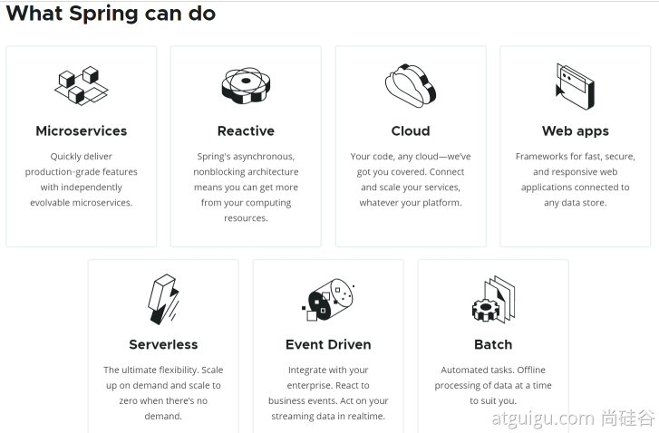
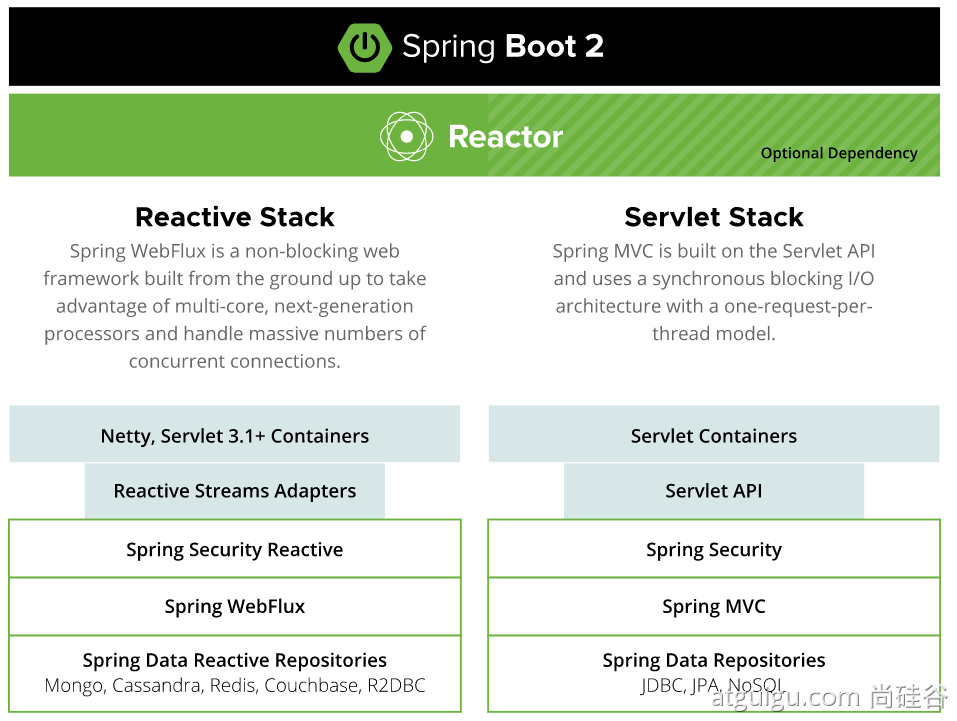
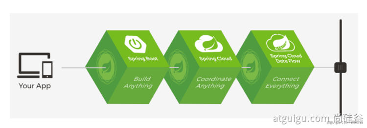
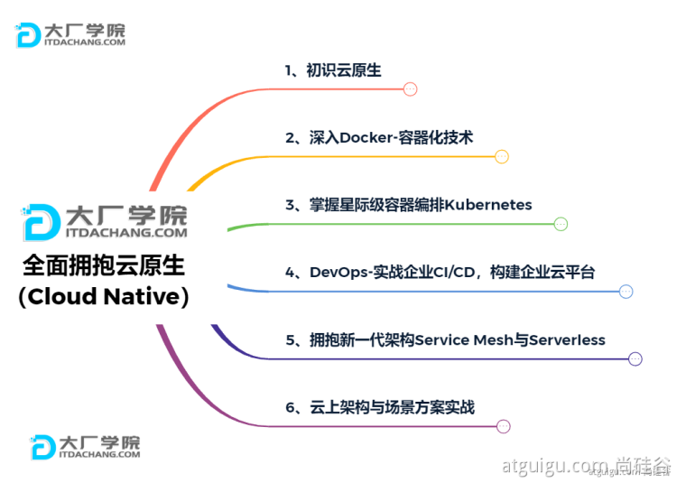
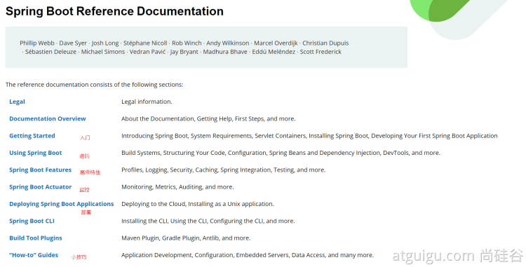
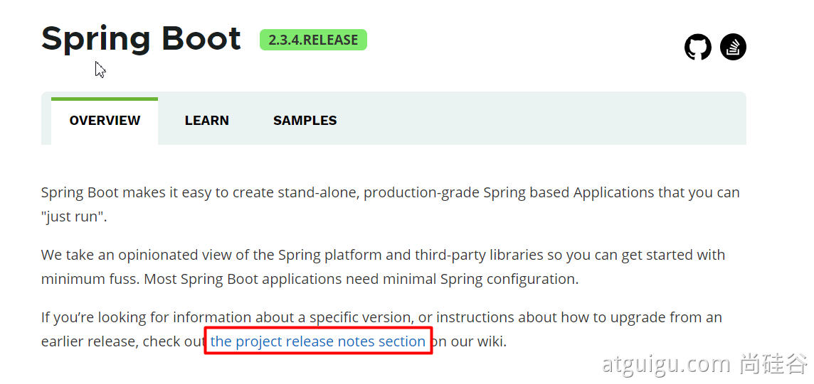
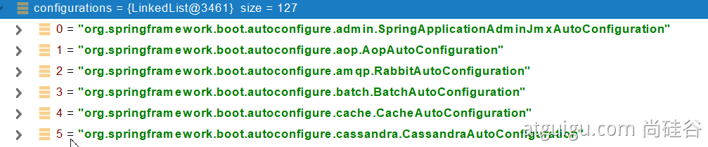
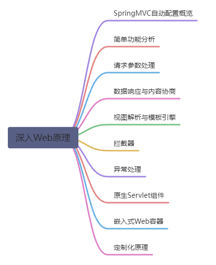

# SpringBoot2 核心技术-基础入门

> 学习要求
>
> ​	熟悉Spring基础
>
> ​	熟悉Maven使用
>
> 环境要求
>
> ​	Java8及以上
>
> ​	Maven 3.3及以上：https://docs.spring.io/spring-boot/docs/current/reference/html/getting-started.html#getting-started-system-requirements
>
> 学习资料
>
> ​	文档地址： https://www.yuque.com/atguigu/springboot
>
> ​	文档不支持旧版本IE、Edge浏览器，请使用chrome或者firefox
>
> ​	视频地址： http://www.gulixueyuan.com/    https://www.bilibili.com/video/BV19K4y1L7MT?p=1
>
> ​	源码地址：https://gitee.com/leifengyang/springboot2

# 01、Spring 与 SpringBoot

## 1、Spring 能做什么

### 1.1、Spring 的能力 



### 1.2、Spring 的生态 

https://spring.io/projects/spring-boot

覆盖了：

- web开发
- 数据访问
- 安全控制
- 分布式
- 消息服务
- 移动开发
- 批处理
- ......

### 1.3、Spring5 重大升级

#### 1.3.1、响应式编程 



#### 1.3.2、内部源码设计 

基于Java8的一些新特性，如：接口默认实现。重新设计源码架构。

## 2、为什么用 SpringBoot 

> Spring Boot makes it easy to create stand-alone, production-grade Spring based Applications that you can "just run".
>
> 能快速创建出生产级别的 Spring 应用

### 2.1、SpringBoot 优点 

- Create stand-alone Spring applications
	- 创建独立 Spring 应用

- Embed Tomcat, Jetty or Undertow directly (no need to deploy WAR files)
	- 内嵌 web 服务器

- Provide opinionated 'starter' dependencies to simplify your build configuration
	- 自动 starter 依赖，简化构建配置

- Automatically configure Spring and 3rd party libraries whenever possible
	- 自动配置 Spring 以及第三方功能

- Provide production-ready features such as metrics, health checks, and externalized configuration
- - 提供生产级别的监控、健康检查及外部化配置

- Absolutely no code generation and no requirement for XML configuration
- - 无代码生成、无需编写 XML

> SpringBoot 是整合 Spring 技术栈的一站式框架
>
> SpringBoot 是简化 Spring 技术栈的快速开发脚手架

### 2.2、SpringBoot 缺点 

- 人称版本帝，迭代快，需要时刻关注变化
- 封装太深，内部原理复杂，不容易精通

## 3、时代背景

### 3.1、微服务 

[James Lewis and Martin Fowler (2014)](https://martinfowler.com/articles/microservices.html)  提出微服务完整概念。

https://martinfowler.com/microservices/

> In short, the microservice architectural style is an approach to developing a single application as a suite of small services, each running in its own process and communicating with lightweight mechanisms, often an HTTP resource API. These services are built around business capabilities and independently deployable by fully automated deployment machinery. There is a bare minimum of centralized management of these services, which may be written in different programming languages and use different data storage technologies.-- [James Lewis and Martin Fowler (2014)](https://martinfowler.com/articles/microservices.html)

- 微服务是一种架构风格
- 一个应用拆分为一组小型服务
- 每个服务运行在自己的进程内，也就是可独立部署和升级
- 服务之间使用轻量级 HTTP 交互
- 服务围绕业务功能拆分
- 可以由全自动部署机制独立部署
- 去中心化，服务自治。服务可以使用不同的语言、不同的存储技术

### 3.2、分布式 


分布式的困难 

- 远程调用
- 服务发现
- 负载均衡
- 服务容错
- 配置管理
- 服务监控
- 链路追踪
- 日志管理
- 任务调度
- ......

分布式的解决 

- SpringBoot + SpringCloud



### 3.3、云原生 

原生应用如何上云。 Cloud Native

上云的困难 

- 服务自愈
- 弹性伸缩
- 服务隔离
- 自动化部署
- 灰度发布
- 流量治理
- ......

上云的解决 



## 4、如何学习 SpringBoot 

### 4.1、官网文档架构 




查看版本新特性；

https://github.com/spring-projects/spring-boot/wiki#release-notes



# 02、SpringBoot2 入门

## 1、系统要求

- Java8 & 兼容 Java14
- Maven 3.3+

### 1.1、Maven 设置

```xml
阿里云的镜像
<mirrors>
    <mirror>
        <id>nexus-aliyun</id>
        <mirrorOf>central</mirrorOf>
        <name>Nexus aliyun</name>
        <url>http://maven.aliyun.com/nexus/content/groups/public</url>
    </mirror>
</mirrors>
JDK 版本
<profiles>
    <profile>
        <id>jdk-1.8</id>
        <activation>
            <activeByDefault>true</activeByDefault>
            <jdk>1.8</jdk>
        </activation>
        <properties>
            <maven.compiler.source>1.8</maven.compiler.source>
            <maven.compiler.target>1.8</maven.compiler.target>
            <maven.compiler.compilerVersion>1.8</maven.compiler.compilerVersion>
        </properties>
    </profile>
</profiles>
```

## 2、HelloWorld

### 2.1、创建 Maven 工程

### 2.2、引入依赖

```xml
引入一个 SpringBoot 的父工程
<parent>
    <groupId>org.springframework.boot</groupId>
    <artifactId>spring-boot-starter-parent</artifactId>
    <version>2.3.4.RELEASE</version>
</parent>

引入 web 模块的启动器
<dependencies>
    <dependency>
        <groupId>org.springframework.boot</groupId>
        <artifactId>spring-boot-starter-web</artifactId>
    </dependency>
</dependencies>
```

### 2.3、创建主程序

```java
/**
 * 主程序类
 * @SpringBootApplication：这是一个SpringBoot应用
 */
@SpringBootApplication
public class MainApplication {

    public static void main(String[] args) {
        SpringApplication.run(MainApplication.class,args);
    }
}
```

### 2.4、编写业务

```java
@RestController // 这个注解是 @ResponseBody 和 @Controller 的结合
//@ResponseBody // 这个注解意味类中的每个方法中的返回值都是返回给浏览器的数据，而不是逻辑视图（也可以加到方法上）
//@Controller
public class HelloController {
    @RequestMapping("/hello")
    public String handle01(){
        return "Hello, Spring Boot 2!";
    }
}
```

### 2.5、测试

### 2.6、简化配置

application.properties 文件放置在 Resource 目录下，其中能够进行一些配置

```properties
server.port=8888
```

### 2.7、简化部署

```xml
<build>
    <plugins>
        <plugin>
            <groupId>org.springframework.boot</groupId>
            <artifactId>spring-boot-maven-plugin</artifactId>
        </plugin>
    </plugins>
</build>
```

把项目打成 jar 包，直接在目标服务器执行即可。这个 jar 是可执行的 jar 包。

# 03、了解自动配置原理

## 1、SpringBoot 的特点

### 1.1、依赖管理

- 父项目用来做依赖管理

```xml
之前在 pom.xml 中配置的父项目是用来做依赖管理    
<parent>
        <groupId>org.springframework.boot</groupId>
        <artifactId>spring-boot-starter-parent</artifactId>
        <version>2.3.4.RELEASE</version>
</parent>

它的父项目
<parent>
    <groupId>org.springframework.boot</groupId>
    <artifactId>spring-boot-dependencies</artifactId>
    <version>2.3.4.RELEASE</version>
</parent>

几乎声明了所有开发中常用的依赖的版本号,自动版本仲裁机制
```

- 开发导入 starter 场景启动器

```xml
1、见到很多 spring-boot-starter-* ： *就某种场景
2、只要引入 starter，这个场景的所有常规需要的依赖我们都自动引入
3、SpringBoot 所有支持的场景
https://docs.spring.io/spring-boot/docs/current/reference/html/using-spring-boot.html#using-boot-starter
4、见到的  *-spring-boot-starter： 第三方为我们提供的简化开发的场景启动器。
5、所有场景启动器最底层的依赖
<dependency>
  <groupId>org.springframework.boot</groupId>
  <artifactId>spring-boot-starter</artifactId>
  <version>2.3.4.RELEASE</version>
  <scope>compile</scope>
</dependency>
```

- 无需关注版本号，自动版本仲裁

> 1、引入依赖默认都可以不写版本
>
> 2、引入非版本仲裁的jar，要写版本号。

- 能够修改默认版本号

```xml
1、查看 spring-boot-dependencies 里面规定当前依赖的版本用的key。
2、在当前项目里面重写配置
<properties>
    <mysql.version>5.1.43</mysql.version>
</properties>
```

### 1.2、自动配置

- 自动配置好 tomcat
	- 引入 tomcat 依赖
	- 并自动配置 tomcat

```xml
<dependency>
    <groupId>org.springframework.boot</groupId>
    <artifactId>spring-boot-starter-tomcat</artifactId>
    <version>2.3.4.RELEASE</version>
    <scope>compile</scope>
</dependency>
```

- 自动配好 SpringMVC

- - 引入 SpringMVC 全套组件
	- 自动配好 SpringMVC 常用组件（功能）

- 自动配好 Web 常见功能，如：字符编码问题

- - SpringBoot 帮我们配置好了所有 web 开发的常见场景

- 默认的包结构

- - **主程序所在包及其下面的所有子包**里面的组件都会被默认扫描进来
	- 无需以前的包扫描配置
	- 想要改变扫描路径，@SpringBootApplication(scanBasePackages=**"com.atguigu"**)

- - - 或者@ComponentScan 指定扫描路径

			```java
			@SpringBootApplication
			等同于
			@SpringBootConfiguration
			@EnableAutoConfiguration
			@ComponentScan("com.atguigu.boot")
			```

- 各种配置拥有默认值

- - 默认配置最终都是映射到某个类上，如：MultipartProperties(文件上传解析器)
	- 配置文件的值最终会绑定每个类上，这个类会在容器中创建对象

- 按需加载所有自动配置项

- - 非常多的 starter
	- 引入了哪些场景这个场景的自动配置才会开启
	- SpringBoot 所有的自动配置功能都在 spring-boot-autoconfigure 包里面

## 2、容器功能

### 2.1、组件添加

#### 1、@Configuration

- 基本使用
- **Full模式与Lite模式**

- - 示例
	- 最佳实战

- - - 配置 类组件之间无依赖关系用Lite模式加速容器启动过程，减少判断
		- 配置类组件之间有依赖关系，方法会被调用得到之前单实例组件，用Full模式

```java
#############################Configuration使用示例######################################################
/**
 * 1、配置类里面使用 @Bean 标注在方法上给容器注册组件，默认也是单实例的
 * 2、配置类本身也是组件
 * 3、proxyBeanMethods：代理 bean 的方法
 *      Full(proxyBeanMethods = true)、【保证每个 @Bean 方法被调用多少次返回的组件都是单实例的】
 *      Lite(proxyBeanMethods = false)【每个 @Bean 方法被调用多少次返回的组件都是新创建的】
 *      组件依赖必须使用Full模式默认。其他默认是否Lite模式
 */
@Configuration(proxyBeanMethods = false) //告诉SpringBoot这是一个配置类 == 配置文件
public class MyConfig {
    /**
     * Full:外部无论对配置类中的这个组件注册方法调用多少次获取的都是之前注册容器中的单实例对象
     * @return
     */
    @Bean //给容器中添加组件。以方法名作为组件的 id。返回类型就是组件类型。返回的值，就是组件在容器中的实例
    public User user01(){
        User zhangsan = new User("zhangsan", 18);
        //user组件依赖了Pet组件
        zhangsan.setPet(tomcatPet());
        return zhangsan;
    }

    @Bean("tom")
    public Pet tomcatPet(){
        return new Pet("tomcat");
    }
}


################################@Configuration测试代码如下########################################
@SpringBootConfiguration
@EnableAutoConfiguration
@ComponentScan("com.atguigu.boot")
public class MainApplication {

    public static void main(String[] args) {
        //1、返回我们 IOC 容器
        ConfigurableApplicationContext run = SpringApplication.run(MainApplication.class, args);

        //2、查看容器里面的组件
        String[] names = run.getBeanDefinitionNames();
        for (String name : names) {
            System.out.println(name);
        }

        //3、从容器中获取组件

        Pet tom01 = run.getBean("tom", Pet.class);

        Pet tom02 = run.getBean("tom", Pet.class);

        System.out.println("组件："+(tom01 == tom02)); //判断是否是单例


        //4、com.atguigu.boot.config.MyConfig$$EnhancerBySpringCGLIB$$51f1e1ca@1654a892 proxyBeanMethods = false，所以这里获取到的 MyConfig 是代理类对象
        MyConfig bean = run.getBean(MyConfig.class);
        System.out.println(bean);

        //如果 @Configuration(proxyBeanMethods = true) 代理对象调用方法。SpringBoot 总会检查这个组件是否在容器中存在
        //保持组件单实例
        User user = bean.user01();
        User user1 = bean.user01();
        System.out.println(user == user1);


        User user01 = run.getBean("user01", User.class);
        Pet tom = run.getBean("tom", Pet.class);

        System.out.println("用户的宠物："+(user01.getPet() == tom));
    }
}
```

#### 2、@Bean、@Component、@Controller、@Service、@Repository

#### 3、@ComponentScan、@Import

```java
 * 4、@Import({User.class, DBHelper.class})
 *      给容器中自动创建出这两个类型的组件、默认组件的名字就是全类名
 *
 *
 *
 */

@Import({User.class, DBHelper.class})
@Configuration(proxyBeanMethods = false) //告诉SpringBoot这是一个配置类 == 配置文件
public class MyConfig {
}
```

#### 4、@Conditional

条件装配：满足Conditional指定的条件，则进行组件注入


```java
=====================测试条件装配==========================
@Configuration(proxyBeanMethods = false) //告诉SpringBoot这是一个配置类 == 配置文件
//@ConditionalOnBean(name = "tom")
@ConditionalOnMissingBean(name = "tom") //容器中没有名字为 tom 的组件时，才会注册 user01 组件和 tom22 组件
public class MyConfig {

    /**
     * Full:外部无论对配置类中的这个组件注册方法调用多少次获取的都是之前注册容器中的单实例对象
     * @return
     */

    @Bean //给容器中添加组件。以方法名作为组件的id。返回类型就是组件类型。返回的值，就是组件在容器中的实例
    public User user01(){
        User zhangsan = new User("zhangsan", 18);
        //user组件依赖了Pet组件
        zhangsan.setPet(tomcatPet());
        return zhangsan;
    }

    @Bean("tom22")
    public Pet tomcatPet(){
        return new Pet("tomcat");
    }
}

public static void main(String[] args) {
    //1、返回我们IOC容器
    ConfigurableApplicationContext run = SpringApplication.run(MainApplication.class, args);

    //2、查看容器里面的组件
    String[] names = run.getBeanDefinitionNames();
    for (String name : names) {
        System.out.println(name);
    }

    boolean tom = run.containsBean("tom");
    System.out.println("容器中Tom组件："+tom);

    boolean user01 = run.containsBean("user01");
    System.out.println("容器中user01组件："+user01);

    boolean tom22 = run.containsBean("tom22");
    System.out.println("容器中tom22组件："+tom22);
}
```

### 2.2、原生配置文件引入

#### 1、@ImportResource

```xml
======================beans.xml=========================
<?xml version="1.0" encoding="UTF-8"?>
<beans xmlns="http://www.springframework.org/schema/beans"
       xmlns:xsi="http://www.w3.org/2001/XMLSchema-instance"
       xmlns:context="http://www.springframework.org/schema/context"
       xsi:schemaLocation="http://www.springframework.org/schema/beans http://www.springframework.org/schema/beans/spring-beans.xsd http://www.springframework.org/schema/context https://www.springframework.org/schema/context/spring-context.xsd">

    <bean id="haha" class="com.atguigu.boot.bean.User">
        <property name="name" value="zhangsan"></property>
        <property name="age" value="18"></property>
    </bean>

    <bean id="hehe" class="com.atguigu.boot.bean.Pet">
        <property name="name" value="tomcat"></property>
    </bean>
</beans>
```

```java
@ImportResource("classpath:beans.xml") // 如果没有这条语句，输出将为 false
public class MyConfig {}

======================测试=================
        boolean haha = run.containsBean("haha");
        boolean hehe = run.containsBean("hehe");
        System.out.println("haha："+haha);//true
        System.out.println("hehe："+hehe);//true
```

### 2.3、配置绑定

如何使用 Java 读取到 properties 文件中的内容，并且把它封装到 JavaBean 中，以供随时使用

以前的方式如下：

```java
public class getProperties {
     public static void main(String[] args) throws FileNotFoundException, IOException {
         Properties pps = new Properties();
         pps.load(new FileInputStream("a.properties"));
         Enumeration enum1 = pps.propertyNames();//得到配置文件的名字
         while(enum1.hasMoreElements()) {
             String strKey = (String) enum1.nextElement();
             String strValue = pps.getProperty(strKey);
             System.out.println(strKey + "=" + strValue);
             //封装到 JavaBean。
         }
     }
 }
```

#### 1、@Component + @ConfigurationProperties

会自动绑定 application.properties 文件中前缀为 mycar 的属性，例如 mycar.brand, mycar.price，这样就能自动绑定到这个类。但是这个类必须是容器中的组件。

```java
/**
 * 只有在容器中的组件，才会拥有 SpringBoot 提供的强大功能
 */
@Component 
@ConfigurationProperties(prefix = "mycar")
public class Car {

    private String brand;
    private Integer price;

    public String getBrand() {
        return brand;
    }

    public void setBrand(String brand) {
        this.brand = brand;
    }

    public Integer getPrice() {
        return price;
    }

    public void setPrice(Integer price) {
        this.price = price;
    }

    @Override
    public String toString() {
        return "Car{" +
                "brand='" + brand + '\'' +
                ", price=" + price +
                '}';
    }
}
```

#### 2、@EnableConfigurationProperties + @ConfigurationProperties

```java
@EnableConfigurationProperties(Car.class)
//1、开启 Car 配置绑定功能
//2、把 Car 这个组件自动注册到容器中
public class MyConfig {
}
```

## 3、自动配置原理入门

### 3.1、引导加载自动配置类

```java
@SpringBootConfiguration
@EnableAutoConfiguration
@ComponentScan(excludeFilters = { @Filter(type = FilterType.CUSTOM, classes = TypeExcludeFilter.class),
		@Filter(type = FilterType.CUSTOM, classes = AutoConfigurationExcludeFilter.class) })
public @interface SpringBootApplication{}    
```

> SpringBootApplication 注解是三个注解的组合

#### 3.1.1、@SpringBootConfiguration

就是 @Configuration 表明当前是一个配置类

#### 3.1.2、@ComponentScan

指定扫描哪些包下的 Spring 注解

#### 3.1.3、@EnableAutoConfiguration

```java
@AutoConfigurationPackage
@Import(AutoConfigurationImportSelector.class)
public @interface EnableAutoConfiguration {}
```

##### 3.1.3.1 @AutoConfigurationPackage

自动配置包？制定了默认的包规则

```java
@Import(AutoConfigurationPackages.Registrar.class)  //给容器中导入一个组件
public @interface AutoConfigurationPackage {}

//利用 Registrar 给容器中导入一系列组件
//将指定的一个包下的所有组件导入进来？MainApplication 所在包下。
```

##### 3.1.3.2 @Import(AutoConfigurationImportSelector.class)

> 1、利用getAutoConfigurationEntry(annotationMetadata);给容器中批量导入一些组件
>
> 2、调用List<String> configurations = getCandidateConfigurations(annotationMetadata, attributes)获取到所有需要导入到容器中的配置类
>
> 3、利用工厂加载 Map<String, List<String>> loadSpringFactories(@Nullable ClassLoader classLoader)；得到所有的组件
>
> 4、从META-INF/spring.factories位置来加载一个文件。
> 	默认扫描我们当前系统里面所有META-INF/spring.factories位置的文件
>     spring-boot-autoconfigure-2.3.4.RELEASE.jar包里面也有META-INF/spring.factories



```xml
文件里面写死了 spring-boot 一启动就要给容器中加载的所有配置类
spring-boot-autoconfigure-2.3.4.RELEASE.jar/META-INF/spring.factories
# Auto Configure
org.springframework.boot.autoconfigure.EnableAutoConfiguration=\
org.springframework.boot.autoconfigure.admin.SpringApplicationAdminJmxAutoConfiguration,\
org.springframework.boot.autoconfigure.aop.AopAutoConfiguration,\
org.springframework.boot.autoconfigure.amqp.RabbitAutoConfiguration,\
org.springframework.boot.autoconfigure.batch.BatchAutoConfiguration,\
org.springframework.boot.autoconfigure.cache.CacheAutoConfiguration,\
org.springframework.boot.autoconfigure.cassandra.CassandraAutoConfiguration,\
org.springframework.boot.autoconfigure.context.ConfigurationPropertiesAutoConfiguration,\
org.springframework.boot.autoconfigure.context.LifecycleAutoConfiguration,\
org.springframework.boot.autoconfigure.context.MessageSourceAutoConfiguration,\
org.springframework.boot.autoconfigure.context.PropertyPlaceholderAutoConfiguration,\
org.springframework.boot.autoconfigure.couchbase.CouchbaseAutoConfiguration,\
org.springframework.boot.autoconfigure.dao.PersistenceExceptionTranslationAutoConfiguration,\
org.springframework.boot.autoconfigure.data.cassandra.CassandraDataAutoConfiguration,\
org.springframework.boot.autoconfigure.data.cassandra.CassandraReactiveDataAutoConfiguration,\
org.springframework.boot.autoconfigure.data.cassandra.CassandraReactiveRepositoriesAutoConfiguration,\
org.springframework.boot.autoconfigure.data.cassandra.CassandraRepositoriesAutoConfiguration,\
org.springframework.boot.autoconfigure.data.couchbase.CouchbaseDataAutoConfiguration,\
org.springframework.boot.autoconfigure.data.couchbase.CouchbaseReactiveDataAutoConfiguration,\
org.springframework.boot.autoconfigure.data.couchbase.CouchbaseReactiveRepositoriesAutoConfiguration,\
org.springframework.boot.autoconfigure.data.couchbase.CouchbaseRepositoriesAutoConfiguration,\
org.springframework.boot.autoconfigure.data.elasticsearch.ElasticsearchDataAutoConfiguration,\
org.springframework.boot.autoconfigure.data.elasticsearch.ElasticsearchRepositoriesAutoConfiguration,\
org.springframework.boot.autoconfigure.data.elasticsearch.ReactiveElasticsearchRepositoriesAutoConfiguration,\
org.springframework.boot.autoconfigure.data.elasticsearch.ReactiveElasticsearchRestClientAutoConfiguration,\
org.springframework.boot.autoconfigure.data.jdbc.JdbcRepositoriesAutoConfiguration,\
org.springframework.boot.autoconfigure.data.jpa.JpaRepositoriesAutoConfiguration,\
org.springframework.boot.autoconfigure.data.ldap.LdapRepositoriesAutoConfiguration,\
org.springframework.boot.autoconfigure.data.mongo.MongoDataAutoConfiguration,\
org.springframework.boot.autoconfigure.data.mongo.MongoReactiveDataAutoConfiguration,\
org.springframework.boot.autoconfigure.data.mongo.MongoReactiveRepositoriesAutoConfiguration,\
org.springframework.boot.autoconfigure.data.mongo.MongoRepositoriesAutoConfiguration,\
org.springframework.boot.autoconfigure.data.neo4j.Neo4jDataAutoConfiguration,\
org.springframework.boot.autoconfigure.data.neo4j.Neo4jRepositoriesAutoConfiguration,\
org.springframework.boot.autoconfigure.data.solr.SolrRepositoriesAutoConfiguration,\
org.springframework.boot.autoconfigure.data.r2dbc.R2dbcDataAutoConfiguration,\
org.springframework.boot.autoconfigure.data.r2dbc.R2dbcRepositoriesAutoConfiguration,\
org.springframework.boot.autoconfigure.data.r2dbc.R2dbcTransactionManagerAutoConfiguration,\
org.springframework.boot.autoconfigure.data.redis.RedisAutoConfiguration,\
org.springframework.boot.autoconfigure.data.redis.RedisReactiveAutoConfiguration,\
org.springframework.boot.autoconfigure.data.redis.RedisRepositoriesAutoConfiguration,\
org.springframework.boot.autoconfigure.data.rest.RepositoryRestMvcAutoConfiguration,\
org.springframework.boot.autoconfigure.data.web.SpringDataWebAutoConfiguration,\
org.springframework.boot.autoconfigure.elasticsearch.ElasticsearchRestClientAutoConfiguration,\
org.springframework.boot.autoconfigure.flyway.FlywayAutoConfiguration,\
org.springframework.boot.autoconfigure.freemarker.FreeMarkerAutoConfiguration,\
org.springframework.boot.autoconfigure.groovy.template.GroovyTemplateAutoConfiguration,\
org.springframework.boot.autoconfigure.gson.GsonAutoConfiguration,\
org.springframework.boot.autoconfigure.h2.H2ConsoleAutoConfiguration,\
org.springframework.boot.autoconfigure.hateoas.HypermediaAutoConfiguration,\
org.springframework.boot.autoconfigure.hazelcast.HazelcastAutoConfiguration,\
org.springframework.boot.autoconfigure.hazelcast.HazelcastJpaDependencyAutoConfiguration,\
org.springframework.boot.autoconfigure.http.HttpMessageConvertersAutoConfiguration,\
org.springframework.boot.autoconfigure.http.codec.CodecsAutoConfiguration,\
org.springframework.boot.autoconfigure.influx.InfluxDbAutoConfiguration,\
org.springframework.boot.autoconfigure.info.ProjectInfoAutoConfiguration,\
org.springframework.boot.autoconfigure.integration.IntegrationAutoConfiguration,\
org.springframework.boot.autoconfigure.jackson.JacksonAutoConfiguration,\
org.springframework.boot.autoconfigure.jdbc.DataSourceAutoConfiguration,\
org.springframework.boot.autoconfigure.jdbc.JdbcTemplateAutoConfiguration,\
org.springframework.boot.autoconfigure.jdbc.JndiDataSourceAutoConfiguration,\
org.springframework.boot.autoconfigure.jdbc.XADataSourceAutoConfiguration,\
org.springframework.boot.autoconfigure.jdbc.DataSourceTransactionManagerAutoConfiguration,\
org.springframework.boot.autoconfigure.jms.JmsAutoConfiguration,\
org.springframework.boot.autoconfigure.jmx.JmxAutoConfiguration,\
org.springframework.boot.autoconfigure.jms.JndiConnectionFactoryAutoConfiguration,\
org.springframework.boot.autoconfigure.jms.activemq.ActiveMQAutoConfiguration,\
org.springframework.boot.autoconfigure.jms.artemis.ArtemisAutoConfiguration,\
org.springframework.boot.autoconfigure.jersey.JerseyAutoConfiguration,\
org.springframework.boot.autoconfigure.jooq.JooqAutoConfiguration,\
org.springframework.boot.autoconfigure.jsonb.JsonbAutoConfiguration,\
org.springframework.boot.autoconfigure.kafka.KafkaAutoConfiguration,\
org.springframework.boot.autoconfigure.availability.ApplicationAvailabilityAutoConfiguration,\
org.springframework.boot.autoconfigure.ldap.embedded.EmbeddedLdapAutoConfiguration,\
org.springframework.boot.autoconfigure.ldap.LdapAutoConfiguration,\
org.springframework.boot.autoconfigure.liquibase.LiquibaseAutoConfiguration,\
org.springframework.boot.autoconfigure.mail.MailSenderAutoConfiguration,\
org.springframework.boot.autoconfigure.mail.MailSenderValidatorAutoConfiguration,\
org.springframework.boot.autoconfigure.mongo.embedded.EmbeddedMongoAutoConfiguration,\
org.springframework.boot.autoconfigure.mongo.MongoAutoConfiguration,\
org.springframework.boot.autoconfigure.mongo.MongoReactiveAutoConfiguration,\
org.springframework.boot.autoconfigure.mustache.MustacheAutoConfiguration,\
org.springframework.boot.autoconfigure.orm.jpa.HibernateJpaAutoConfiguration,\
org.springframework.boot.autoconfigure.quartz.QuartzAutoConfiguration,\
org.springframework.boot.autoconfigure.r2dbc.R2dbcAutoConfiguration,\
org.springframework.boot.autoconfigure.rsocket.RSocketMessagingAutoConfiguration,\
org.springframework.boot.autoconfigure.rsocket.RSocketRequesterAutoConfiguration,\
org.springframework.boot.autoconfigure.rsocket.RSocketServerAutoConfiguration,\
org.springframework.boot.autoconfigure.rsocket.RSocketStrategiesAutoConfiguration,\
org.springframework.boot.autoconfigure.security.servlet.SecurityAutoConfiguration,\
org.springframework.boot.autoconfigure.security.servlet.UserDetailsServiceAutoConfiguration,\
org.springframework.boot.autoconfigure.security.servlet.SecurityFilterAutoConfiguration,\
org.springframework.boot.autoconfigure.security.reactive.ReactiveSecurityAutoConfiguration,\
org.springframework.boot.autoconfigure.security.reactive.ReactiveUserDetailsServiceAutoConfiguration,\
org.springframework.boot.autoconfigure.security.rsocket.RSocketSecurityAutoConfiguration,\
org.springframework.boot.autoconfigure.security.saml2.Saml2RelyingPartyAutoConfiguration,\
org.springframework.boot.autoconfigure.sendgrid.SendGridAutoConfiguration,\
org.springframework.boot.autoconfigure.session.SessionAutoConfiguration,\
org.springframework.boot.autoconfigure.security.oauth2.client.servlet.OAuth2ClientAutoConfiguration,\
org.springframework.boot.autoconfigure.security.oauth2.client.reactive.ReactiveOAuth2ClientAutoConfiguration,\
org.springframework.boot.autoconfigure.security.oauth2.resource.servlet.OAuth2ResourceServerAutoConfiguration,\
org.springframework.boot.autoconfigure.security.oauth2.resource.reactive.ReactiveOAuth2ResourceServerAutoConfiguration,\
org.springframework.boot.autoconfigure.solr.SolrAutoConfiguration,\
org.springframework.boot.autoconfigure.task.TaskExecutionAutoConfiguration,\
org.springframework.boot.autoconfigure.task.TaskSchedulingAutoConfiguration,\
org.springframework.boot.autoconfigure.thymeleaf.ThymeleafAutoConfiguration,\
org.springframework.boot.autoconfigure.transaction.TransactionAutoConfiguration,\
org.springframework.boot.autoconfigure.transaction.jta.JtaAutoConfiguration,\
org.springframework.boot.autoconfigure.validation.ValidationAutoConfiguration,\
org.springframework.boot.autoconfigure.web.client.RestTemplateAutoConfiguration,\
org.springframework.boot.autoconfigure.web.embedded.EmbeddedWebServerFactoryCustomizerAutoConfiguration,\
org.springframework.boot.autoconfigure.web.reactive.HttpHandlerAutoConfiguration,\
org.springframework.boot.autoconfigure.web.reactive.ReactiveWebServerFactoryAutoConfiguration,\
org.springframework.boot.autoconfigure.web.reactive.WebFluxAutoConfiguration,\
org.springframework.boot.autoconfigure.web.reactive.error.ErrorWebFluxAutoConfiguration,\
org.springframework.boot.autoconfigure.web.reactive.function.client.ClientHttpConnectorAutoConfiguration,\
org.springframework.boot.autoconfigure.web.reactive.function.client.WebClientAutoConfiguration,\
org.springframework.boot.autoconfigure.web.servlet.DispatcherServletAutoConfiguration,\
org.springframework.boot.autoconfigure.web.servlet.ServletWebServerFactoryAutoConfiguration,\
org.springframework.boot.autoconfigure.web.servlet.error.ErrorMvcAutoConfiguration,\
org.springframework.boot.autoconfigure.web.servlet.HttpEncodingAutoConfiguration,\
org.springframework.boot.autoconfigure.web.servlet.MultipartAutoConfiguration,\
org.springframework.boot.autoconfigure.web.servlet.WebMvcAutoConfiguration,\
org.springframework.boot.autoconfigure.websocket.reactive.WebSocketReactiveAutoConfiguration,\
org.springframework.boot.autoconfigure.websocket.servlet.WebSocketServletAutoConfiguration,\
org.springframework.boot.autoconfigure.websocket.servlet.WebSocketMessagingAutoConfiguration,\
org.springframework.boot.autoconfigure.webservices.WebServicesAutoConfiguration,\
org.springframework.boot.autoconfigure.webservices.client.WebServiceTemplateAutoConfiguration
```

### 3.2、按需开启自动配置项

>虽然我们127个场景的所有自动配置启动的时候默认全部加载。xxxxAutoConfiguration
>
>按照条件装配规则（@Conditional），最终会按需配置。

### 3.3、修改默认配置

```java
@Bean
@ConditionalOnBean(MultipartResolver.class)  //容器中有这个类型组件
@ConditionalOnMissingBean(name = DispatcherServlet.MULTIPART_RESOLVER_BEAN_NAME) //容器中没有这个名字 multipartResolver 的组件
public MultipartResolver multipartResolver(MultipartResolver resolver) {
    //给 @Bean 标注的方法传入了对象参数，这个参数的值就会从容器中找。
    //SpringMVC multipartResolver。防止有些用户配置的文件上传解析器不符合规范
    //Detect if the user has created a MultipartResolver but named it incorrectly
    return resolver;
}
给容器中的文件上传解析器修改为规范的名字
```

SpringBoot默认会在底层配好所有的组件。但是如果用户自己配置了以用户的优先

```java
@Bean
@ConditionalOnMissingBean //如果容器中没有这个组件，下面的内容才生效，因此以用户自配置的优先
public CharacterEncodingFilter characterEncodingFilter() {
}
```

总结：

- SpringBoot先加载所有的自动配置类  xxxxxAutoConfiguration
- 每个自动配置类按照条件进行生效，默认都会绑定配置文件指定的值。xxxProperties和配置文件进行了绑定
- 生效的配置类就会给容器中装配很多组件
- 只要容器中有这些组件，相当于这些功能就有了
- 定制化配置

- - 用户直接自己 @Bean 替换底层的组件
	- 用户修改配置文件进行定制化配置

**xxxxxAutoConfiguration ---> 组件  --->** **xxxxProperties里面拿值  ----> application.properties**

### 3.4、最佳实践

- 引入场景依赖

  - https://docs.spring.io/spring-boot/docs/current/reference/html/using-spring-boot.html#using-boot-starter

- 查看自动配置了哪些（选做）

  - 自己分析，引入场景对应的自动配置一般都生效了

  - 配置文件中 debug=true 开启自动配置报告。Negative（不生效）| Positive（生效）

- 是否需要修改

  - 参照文档修改配置项
  	- https://docs.spring.io/spring-boot/docs/current/reference/html/appendix-application-properties.html#common-application-properties
  	- 自己分析。xxxxProperties 绑定了配置文件的哪些。

  - 自定义加入或者替换组件
  	- @Bean、@Component
  - 自定义器  xxxxCustomizer；


# SpringBoot2 核心技术-核心功能

# 04、配置文件

## 1、文件类型

### 1.1、properties 文件

```properties
spring.username  # 采用点的形式
```

### 1.2、yaml 文件

#### 1.2.1 yaml 格式简介

YAML 是 "YAML Ain't Markup Language"（YAML 不是一种标记语言）的递归缩写。在开发的这种语言时，YAML 的意思其实是："Yet Another Markup Language"（仍是一种标记语言）。 

非常适合用来做以数据为中心的配置文件

#### 1.2.2 yaml 格式语法

- ey: value；kv之间有空格
- 大小写敏感
- 使用缩进表示层级关系
- 缩进不允许使用tab，只允许空格
- 缩进的空格数不重要，只要相同层级的元素左对齐即可
- '#'表示注释
- 字符串无需加引号，如果要加，''与""表示字符串内容 会被 转义/不转义。对于 'hello \n world' 和 "hello \n world".
	- 'hello \n world': 输出 hello \n world
	- "hello \n world": 输出 hello
		                      world

#### 1.2.3 数据类型表示方法

- 字面量：单个的、不可再分的值。date、boolean、string、number、null

	```yaml
	k: v # 冒号后有个空格分隔
	```

- 对象：键值对的集合。map、object 

	```yaml
	行内写法：  k: {k1:v1, k2:v2, k3:v3}
	#或
	k: 
	  k1: v1
	  k2: v2
	  k3: v3
	```

- 数组：一组按次序排列的值。array、list、queue

	```yaml
	行内写法：k: [v1,v2,v3]
	#或者
	k:
	 - v1
	 - v2
	 - v3
	```

#### 1.2.4 示例

```java
@ConfigurationProperties(prefix = "person") //与配置文件中的 person 前缀绑定
@Component // 注册到容器中
@Data
public class Person {
	
	private String userName;
	private Boolean boss;
	private Date birth;
	private Integer age;
	private Pet pet;
	private String[] interests;
	private List<String> animal;
	private Map<String, Object> score;
	private Set<Double> salarys;
	private Map<String, List<Pet>> allPets;
}

@Data
public class Pet {
	private String name;
	private Double weight;
}
```

```yaml
person:
  userName: zhangsan
  boss: true
  birth: 2024/12/23
  age: 18
  interests: # 表示集合类型方式一
    - 瓦洛兰特
    - 英雄联盟
    - web开发
  animal: [狗, 猫] # 表示集合类型方式二
  score: {english: 80, math: 90} # 表示 map 的方式
  salarys:
    - 9999
    - 8888
  pet: # 表示一个对象及其属性
    name: 狗
    weight: 99.99
  allPets:
    sick:
      - {name: 狗, weight: 99.99}
      - name: 猫
        weight: 88.88
      - name: 🐍
        weight: 77.77
    health:
      - {name: 鱼, weight: 66.66}
      - {name: 羊, weight: 55.55}
```

## 2、配置提示

```xml
<!--yaml 文件中配置的提示功能, 在 properties 文件中 idea 会对能够设置的属性进行提示，但是 yaml 文件无提示，添加 spring-boot-configuration-processor 依赖就会有提示--> 
<dependency>
    <groupId>org.springframework.boot</groupId>
    <artifactId>spring-boot-configuration-processor</artifactId>
    <optional>true</optional>
</dependency>


<build>
    <plugins>
        <<!--下面的 plugin 是在打包 jar 的时候不打包与配置提示有关的内容，减小 jvm 的开销（因为这部分对功能无关，是方便开发的内容）-->
			<plugin>
				<groupId>org.springframework.boot</groupId>
				<artifactId>spring-boot-maven-plugin</artifactId>
				<configuration>
					<excludes>
						<exclude>
							<groupId>org.springframework.boot</groupId>
							<artifactId>spring-boot-configuration-processor</artifactId>
						</exclude>
					</excludes>
				</configuration>
			</plugin>
    </plugins>
</build>
```

# 05、web 开发



## 1、SpringMVC 自动配置概览

Spring Boot provides auto-configuration for Spring MVC that **works well with most applications.(大多场景我们都无需自定义配置)**

The auto-configuration adds the following features on top of Spring’s defaults:

- Inclusion of `ContentNegotiatingViewResolver` and `BeanNameViewResolver` beans.

- - 内容协商视图解析器和BeanName视图解析器

- Support for serving static resources, including support for WebJars (covered [later in this document](https://docs.spring.io/spring-boot/docs/current/reference/html/spring-boot-features.html#boot-features-spring-mvc-static-content))).

- - 静态资源（包括webjars）

- Automatic registration of `Converter`, `GenericConverter`, and `Formatter` beans.

- - 自动注册 `Converter，GenericConverter，Formatter `

- Support for `HttpMessageConverters` (covered [later in this document](https://docs.spring.io/spring-boot/docs/current/reference/html/spring-boot-features.html#boot-features-spring-mvc-message-converters)).

- - 支持 `HttpMessageConverters` （后来我们配合内容协商理解原理）

- Automatic registration of `MessageCodesResolver` (covered [later in this document](https://docs.spring.io/spring-boot/docs/current/reference/html/spring-boot-features.html#boot-features-spring-message-codes)).

- - 自动注册 `MessageCodesResolver` （国际化用）

- Static `index.html` support.

- - 静态index.html 页支持

- Custom `Favicon` support (covered [later in this document](https://docs.spring.io/spring-boot/docs/current/reference/html/spring-boot-features.html#boot-features-spring-mvc-favicon)).

- - 自定义 `Favicon`  

- Automatic use of a `ConfigurableWebBindingInitializer` bean (covered [later in this document](https://docs.spring.io/spring-boot/docs/current/reference/html/spring-boot-features.html#boot-features-spring-mvc-web-binding-initializer)).

- - 自动使用 `ConfigurableWebBindingInitializer` ，（DataBinder负责将请求数据绑定到JavaBean上）

> If you want to keep those Spring Boot MVC customizations and make more [MVC customizations](https://docs.spring.io/spring/docs/5.2.9.RELEASE/spring-framework-reference/web.html#mvc) (interceptors, formatters, view controllers, and other features), you can add your own `@Configuration` class of type `WebMvcConfigurer` but **without** `@EnableWebMvc`.
>
> **不用@EnableWebMvc注解。使用** `@Configuration` **+** `WebMvcConfigurer` **自定义规则**

> If you want to provide custom instances of `RequestMappingHandlerMapping`, `RequestMappingHandlerAdapter`, or `ExceptionHandlerExceptionResolver`, and still keep the Spring Boot MVC customizations, you can declare a bean of type `WebMvcRegistrations` and use it to provide custom instances of those components.
>
> **声明** `WebMvcRegistrations` **改变默认底层组件**

> If you want to take complete control of Spring MVC, you can add your own `@Configuration` annotated with `@EnableWebMvc`, or alternatively add your own `@Configuration`-annotated `DelegatingWebMvcConfiguration` as described in the Javadoc of `@EnableWebMvc`.
>
> **使用** `@EnableWebMvc+@Configuration+DelegatingWebMvcConfiguration 全面接管SpringMVC`

## 2、简单功能分析

### 2.1、静态资源访问

#### 1、静态资源目录 

只要静态资源放在类路径下： `/static` (or `/public` or `/resources` or `/META-INF/resources`

访问 ： 当前项目根路径/ + 静态资源名 

------

原理： 静态映射/**。（默认的静态映射为 /\*\*) 意为所有的请求

请求进来，先去找Controller看能不能处理。不能处理的所有请求又都交给静态资源处理器。静态资源也找不到则响应404页面

改变默认的静态资源路径

```yaml
spring:
  mvc:
  	static-path-pattern: /res/**   # 改变默认的静态映射，则在浏览器需要使用 /res + 静态资源名来访问资源，这里并不是修改静态资源放置的位置，放置的位置仍旧是 /static 的路径下
  resources:
  	static-locations: [classpath:/haha/] # 这里是改变默认的静态资源的位置，使用一个数组表示
```

#### 2、webjar（一些静态资源 jar 包）

自动映射 /[webjars](http://localhost:8080/webjars/jquery/3.5.1/jquery.js)/**

https://www.webjars.org/

    <dependency>
    	<groupId>org.webjars</groupId>
    	<artifactId>jquery</artifactId>
    	<version>3.5.1</version>
    </dependency>

访问地址：[http://localhost:8080/webjars/jquery/3.5.1/jquery.js](http://localhost:8080/webjars/jquery/3.5.1/jquery.js)   后面地址要按照依赖里面的包路径

jquery.js 在引入的 jar 包中存放在 META-INF/resources/jquery/3.5.1/ 下，那么默认的访问路径应该是 http://localhost:8080/jquery/3.5.1/jquery.js, 但是因为这是 webjar 资源，因此需要在类路径后面加上 webjar。

### 2.2、欢迎页支持

- 静态资源路径下的 index.html

	- 可以配置静态资源路径

	- 但是无法配置静态资源的访问前缀（会导致 index.html 无法被默认访问)

		```yaml
		spring:
		#  mvc:
		#    static-path-pattern: /res/**   这个会导致welcome page功能失效
		
		  resources:
		    static-locations: [classpath:/haha/]
		```

- controller 能够处理 index 请求（如果要使用静态资源的访问前缀的解决办法）

### 2.3、自定义 Favicon

favicon.ico 放在静态资源目录下即可

```yaml
spring:
#  mvc:
#    static-path-pattern: /res/**   这个会导致 favicon.ico 功能失效
```

### 2.4、静态资源配置原理

- SpringBoot 启动默认加载 xxxAutoConfiguration 类（自动配置类）

- SpringMVC 功能的自动配置类 WebMvcAutoConfiguration（判断条件是否都生效）

	```java
	@Configuration(proxyBeanMethods = false)
	@ConditionalOnWebApplication(type = Type.SERVLET)
	@ConditionalOnClass({ Servlet.class, DispatcherServlet.class, WebMvcConfigurer.class })
	@ConditionalOnMissingBean(WebMvcConfigurationSupport.class)
	@AutoConfigureOrder(Ordered.HIGHEST_PRECEDENCE + 10)
	@AutoConfigureAfter({ DispatcherServletAutoConfiguration.class, TaskExecutionAutoConfiguration.class,
			ValidationAutoConfiguration.class })
	public class WebMvcAutoConfiguration {}
	```

- 给容器中配置的内容

	```java
	@Configuration(proxyBeanMethods = false)
	@Import(EnableWebMvcConfiguration.class)
	@EnableConfigurationProperties({ WebMvcProperties.class, ResourceProperties.class }) // 有两个和配置文件绑定的类 WebMvcProperties 和 ResourceProperties
	@Order(0)
	public static class WebMvcAutoConfigurationAdapter implements WebMvcConfigurer {}
	```

	WebMvcProperties 与 spring.mvc 前缀的属性进行了绑定（例如上述的静态资源访问前缀）

	ResourceProperties 与 spring.resources 前缀的属性进行了绑定（例如上述的静态资源访问路径）

#### 2.4.1、配置类只有一个有参构造器

```java
//有参构造器所有参数的值都会从容器中确定
//ResourceProperties resourceProperties；获取和 spring.resources 绑定的所有的值的对象
//WebMvcProperties mvcProperties 获取和 spring.mvc 绑定的所有的值的对象
//ListableBeanFactory beanFactory Spring 的 beanFactory
//ObjectProvider<HttpMessageConverters> 找到所有的 HttpMessageConverters
//ResourceHandlerRegistrationCustomizer 找到资源处理器的自定义器
//DispatcherServletPath  
//ServletRegistrationBean   给应用注册 Servlet、Filter 等
	public WebMvcAutoConfigurationAdapter(ResourceProperties resourceProperties, WebMvcProperties mvcProperties,
				ListableBeanFactory beanFactory, ObjectProvider<HttpMessageConverters> messageConvertersProvider,
				ObjectProvider<ResourceHandlerRegistrationCustomizer> resourceHandlerRegistrationCustomizerProvider,
				ObjectProvider<DispatcherServletPath> dispatcherServletPath,
				ObjectProvider<ServletRegistrationBean<?>> servletRegistrations) {
			this.resourceProperties = resourceProperties;
			this.mvcProperties = mvcProperties;
			this.beanFactory = beanFactory;
			this.messageConvertersProvider = messageConvertersProvider;
			this.resourceHandlerRegistrationCustomizer = resourceHandlerRegistrationCustomizerProvider.getIfAvailable();
			this.dispatcherServletPath = dispatcherServletPath;
			this.servletRegistrations = servletRegistrations;
		}
```

#### 2.4.2、资源处理的默认规则

```java
@Override
public void addResourceHandlers(ResourceHandlerRegistry registry) {
    if (!this.resourceProperties.isAddMappings()) { //resourceProperties 绑定了前缀为 spring.resources 的属性，如果这个 add-mappings 为 false，则关闭了默认的资源处理操作（默认为 true 是开启的）
        logger.debug("Default resource handling disabled");
        return;
    }
    Duration cachePeriod = this.resourceProperties.getCache().getPeriod(); //获取一个缓存时间（可以配置，参考 respurceProperties 中的写法）
    CacheControl cacheControl = this.resourceProperties.getCache().getCachecontrol().toHttpCacheControl();
    //webjars的规则
    if (!registry.hasMappingForPattern("/webjars/**")) {
        customizeResourceHandlerRegistration(registry.addResourceHandler("/webjars/**")
                                             .addResourceLocations("classpath:/META-INF/resources/webjars/")
                                             .setCachePeriod(getSeconds(cachePeriod)).setCacheControl(cacheControl));
    }

    //
    String staticPathPattern = this.mvcProperties.getStaticPathPattern();
    if (!registry.hasMappingForPattern(staticPathPattern)) { // 这个 if 获取静态资源路径
        customizeResourceHandlerRegistration(registry.addResourceHandler(staticPathPattern)
                                             .addResourceLocations(getResourceLocations(this.resourceProperties.getStaticLocations()))
                                             .setCachePeriod(getSeconds(cachePeriod)).setCacheControl(cacheControl));
    }
}
```

```yaml
spring:
#  mvc:
#    static-path-pattern: /res/**

  resources:
    add-mappings: false   禁用所有静态资源规则
```

```java
@ConfigurationProperties(prefix = "spring.resources", ignoreUnknownFields = false)
public class ResourceProperties {

	private static final String[] CLASSPATH_RESOURCE_LOCATIONS = { "classpath:/META-INF/resources/",
			"classpath:/resources/", "classpath:/static/", "classpath:/public/" };

	/**
	 * Locations of static resources. Defaults to classpath:[/META-INF/resources/,
	 * /resources/, /static/, /public/].
	 */
	private String[] staticLocations = CLASSPATH_RESOURCE_LOCATIONS;
```

#### 2.4.3、欢迎页的处理规则

```java
HandlerMapping：处理器映射。保存了每一个Handler能处理哪些请求。	

    @Bean
    public WelcomePageHandlerMapping welcomePageHandlerMapping(ApplicationContext applicationContext, FormattingConversionService mvcConversionService, ResourceUrlProvider mvcResourceUrlProvider) {
    WelcomePageHandlerMapping welcomePageHandlerMapping = new WelcomePageHandlerMapping(
        new TemplateAvailabilityProviders(applicationContext), applicationContext, getWelcomePage(),
        this.mvcProperties.getStaticPathPattern()); //调用了构造器
    welcomePageHandlerMapping.setInterceptors(getInterceptors(mvcConversionService, mvcResourceUrlProvider));
    welcomePageHandlerMapping.setCorsConfigurations(getCorsConfigurations());
    return welcomePageHandlerMapping;
}

WelcomePageHandlerMapping(TemplateAvailabilityProviders templateAvailabilityProviders,
                          ApplicationContext applicationContext, Optional<Resource> welcomePage, String staticPathPattern) {
    if (welcomePage.isPresent() && "/**".equals(staticPathPattern)) {
        //要用欢迎页功能，必须是/** ，这就是为什么配置了静态资源访问前缀，欢迎页功能会失效，因为这里要求访问前缀必须是 /**
        logger.info("Adding welcome page: " + welcomePage.get());
        setRootViewName("forward:index.html");
    }
    else if (welcomeTemplateExists(templateAvailabilityProviders, applicationContext)) {
        // 调用Controller  /index （解决方法，放到 controller 去处理这个请求）
        logger.info("Adding welcome page template: index");
        setRootViewName("index");
    }
}
```

## 3、请求参数处理

### 3.1、请求映射

#### 3.1.1 rest 使用与原理

Rest 风格支持（使用 HTTP 请求方式来表示对资源的操作）

- 之前的方式：/getUser  获取用户    /deleteUser 删除用户   /editUser  修改用户     /saveUser 保存用户
- Restful方式： /user    GET-获取用户   DELETE-删除用户     PUT-修改用户      POST-保存用户
- 核心为：HiddenHttpMethodFilter（替换 method 参数，然后放行）
	- 用法：表单的请求方式设置为 post，设置隐藏域 _method=put/delete
	- 需要在 SpringBoot 配置文件中手动开启, spring.mvc.hiddenmethod.filter.enabled 设置为 true

```java
    @RequestMapping(value = "/user",method = RequestMethod.GET)
    public String getUser(){
        return "GET-张三";
    }

    @RequestMapping(value = "/user",method = RequestMethod.POST)
    public String saveUser(){
        return "POST-张三";
    }


    @RequestMapping(value = "/user",method = RequestMethod.PUT)
    public String putUser(){
        return "PUT-张三";
    }

    @RequestMapping(value = "/user",method = RequestMethod.DELETE)
    public String deleteUser(){
        return "DELETE-张三";
    }

	// 在容器中注入 HiddenHttpMethodFilter
	@Bean
	@ConditionalOnMissingBean(HiddenHttpMethodFilter.class)
	@ConditionalOnProperty(prefix = "spring.mvc.hiddenmethod.filter", name = "enabled", matchIfMissing = false)
	public OrderedHiddenHttpMethodFilter hiddenHttpMethodFilter() {
		return new OrderedHiddenHttpMethodFilter();
	}


	//自定义filter
    @Bean
    public HiddenHttpMethodFilter hiddenHttpMethodFilter(){
        HiddenHttpMethodFilter methodFilter = new HiddenHttpMethodFilter();
        methodFilter.setMethodParam("_m");
        return methodFilter;
    }
```

Rest 原理

- 表单提交会带上隐藏域 _method=put/delete （大小写无关）

- 请求会被 HiddenHttpMethodFilter 拦截

	- 请求是 POST，并且请求是正常的

		- 获取 _method 的值
		- 判断是否是以下请求 PUT、DELETE、PATCH
		- 将原来的 request 中的 method 替换为 PUT、DELETE、PATCH，并重写了 getMethod 方法（后续获得的 method 都是改变后的）
		- 过滤器链放行的时候用 wrapper。以后的方法调用 getMethod 是调用 requesWrapper 的（装饰器模式）


> Rest 使用客户端工具能够直接发送 put、delete 等方式请求，无需 Filter。因此 SpringBoot 没有默认开启。(前后端分离时可能接触不到表单提交，只有表单提交需要)

```java
spring:
  mvc:
    hiddenmethod:
      filter:
        enabled: true   #开启页面表单的Rest功能
```

