# SpringBoot2 核心技术-基础入门

> 学习要求
>
> ​	熟悉Spring基础
>
> ​	熟悉Maven使用
>
> 环境要求
>
> ​	Java8及以上
>
> ​	Maven 3.3及以上：https://docs.spring.io/spring-boot/docs/current/reference/html/getting-started.html#getting-started-system-requirements
>
> 学习资料
>
> ​	文档地址： https://www.yuque.com/atguigu/springboot
>
> ​	文档不支持旧版本IE、Edge浏览器，请使用chrome或者firefox
>
> ​	视频地址： http://www.gulixueyuan.com/    https://www.bilibili.com/video/BV19K4y1L7MT?p=1
>
> ​	源码地址：https://gitee.com/leifengyang/springboot2

# 01、Spring 与 SpringBoot

## 1、Spring 能做什么

### 1.1、Spring 的能力 


### 1.2、Spring 的生态 

https://spring.io/projects/spring-boot

覆盖了：

- web开发
- 数据访问
- 安全控制
- 分布式
- 消息服务
- 移动开发
- 批处理
- ......

### 1.3、Spring5 重大升级

#### 1.3.1、响应式编程 


#### 1.3.2、内部源码设计 

基于Java8的一些新特性，如：接口默认实现。重新设计源码架构。

## 2、为什么用 SpringBoot 

> Spring Boot makes it easy to create stand-alone, production-grade Spring based Applications that you can "just run".
>
> 能快速创建出生产级别的 Spring 应用

### 2.1、SpringBoot 优点 

- Create stand-alone Spring applications
	- 创建独立 Spring 应用
- Embed Tomcat, Jetty or Undertow directly (no need to deploy WAR files)
	- 内嵌 web 服务器
- Provide opinionated 'starter' dependencies to simplify your build configuration
	- 自动 starter 依赖，简化构建配置
- Automatically configure Spring and 3rd party libraries whenever possible
	- 自动配置 Spring 以及第三方功能
- Provide production-ready features such as metrics, health checks, and externalized configuration
	- 提供生产级别的监控、健康检查及外部化配置
- Absolutely no code generation and no requirement for XML configuration
	- 无代码生成、无需编写 XML

> SpringBoot 是整合 Spring 技术栈的一站式框架
>
> SpringBoot 是简化 Spring 技术栈的快速开发脚手架

### 2.2、SpringBoot 缺点 

- 人称版本帝，迭代快，需要时刻关注变化
- 封装太深，内部原理复杂，不容易精通

## 3、时代背景

### 3.1、微服务 

[James Lewis and Martin Fowler (2014)](https://martinfowler.com/articles/microservices.html)  提出微服务完整概念。

https://martinfowler.com/microservices/

> In short, the microservice architectural style is an approach to developing a single application as a suite of small services, each running in its own process and communicating with lightweight mechanisms, often an HTTP resource API. These services are built around business capabilities and independently deployable by fully automated deployment machinery. There is a bare minimum of centralized management of these services, which may be written in different programming languages and use different data storage technologies.-- [James Lewis and Martin Fowler (2014)](https://martinfowler.com/articles/microservices.html)

- 微服务是一种架构风格
- 一个应用拆分为一组小型服务
- 每个服务运行在自己的进程内，也就是可独立部署和升级
- 服务之间使用轻量级 HTTP 交互
- 服务围绕业务功能拆分
- 可以由全自动部署机制独立部署
- 去中心化，服务自治。服务可以使用不同的语言、不同的存储技术

### 3.2、分布式 


分布式的困难 

- 远程调用
- 服务发现
- 负载均衡
- 服务容错
- 配置管理
- 服务监控
- 链路追踪
- 日志管理
- 任务调度
- ......

分布式的解决 

- SpringBoot + SpringCloud


### 3.3、云原生 

原生应用如何上云。 Cloud Native

上云的困难 

- 服务自愈
- 弹性伸缩
- 服务隔离
- 自动化部署
- 灰度发布
- 流量治理
- ......

上云的解决 


## 4、如何学习 SpringBoot 

### 4.1、官网文档架构 


查看版本新特性；

https://github.com/spring-projects/spring-boot/wiki#release-notes


# 02、SpringBoot2 入门

## 1、系统要求

- Java8 & 兼容 Java14
- Maven 3.3+

### 1.1、Maven 设置

```xml
阿里云的镜像
<mirrors>
    <mirror>
        <id>nexus-aliyun</id>
        <mirrorOf>central</mirrorOf>
        <name>Nexus aliyun</name>
        <url>http://maven.aliyun.com/nexus/content/groups/public</url>
    </mirror>
</mirrors>
JDK 版本
<profiles>
    <profile>
        <id>jdk-1.8</id>
        <activation>
            <activeByDefault>true</activeByDefault>
            <jdk>1.8</jdk>
        </activation>
        <properties>
            <maven.compiler.source>1.8</maven.compiler.source>
            <maven.compiler.target>1.8</maven.compiler.target>
            <maven.compiler.compilerVersion>1.8</maven.compiler.compilerVersion>
        </properties>
    </profile>
</profiles>
```

## 2、HelloWorld

### 2.1、创建 Maven 工程

### 2.2、引入依赖

```xml
引入一个 SpringBoot 的父工程
<parent>
    <groupId>org.springframework.boot</groupId>
    <artifactId>spring-boot-starter-parent</artifactId>
    <version>2.3.4.RELEASE</version>
</parent>

引入 web 模块的启动器
<dependencies>
    <dependency>
        <groupId>org.springframework.boot</groupId>
        <artifactId>spring-boot-starter-web</artifactId>
    </dependency>
</dependencies>
```

### 2.3、创建主程序

```java
/**
 * 主程序类
 * @SpringBootApplication：这是一个SpringBoot应用
 */
@SpringBootApplication
public class MainApplication {

    public static void main(String[] args) {
        SpringApplication.run(MainApplication.class, args); 
    }
}
```

### 2.4、编写业务

```java
@RestController // 这个注解是 @ResponseBody 和 @Controller 的结合
//@ResponseBody // 这个注解意味类中的每个方法中的返回值都是返回给浏览器的数据，而不是逻辑视图（也可以加到方法上）
//@Controller
public class HelloController {
    @RequestMapping("/hello")
    public String handle01(){
        return "Hello, Spring Boot 2!";
    }
}
```

### 2.5、测试

直接运行main方法即可

### 2.6、简化配置

application.properties 文件放置在 Resource 目录下，其中能够进行一些配置

```properties
server.port=8888
```

### 2.7、简化部署

```xml
<build>
    <plugins>
        <plugin>
            <groupId>org.springframework.boot</groupId>
            <artifactId>spring-boot-maven-plugin</artifactId>
        </plugin>
    </plugins>
</build>
```

把项目打成 jar 包，直接在目标服务器执行即可。这个 jar 是可执行的 jar 包。

# 03、了解自动配置原理

## 1、SpringBoot 的特点

### 1.1、依赖管理

- 父项目用来做依赖管理

```xml
之前在 pom.xml 中配置的父项目是用来做依赖管理    
<parent>
    <groupId>org.springframework.boot</groupId>
    <artifactId>spring-boot-starter-parent</artifactId>
    <version>2.3.4.RELEASE</version>
</parent>

它的父项目
<parent>
    <groupId>org.springframework.boot</groupId>
    <artifactId>spring-boot-dependencies</artifactId>
    <version>2.3.4.RELEASE</version>
</parent>

几乎声明了所有开发中常用的依赖的版本号,自动版本仲裁机制
```

- 开发导入 starter 场景启动器

```xml
1、见到很多 spring-boot-starter-* ： *就某种场景
2、只要引入 starter，这个场景的所有常规需要的依赖我们都自动引入
3、SpringBoot 所有支持的场景
https://docs.spring.io/spring-boot/docs/current/reference/html/using-spring-boot.html#using-boot-starter
4、见到的 *-spring-boot-starter： 第三方为我们提供的简化开发的场景启动器。
5、所有场景启动器最底层的依赖
<dependency>
    <groupId>org.springframework.boot</groupId>
    <artifactId>spring-boot-starter</artifactId>
    <version>2.3.4.RELEASE</version>
    <scope>compile</scope>
</dependency>
```

- 无需关注版本号，自动版本仲裁

> 1、引入依赖默认都可以不写版本
>
> 2、引入非版本仲裁的jar，要写版本号。

- 能够修改默认版本号

```xml
1、查看 spring-boot-dependencies 里面规定当前依赖的版本用的key。
2、在当前项目里面重写配置
<properties>
    <mysql.version>5.1.43</mysql.version>
</properties>
```

### 1.2、自动配置

- 自动配置好 tomcat
	- 引入 tomcat 依赖
	- 并自动配置 tomcat

```xml
<dependency>
    <groupId>org.springframework.boot</groupId>
    <artifactId>spring-boot-starter-tomcat</artifactId>
    <version>2.3.4.RELEASE</version>
    <scope>compile</scope>
</dependency>
```

- 自动配好 SpringMVC

  - 引入 SpringMVC 全套组件

  - 自动配好 SpringMVC 常用组件（功能）

- 自动配好 Web 常见功能，如：字符编码问题

  - SpringBoot 帮我们配置好了所有 web 开发的常见场景

- 默认的包结构

  - **主程序所在包及其下面的所有子包**里面的组件都会被**默认**扫描进来

  - 无需以前的包扫描配置

  - 想要改变扫描路径，@SpringBootApplication(scanBasePackages=**"com.atguigu"**)

  	- 或者@ComponentScan 指定扫描路径

  		```java
  		@SpringBootApplication
  		等同于
  		@SpringBootConfiguration
  		@EnableAutoConfiguration
  		@ComponentScan("com.atguigu.boot") // 主程序所在的包路径
  		```

- 各种配置拥有默认值

  - 默认配置最终都是映射到某个类上，如：MultipartProperties(文件上传解析器)

  - 配置文件的值最终会绑定类上，这个类会在容器中创建对象

- 按需加载所有自动配置项

  - SpringBoot 提供了很多 starter

  - 引入了哪些场景这个场景的自动配置才会开启
  - SpringBoot 所有的自动配置功能都在 spring-boot-autoconfigure 包

## 2、容器功能

### 2.1、组件添加

#### 1、@Configuration

- 基本使用
- **Full模式与Lite模式**

- - 示例
	- 最佳实战

- - - 配置 类组件之间无依赖关系用Lite模式加速容器启动过程，减少判断
		- 配置类组件之间有依赖关系，方法会被调用得到之前单实例组件，用Full模式

```java
#############################Configuration使用示例######################################################
/**
 * 1、配置类里面使用 @Bean 标注在方法上给容器注册组件，默认也是单实例的
 * 2、配置类本身也是组件
 * 3、proxyBeanMethods：代理 bean 的方法
 *      Full(proxyBeanMethods = true)、【保证每个 @Bean 方法被调用多少次返回的组件都是单实例的】
 *      Lite(proxyBeanMethods = false)【每个 @Bean 方法被调用多少次返回的组件都是新创建的】
 *      组件依赖必须使用Full模式默认。其他默认是否Lite模式
 */
@Configuration(proxyBeanMethods = false) //告诉SpringBoot这是一个配置类 == 配置文件
public class MyConfig {
    /**
     * Full:外部无论对配置类中的这个组件注册方法调用多少次获取的都是之前注册容器中的单实例对象
     * @return
     */
    @Bean //给容器中添加组件。以方法名作为组件的 id。返回类型就是组件类型。返回的值，就是组件在容器中的实例
    public User user01(){
        User zhangsan = new User("zhangsan", 18);
        //user组件依赖了Pet组件
        zhangsan.setPet(tomcatPet());
        return zhangsan;
    }

    @Bean("tom")
    public Pet tomcatPet(){
        return new Pet("tomcat");
    }
}


################################@Configuration测试代码如下########################################
@SpringBootConfiguration
@EnableAutoConfiguration
@ComponentScan("com.atguigu.boot")
public class MainApplication {

    public static void main(String[] args) {
        //1、返回我们 IOC 容器
        ConfigurableApplicationContext run = SpringApplication.run(MainApplication.class, args);

        //2、查看容器里面的组件
        String[] names = run.getBeanDefinitionNames();
        for (String name : names) {
            System.out.println(name);
        }

        //3、从容器中获取组件

        Pet tom01 = run.getBean("tom", Pet.class);

        Pet tom02 = run.getBean("tom", Pet.class);

        System.out.println("组件："+(tom01 == tom02)); //判断是否是单例


        //4、com.atguigu.boot.config.MyConfig$$EnhancerBySpringCGLIB$$51f1e1ca@1654a892 proxyBeanMethods = false，所以这里获取到的 MyConfig 是代理类对象
        MyConfig bean = run.getBean(MyConfig.class);
        System.out.println(bean);

        //如果 @Configuration(proxyBeanMethods = true) 代理对象调用方法。SpringBoot 总会检查这个组件是否在容器中存在
        //保持组件单实例
        User user = bean.user01();
        User user1 = bean.user01();
        System.out.println(user == user1);


        User user01 = run.getBean("user01", User.class);
        Pet tom = run.getBean("tom", Pet.class);

        System.out.println("用户的宠物："+(user01.getPet() == tom));
    }
}
```

#### 2、@Bean、@Component、@Controller、@Service、@Repository

#### 3、@ComponentScan、@Import

```java
 * 4、@Import({User.class, DBHelper.class})
 *      给容器中自动创建出这两个类型的组件、默认组件的名字就是全类名
 *
 *
 *
 */

@Import({User.class, DBHelper.class})
@Configuration(proxyBeanMethods = false) //告诉SpringBoot这是一个配置类 == 配置文件
public class MyConfig {
}
```

#### 4、@Conditional

条件装配：满足Conditional指定的条件，则进行组件注入


```java
=====================测试条件装配==========================
@Configuration(proxyBeanMethods = false) //告诉SpringBoot这是一个配置类 == 配置文件
//@ConditionalOnBean(name = "tom")
@ConditionalOnMissingBean(name = "tom") //容器中没有名字为 tom 的组件时，才会注册 user01 组件和 tom22 组件
public class MyConfig {

    /**
     * Full:外部无论对配置类中的这个组件注册方法调用多少次获取的都是之前注册容器中的单实例对象
     * @return
     */

    @Bean //给容器中添加组件。以方法名作为组件的id。返回类型就是组件类型。返回的值，就是组件在容器中的实例
    public User user01(){
        User zhangsan = new User("zhangsan", 18);
        //user组件依赖了Pet组件
        zhangsan.setPet(tomcatPet());
        return zhangsan;
    }

    @Bean("tom22")
    public Pet tomcatPet(){
        return new Pet("tomcat");
    }
}

public static void main(String[] args) {
    //1、返回我们IOC容器
    ConfigurableApplicationContext run = SpringApplication.run(MainApplication.class, args);

    //2、查看容器里面的组件
    String[] names = run.getBeanDefinitionNames();
    for (String name : names) {
        System.out.println(name);
    }

    boolean tom = run.containsBean("tom");
    System.out.println("容器中Tom组件："+tom);

    boolean user01 = run.containsBean("user01");
    System.out.println("容器中user01组件："+user01);

    boolean tom22 = run.containsBean("tom22");
    System.out.println("容器中tom22组件："+tom22);
}
```

### 2.2、原生配置文件引入

#### 1、@ImportResource

```xml
======================beans.xml=========================
<?xml version="1.0" encoding="UTF-8"?>
<beans xmlns="http://www.springframework.org/schema/beans"
       xmlns:xsi="http://www.w3.org/2001/XMLSchema-instance"
       xmlns:context="http://www.springframework.org/schema/context"
       xsi:schemaLocation="http://www.springframework.org/schema/beans http://www.springframework.org/schema/beans/spring-beans.xsd http://www.springframework.org/schema/context https://www.springframework.org/schema/context/spring-context.xsd">

    <bean id="haha" class="com.atguigu.boot.bean.User">
        <property name="name" value="zhangsan"></property>
        <property name="age" value="18"></property>
    </bean>

    <bean id="hehe" class="com.atguigu.boot.bean.Pet">
        <property name="name" value="tomcat"></property>
    </bean>
</beans>
```

```java
@ImportResource("classpath:beans.xml") // 如果没有这条语句，输出将为 false
public class MyConfig {}

======================测试=================
        boolean haha = run.containsBean("haha");
        boolean hehe = run.containsBean("hehe");
        System.out.println("haha："+haha);//true
        System.out.println("hehe："+hehe);//true
```

### 2.3、配置绑定

如何使用 Java 读取到 properties 文件中的内容，并且把它封装到 JavaBean 中，以供随时使用

以前的方式如下：

```java
public class getProperties {
     public static void main(String[] args) throws FileNotFoundException, IOException {
         Properties pps = new Properties();
         pps.load(new FileInputStream("a.properties"));
         Enumeration enum1 = pps.propertyNames();//得到配置文件的名字
         while(enum1.hasMoreElements()) {
             String strKey = (String) enum1.nextElement();
             String strValue = pps.getProperty(strKey);
             System.out.println(strKey + "=" + strValue);
             //封装到 JavaBean。
         }
     }
 }
```

#### 1、@Component + @ConfigurationProperties

会自动绑定 application.properties 文件中前缀为 mycar 的属性，例如 mycar.brand, mycar.price，这样就能自动绑定到这个类。但是这个类必须是容器中的组件。

```java
/**
 * 只有在容器中的组件，才会拥有 SpringBoot 提供的强大功能
 */
@Component 
@ConfigurationProperties(prefix = "mycar")
public class Car {

    private String brand;
    private Integer price;

    public String getBrand() {
        return brand;
    }

    public void setBrand(String brand) {
        this.brand = brand;
    }

    public Integer getPrice() {
        return price;
    }

    public void setPrice(Integer price) {
        this.price = price;
    }

    @Override
    public String toString() {
        return "Car{" +
                "brand='" + brand + '\'' +
                ", price=" + price +
                '}';
    }
}
```

#### 2、@EnableConfigurationProperties + @ConfigurationProperties

```java
@EnableConfigurationProperties(Car.class)
//1、开启 Car 配置绑定功能
//2、把 Car 这个组件自动注册到容器中
public class MyConfig {
}
```

## 3、自动配置原理入门

### 3.1、引导加载自动配置类

```java
@SpringBootConfiguration
@EnableAutoConfiguration
@ComponentScan(excludeFilters = { @Filter(type = FilterType.CUSTOM, classes = TypeExcludeFilter.class),
		@Filter(type = FilterType.CUSTOM, classes = AutoConfigurationExcludeFilter.class) })
public @interface SpringBootApplication{}    
```

> SpringBootApplication 注解是三个注解的组合

#### 3.1.1、@SpringBootConfiguration

就是 @Configuration 表明当前是一个配置类

#### 3.1.2、@ComponentScan

指定扫描哪些包下的 Spring 注解

#### 3.1.3、@EnableAutoConfiguration

```java
@AutoConfigurationPackage
@Import(AutoConfigurationImportSelector.class)
public @interface EnableAutoConfiguration {}
```

##### 3.1.3.1 @AutoConfigurationPackage

自动配置包？制定了默认的包规则

```java
@Import(AutoConfigurationPackages.Registrar.class)  //给容器中导入一个组件
public @interface AutoConfigurationPackage {}

//利用 Registrar 给容器中导入一系列组件
//将指定的一个包下的所有组件导入进来----MainApplication 所在包下。
```

##### 3.1.3.2 @Import(AutoConfigurationImportSelector.class)

> 1、利用getAutoConfigurationEntry(annotationMetadata);给容器中批量导入一些组件
>
> 2、调用List\<String> configurations = getCandidateConfigurations(annotationMetadata, attributes)获取到所有需要导入到容器中的配置类
>
> 3、利用工厂加载 Map<String, List\<String>> loadSpringFactories(@Nullable ClassLoader classLoader)；得到所有的组件
>
> 4、从META-INF/spring.factories位置来加载一个文件。
> 	默认扫描我们当前系统里面所有META-INF/spring.factories位置的文件
>     spring-boot-autoconfigure-2.3.4.RELEASE.jar包里面也有META-INF/spring.factories


```xml
文件里面写死了 spring-boot 一启动就要给容器中加载的所有配置类
spring-boot-autoconfigure-2.3.4.RELEASE.jar/META-INF/spring.factories
# Auto Configure
org.springframework.boot.autoconfigure.EnableAutoConfiguration=\
org.springframework.boot.autoconfigure.admin.SpringApplicationAdminJmxAutoConfiguration,\
org.springframework.boot.autoconfigure.aop.AopAutoConfiguration,\
org.springframework.boot.autoconfigure.amqp.RabbitAutoConfiguration,\
org.springframework.boot.autoconfigure.batch.BatchAutoConfiguration,\
org.springframework.boot.autoconfigure.cache.CacheAutoConfiguration,\
org.springframework.boot.autoconfigure.cassandra.CassandraAutoConfiguration,\
org.springframework.boot.autoconfigure.context.ConfigurationPropertiesAutoConfiguration,\
org.springframework.boot.autoconfigure.context.LifecycleAutoConfiguration,\
org.springframework.boot.autoconfigure.context.MessageSourceAutoConfiguration,\
org.springframework.boot.autoconfigure.context.PropertyPlaceholderAutoConfiguration,\
org.springframework.boot.autoconfigure.couchbase.CouchbaseAutoConfiguration,\
org.springframework.boot.autoconfigure.dao.PersistenceExceptionTranslationAutoConfiguration,\
org.springframework.boot.autoconfigure.data.cassandra.CassandraDataAutoConfiguration,\
org.springframework.boot.autoconfigure.data.cassandra.CassandraReactiveDataAutoConfiguration,\
org.springframework.boot.autoconfigure.data.cassandra.CassandraReactiveRepositoriesAutoConfiguration,\
org.springframework.boot.autoconfigure.data.cassandra.CassandraRepositoriesAutoConfiguration,\
org.springframework.boot.autoconfigure.data.couchbase.CouchbaseDataAutoConfiguration,\
org.springframework.boot.autoconfigure.data.couchbase.CouchbaseReactiveDataAutoConfiguration,\
org.springframework.boot.autoconfigure.data.couchbase.CouchbaseReactiveRepositoriesAutoConfiguration,\
org.springframework.boot.autoconfigure.data.couchbase.CouchbaseRepositoriesAutoConfiguration,\
org.springframework.boot.autoconfigure.data.elasticsearch.ElasticsearchDataAutoConfiguration,\
org.springframework.boot.autoconfigure.data.elasticsearch.ElasticsearchRepositoriesAutoConfiguration,\
org.springframework.boot.autoconfigure.data.elasticsearch.ReactiveElasticsearchRepositoriesAutoConfiguration,\
org.springframework.boot.autoconfigure.data.elasticsearch.ReactiveElasticsearchRestClientAutoConfiguration,\
org.springframework.boot.autoconfigure.data.jdbc.JdbcRepositoriesAutoConfiguration,\
org.springframework.boot.autoconfigure.data.jpa.JpaRepositoriesAutoConfiguration,\
org.springframework.boot.autoconfigure.data.ldap.LdapRepositoriesAutoConfiguration,\
org.springframework.boot.autoconfigure.data.mongo.MongoDataAutoConfiguration,\
org.springframework.boot.autoconfigure.data.mongo.MongoReactiveDataAutoConfiguration,\
org.springframework.boot.autoconfigure.data.mongo.MongoReactiveRepositoriesAutoConfiguration,\
org.springframework.boot.autoconfigure.data.mongo.MongoRepositoriesAutoConfiguration,\
org.springframework.boot.autoconfigure.data.neo4j.Neo4jDataAutoConfiguration,\
org.springframework.boot.autoconfigure.data.neo4j.Neo4jRepositoriesAutoConfiguration,\
org.springframework.boot.autoconfigure.data.solr.SolrRepositoriesAutoConfiguration,\
org.springframework.boot.autoconfigure.data.r2dbc.R2dbcDataAutoConfiguration,\
org.springframework.boot.autoconfigure.data.r2dbc.R2dbcRepositoriesAutoConfiguration,\
org.springframework.boot.autoconfigure.data.r2dbc.R2dbcTransactionManagerAutoConfiguration,\
org.springframework.boot.autoconfigure.data.redis.RedisAutoConfiguration,\
org.springframework.boot.autoconfigure.data.redis.RedisReactiveAutoConfiguration,\
org.springframework.boot.autoconfigure.data.redis.RedisRepositoriesAutoConfiguration,\
org.springframework.boot.autoconfigure.data.rest.RepositoryRestMvcAutoConfiguration,\
org.springframework.boot.autoconfigure.data.web.SpringDataWebAutoConfiguration,\
org.springframework.boot.autoconfigure.elasticsearch.ElasticsearchRestClientAutoConfiguration,\
org.springframework.boot.autoconfigure.flyway.FlywayAutoConfiguration,\
org.springframework.boot.autoconfigure.freemarker.FreeMarkerAutoConfiguration,\
org.springframework.boot.autoconfigure.groovy.template.GroovyTemplateAutoConfiguration,\
org.springframework.boot.autoconfigure.gson.GsonAutoConfiguration,\
org.springframework.boot.autoconfigure.h2.H2ConsoleAutoConfiguration,\
org.springframework.boot.autoconfigure.hateoas.HypermediaAutoConfiguration,\
org.springframework.boot.autoconfigure.hazelcast.HazelcastAutoConfiguration,\
org.springframework.boot.autoconfigure.hazelcast.HazelcastJpaDependencyAutoConfiguration,\
org.springframework.boot.autoconfigure.http.HttpMessageConvertersAutoConfiguration,\
org.springframework.boot.autoconfigure.http.codec.CodecsAutoConfiguration,\
org.springframework.boot.autoconfigure.influx.InfluxDbAutoConfiguration,\
org.springframework.boot.autoconfigure.info.ProjectInfoAutoConfiguration,\
org.springframework.boot.autoconfigure.integration.IntegrationAutoConfiguration,\
org.springframework.boot.autoconfigure.jackson.JacksonAutoConfiguration,\
org.springframework.boot.autoconfigure.jdbc.DataSourceAutoConfiguration,\
org.springframework.boot.autoconfigure.jdbc.JdbcTemplateAutoConfiguration,\
org.springframework.boot.autoconfigure.jdbc.JndiDataSourceAutoConfiguration,\
org.springframework.boot.autoconfigure.jdbc.XADataSourceAutoConfiguration,\
org.springframework.boot.autoconfigure.jdbc.DataSourceTransactionManagerAutoConfiguration,\
org.springframework.boot.autoconfigure.jms.JmsAutoConfiguration,\
org.springframework.boot.autoconfigure.jmx.JmxAutoConfiguration,\
org.springframework.boot.autoconfigure.jms.JndiConnectionFactoryAutoConfiguration,\
org.springframework.boot.autoconfigure.jms.activemq.ActiveMQAutoConfiguration,\
org.springframework.boot.autoconfigure.jms.artemis.ArtemisAutoConfiguration,\
org.springframework.boot.autoconfigure.jersey.JerseyAutoConfiguration,\
org.springframework.boot.autoconfigure.jooq.JooqAutoConfiguration,\
org.springframework.boot.autoconfigure.jsonb.JsonbAutoConfiguration,\
org.springframework.boot.autoconfigure.kafka.KafkaAutoConfiguration,\
org.springframework.boot.autoconfigure.availability.ApplicationAvailabilityAutoConfiguration,\
org.springframework.boot.autoconfigure.ldap.embedded.EmbeddedLdapAutoConfiguration,\
org.springframework.boot.autoconfigure.ldap.LdapAutoConfiguration,\
org.springframework.boot.autoconfigure.liquibase.LiquibaseAutoConfiguration,\
org.springframework.boot.autoconfigure.mail.MailSenderAutoConfiguration,\
org.springframework.boot.autoconfigure.mail.MailSenderValidatorAutoConfiguration,\
org.springframework.boot.autoconfigure.mongo.embedded.EmbeddedMongoAutoConfiguration,\
org.springframework.boot.autoconfigure.mongo.MongoAutoConfiguration,\
org.springframework.boot.autoconfigure.mongo.MongoReactiveAutoConfiguration,\
org.springframework.boot.autoconfigure.mustache.MustacheAutoConfiguration,\
org.springframework.boot.autoconfigure.orm.jpa.HibernateJpaAutoConfiguration,\
org.springframework.boot.autoconfigure.quartz.QuartzAutoConfiguration,\
org.springframework.boot.autoconfigure.r2dbc.R2dbcAutoConfiguration,\
org.springframework.boot.autoconfigure.rsocket.RSocketMessagingAutoConfiguration,\
org.springframework.boot.autoconfigure.rsocket.RSocketRequesterAutoConfiguration,\
org.springframework.boot.autoconfigure.rsocket.RSocketServerAutoConfiguration,\
org.springframework.boot.autoconfigure.rsocket.RSocketStrategiesAutoConfiguration,\
org.springframework.boot.autoconfigure.security.servlet.SecurityAutoConfiguration,\
org.springframework.boot.autoconfigure.security.servlet.UserDetailsServiceAutoConfiguration,\
org.springframework.boot.autoconfigure.security.servlet.SecurityFilterAutoConfiguration,\
org.springframework.boot.autoconfigure.security.reactive.ReactiveSecurityAutoConfiguration,\
org.springframework.boot.autoconfigure.security.reactive.ReactiveUserDetailsServiceAutoConfiguration,\
org.springframework.boot.autoconfigure.security.rsocket.RSocketSecurityAutoConfiguration,\
org.springframework.boot.autoconfigure.security.saml2.Saml2RelyingPartyAutoConfiguration,\
org.springframework.boot.autoconfigure.sendgrid.SendGridAutoConfiguration,\
org.springframework.boot.autoconfigure.session.SessionAutoConfiguration,\
org.springframework.boot.autoconfigure.security.oauth2.client.servlet.OAuth2ClientAutoConfiguration,\
org.springframework.boot.autoconfigure.security.oauth2.client.reactive.ReactiveOAuth2ClientAutoConfiguration,\
org.springframework.boot.autoconfigure.security.oauth2.resource.servlet.OAuth2ResourceServerAutoConfiguration,\
org.springframework.boot.autoconfigure.security.oauth2.resource.reactive.ReactiveOAuth2ResourceServerAutoConfiguration,\
org.springframework.boot.autoconfigure.solr.SolrAutoConfiguration,\
org.springframework.boot.autoconfigure.task.TaskExecutionAutoConfiguration,\
org.springframework.boot.autoconfigure.task.TaskSchedulingAutoConfiguration,\
org.springframework.boot.autoconfigure.thymeleaf.ThymeleafAutoConfiguration,\
org.springframework.boot.autoconfigure.transaction.TransactionAutoConfiguration,\
org.springframework.boot.autoconfigure.transaction.jta.JtaAutoConfiguration,\
org.springframework.boot.autoconfigure.validation.ValidationAutoConfiguration,\
org.springframework.boot.autoconfigure.web.client.RestTemplateAutoConfiguration,\
org.springframework.boot.autoconfigure.web.embedded.EmbeddedWebServerFactoryCustomizerAutoConfiguration,\
org.springframework.boot.autoconfigure.web.reactive.HttpHandlerAutoConfiguration,\
org.springframework.boot.autoconfigure.web.reactive.ReactiveWebServerFactoryAutoConfiguration,\
org.springframework.boot.autoconfigure.web.reactive.WebFluxAutoConfiguration,\
org.springframework.boot.autoconfigure.web.reactive.error.ErrorWebFluxAutoConfiguration,\
org.springframework.boot.autoconfigure.web.reactive.function.client.ClientHttpConnectorAutoConfiguration,\
org.springframework.boot.autoconfigure.web.reactive.function.client.WebClientAutoConfiguration,\
org.springframework.boot.autoconfigure.web.servlet.DispatcherServletAutoConfiguration,\
org.springframework.boot.autoconfigure.web.servlet.ServletWebServerFactoryAutoConfiguration,\
org.springframework.boot.autoconfigure.web.servlet.error.ErrorMvcAutoConfiguration,\
org.springframework.boot.autoconfigure.web.servlet.HttpEncodingAutoConfiguration,\
org.springframework.boot.autoconfigure.web.servlet.MultipartAutoConfiguration,\
org.springframework.boot.autoconfigure.web.servlet.WebMvcAutoConfiguration,\
org.springframework.boot.autoconfigure.websocket.reactive.WebSocketReactiveAutoConfiguration,\
org.springframework.boot.autoconfigure.websocket.servlet.WebSocketServletAutoConfiguration,\
org.springframework.boot.autoconfigure.websocket.servlet.WebSocketMessagingAutoConfiguration,\
org.springframework.boot.autoconfigure.webservices.WebServicesAutoConfiguration,\
org.springframework.boot.autoconfigure.webservices.client.WebServiceTemplateAutoConfiguration
```

### 3.2、按需开启自动配置项

>虽然我们127个场景的所有自动配置启动的时候默认全部加载。xxxxAutoConfiguration
>
>按照条件装配规则（@Conditional），最终会按需配置。

### 3.3、修改默认配置

```java
@Bean
@ConditionalOnBean(MultipartResolver.class)  //容器中有这个类型组件
@ConditionalOnMissingBean(name = DispatcherServlet.MULTIPART_RESOLVER_BEAN_NAME) //容器中没有这个名字 multipartResolver 的组件
public MultipartResolver multipartResolver(MultipartResolver resolver) {
    //给 @Bean 标注的方法传入了对象参数，这个参数的值就会从容器中找。
    //SpringMVC multipartResolver。防止有些用户配置的文件上传解析器不符合规范
    //Detect if the user has created a MultipartResolver but named it incorrectly
    return resolver;
}
给容器中的文件上传解析器修改为规范的名字
```

SpringBoot默认会在底层配好所有的组件。但是如果用户自己配置了以用户的优先

```java
@Bean
@ConditionalOnMissingBean //如果容器中没有这个组件，下面的内容才生效，因此以用户自配置的优先
public CharacterEncodingFilter characterEncodingFilter() {
}
```

总结：

- SpringBoot先加载所有的自动配置类  xxxAutoConfiguration

- 每个自动配置类按照条件进行生效，默认都会绑定配置文件指定的值。xxxProperties和配置文件进行了绑定

- 生效的配置类就会给容器中装配很多组件

- 只要容器中有这些组件，就有相应的功能

- 定制化配置

	- 用户直接自己 @Bean 替换底层的组件

	- 用户修改配置文件进行定制化配置

**xxxAutoConfiguration ---> 组件  --->** **xxxProperties 里面拿值  ----> application.properties**

### 3.4、最佳实践

- 引入场景依赖

  - https://docs.spring.io/spring-boot/docs/current/reference/html/using-spring-boot.html#using-boot-starter

- 查看自动配置了哪些（选做）

  - 自己分析，引入场景对应的自动配置一般都生效了

  - 配置文件中 debug=true 开启自动配置报告。Negative（不生效）| Positive（生效）

- 是否需要修改

  - 参照文档修改配置项
  	- https://docs.spring.io/spring-boot/docs/current/reference/html/appendix-application-properties.html#common-application-properties
  	- 自己分析。xxxxProperties 绑定了配置文件的哪些。

  - 自定义加入或者替换组件
  	- @Bean、@Component
  - 自定义器  xxxxCustomizer；


# SpringBoot2 核心技术-核心功能

# 04、配置文件

## 1、文件类型

### 1.1、properties 文件

```properties
spring.username  # 采用点的形式
```

### 1.2、yaml 文件

#### 1.2.1 yaml 格式简介

YAML 是 "YAML Ain't Markup Language"（YAML 不是一种标记语言）的递归缩写。在开发的这种语言时，YAML 的意思其实是："Yet Another Markup Language"（仍是一种标记语言）。 

非常适合用来做以数据为中心的配置文件

#### 1.2.2 yaml 格式语法

- ey: value；kv之间有空格
- 大小写敏感
- 使用缩进表示层级关系
- 缩进不允许使用tab，只允许空格
- 缩进的空格数不重要，只要相同层级的元素左对齐即可
- '#'表示注释
- 字符串无需加引号，如果要加，''与""表示字符串内容 会被 转义/不转义。对于 'hello \n world' 和 "hello \n world".
	- 'hello \n world': 输出 hello \n world
	- "hello \n world": 输出 hello
		                      world

#### 1.2.3 数据类型表示方法

- 字面量：单个的、不可再分的值。date、boolean、string、number、null

	```yaml
	k: v # 冒号后有个空格分隔
	```

- 对象：键值对的集合。map、object 

	```yaml
	行内写法：  k: {k1:v1, k2:v2, k3:v3}
	#或
	k: 
	  k1: v1
	  k2: v2
	  k3: v3
	```

- 数组：一组按次序排列的值。array、list、queue

	```yaml
	行内写法：k: [v1,v2,v3]
	#或者
	k:
	 - v1
	 - v2
	 - v3
	```

#### 1.2.4 示例

```java
@ConfigurationProperties(prefix = "person") //与配置文件中的 person 前缀绑定
@Component // 注册到容器中
@Data
public class Person {
	
	private String userName;
	private Boolean boss;
	private Date birth;
	private Integer age;
	private Pet pet;
	private String[] interests;
	private List<String> animal;
	private Map<String, Object> score;
	private Set<Double> salarys;
	private Map<String, List<Pet>> allPets;
}

@Data
public class Pet {
	private String name;
	private Double weight;
}
```

```yaml
person:
  userName: zhangsan
  boss: true
  birth: 2024/12/23
  age: 18
  interests: # 表示集合类型方式一
    - 瓦洛兰特
    - 英雄联盟
    - web开发
  animal: [狗, 猫] # 表示集合类型方式二
  score: {english: 80, math: 90} # 表示 map 的方式
  salarys:
    - 9999
    - 8888
  pet: # 表示一个对象及其属性
    name: 狗
    weight: 99.99
  allPets:
    sick:
      - {name: 狗, weight: 99.99}
      - name: 猫
        weight: 88.88
      - name: 🐍
        weight: 77.77
    health:
      - {name: 鱼, weight: 66.66}
      - {name: 羊, weight: 55.55}
```

## 2、配置提示

```xml
<!--yaml 文件中配置的提示功能, 在 properties 文件中 idea 会对能够设置的属性进行提示，但是 yaml 文件无提示，添加 spring-boot-configuration-processor 依赖就会有提示--> 
<dependency>
    <groupId>org.springframework.boot</groupId>
    <artifactId>spring-boot-configuration-processor</artifactId>
    <optional>true</optional>
</dependency>


<build>
    <plugins>
        <<!--下面的 plugin 是在打包 jar 的时候不打包与配置提示有关的内容，减小 jvm 的开销（因为这部分对功能无关，是方便开发的内容）-->
			<plugin>
				<groupId>org.springframework.boot</groupId>
				<artifactId>spring-boot-maven-plugin</artifactId>
				<configuration>
					<excludes>
						<exclude>
							<groupId>org.springframework.boot</groupId>
							<artifactId>spring-boot-configuration-processor</artifactId>
						</exclude>
					</excludes>
				</configuration>
			</plugin>
    </plugins>
</build>
```

# 05、web 开发


## 1、SpringMVC 自动配置概览

Spring Boot provides auto-configuration for Spring MVC that **works well with most applications.(大多场景我们都无需自定义配置)**

The auto-configuration adds the following features on top of Spring’s defaults:

- Inclusion of `ContentNegotiatingViewResolver` and `BeanNameViewResolver` beans.
	- 内容协商视图解析器和BeanName视图解析器
- Support for serving static resources, including support for WebJars (covered [later in this document](https://docs.spring.io/spring-boot/docs/current/reference/html/spring-boot-features.html#boot-features-spring-mvc-static-content))).
	- 静态资源（包括webjars）
- Automatic registration of `Converter`, `GenericConverter`, and `Formatter` beans.
	- 自动注册 `Converter，GenericConverter，Formatter `
- Support for `HttpMessageConverters` (covered [later in this document](https://docs.spring.io/spring-boot/docs/current/reference/html/spring-boot-features.html#boot-features-spring-mvc-message-converters)).
	- 支持 `HttpMessageConverters` （后来我们配合内容协商理解原理）
- Automatic registration of `MessageCodesResolver` (covered [later in this document](https://docs.spring.io/spring-boot/docs/current/reference/html/spring-boot-features.html#boot-features-spring-message-codes)).
	- 自动注册 `MessageCodesResolver` （国际化用）
- Static `index.html` support.
	- 静态index.html 页支持
- Custom `Favicon` support (covered [later in this document](https://docs.spring.io/spring-boot/docs/current/reference/html/spring-boot-features.html#boot-features-spring-mvc-favicon)).
	- 自定义 `Favicon`  
- Automatic use of a `ConfigurableWebBindingInitializer` bean (covered [later in this document](https://docs.spring.io/spring-boot/docs/current/reference/html/spring-boot-features.html#boot-features-spring-mvc-web-binding-initializer)).
	- 自动使用 `ConfigurableWebBindingInitializer` ，（DataBinder负责将请求数据绑定到JavaBean上）

> If you want to keep those Spring Boot MVC customizations and make more [MVC customizations](https://docs.spring.io/spring/docs/5.2.9.RELEASE/spring-framework-reference/web.html#mvc) (interceptors, formatters, view controllers, and other features), you can add your own `@Configuration` class of type `WebMvcConfigurer` but **without** `@EnableWebMvc`.
>
> **不用@EnableWebMvc注解。使用** `@Configuration` **+** `WebMvcConfigurer` **自定义规则**

> If you want to provide custom instances of `RequestMappingHandlerMapping`, `RequestMappingHandlerAdapter`, or `ExceptionHandlerExceptionResolver`, and still keep the Spring Boot MVC customizations, you can declare a bean of type `WebMvcRegistrations` and use it to provide custom instances of those components.
>
> **声明** `WebMvcRegistrations` **改变默认底层组件**

> If you want to take complete control of Spring MVC, you can add your own `@Configuration` annotated with `@EnableWebMvc`, or alternatively add your own `@Configuration`-annotated `DelegatingWebMvcConfiguration` as described in the Javadoc of `@EnableWebMvc`.
>
> **使用** `@EnableWebMvc+@Configuration+DelegatingWebMvcConfiguration 全面接管SpringMVC`

## 2、简单功能分析

### 2.1、静态资源访问

#### 1、静态资源目录 

只要静态资源放在**类路径下**： `/static` (or `/public` or `/resources` or `/META-INF/resources`

访问 ： 当前项目根路径/ + 静态资源名 

------

原理： 静态映射/**。（默认的静态映射为 /\*\*) 意为所有的请求

请求进来

1. 先去找 Controller 看能不能处理。
2. 然后，不能处理的所有请求又都交给静态资源处理器（因为静态资源处理器拦截所有请求）。
3. 静态资源也找不到则响应 404 页面

```yaml
# 改变默认的静态资源路径
spring:
  mvc:
  	static-path-pattern: /res/**   # 改变默认的静态映射，则在浏览器需要使用 /res + 静态资源名来访问资源，这里并不是修改静态资源放置的位置，放置的位置仍旧是 /static 的路径下
  resources:
  	static-locations: [classpath:/haha/] # 这里是改变默认的静态资源的位置，使用一个数组表示
```

#### 2、webjars（一些静态资源 jar 包）（了解）

自动映射 /[webjars](http://localhost:8080/webjars/jquery/3.5.1/jquery.js)/**

https://www.webjars.org/

    <dependency>
    	<groupId>org.webjars</groupId>
    	<artifactId>jquery</artifactId>
    	<version>3.5.1</version>
    </dependency>

访问地址：[http://localhost:8080/webjars/jquery/3.5.1/jquery.js](http://localhost:8080/webjars/jquery/3.5.1/jquery.js) 后面地址要按照依赖里面的包路径

jquery.js 在引入的 jar 包中存放在 META-INF/resources/jquery/3.5.1/ 下，那么默认的访问路径应该是 http://localhost:8080/jquery/3.5.1/jquery.js, 但是因为这是 webjar 资源，因此需要在类路径后面加上 webjar。

### 2.2、欢迎页支持

- 静态资源路径下的 index.html

	- 可以配置静态资源路径

	- 但是无法配置静态资源的访问前缀（会导致 index.html 无法被默认访问)

		```yaml
		spring:
		#  mvc:
		#    static-path-pattern: /res/**   这个会导致welcome page功能失效
		  resources:
		    static-locations: [classpath:/haha/]
		```
	
- controller 能够处理 index 请求（如果要使用静态资源的访问前缀的解决办法）

### 2.3、自定义 Favicon

favicon.ico 放在静态资源目录下即可

```yaml
spring:
#  mvc:
#    static-path-pattern: /res/**   这个会导致 favicon.ico 功能失效
```

### 2.4、静态资源配置原理

- SpringBoot 启动默认加载 xxxAutoConfiguration 类（自动配置类）

- SpringMVC 功能的自动配置类 WebMvcAutoConfiguration（判断条件是否都生效）

	```java
	@Configuration(proxyBeanMethods = false)
	@ConditionalOnWebApplication(type = Type.SERVLET)
	@ConditionalOnClass({ Servlet.class, DispatcherServlet.class, WebMvcConfigurer.class })
	@ConditionalOnMissingBean(WebMvcConfigurationSupport.class)
	@AutoConfigureOrder(Ordered.HIGHEST_PRECEDENCE + 10)
	@AutoConfigureAfter({ DispatcherServletAutoConfiguration.class, TaskExecutionAutoConfiguration.class,
			ValidationAutoConfiguration.class })
	public class WebMvcAutoConfiguration {}
	```

- 给容器中配置的内容

	```java
	@Configuration(proxyBeanMethods = false)
	@Import(EnableWebMvcConfiguration.class)
	@EnableConfigurationProperties({ WebMvcProperties.class, ResourceProperties.class }) // 有两个和配置文件绑定的类 WebMvcProperties 和 ResourceProperties 类中会指明与配置文件中什么前缀进行绑定，并且将这两个组件放在容器中以便获取
	@Order(0)
	public static class WebMvcAutoConfigurationAdapter implements WebMvcConfigurer {}
	```

	WebMvcProperties 与 spring.mvc 前缀的属性进行了绑定（例如上述的静态资源访问前缀）

	ResourceProperties 与 spring.resources 前缀的属性进行了绑定（例如上述的静态资源访问路径）

#### 2.4.1、配置类只有一个有参构造器

1. 有参构造器所有参数的值都会从容器中确定
2. ResourceProperties resourceProperties；获取和 spring.resources 绑定的值的对象
3. WebMvcProperties mvcProperties 获取和 spring.mvc 绑定的所有的值的对象
4. ListableBeanFactory beanFactory Spring 的 beanFactory (IOC 容器)
5. ObjectProvider\<HttpMessageConverters> 找到所有的 HttpMessageConverters
6. ResourceHandlerRegistrationCustomizer 找到资源处理器的自定义器
7. DispatcherServletPath  DispatcherServlet 能处理的路径
8. ServletRegistrationBean   给应用注册 Servlet、Filter 等

```java
public WebMvcAutoConfigurationAdapter(
    ResourceProperties resourceProperties, 
    WebMvcProperties mvcProperties,
    ListableBeanFactory beanFactory, 
    ObjectProvider<HttpMessageConverters> messageConvertersProvider,
    ObjectProvider<ResourceHandlerRegistrationCustomizer> resourceHandlerRegistrationCustomizerProvider,			
    ObjectProvider<DispatcherServletPath> dispatcherServletPath,
    ObjectProvider<ServletRegistrationBean<?>> servletRegistrations) {
    this.resourceProperties = resourceProperties;
    this.mvcProperties = mvcProperties;
    this.beanFactory = beanFactory;
    this.messageConvertersProvider = messageConvertersProvider;
    this.resourceHandlerRegistrationCustomizer = resourceHandlerRegistrationCustomizerProvider.getIfAvailable();
    this.dispatcherServletPath = dispatcherServletPath;
    this.servletRegistrations = servletRegistrations;
}
```

#### 2.4.2、资源处理的默认规则

```java
@Override
public void addResourceHandlers(ResourceHandlerRegistry registry) {
    if (!this.resourceProperties.isAddMappings()) { //resourceProperties 绑定了前缀为 spring.resources 的属性，如果这个 add-mappings 为 false，则关闭了默认的资源处理操作（默认为 true 是开启的）
        logger.debug("Default resource handling disabled");
        return;
    }
    Duration cachePeriod = this.resourceProperties.getCache().getPeriod(); //获取一个缓存时间（可以配置，参考 respurceProperties 中的写法）
    CacheControl cacheControl = this.resourceProperties.getCache().getCachecontrol().toHttpCacheControl();
    //webjars的规则
    if (!registry.hasMappingForPattern("/webjars/**")) {
        customizeResourceHandlerRegistration(registry.addResourceHandler("/webjars/**")
                                             .addResourceLocations("classpath:/META-INF/resources/webjars/")
                                             .setCachePeriod(getSeconds(cachePeriod)).setCacheControl(cacheControl));
    }

    //静态资源路径的规则
    String staticPathPattern = this.mvcProperties.getStaticPathPattern();
    if (!registry.hasMappingForPattern(staticPathPattern)) { // 这个 if 获取静态资源路径
        customizeResourceHandlerRegistration(registry.addResourceHandler(staticPathPattern)
                                             .addResourceLocations(getResourceLocations(this.resourceProperties.getStaticLocations()))
                                             .setCachePeriod(getSeconds(cachePeriod)).setCacheControl(cacheControl));
    }
}
```

```yaml
spring:
#  mvc:
#    static-path-pattern: /res/**

  resources:
    add-mappings: false   禁用所有静态资源规则
```

```java
@ConfigurationProperties(prefix = "spring.resources", ignoreUnknownFields = false)
public class ResourceProperties {

	private static final String[] CLASSPATH_RESOURCE_LOCATIONS = { "classpath:/META-INF/resources/",
			"classpath:/resources/", "classpath:/static/", "classpath:/public/" };

	/**
	 * Locations of static resources. Defaults to classpath:[/META-INF/resources/,
	 * /resources/, /static/, /public/].
	 */
	private String[] staticLocations = CLASSPATH_RESOURCE_LOCATIONS;
```

#### 2.4.3、欢迎页的处理规则

HandlerMapping：处理器映射。保存了每一个Handler能处理哪些请求。	

```java
@Bean
public WelcomePageHandlerMapping welcomePageHandlerMapping(
    ApplicationContext applicationContext, 
    FormattingConversionService mvcConversionService, 
    ResourceUrlProvider mvcResourceUrlProvider) {
    WelcomePageHandlerMapping welcomePageHandlerMapping = new WelcomePageHandlerMapping(
        new TemplateAvailabilityProviders(applicationContext), applicationContext, getWelcomePage(),
        this.mvcProperties.getStaticPathPattern()); //调用了构造器
    welcomePageHandlerMapping.setInterceptors(getInterceptors(mvcConversionService, mvcResourceUrlProvider));
    welcomePageHandlerMapping.setCorsConfigurations(getCorsConfigurations());
    return welcomePageHandlerMapping;
}

WelcomePageHandlerMapping(TemplateAvailabilityProviders templateAvailabilityProviders,
                          ApplicationContext applicationContext, Optional<Resource> welcomePage, String staticPathPattern) {
    if (welcomePage.isPresent() && "/**".equals(staticPathPattern)) {
        //要用欢迎页功能，必须是/** ，这就是为什么配置了静态资源访问前缀，欢迎页功能会失效，因为这里要求访问前缀必须是 /**
        logger.info("Adding welcome page: " + welcomePage.get());
        setRootViewName("forward:index.html");
    }
    else if (welcomeTemplateExists(templateAvailabilityProviders, applicationContext)) {
        // 找不到默认的 /** 下的静态资源欢迎页，则调用 Controller 来处理 /index 请求 （解决方法，放到 controller 去处理这个请求）
        logger.info("Adding welcome page template: index");
        setRootViewName("index");
    }
}
```

## 3、请求参数处理

### 3.1、请求映射

#### 3.1.1 rest 使用与原理

Rest 风格支持（使用 HTTP 请求方式来表示对资源的操作）

- 之前的方式：/getUser  获取用户    /deleteUser 删除用户   /editUser  修改用户     /saveUser 保存用户
- Restful 方式： /user    GET-获取用户   DELETE-删除用户     PUT-修改用户      POST-保存用户
- 核心为：HiddenHttpMethodFilter（替换 method 参数，然后放行）
	- 用法：表单的请求方式设置为 post，设置隐藏域 _method=put/delete
	- 需要在 SpringBoot 配置文件中手动开启, spring.mvc.hiddenmethod.filter.enabled 设置为 true

```java
    @RequestMapping(value = "/user",method = RequestMethod.GET)
    public String getUser(){
        return "GET-张三";
    }

    @RequestMapping(value = "/user",method = RequestMethod.POST)
    public String saveUser(){
        return "POST-张三";
    }


    @RequestMapping(value = "/user",method = RequestMethod.PUT)
    public String putUser(){
        return "PUT-张三";
    }

    @RequestMapping(value = "/user",method = RequestMethod.DELETE)
    public String deleteUser(){
        return "DELETE-张三";
    }

	// 在容器中注入 HiddenHttpMethodFilter
	@Bean
	@ConditionalOnMissingBean(HiddenHttpMethodFilter.class)
	@ConditionalOnProperty(prefix = "spring.mvc.hiddenmethod.filter", name = "enabled", matchIfMissing = false)
	public OrderedHiddenHttpMethodFilter hiddenHttpMethodFilter() {
		return new OrderedHiddenHttpMethodFilter();
	}


	//自定义filter
    @Bean
    public HiddenHttpMethodFilter hiddenHttpMethodFilter(){
        HiddenHttpMethodFilter methodFilter = new HiddenHttpMethodFilter();
        methodFilter.setMethodParam("_m");
        return methodFilter;
    }
```

Rest 原理

- 表单提交会带上隐藏域 _method = put / delete （大小写无关）

- 请求会被 HiddenHttpMethodFilter 拦截(过滤器)

	- 请求是 POST，并且请求是正常的

		- 获取 _method 的值
		- 判断是否是以下请求 PUT、DELETE、PATCH
		- 将原来的 request 中的 method 替换为 PUT、DELETE、PATCH，并重写了 getMethod 方法（后续获得的 method 都是改变后的）
		- 过滤器链放行的时候用 wrapper(包装器)。以后的方法调用 getMethod 是调用 requesWrapper 的（装饰器模式）

> Rest 使用客户端工具能够直接发送 put、delete 等方式请求，无需 Filter。因此 SpringBoot 没有默认开启。(前后端分离时可能接触不到表单提交，只有表单提交需要，因为表单提交只能是 get、post 方式)

```java
spring:
  mvc:
    hiddenmethod:
      filter:
        enabled: true   #开启页面表单的Rest功能
```

#### 3.1.2 请求映射原理


SpringMVC功能分析都从 org.springframework.web.servlet.DispatcherServlet -> doDispatch（）

```java
protected void doDispatch(HttpServletRequest request, HttpServletResponse response) throws Exception {
		HttpServletRequest processedRequest = request;
		HandlerExecutionChain mappedHandler = null;
		boolean multipartRequestParsed = false;

		WebAsyncManager asyncManager = WebAsyncUtils.getAsyncManager(request);

		try {
			ModelAndView mv = null;
			Exception dispatchException = null;

			try {
				processedRequest = checkMultipart(request);
				multipartRequestParsed = (processedRequest != request);

				// 重要的一行：找到当前请求使用哪个Handler（Controller的方法）处理
				mappedHandler = getHandler(processedRequest);
                
                //HandlerMapping：处理器映射。/xxx->>xxxx
```


**RequestMappingHandlerMapping**：保存了所有 @RequestMapping 注解和 handler 的映射规则。


- SpringBoot 自动配置欢迎页的 WelcomePageHandlerMapping。访问 / 能够访问到 index.html
- SpringBoot 自动配置了默认的 RequestMappingHandlerMapping
- 遍历所有的 HandlerMapping 查看是否有对应的请求信息处理方式
- 可以自定义映射处理，自定义 HandlerMapping

```java
	protected HandlerExecutionChain getHandler(HttpServletRequest request) throws Exception {
		if (this.handlerMappings != null) {
			for (HandlerMapping mapping : this.handlerMappings) {
				HandlerExecutionChain handler = mapping.getHandler(request);
				if (handler != null) {
					return handler;
				}
			}
		}
		return null;
	}
```

### 3.2、普通参数与基本注解

#### 3.2.1 注解

- @PathVariable
- @RequestHeader
- @ModelAttribute
- @RequestParam
- @MatrixVariable
- @CookieValue
- @RequestBody

对应的参数解析器能够解析上述的参数

```java
@RestController
public class ParameterTestController {

    //  car/2/owner/zhangsan
    @GetMapping("/car/{id}/owner/{username}")
    public Map<String,Object> getCar(@PathVariable("id") Integer id,
                                     @PathVariable("username") String name,
                                     @PathVariable Map<String,String> pv,
                                     @RequestHeader("User-Agent") String userAgent,
                                     @RequestHeader Map<String,String> header,
                                     @RequestParam("age") Integer age,
                                     @RequestParam("inters") List<String> inters,
                                     @RequestParam Map<String,String> params,
                                     @CookieValue("_ga") String _ga,
                                     @CookieValue("_ga") Cookie cookie){


        Map<String,Object> map = new HashMap<>();

//        map.put("id",id);
//        map.put("name",name);
//        map.put("pv",pv);
//        map.put("userAgent",userAgent);
//        map.put("headers",header);
        map.put("age",age);
        map.put("inters",inters);
        map.put("params",params);
        map.put("_ga",_ga);
        System.out.println(cookie.getName()+"===>"+cookie.getValue());
        return map;
    }

    @PostMapping("/save")
    public Map postMethod(@RequestBody String content){
        Map<String,Object> map = new HashMap<>();
        map.put("content",content);
        return map;
    }
	//矩阵变量
    //1、语法： 请求路径：/cars/sell;low=34;brand=byd,audi,yd
    //2、SpringBoot默认是禁用了矩阵变量的功能
    //      手动开启：原理。对于路径的处理。UrlPathHelper进行解析。
    //              removeSemicolonContent（移除分号内容）支持矩阵变量的
    //3、矩阵变量必须有url路径变量才能被解析
    @GetMapping("/cars/{path}")
    public Map carsSell(@MatrixVariable("low") Integer low,
                        @MatrixVariable("brand") List<String> brand,
                        @PathVariable("path") String path){
        Map<String,Object> map = new HashMap<>();

        map.put("low",low);
        map.put("brand",brand);
        map.put("path",path);
        return map;
    }

    // /boss/1;age=20/2;age=10
    @GetMapping("/boss/{bossId}/{empId}")
    public Map boss(@MatrixVariable(value = "age",pathVar = "bossId") Integer bossAge,
                    @MatrixVariable(value = "age",pathVar = "empId") Integer empAge){
        Map<String,Object> map = new HashMap<>();

        map.put("bossAge",bossAge);
        map.put("empAge",empAge);
        return map;
    }
}
```

#### 3.2.2 ServletAPI

- WebRequest
- ServletRequest
- MultipartRequest
- HttpSession
- javax.servlet.http.PushBuilder
- Principal
- InputStream
- Reader
- HttpMethod
- Locale
- TimeZone
- ZoneId

**ServletRequestMethodArgumentResolver  能够解析以上的参数**

```java
//判断是否能够支持这种参数	
	@Override
	public boolean supportsParameter(MethodParameter parameter) {
		Class<?> paramType = parameter.getParameterType();
		return (WebRequest.class.isAssignableFrom(paramType) ||
				ServletRequest.class.isAssignableFrom(paramType) ||
				MultipartRequest.class.isAssignableFrom(paramType) ||
				HttpSession.class.isAssignableFrom(paramType) ||
				(pushBuilder != null && pushBuilder.isAssignableFrom(paramType)) ||
				Principal.class.isAssignableFrom(paramType) ||
				InputStream.class.isAssignableFrom(paramType) ||
				Reader.class.isAssignableFrom(paramType) ||
				HttpMethod.class == paramType ||
				Locale.class == paramType ||
				TimeZone.class == paramType ||
				ZoneId.class == paramType);
	}
```

#### 3.2.3 复杂参数

**Map**、**Model（Map、Model里面的数据会被放在request的请求域  相当于 request.setAttribute）、**Errors/BindingResult、**RedirectAttributes（ 重定向携带数据）**、**ServletResponse（Response）**、SessionStatus、UriComponentsBuilder、ServletUriComponentsBuilder

```java
Map<String,Object> map,  Model model, HttpServletRequest request //可以给request域中放数据，
request.getAttribute(); // 获取数据
```

**Map、Model类型的参数**，会返回 mavContainer.getModel（）；---> BindingAwareModelMap 是Model 也是Map

**mavContainer**.getModel(); 获取到值的


#### 3.2.4 自定义对象参数

可以自动类型转换与格式化，可以级联封装。

```java
/**
 *     姓名： <input name="userName"/> <br/>
 *     年龄： <input name="age"/> <br/>
 *     生日： <input name="birth"/> <br/>
 *     宠物姓名：<input name="pet.name"/><br/>
 *     宠物年龄：<input name="pet.age"/>
 */
@Data
public class Person {
    
    private String userName;
    private Integer age;
    private Date birth;
    private Pet pet;
    
}

@Data
public class Pet {

    private String name;
    private String age;

}

result
```

### 3.3 POJO 封装过程

ServletModelAttributeMethodProcessor

### 3.4 参数处理原理

- HandlerMapping 中找到能够处理请求的 Handler （Controller.method）
- 为当前 Handler 寻找一个适配器 HandlerAdapter； RequestMappingHandlerAdapter
- 为适配器执行目标方法并确定方法参数的每一个值

#### 3.3.1 HandlerAdapter

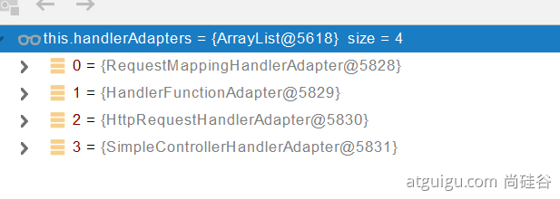

0 - 支持方法上标注@RequestMapping 

1 - 支持函数式编程的

#### 3.3.2 执行目标方法

```java
// Actually invoke the handler.
//DispatcherServlet -- doDispatch
mv = ha.handle(processedRequest, response, mappedHandler.getHandler());
```

```java

mav = invokeHandlerMethod(request, response, handlerMethod); //执行目标方法


//ServletInvocableHandlerMethod
Object returnValue = invokeForRequest(webRequest, mavContainer, providedArgs);
//获取方法的参数值
Object[] args = getMethodArgumentValues(request, mavContainer, providedArgs);
```

#### 3.3.3 参数解析器-HandlerMethodArgumentResolver

确定将要执行的目标方法的每一个参数的值是什么;

SpringMVC目标方法能写多少种参数类型。取决于参数解析器。


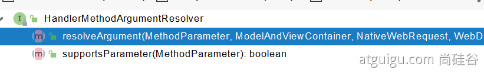

- 当前解析器是否支持解析这种参数
- 支持就调用 resolveArgument

#### 3.3.4 返回值处理器


#### 3.3.5 如何确定目标方法每一个参数的值

```java
============InvocableHandlerMethod==========================
protected Object[] getMethodArgumentValues(NativeWebRequest request, @Nullable ModelAndViewContainer mavContainer,
			Object... providedArgs) throws Exception {

		MethodParameter[] parameters = getMethodParameters();
		if (ObjectUtils.isEmpty(parameters)) {
			return EMPTY_ARGS;
		}

		Object[] args = new Object[parameters.length];
		for (int i = 0; i < parameters.length; i++) {
			MethodParameter parameter = parameters[i];
			parameter.initParameterNameDiscovery(this.parameterNameDiscoverer);
			args[i] = findProvidedArgument(parameter, providedArgs);
			if (args[i] != null) {
				continue;
			}
			if (!this.resolvers.supportsParameter(parameter)) {
				throw new IllegalStateException(formatArgumentError(parameter, "No suitable resolver"));
			}
			try {
				args[i] = this.resolvers.resolveArgument(parameter, mavContainer, request, this.dataBinderFactory);
			}
			catch (Exception ex) {
				// Leave stack trace for later, exception may actually be resolved and handled...
				if (logger.isDebugEnabled()) {
					String exMsg = ex.getMessage();
					if (exMsg != null && !exMsg.contains(parameter.getExecutable().toGenericString())) {
						logger.debug(formatArgumentError(parameter, exMsg));
					}
				}
				throw ex;
			}
		}
		return args;
	}
```

##### 3.3.5.1 挨个判断所有参数解析器那个支持解析这个参数

```java
	@Nullable
	private HandlerMethodArgumentResolver getArgumentResolver(MethodParameter parameter) {
		HandlerMethodArgumentResolver result = this.argumentResolverCache.get(parameter);
		if (result == null) {
			for (HandlerMethodArgumentResolver resolver : this.argumentResolvers) {
				if (resolver.supportsParameter(parameter)) {
					result = resolver;
					this.argumentResolverCache.put(parameter, result);
					break;
				}
			}
		}
		return result;
	}
```

##### 3.3.5.2 解析这个参数的值

```java
调用各自 HandlerMethodArgumentResolver 的 resolveArgument 方法即可
```

##### 3.3.5.3 自定义数据类型 封装 POJO

**ServletModelAttributeMethodProcessor  这个参数处理器支持**

 **是否为简单类型。**

```java
public static boolean isSimpleValueType(Class<?> type) {
		return (Void.class != type && void.class != type &&
				(ClassUtils.isPrimitiveOrWrapper(type) ||
				Enum.class.isAssignableFrom(type) ||
				CharSequence.class.isAssignableFrom(type) ||
				Number.class.isAssignableFrom(type) ||
				Date.class.isAssignableFrom(type) ||
				Temporal.class.isAssignableFrom(type) ||
				URI.class == type ||
				URL.class == type ||
				Locale.class == type ||
				Class.class == type));
	}
```

```java
@Override
	@Nullable
	public final Object resolveArgument(MethodParameter parameter, @Nullable ModelAndViewContainer mavContainer,
			NativeWebRequest webRequest, @Nullable WebDataBinderFactory binderFactory) throws Exception {

		Assert.state(mavContainer != null, "ModelAttributeMethodProcessor requires ModelAndViewContainer");
		Assert.state(binderFactory != null, "ModelAttributeMethodProcessor requires WebDataBinderFactory");

		String name = ModelFactory.getNameForParameter(parameter);
		ModelAttribute ann = parameter.getParameterAnnotation(ModelAttribute.class);
		if (ann != null) {
			mavContainer.setBinding(name, ann.binding());
		}

		Object attribute = null;
		BindingResult bindingResult = null;

		if (mavContainer.containsAttribute(name)) {
			attribute = mavContainer.getModel().get(name);
		}
		else {
			// Create attribute instance
			try {
				attribute = createAttribute(name, parameter, binderFactory, webRequest);
			}
			catch (BindException ex) {
				if (isBindExceptionRequired(parameter)) {
					// No BindingResult parameter -> fail with BindException
					throw ex;
				}
				// Otherwise, expose null/empty value and associated BindingResult
				if (parameter.getParameterType() == Optional.class) {
					attribute = Optional.empty();
				}
				bindingResult = ex.getBindingResult();
			}
		}

		if (bindingResult == null) {
			// Bean property binding and validation;
			// skipped in case of binding failure on construction.
			WebDataBinder binder = binderFactory.createBinder(webRequest, attribute, name);
			if (binder.getTarget() != null) {
				if (!mavContainer.isBindingDisabled(name)) {
					bindRequestParameters(binder, webRequest);
				}
				validateIfApplicable(binder, parameter);
				if (binder.getBindingResult().hasErrors() && isBindExceptionRequired(binder, parameter)) {
					throw new BindException(binder.getBindingResult());
				}
			}
			// Value type adaptation, also covering java.util.Optional
			if (!parameter.getParameterType().isInstance(attribute)) {
				attribute = binder.convertIfNecessary(binder.getTarget(), parameter.getParameterType(), parameter);
			}
			bindingResult = binder.getBindingResult();
		}

		// Add resolved attribute and BindingResult at the end of the model
		Map<String, Object> bindingResultModel = bindingResult.getModel();
		mavContainer.removeAttributes(bindingResultModel);
		mavContainer.addAllAttributes(bindingResultModel);

		return attribute;
	}
```

**WebDataBinder binder = binderFactory.createBinder(webRequest, attribute, name);**

**WebDataBinder : web 数据绑定器，将请求参数的值绑定到指定的 JavaBean 里面**

**WebDataBinder 利用它里面的 Converters 将请求数据转成指定的数据类型。再次封装到 JavaBean 中**


**GenericConversionService：在设置每一个值的时候，找它里面的所有 converter 那个可以将这个数据类型（request带来参数的字符串）转换到指定的类型（JavaBean -- Integer）**

**byte -- > file**

@FunctionalInterface **public interface** Converter<S, T>


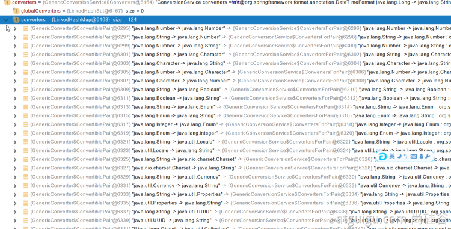

未来我们可以给WebDataBinder里面放自己的Converter；

**private static final class** StringToNumber<T **extends** Number> **implements** Converter<String, T>

自定义 Converter

```java
    //1、WebMvcConfigurer定制化SpringMVC的功能
    @Bean
    public WebMvcConfigurer webMvcConfigurer(){
        return new WebMvcConfigurer() {
            @Override
            public void configurePathMatch(PathMatchConfigurer configurer) {
                UrlPathHelper urlPathHelper = new UrlPathHelper();
                // 不移除；后面的内容。矩阵变量功能就可以生效
                urlPathHelper.setRemoveSemicolonContent(false);
                configurer.setUrlPathHelper(urlPathHelper);
            }

            @Override
            public void addFormatters(FormatterRegistry registry) {
                registry.addConverter(new Converter<String, Pet>() {

                    @Override
                    public Pet convert(String source) {
                        // 啊猫,3
                        if(!StringUtils.isEmpty(source)){
                            Pet pet = new Pet();
                            String[] split = source.split(",");
                            pet.setName(split[0]);
                            pet.setAge(Integer.parseInt(split[1]));
                            return pet;
                        }
                        return null;
                    }
                });
            }
        };
    }
```

#### 3.3.6 目标方法执行完成

将所有的数据都放在 **ModelAndViewContainer**；包含要去的页面地址 View。还包含 Model 数据。


#### 3.3.7 处理派发结果

processDispatchResult(processedRequest, response, mappedHandler, mv, dispatchException);

renderMergedOutputModel(mergedModel, getRequestToExpose(request), response);

```java
InternalResourceView：
@Override
	protected void renderMergedOutputModel(
			Map<String, Object> model, HttpServletRequest request, HttpServletResponse response) throws Exception {

		// Expose the model object as request attributes.
		exposeModelAsRequestAttributes(model, request);

		// Expose helpers as request attributes, if any.
		exposeHelpers(request);

		// Determine the path for the request dispatcher.
		String dispatcherPath = prepareForRendering(request, response);

		// Obtain a RequestDispatcher for the target resource (typically a JSP).
		RequestDispatcher rd = getRequestDispatcher(request, dispatcherPath);
		if (rd == null) {
			throw new ServletException("Could not get RequestDispatcher for [" + getUrl() +
					"]: Check that the corresponding file exists within your web application archive!");
		}

		// If already included or response already committed, perform include, else forward.
		if (useInclude(request, response)) {
			response.setContentType(getContentType());
			if (logger.isDebugEnabled()) {
				logger.debug("Including [" + getUrl() + "]");
			}
			rd.include(request, response);
		}

		else {
			// Note: The forwarded resource is supposed to determine the content type itself.
			if (logger.isDebugEnabled()) {
				logger.debug("Forwarding to [" + getUrl() + "]");
			}
			rd.forward(request, response);
		}
	}
```

```java
暴露模型作为请求域属性
// Expose the model object as request attributes.
		exposeModelAsRequestAttributes(model, request);
```

```java
protected void exposeModelAsRequestAttributes(Map<String, Object> model,
			HttpServletRequest request) throws Exception {

    //model中的所有数据遍历挨个放在请求域中
		model.forEach((name, value) -> {
			if (value != null) {
				request.setAttribute(name, value);
			}
			else {
				request.removeAttribute(name);
			}
		});
	}
```

## 4、数据响应与内容协商

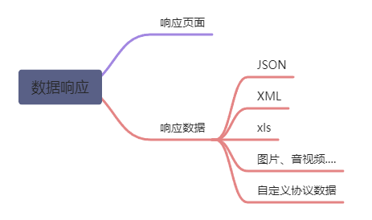

### 4.1 响应 JSON

#### 4.1.1 jackson.jar+@ResponseBody

```xml
<dependency>
    <groupId>org.springframework.boot</groupId>
    <artifactId>spring-boot-starter-web</artifactId>
</dependency>
web场景自动引入了json场景
<dependency>
    <groupId>org.springframework.boot</groupId>
    <artifactId>spring-boot-starter-json</artifactId>
    <version>2.3.4.RELEASE</version>
    <scope>compile</scope>
</dependency>
```

利用 jackson 包完成功能


给前端自动返回json数据；

##### 返回值处理器

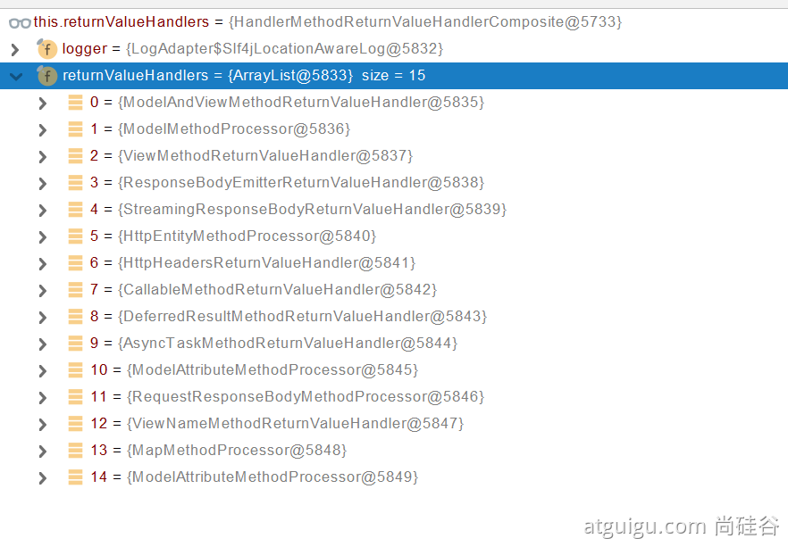

```java
try {
    this.returnValueHandlers.handleReturnValue(
        returnValue, getReturnValueType(returnValue), mavContainer, webRequest);
}
```

```java
@Override
public void handleReturnValue(@Nullable Object returnValue, MethodParameter returnType,
                              ModelAndViewContainer mavContainer, NativeWebRequest webRequest) throws Exception {

    HandlerMethodReturnValueHandler handler = selectHandler(returnValue, returnType);
    if (handler == null) {
        throw new IllegalArgumentException("Unknown return value type: " + returnType.getParameterType().getName());
    }
    handler.handleReturnValue(returnValue, returnType, mavContainer, webRequest);
}
```

```java
RequestResponseBodyMethodProcessor 类	
    @Override
    public void handleReturnValue(@Nullable Object returnValue, MethodParameter returnType,
                                  ModelAndViewContainer mavContainer, NativeWebRequest webRequest)
    throws IOException, HttpMediaTypeNotAcceptableException, HttpMessageNotWritableException {

    mavContainer.setRequestHandled(true);
    ServletServerHttpRequest inputMessage = createInputMessage(webRequest);
    ServletServerHttpResponse outputMessage = createOutputMessage(webRequest);

    // Try even with null return value. ResponseBodyAdvice could get involved.
    // 使用消息转换器进行写出操作
    writeWithMessageConverters(returnValue, returnType, inputMessage, outputMessage);
}
```

##### 返回值解析器原理


1. 返回值处理器判断是否支持这种类型返回值 supportsReturnType
2. 返回值处理器调用 handleReturnValue 进行处理
3. RequestResponseBodyMethodProcessor 可以处理返回值标了 @ResponseBody 注解的。
	1. 利用 MessageConverters 进行处理，将数据写为 json
		- 内容协商（浏览器默认会以请求头的方式告诉服务器他能接受什么样的内容类型，Accept 字段）
		- 服务器最终根据自己自身的能力，决定服务器能生产出什么样内容类型的数据
		- SpringMVC会挨个遍历所有容器底层的 HttpMessageConverter，找到能处理的 HttpMessageConverter
			- 得到 MappingJackson2HttpMessageConverter 可以将对象写为 json
			- 利用 MappingJackson2HttpMessageConverter 将对象转为 json 再写出去

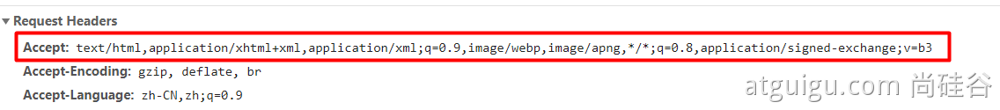

#### 4.1.2 SpringMVC 到底支持哪些返回值

```java
ModelAndView
Model
View
ResponseEntity 
ResponseBodyEmitter
StreamingResponseBody
HttpEntity
HttpHeaders
Callable
DeferredResult
ListenableFuture
CompletionStage
WebAsyncTask
@ModelAttribute 且为对象类型的
@ResponseBody 注解 ---> RequestResponseBodyMethodProcessor；
```

#### 4.1.3 HTTPMessageConverter 原理

##### MessageConverter 规范

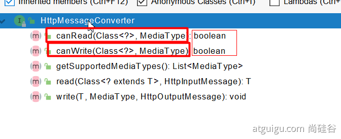

HttpMessageConverter: 看是否支持将此 Class 类型的对象，转为 MediaType 类型的数据。

例子：Person对象转为JSON。或者 JSON转为Person（Write or Read）

##### 默认的 MessageConverter


0 - 只支持 Byte 类型的

1 - String

2 - String

3 - Resource

4 - ResourceRegion

5 - DOMSource.class  SAXSource.class  StAXSource.class StreamSource.class Source.class

6 - MultiValueMap

7 - 直接返回为 true

8 - 直接返回为 true

9 - 支持注解方式 xml 处理的

最终 MappingJackson2HttpMessageConverter 把对象转为 JSON（利用底层的 jackson 的 objectMapper 转换的）


### 4.2 内容协商

根据客户端接收能力不同，返回不同媒体类型的数据。

#### 4.2.1 引入 xml 依赖

```xml
<dependency>
    <groupId>com.fasterxml.jackson.dataformat</groupId>
    <artifactId>jackson-dataformat-xml</artifactId>
</dependency>
```

#### 4.2.2 postman 分别测试返回 json 和 xml

只需要改变请求头中 Accept 字段。Http 协议中规定的，告诉服务器本客户端可以接收的数据类型

#### 4.2.3  开启浏览器参数方式内容协商功能

为了方便内容协商，开启基于请求参数的内容协商功能

```xml
spring:
    contentnegotiation:
      favor-parameter: true  #开启请求参数内容协商模式
```

发请求： http://localhost:8080/test/person?format=json | [http://localhost:8080/test/person?format=xml](http://localhost:8080/test/person?format=xml)

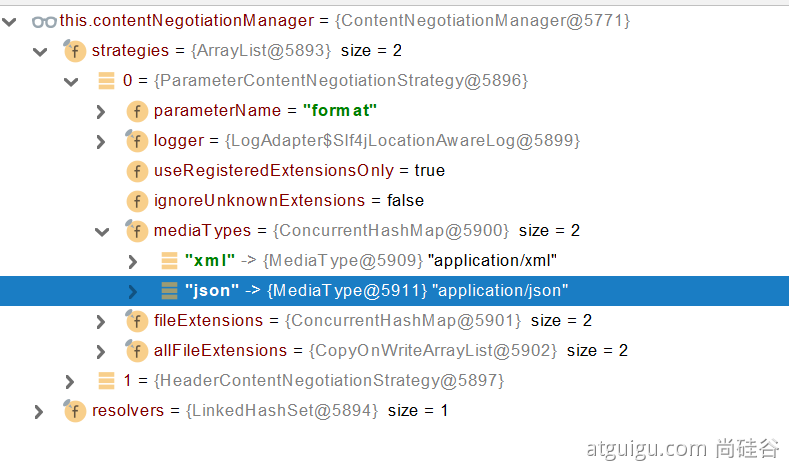

确定客户端接收什么样的内容类型；

1. Parameter 策略优先确定是要返回 json 数据（获取请求头中的 format 的值）

	

2. 最终进行内容协商返回给客户端 json 即可

#### 4.2.4 内容协商原理

1.   判断当前响应头中是否已经有确定的媒体类型。MediaType

2.   **获取客户端（PostMan、浏览器）支持接收的内容类型。（获取客户端Accept请求头字段）[application/xml]**

     -   **contentNegotiationManager 内容协商管理器 默认使用基于请求头的策略**

         

     -   **HeaderContentNegotiationStrategy  确定客户端可以接收的内容类型**

         

3.   遍历循环所有当前系统的 **MessageConverter**，找到支持操作这个对象（Person）的 MessageConverter

4.   找到支持操作 Person 的 converter，把 converter 支持的媒体类型统计出来

5.   客户端需要 [application/xml]。服务端能力 [10种、json、xml]

     

6.   进行内容协商的最佳匹配媒体类型

7.   用支持将对象转为最佳匹配媒体类型的 converter。调用它进行转化

     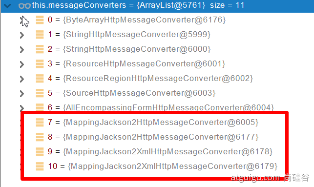

     导入了 jackson 处理 xml 的包，xml 的 converter 就会自动进来

     ```java
     WebMvcConfigurationSupport
     jackson2XmlPresent = ClassUtils.isPresent("com.fasterxml.jackson.dataformat.xml.XmlMapper", classLoader);
     
     if (jackson2XmlPresent) {
     			Jackson2ObjectMapperBuilder builder = Jackson2ObjectMapperBuilder.xml();
     			if (this.applicationContext != null) {
     				builder.applicationContext(this.applicationContext);
     			}
     			messageConverters.add(new MappingJackson2XmlHttpMessageConverter(builder.build()));
     		}
     ```

#### 4.2.5 自定义 MessageConverter

**实现多协议数据兼容。json、xml、x-guigu**

**0、**@ResponseBody 响应数据出去 调用 **RequestResponseBodyMethodProcessor** 处理

1、Processor 处理方法返回值。通过 **MessageConverter** 处理

2、所有 **MessageConverter** 合起来可以支持各种媒体类型数据的操作（读、写）

3、内容协商找到最终的 **messageConverter**；


SpringMVC 的什么功能。一个入口给容器中添加一个 WebMvcConfigurer

```java
 @Bean
public WebMvcConfigurer webMvcConfigurer(){
    return new WebMvcConfigurer() {

        @Override
        public void extendMessageConverters(List<HttpMessageConverter<?>> converters) {

        }
    }
}
```


## 5、视图解析与模板引擎

视图解析：**SpringBoot默认不支持 JSP，需要引入第三方模板引擎技术实现页面渲染。**

### 5.1  视图解析

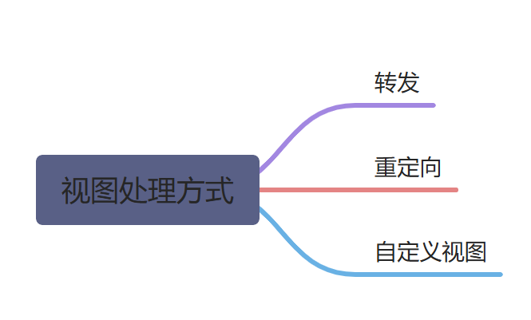

#### 5.1.1 视图解析原理流程

1.   目标方法处理的过程中，所有数据都会被放在 **ModelAndViewContainer 里面。包括数据和视图地址**，如果**方法的参数是一个自定义类型对象（从请求参数中确定的），也会把它重新放在** **ModelAndViewContainer** 

2.   任何目标方法执行完成以后都会返回 **ModelAndView**（数据和视图地址）

3.   **processDispatchResult  处理派发结果（页面该如何响应）**

     1.   **render**(**mv**, request, response); 进行页面渲染逻辑

          

          1.   根据方法的String返回值得到 **View** 对象【其中 render 方法定义了页面的渲染逻辑】

               -   所有的视图解析器尝试是否能根据当前返回值得到 **View** 对象

                   <div>			<!--块级封装-->
                       <center>	<!--将图片和文字居中-->
                       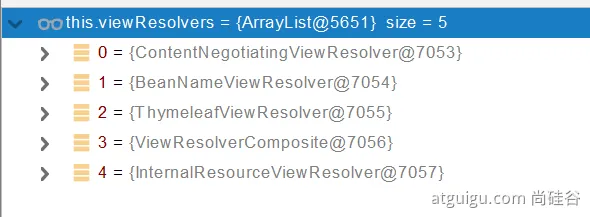
                       <br>		<!--换行-->
                       所有的视图解析器	<!--标题-->
                       </center>
                   </div>

                   -   **redirect:** ==> Thymeleaf 会 new **RedirectView**()
                   -   **forward:** ==> Thymeleaf 会 new **InternalResourceView(forwardUrl)**
                   -   **普通字符串** ==> Thymeleaf 会 new **ThymeleafView()**

               -   ContentNegotiationViewResolver 里面包含了下面所有的视图解析器，内部还是利用下面所有视图解析器得到视图对象

                   <div>			<!--块级封装-->
                       <center>	<!--将图片和文字居中-->
                       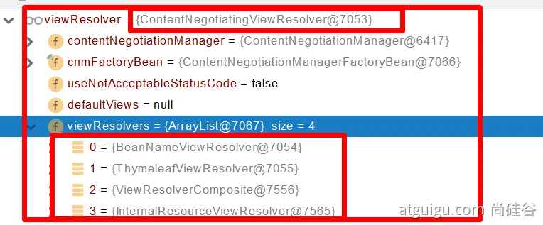
                       <br>		<!--换行-->
                       ContentNegotiationViewResolver 里面包含了下面所有的视图解析器	<!--标题-->
                       </center>
                   </div>

               -   view.render(mv.getModelInternal(), request, response);   视图对象调用自定义的 render 方法进行页面渲染工作

### 5.2 模板引擎-Thymeleaf

#### 5.2.1 thymeleaf 简介

Thymeleaf is a modern server-side Java template engine for both web and standalone environments, capable of processing HTML, XML, JavaScript, CSS and even plain text.

**现代化、服务端Java模板引擎**

#### 5.2.2 基本语法

##### 5.2.2.1 表达式

| 表达式名字 | 语法   | 用途                               |
| ---------- | ------ | ---------------------------------- |
| 变量取值   | ${...} | 获取请求域、session域、对象等值    |
| 选择变量   | *{...} | 获取上下文对象值                   |
| 消息       | #{...} | 获取国际化等值                     |
| 链接       | @{...} | 生成链接                           |
| 片段表达式 | ~{...} | jsp:include 作用，引入公共页面片段 |

##### 5.2.2.2 字面量

文本值: **'one text'** **,** **'Another one!'** **,…**

数字: **0** **,** **34** **,** **3.0** **,** **12.3** **,…**

布尔值: **true** **,** **false**

空值: **null**

变量：one，two，.... 变量名不能有空格

##### 5.2.2.3 文本操作

字符串拼接: **+**

变量替换: **|The name is ${name}|** 

##### 5.2.2.4 运算

1. 数学运算符: + , - , * , / , %

2. 布尔运算

	运算符:  **and** **,** **or**

	一元运算: **!** **,** **not** 

3. 比较运算

	比较: **>** **,** **<** **,** **>=** **,** **<=** **(** **gt** **,** **lt** **,** **ge** **,** **le** **)**等式: **==** **,** **!=** **(** **eq** **,** **ne** **)** 

4. 条件运算

	- If-then: **(if) ? (then)**
	- If-then-else: **(if) ? (then) : (else)**
	- Default: (value) **?: (defaultvalue)** 

#### 5.2.3 设置属性值 - th:attr

- 设置单个值

	```html
	<form action="subscribe.html" th:attr="action=@{/subscribe}">
	  <fieldset>
	    <input type="text" name="email" />
	    <input type="submit" value="Subscribe!" th:attr="value=#{subscribe.submit}"/>
	  </fieldset>
	</form>
	```

- 设置多个值

	```html
	
	```

- 以上两个的代替写法 th:xxxx

	```html
	<input type="submit" value="Subscribe!" th:value="#{subscribe.submit}"/>
	<form action="subscribe.html" th:action="@{/subscribe}">
	```

[所有h5兼容的标签写法](https://www.thymeleaf.org/doc/tutorials/3.0/usingthymeleaf.html#setting-value-to-specific-attributes)

#### 5.2.4 迭代

```html
<tr th:each="prod : ${prods}">
        <td th:text="${prod.name}">Onions</td>
        <td th:text="${prod.price}">2.41</td>
        <td th:text="${prod.inStock}? #{true} : #{false}">yes</td>
</tr>
```

```html
<tr th:each="prod,iterStat : ${prods}" th:class="${iterStat.odd}? 'odd'">
  <td th:text="${prod.name}">Onions</td>
  <td th:text="${prod.price}">2.41</td>
  <td th:text="${prod.inStock}? #{true} : #{false}">yes</td>
</tr>
```

#### 5.2.5 条件运算

```html
<a href="comments.html"
th:href="@{/product/comments(prodId=${prod.id})}"
th:if="${not #lists.isEmpty(prod.comments)}">view</a>
```

```html
<div th:switch="${user.role}">
  <p th:case="'admin'">User is an administrator</p>
  <p th:case="#{roles.manager}">User is a manager</p>
  <p th:case="*">User is some other thing</p>
</div>
```

#### 5.2.6 属性优先级

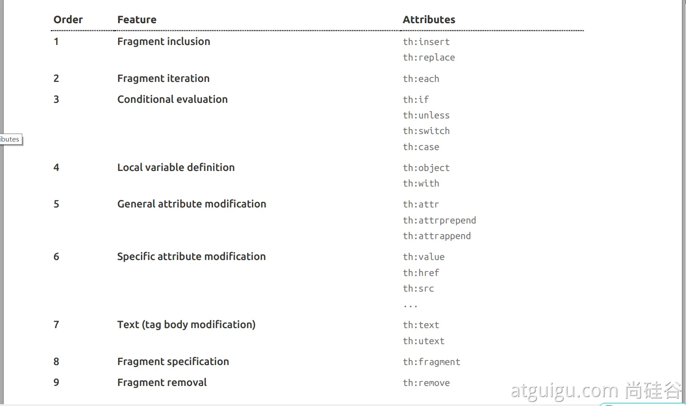

### 5.3 Thymeleaf 使用

1. 引入 starter

	```xml
	<dependency>
	    <groupId>org.springframework.boot</groupId>
	    <artifactId>spring-boot-starter-thymeleaf</artifactId>
	</dependency>
	```

2. 自动配置好了thymeleaf

	```java
	@Configuration(proxyBeanMethods = false)
	@EnableConfigurationProperties(ThymeleafProperties.class)
	@ConditionalOnClass({ TemplateMode.class, SpringTemplateEngine.class })
	@AutoConfigureAfter({ WebMvcAutoConfiguration.class, WebFluxAutoConfiguration.class })
	public class ThymeleafAutoConfiguration { }
	```

	自动配好的策略

	1. 所有thymeleaf的配置值都在 ThymeleafProperties
	2. 配置好了 **SpringTemplateEngine** 
	3. **配好了** **ThymeleafViewResolver** 
	4. 我们只需要直接开发页面

	```java
	public static final String DEFAULT_PREFIX = "classpath:/templates/";
	public static final String DEFAULT_SUFFIX = ".html";  //xxx.html
	```

3. 页面开发

	```html
	<!DOCTYPE html>
	<html lang="en" xmlns:th="http://www.thymeleaf.org">
	<head>
	    <meta charset="UTF-8">
	    <title>Title</title>
	</head>
	<body>
	<h1 th:text="${msg}">哈哈</h1>
	<h2>
	    <a href="www.atguigu.com" th:href="${link}">去百度</a>  <br/>
	    <a href="www.atguigu.com" th:href="@{link}">去百度2</a>
	</h2>
	</body>
	</html>
	```

## 6、拦截器

#### 6.1 HandlerInterceptor 接口

```java
/**
 * 登录检查
 * 1、配置好拦截器要拦截哪些请求
 * 2、把这些配置放在容器中
 */
@Slf4j
public class LoginInterceptor implements HandlerInterceptor {

    /**
     * 目标方法执行之前
     * @param request
     * @param response
     * @param handler
     * @return
     * @throws Exception
     */
    @Override
    public boolean preHandle(HttpServletRequest request, HttpServletResponse response, Object handler) throws Exception {

        String requestURI = request.getRequestURI();
        log.info("preHandle拦截的请求路径是{}",requestURI);

        //登录检查逻辑
        HttpSession session = request.getSession();

        Object loginUser = session.getAttribute("loginUser");

        if(loginUser != null){
            //放行
            return true;
        }

        //拦截住。未登录。跳转到登录页
        request.setAttribute("msg","请先登录");
//        re.sendRedirect("/");
        request.getRequestDispatcher("/").forward(request,response);
        return false;
    }

    /**
     * 目标方法执行完成以后
     * @param request
     * @param response
     * @param handler
     * @param modelAndView
     * @throws Exception
     */
    @Override
    public void postHandle(HttpServletRequest request, HttpServletResponse response, Object handler, ModelAndView modelAndView) throws Exception {
        log.info("postHandle执行{}",modelAndView);
    }

    /**
     * 页面渲染以后
     * @param request
     * @param response
     * @param handler
     * @param ex
     * @throws Exception
     */
    @Override
    public void afterCompletion(HttpServletRequest request, HttpServletResponse response, Object handler, Exception ex) throws Exception {
        log.info("afterCompletion执行异常{}",ex);
    }
}
```

#### 6.2 配置拦截器

```java
/**
 * 1、编写一个拦截器实现HandlerInterceptor接口
 * 2、拦截器注册到容器中（实现WebMvcConfigurer的addInterceptors）
 * 3、指定拦截规则【如果是拦截所有，静态资源也会被拦截】
 */
@Configuration
public class AdminWebConfig implements WebMvcConfigurer {

    @Override
    public void addInterceptors(InterceptorRegistry registry) {
        registry.addInterceptor(new LoginInterceptor())
                .addPathPatterns("/**")  //所有请求都被拦截包括静态资源
                .excludePathPatterns("/","/login","/css/**","/fonts/**","/images/**","/js/**"); //放行的请求
    }
}
```

#### 6.3 拦截器原理

1. 根据当前请求，找到 **HandlerExecutionChain**【可以处理请求的 handler 以及 handler 的所有拦截器】

2. 先来 **顺序执行** 所有拦截器的 preHandle 方法

- 如果当前拦截器 prehandler 返回为 true。则执行下一个拦截器的 preHandle
- 如果当前拦截器返回为 false。倒序执行所有已经执行了的拦截器的 afterCompletion；

3. 如果任何一个拦截器返回 false。直接跳出不执行目标方法

4. 所有拦截器都返回 True。执行目标方法

5. 倒序执行所有拦截器的 postHandle 方法

6. 前面的步骤有任何异常都会直接倒序触发 afterCompletion

7. 页面成功渲染完成以后，也会倒序触发 afterCompletion

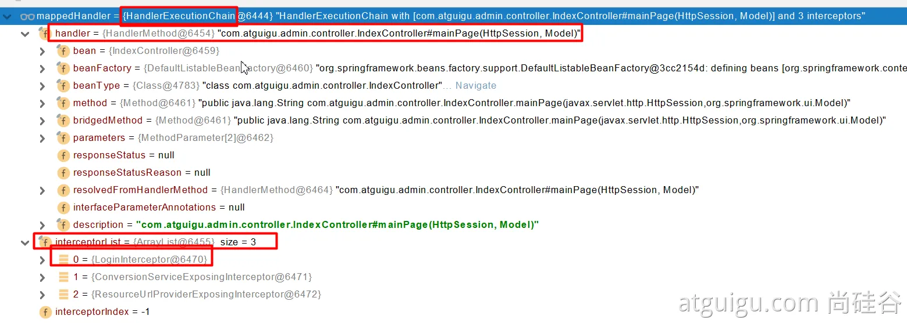

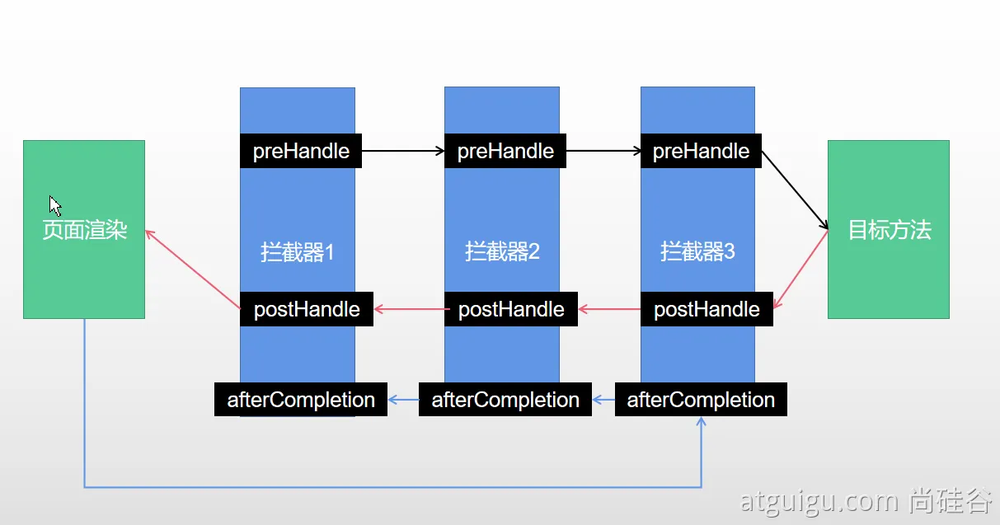

## 7、文件上传

1. 页面表单

	```xml
	<form method="post" action="/upload" enctype="multipart/form-data">
	    <input type="file" name="file"><br>
	    <input type="submit" value="提交">
	</form>
	```

2. 文件上传代码

	```java
	    /**
	     * MultipartFile 自动封装上传过来的文件
	     * @param email
	     * @param username
	     * @param headerImg
	     * @param photos
	     * @return
	     */
	    @PostMapping("/upload")
	    public String upload(@RequestParam("email") String email,
	                         @RequestParam("username") String username,
	                         @RequestPart("headerImg") MultipartFile headerImg,
	                         @RequestPart("photos") MultipartFile[] photos) throws IOException {
	
	        log.info("上传的信息：email={}，username={}，headerImg={}，photos={}",
	                email,username,headerImg.getSize(),photos.length);
	
	        if(!headerImg.isEmpty()){
	            //保存到文件服务器，OSS服务器
	            String originalFilename = headerImg.getOriginalFilename();
	            headerImg.transferTo(new File("H:\\cache\\"+originalFilename));
	        }
	
	        if(photos.length > 0){
	            for (MultipartFile photo : photos) {
	                if(!photo.isEmpty()){
	                    String originalFilename = photo.getOriginalFilename();
	                    photo.transferTo(new File("H:\\cache\\"+originalFilename));
	                }
	            }
	        }
	
	        return "main";
	    }
	```

3. 自动配置原理

	文件上传自动配置类 -> MultipartAutoConfiguration -> MultipartProperties

	- 自动配置好了 **StandardServletMultipartResolver 【文件上传解析器】**

	- **原理步骤**:

		1. **请求进来使用文件上传解析器判断（**isMultipart**）并封装（**resolveMultipart，**返回**MultipartHttpServletRequest**）文件上传请求**

		2. **参数解析器来解析请求中的文件内容封装成MultipartFile**

			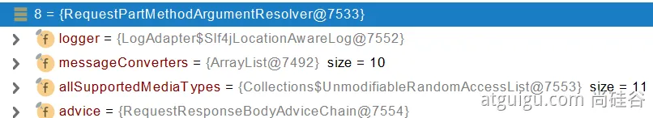

		3. **将 request 中文件信息封装为一个 Map；**MultiValueMap<String, MultipartFile>,键为 "headerImg"、"photos"

			```java
			@PostMapping("/upload")
			public String upload(@RequestParam("email") String email,
			                     @RequestParam("username") String username,
			                     @RequestPart("headerImg") MultipartFile headerImg,
			                     @RequestPart("photos") MultipartFile[] photos)
			```

			**FileCopyUtils** 工具类实现文件流的拷贝

## 8、异常处理

### 8.1 默认规则

- 默认情况下，Spring Boot提供`/error`处理所有错误的映射

- 对于机器客户端，它将生成 JSON 响应，其中包含错误，HTTP状态和异常消息的详细信息

	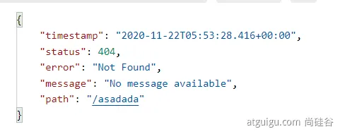

	对于浏览器客户端，响应一个 “whitelabel” 错误视图，以 HTML 格式呈现相同的数据

	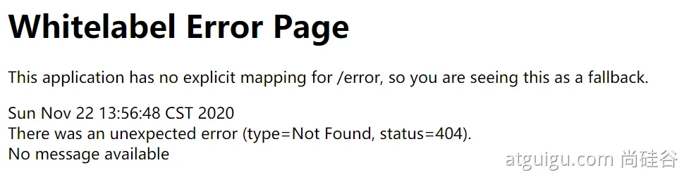

- **要对其进行自定义，添加**`View`**解析为**`error`

- 要完全替换默认行为，可以实现 `ErrorController `并注册该类型的Bean定义，或添加`ErrorAttributes类型的组件`以使用现有机制但替换其内容

- error/下的4xx，5xx页面会被自动解析

	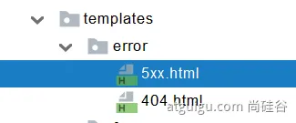

### 8.2 定制错误处理逻辑

- 自定义错误页

	error/404.html   error/5xx.html

	有精确的错误状态码页面就匹配精确，没有就找 4xx.html；如果都没有就触发白页

- @ControllerAdvice + @ExceptionHandler 处理全局异常

	底层是 **ExceptionHandlerExceptionResolver 支持的**

- @ResponseStatus + 自定义异常

	底层是 **ResponseStatusExceptionResolver，把 responsestatus 注解的调用response.sendError(statusCode, resolvedReason) 向 tomcat 发送 /error 请求，再转向处理 /error 请求的逻辑，适配到 4xx、5xx 页面**

- Spring底层的异常，如 参数类型转换异常

	**DefaultHandlerExceptionResolver 处理框架底层的异常**

	response.sendError(HttpServletResponse.**SC_BAD_REQUEST**, ex.getMessage()); 

	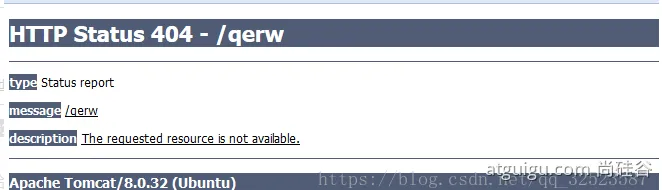

- 自定义实现 HandlerExceptionResolver 处理异常；可以作为默认的全局异常处理规则

	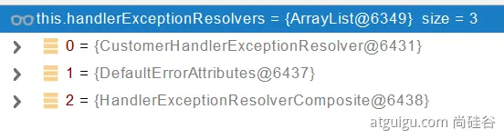

- **ErrorViewResolver** 实现自定义处理异常

	- response.sendError，error 请求就会转给 controller
	- 你的异常没有任何人能处理，tomcat底层也会调用 response.sendError，error 请求就会转给 controller
	- **basicErrorController 要去的页面地址是** **ErrorViewResolver**  

### 8.3 异常处理自动配置原理

1. **ErrorMvcAutoConfiguration  自动配置异常处理规则**

	为容器中的配置的组件

	- **DefaultErrorAttributes ->** **id：errorAttributes**

		```java
		public class DefaultErrorAttributes implements ErrorAttributes, HandlerExceptionResolver
		```

	- **DefaultErrorAttributes**：定义错误页面中可以包含哪些数据

		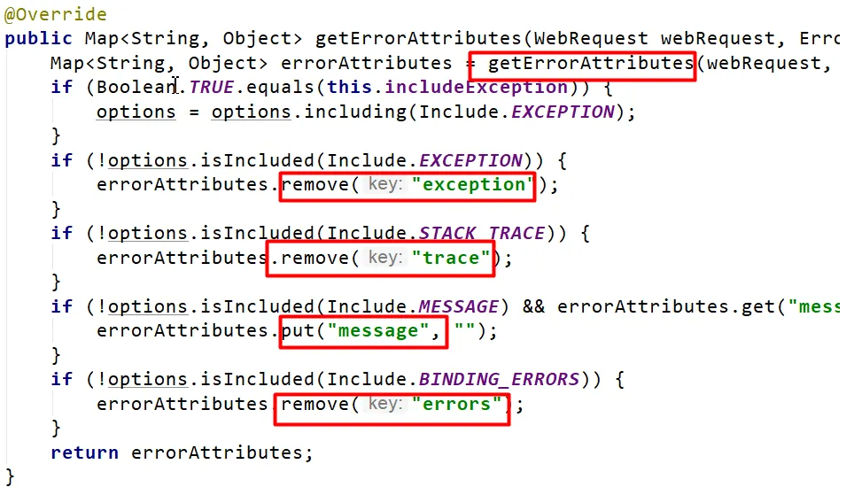

		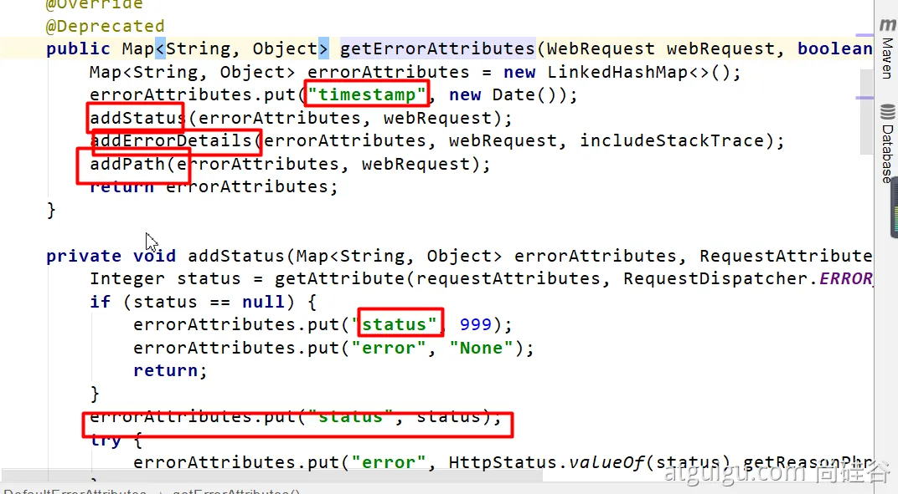

	- **BasicErrorController --> id：basicErrorController（json+白页 适配响应）**

		- 处理默认 /error 路径的请求；页面响应 new ModelAndView("error", model)
		- 容器中有组件 View -> id 是 error （响应默认错误页）
		- 容器中有组件 BeanNameViewResolver (视图解析器), 按照返回的视图名作为组件的 id 去容器中找 View 对象，如此就找到了组件中的 View

	- DefaultErrorViewResolver -> id: conventionErrorViewResolver

		- 如果发生错误，会以 HTTP 的状态码作为视图页地址(viewName),找到真正的页面
		- error/404、5xx.html

### 8.4 异常处理步骤流程

1. 执行目标方法，目标方法运行期间有任何异常都会被 catch、而且标志当前请求结束，并且用 **dispatchException** 

2. 进入视图解析流程

	```java
	processDispatchResult(processedRequest, response, mappedHandler, mv, dispatchException);
	```

3. **mv** = **processHandlerException**；处理 handler 发生的异常，处理完成返回 ModelAndView

	遍历所有的 **handlerExceptionResolvers，找到能处理当前异常的异常解析器处理器异常解析器**

	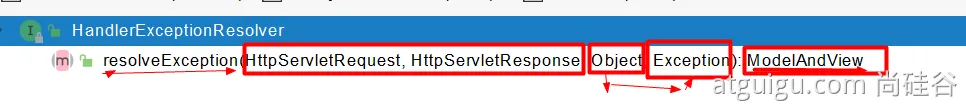

	**系统默认的异常解析器**

	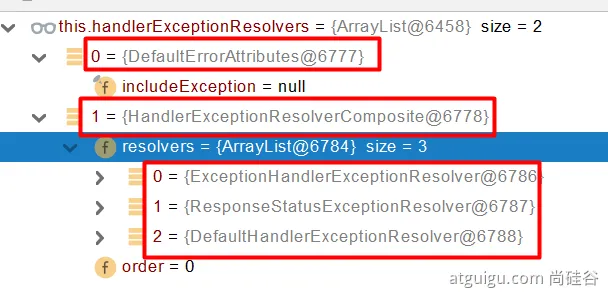

	- DefaultErrorAttributes 先来处理异常。把异常信息保存到 request域，并且返回 null，在源码的处理流程中，如果异常解析器返回为 null，则不会真正返回，而是继续寻找下一个异常解析器继续处理

	- 默认没有任何人能处理异常，所以异常会被抛出

		- **如果没有任何人能处理最终底层就会发送 /error 请求。会被底层的 BasicErrorController 处理**

		- **解析错误视图；遍历所有的** **ErrorViewResolver 看谁能解析**

			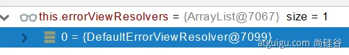

		- **默认的 DefaultErrorViewResolver ,作用是把响应状态码作为错误页的地址，error/500.html**

		- **模板引擎最终响应这个页面 error/500.html** 

	

	

## 9、Web 原生组件注入

### 9.1 使用 Servlet API

```java
@ServletComponentScan(basePackages = "com.atguigu.admin") :指定原生Servlet组件都放在那里, 添加在主类上

@WebServlet(urlPatterns = "/my")：效果：直接响应，没有经过Spring的拦截器？原因是？

@WebFilter(urlPatterns={"/css/","/images/"})

@WebListener
```

>   扩展：DispatchServlet 如何注册进来
>
>   -   容器中自动配置了 DispatchServlet 属性绑定到 WebMvcProperties；对应的配置文件配置项是 spring.mvc
>   -   **通过** **ServletRegistrationBean** \<DispatcherServlet> 把 DispatcherServlet  配置进来
>   -   并且默认映射的是 / 路径

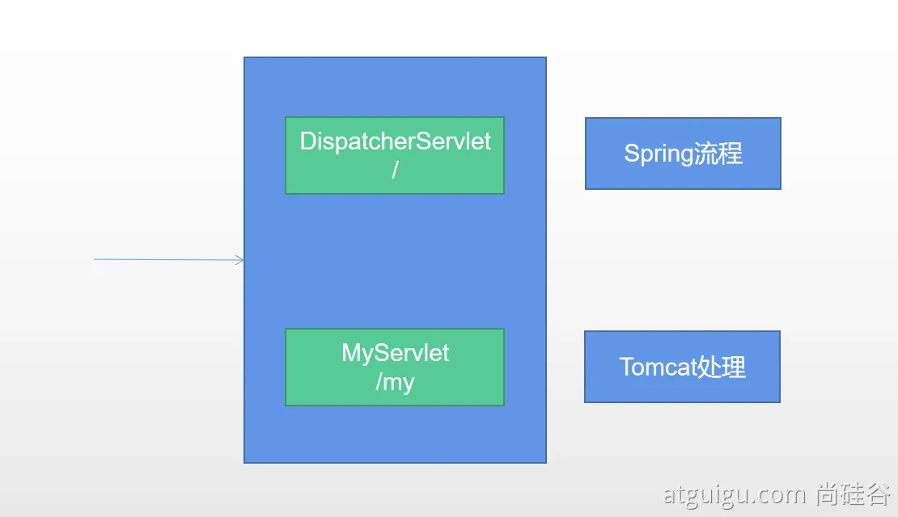

>   而上文中定义的 WebServlet 的 urlPatterns = "/my"，比 / 更精确，因此请求发送过来自然会找到 MyServlet 而不会被 DispatcherServlet 处理，也就不会经过拦截器的拦截。

### 9.2 使用 RegistrationBean

`ServletRegistrationBean`, `FilterRegistrationBean`, and `ServletListenerRegistrationBean`

 分别向容器中注册 Servlet、Filter、Listener

```java
@Configuration
public class MyRegistConfig {

    @Bean
    public ServletRegistrationBean myServlet(){
        MyServlet myServlet = new MyServlet();
        return new ServletRegistrationBean(myServlet,"/my","/my02");
    }


    @Bean
    public FilterRegistrationBean myFilter(){
        MyFilter myFilter = new MyFilter();
        FilterRegistrationBean filterRegistrationBean = new FilterRegistrationBean(myFilter);
        filterRegistrationBean.setUrlPatterns(Arrays.asList("/my","/css/*"));
        return filterRegistrationBean;
    }

    @Bean
    public ServletListenerRegistrationBean myListener(){
        MyServletContextListener myServletContextListener = new MyServletContextListener();
        return new ServletListenerRegistrationBean(myServletContextListener);
    }
}
```

## 10、嵌入式 Servlet 容器

### 10.1 切换嵌入式 Servlet 容器

默认支持的 webServer 

-   `Tomcat`, `Jetty`, or `Undertow`

    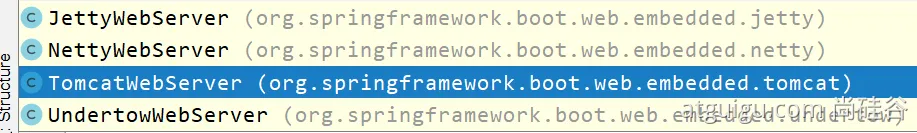

-   ServletWebServerApplicationContext 容器启动寻找 ServletWebServerFactory 并引导创建服务器。（如果 springboot 知道这是一个 web 应用，就不会创建普通的 IOC 容器 ApplicationContext，而是会创建 ServletWebServerApplicationContext。

```xml
<dependency>
    <groupId>org.springframework.boot</groupId>
    <artifactId>spring-boot-starter-web</artifactId>
    <exclusions>
        <exclusion>
            <groupId>org.springframework.boot</groupId>
            <artifactId>spring-boot-starter-tomcat</artifactId>
        </exclusion>
    </exclusions>
</dependency>
// web 启动器默认配置了 tomcat webServer，如果要切换需要移除 tomcat，再加入其他 webServer 的启动器
```

>   原理：
>
>   -   SpringBoot应用启动发现当前是 Web 应用。web 场景包会导入 tomcat
>   -   web应用会创建一个web版的 ioc 容器 **ServletWebServerApplicationContext**
>   -   ServletWebServerApplicationContext` 启动的时候寻找 `**ServletWebServerFactory**（Servlet 的 web 服务器工厂-> Servlet 的web 服务器）
>   -   SpringBoot 底层默认有很多的 WebServer 工厂；`TomcatServletWebServerFactory`, `JettyServletWebServerFactory`, or `UndertowServletWebServerFactory`
>   -   底层直接会有一个自动配置类。**ServletWebServerFactoryAutoConfiguration**
>   -   ServletWebServerFactoryAutoConfiguration 导入了 ServletWebServerFactoryConfiguration（配置类）
>   -   ServletWebServerFactoryConfiguration 配置类根据动态判断系统中到底导入了哪个 Web 服务器的包。（默认是 web-starter 导入tomcat 包），容器中就有 TomcatServletWebServerFactory
>   -   TomcatServletWebServerFactory 创建出 Tomcat 服务器并启动；TomcatWebServer 的构造器拥有初始化方法 initialize -> this.tomcat.start();

### 10.2 定制 Servlet 容器

-   SpringBoot 实现  `WebServerFactoryCustomizer <ConfigurableServletWebServerFactory> `

    -   把配置文件的值和`ServletWebServerFactory 进行绑定`

-   修改配置文件 **server.xxx**

-   直接自定义 **ConfigurableServletWebServerFactory**

    ```java
    import org.springframework.boot.web.server.WebServerFactoryCustomizer;
    import org.springframework.boot.web.servlet.server.ConfigurableServletWebServerFactory;
    import org.springframework.stereotype.Component;
    
    @Component
    public class CustomizationBean implements WebServerFactoryCustomizer<ConfigurableServletWebServerFactory> {
    
        @Override
        public void customize(ConfigurableServletWebServerFactory server) {
            server.setPort(9000);
        }
    }
    ```

## 11、定制化原理

### 11.1 定制化的常见方式

-   修改配置文件

-   xxxCustomizer

-   编写自定义的配置类 xxxConfiguration + @Bean 进行替换，增加或替换容器中的默认组件

-   Web 应用编写一个配置类实现 WebMvcConfigurer 即可定制化 web 功能 + @Bean 给容器中再扩展一些组件

    ```java
    @Configuration
    public class AdminWebConfig implements WebMvcConfigurer{}
    ```

-   @EnableWebMvc + WebMvcConfigurer + @Bean  可以全面接管 SpringMVC，所有规则全部自己重新配置， 实现定制和扩展功能

    -   WebMvcAutoConfiguration  默认的 SpringMVC 的自动配置功能类，e.g. 静态资源、欢迎页

    -   一旦使用 @EnableWebMvc 会 @Import(DelegatingWebMvcConfiguration.class)

    -   DelegatingWebMvcConfiguration 的作用，只保证 SpringMVC 最基本的使用

        -   把所有系统中的 WebMvcConfigurer 拿过来。所有功能的定制都是这些 WebMvcConfigurer  合起来一起生效

        -   自动配置了一些非常底层的组件。**RequestMappingHandlerMapping**，这些组件依赖的组件都是从容器中获取

        -   ```java
            public class DelegatingWebMvcConfiguration extends WebMvcConfigurationSupport
            ```
    -   WebMvcAutoConfiguration 里面的配置要能生效必须 @ConditionalOnMissingBean(WebMvcConfigurationSupport.class)

    -   @EnableWebMvc  导致了 WebMvcAutoConfiguration  没有生效

