# 二、Redis 概述安装

-   Redis是一个开源的 key-value 存储系统
-   和 Memcached 类似，它支持存储的 value 类型相对更多，包括 string(字符串)、list(链表)、set(集合)、zset(sorted set --有序集合)和 hash（哈希类型）
-   这些数据类型都支持 push/pop、add/remove 及取交集并集和差集及更丰富的操作，而且这些操作都是原子性的
-   在此基础上，Redis支持各种不同方式的排序
-   与memcached一样，为了保证效率，数据都是缓存在内存中
-   区别的是Redis会周期性的把更新的数据写入磁盘或者把修改操作写入追加的记录文件
-   并且在此基础上实现了master-slave(主从)同步

## 2.1 应用场景

### 2.1.1 配合关系型数据库做高速缓存

-   高频次，热门访问的数据，降低数据库 IO
-   分布式架构，做 session 共享

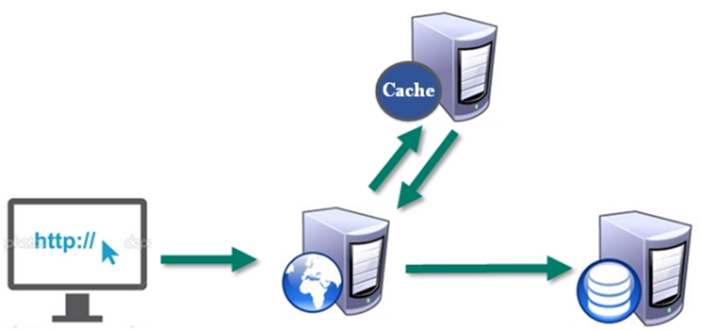

### 2.1.2 多样的数据结构存储持久化数据

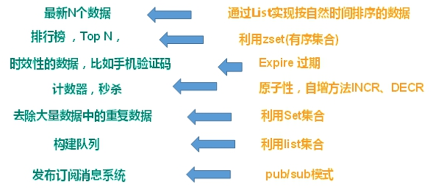

## 2.2 Redis 安装

### 2.2.1 安装目录 /usr/local/bin

-   redis-benchmark:性能测试工具
-   redis-check-aof：修复有问题的AOF文件
-   redis-check-dump：修复有问题的dump.rdb文件
-   redis-sentinel：Redis集群使用
-   redis-server：Redis服务器启动命令
-   redis-cli：客户端，操作入口

### 2.2.2 前台启动

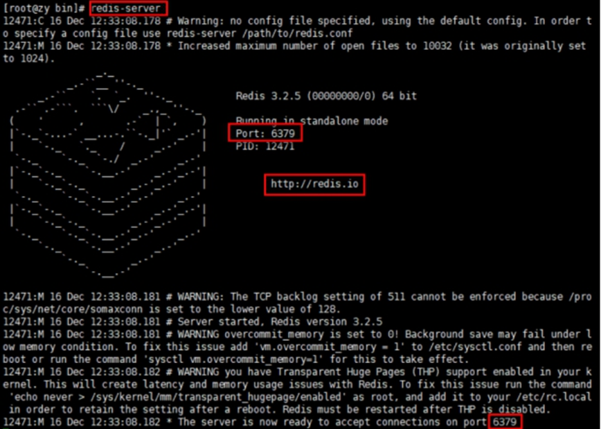

```shell
redis-server # 命令行窗口不能关闭，否则服务器停止
```

### 2.2.3 后台启动

#### 2.2.3.1 备份 redis.conf

拷贝一份 redis.conf 

```shell
cp /opt/redis-3.2.5/redis.conf /myredis
```

#### 2.2.5.2 修改后台启动设置 

128: daemonize no 改成 yes，让服务在后台启动

#### 2.2.5.3 Redis 启动

```shell
redis-server /myredis/redis.conf
ps -ef | grep redis
```

#### 2.2.5.4 客户端访问

```shell
redis-cli
```

#### 2.2.5.5 Redis 关闭

```shell
redis-cli shutdown
也可进入终端再关闭
```

### 2.2.4 Redis 相关知识

-   端口 6379
-   默认存在16个数据库，下标从0开始，初始默认使用0号库；使用命令 select \<dbid> 来切换数据库: select 8
-   所有库使用同样的密码
-   dbsize 查看当前数据库的 key 的数量
-   flushdb 清空当前库；flushall 通杀全部库

Redis是**单线程+多路IO复用技术**

多路复用是指使用一个线程来检查多个文件描述符（Socket）的就绪状态，比如调用select和poll函数，传入多个文件描述符，如果有一个文件描述符就绪，则返回，否则阻塞直到超时。得到就绪状态后真正的操作可以在同一个线程里执行，也可以启动线程执行（比如使用线程池）

串行  vs  多线程+锁（memcached） vs  单线程+多路IO复用(Redis)

（与Memcache三点不同: 支持多数据类型，支持持久化，单线程+多路IO复用）

# 三、常用五大数据类型

## 3.1 Redis 键(key)

```shell
key * # 查看当前库所有key
exists key # 判断某个key是否存在
type key # 查看你的key是什么类型
del key # 删除指定的key数据
unlink key # 根据value选择非阻塞删除
	仅将keys从keyspace元数据中删除，真正的删除会在后续异步操作。
expire key 10 # 10秒钟：为给定的key设置过期时间
ttl key # 查看还有多少秒过期，-1表示永不过期，-2表示已过期
select # 命令切换数据库
dbsize # 查看当前数据库的key的数量
flushdb # 清空当前库
flushall # 通杀全部库
```

## 3.2 Redis 字符串（String）

### 3.2.1 简介

-   String类型是**二进制安全**的。意味着Redis的String可以包含任何数据。比如jpg图片或者序列化的对象。
-   String类型是Redis最基本的数据类型，一个Redis中字符串value最多可以是512M

### 3.2.2 常用命令

````shell
set <key> <value> # 添加键值对
```
*NX：当数据库中key不存在时，可以将key-value添加数据库
*XX：当数据库中key存在时，可以将key-value添加数据库，与NX参数互斥
*EX：key的超时秒数
*PX：key的超时毫秒数，与EX互斥
*表示非必选
```
````

```shell
get <key> # 查询对应键值
append <key> <value> # 将给定的<value>追加到原值的末尾，字符串拼接
strlen <key> # 获得值的长度
setnx <key> <value> # 只有在 key 不存在时，设置 key 的值

incr  <key>
	# 将 key 中储存的数字值增1
	# 只能对数字值操作，如果为空，新增值为1
decr  <key>
	# 将 key 中储存的数字值减1
	# 只能对数字值操作，如果为空，新增值为-1
incrby / decrby <key><strip> # 将 key 中储存的数字值增减。自定义步长。
```

```shell
mset <key1> <value1> <key2> <value2> # 同时设置一个或多个 key-value对  
mget <key1> <key2> <key3> # 同时获取一个或多个 value  
msetnx <key1> <value1> <key2> <value2> # 同时设置一个或多个 key-value 对，当且仅当所有给定 key 都不存在。原子性，有一个失败则都失败
```

```shell
getrange <key> <起始位置> <结束位置> # 获得值的范围，类似java中的substring，前包，后包
setrange <key> <起始位置> <value> # 用 <value> 覆写<key>所储存的字符串值，从<起始位置>开始(索引从0开始)。
setex <key> <过期时间> <value> # 设置键值的同时，设置过期时间，单位秒。
getset <key> <value> # 以新换旧，设置了新值同时获得旧值。
```

### 3.2.3 数据结构

String 的数据结构为**简单动态字符串**(Simple Dynamic String,缩写SDS)。是可以修改的字符串，内部结构实现上类似于 Java 的 ArrayList，采用预分配冗余空间的方式来减少内存的频繁分配。

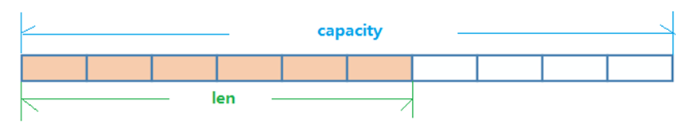

如图中所示，内部为当前字符串实际分配的空间 capacity 一般要高于实际字符串长度 len。当字符串长度小于1M时，扩容都是加倍现有的空间，如果超过1M，扩容时一次只会多扩1M的空间。需要注意的是字符串最大长度为512M。

## 3.3 Redis 列表（List）

### 3.3.1 简介

Redis 列表是简单的**字符串列表**，按照**插入顺序排序**。你可以添加一个元素到列表的头部（左边）或者尾部（右边）。它的底层实际是个双向链表，对两端的操作性能很高，通过索引下标的操作中间的节点性能会较差。

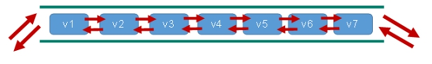

### 3.3.2 常用命令

```shell
lpush/rpush <key> <value1> <value2> <value3> # 从左边/右边插入一个或多个值
lpop/rpop <key> # 从左边/右边吐出一个值。值在键在，值光键亡
rpoplpush <key1> <key2> # 从<key1>列表右边吐出一个值，插到<key2>列表左边。(rpoplpush是一个命令而不是两个)
lrange <key> <start> <stop> # 按照索引下标获得元素(从左到右)
lrange mylist 0 -1 # 0左边第一个，-1右边第一个，（0-1表示获取所有）
lindex <key> <index> # 按照索引下标获得元素(从左到右)
llen <key> # 获得列表长度 
linsert <key> before <value> <newvalue> # 在<value>的后面插入<newvalue>插入值
lrem <key> <n> <value> # 从左边删除n个value值(从左到右)
lset <key> <index> <value> #将列表key下标为index的值替换成value
```

### 3.3.3 数据结构

List 的数据结构为快速链表 quickList。首先在列表元素较少的情况下会使用一块连续的内存存储，这个结构是ziplist，也即是压缩列表。它将所有的元素紧挨着一起存储，分配的是一块连续的内存。当数据量比较多的时候才会改成quicklist。因为普通的链表需要的附加指针空间太大，会比较浪费空间。比如这个列表里存的只是int类型的数据，结构上还需要两个额外的指针prev和next。


Redis将链表和ziplist结合起来组成了quicklist。也就是将多个ziplist使用双向指针串起来使用。这样既满足了快速的插入删除性能，又不会出现太大的空间冗余。

## 3.4 Redis 集合（Set）

### 3.4.1 简介

Redis set对外提供的功能与list类似是一个列表的功能，特殊之处在于set是可以**自动排重**的，当你需要存储一个列表数据，又不希望出现重复数据时，set是一个很好的选择，并且set提供了判断某个成员是否在一个set集合内的重要接口，这个也是list所不能提供的。

Redis的Set是String类型的无序集合。它底层其实是一个value为null的hash表，所以添加，删除，查找的**复杂度都是**O(1)。

### 3.4.2 常用命令

```shell
sadd <key> <value1> <value2> # 将一个或多个 member 元素加入到集合 key 中，已经存在的 member 元素将被忽略
smembers <key> # 取出该集合的所有值。
sismember <key> <value> # 判断集合<key>是否为含有该<value>值，有1，没有0
scard <key> # 返回该集合的元素个数。
srem <key> <value1> <value2> # 删除集合中的某个元素。
spop <key> # 随机从该集合中吐出一个值,会删除
srandmember <key> <n> # 随机从该集合中取出n个值。不会从集合中删除 。
smove <source> <destination> # value把集合中一个值从一个集合移动到另一个集合
sinter <key1> <key2> # 返回两个集合的交集元素。
sunion <key1> <key2> # 返回两个集合的并集元素。
sdiff <key1> <key2> # 返回两个集合的差集元素(key1中的，不包含key2中的)
```

### 3.4.3 数据结构

Set数据结构是dict字典，字典是用哈希表实现的。

Java中HashSet的内部实现使用的是HashMap，只不过所有的value都指向同一个对象。Redis的set结构也是一样，它的内部也使用hash结构，所有的value都指向同一个内部值。

## 3.5 Redis 哈希（Hash）

### 3.5.1 简介

Redis hash是一个string类型的 field 和 value 的映射表，hash特别适合用于存储对象。

类似Java里面的Map<String,Object>

### 3.5.2 常用命令

```shell
hset <key> <field> <value> # 给<key>集合中的 <field>键赋值<value>
hget <key1> <field> # 从<key1>集合<field>取出value 
hmset <key1> <field1> <value1> <field2> <value2> # 批量设置hash的值
hexists <key1> <field> # 查看哈希表 key 中，给定域 field 是否存在。 
hkeys <key> # 列出该hash集合的所有field
hvals <key> # 列出该hash集合的所有value
hincrby/hindecrby <key> <field> <increment> # 为哈希表 key 中的域 field 的值加上增量 1   -1
hsetnx <key> <field> <value> # 将哈希表 key 中的域 field 的值设置为 value ，当且仅当域 field 不存在。
```

### 3.5.3 数据结构

Hash类型对应的数据结构是两种：ziplist（压缩列表），hashtable（哈希表）。当field-value长度较短且个数较少时，使用ziplist，否则使用hashtable。

## 3.6 Redis 有序集合 Zset（Sorted set）

### 3.6.1 简介

Redis有序集合zset与普通集合set非常相似，是一个没有重复元素的字符串集合。

不同之处是有序集合的每个成员都关联了一个评分（score）,这个评分（score）被用来按照从最低分到最高分的方式排序集合中的成员。集合的成员是唯一的，但是评分可以是重复了 。

因为元素是有序的, 所以你也可以很快的根据评分（score）或者次序（position）来获取一个范围的元素。

访问有序集合的中间元素也是非常快的，因此你能够使用有序集合作为一个没有重复成员的智能列表。

### 3.6.2 常用命令

```shell
zadd <key> <score1> <value1> <score2> <value2> # 将一个或多个 member 元素及其 score 值加入到有序集 key 当中。
zrange <key> <start> <stop> [WITHSCORES]  # 返回有序集 key 中，下标在<start><stop>之间的元素，带 WITHSCORES，可以让分数一起和值返回到结果集。
zrangebyscore key min max [withscores] [limit offset count] # 返回有序集 key 中，所有 score 值介于 min 和 max 之间(包括等于 min 或 max )的成员。有序集成员按 score 值递增(从小到大)次序排列。 
zrevrangebyscore key max min [withscores] [limit offset count] # 同上，改为从大到小排列。 
zincrby <key> <increment> <value>  # 为元素的score加上增量
zrem <key> <value> # 删除该集合下，指定值的元素 
zcount <key> <min> <max> # 统计该集合，分数区间内的元素个数 
zrank <key> <value> # 返回该值在集合中的排名，从0开始。
```

### 3.6.3 数据结构

SortedSet(zset)是Redis提供的一个非常特别的数据结构，一方面它等价于Java的数据结构Map<String, Double>，可以给每一个元素value赋予一个权重score，另一方面它又类似于TreeSet，内部的元素会按照权重score进行排序，可以得到每个元素的名次，还可以通过score的范围来获取元素的列表。

zset底层使用了两个数据结构

（1）hash，hash的作用就是关联元素value和权重score，保障元素value的唯一性，可以通过元素value找到相应的score值。

（2）跳跃表，跳跃表的目的在于给元素value排序，根据score的范围获取元素列表。

 

### 3.6.4 跳跃表

1、简介

有序集合在生活中比较常见，例如根据成绩对学生排名，根据得分对玩家排名等。对于有序集合的底层实现，可以用数组、平衡树、链表等。数组不便元素的插入、删除；平衡树或红黑树虽然效率高但结构复杂；链表查询需要遍历所有效率低。Redis采用的是跳跃表。跳跃表效率堪比红黑树，实现远比红黑树简单。

2、实例

对比有序链表和跳跃表，从链表中查询出51

（1）  有序链表                            

要查找值为51的元素，需要从第一个元素开始依次查找、比较才能找到。共需要6次比较。

（2）  跳跃表

从第2层开始，1节点比51节点小，向后比较。

21节点比51节点小，继续向后比较，后面就是NULL了，所以从21节点向下到第1层

在第1层，41节点比51节点小，继续向后，61节点比51节点大，所以从41向下

在第0层，51节点为要查找的节点，节点被找到，共查找4次。

 

#  四、Redis 配置文件介绍

## 4.1 Units 单位

配置大小单位，开头定义了一些基本的度量单位，只支持bytes，不支持bit，大小写不敏感

 

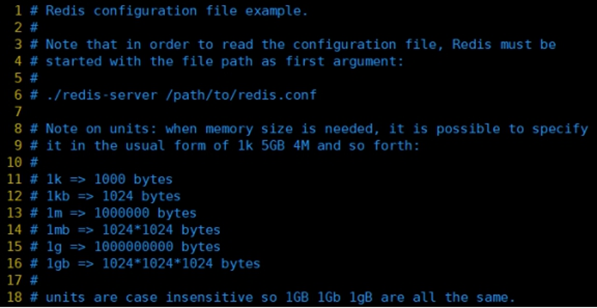

## 4.2 INCLUDES

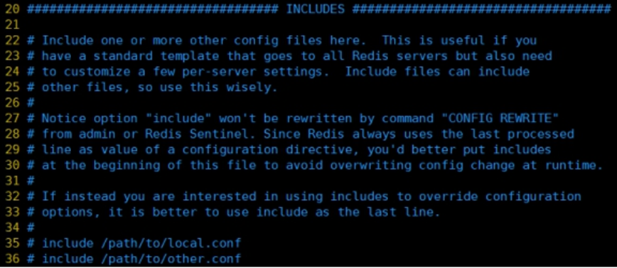

类似 JSP 中的 INCLUDE，多实例的情况可以把公用的配置文件内容提取出来

## 4.3 网络相关配置

### 4.3.1 bind

默认情况 bind = 127.0.0.1 只能接受本机的访问请求

不写的情况下，无限制接受任何 ip 地址的访问

如果开启了 protected-mode，那么在没有设定 bind ip 且没有设密码的情况下，Redis只允许接收本机的响应

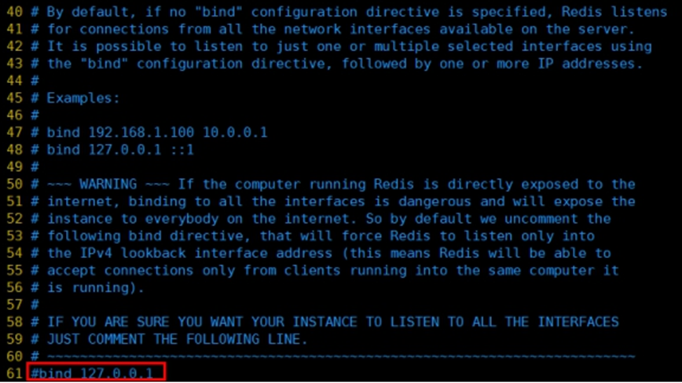

禁用掉 bind，保存配置，停止服务，重启查看进程

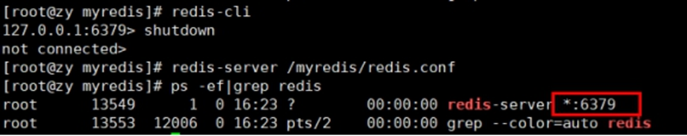

不再是本机访问，而是任意 ip 可以访问

### 4.3.2 protected-mode

本机访问保护模式

### 4.3.3  Port

端口号 ，默认6379

### 4.3.4 tcp-backlog

设置tcp的backlog，backlog其实是一个连接队列，backlog队列总和=未完成三次握手队列 + 已经完成三次握手队列。

在高并发环境下你需要一个高backlog值来避免慢客户端连接问题。

注意Linux内核会将这个值减小到/proc/sys/net/core/somaxconn的值（128），所以需要确认增大/proc/sys/net/core/somaxconn和/proc/sys/net/ipv4/tcp_max_syn_backlog（128）两个值来达到想要的效果

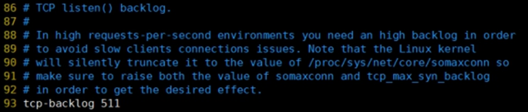

### 4.3.5 timeout

一个空闲的客户端维持多少秒会关闭，0表示关闭该功能。

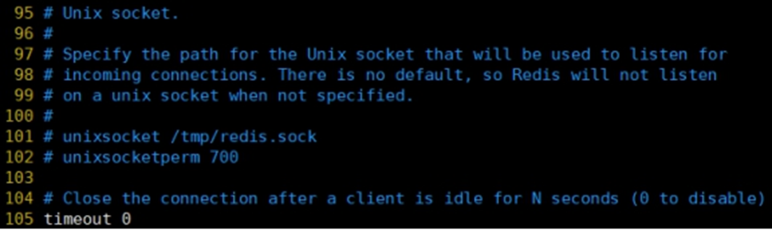

### 4.3.6  tcp-keepalive

对访问客户端的一种心跳检测，每个n秒检测一次。

单位为秒，如果设置为0，则不会进行Keepalive检测，建议设置成60 

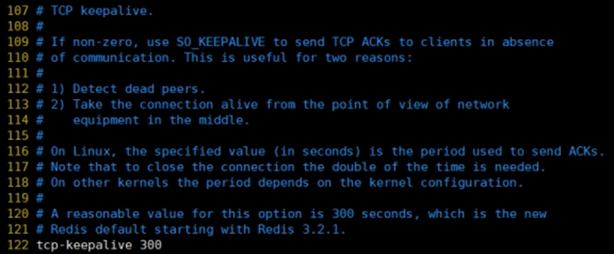

## 4.4 GENERAL

### 4.4.1 daemonize

是否为后台进程，建议设置为yes

守护进程，后台启动

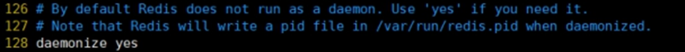

### 4.4.2 pidfile

存放pid文件的位置，每个实例会产生一个不同的pid文件


### 4.4.3 loglevel

指定日志记录级别，Redis总共支持四个级别：debug、verbose、notice、warning，默认为**notice**

四个级别根据使用阶段来选择，生产环境选择notice 或者warning

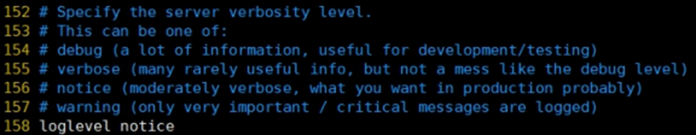

### 4.4.4 logfile

日志文件名称

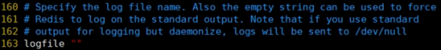

### 4.4.5 database 16

设定库的数量 默认16，默认数据库为0，可以使用SELECT \<dbid>命令在连接上指定数据库id

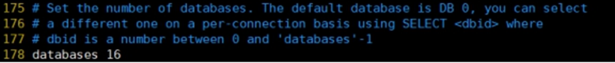

## 4.5 SECURITY

### 4.5.1 设置密码

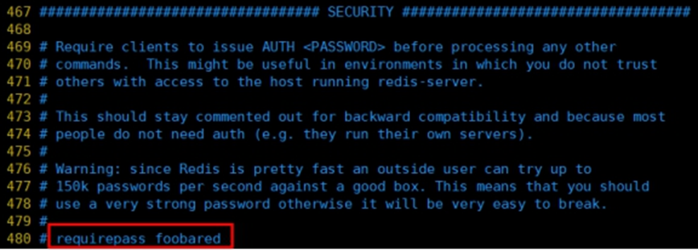

访问密码的查看、设置和取消

在命令中设置密码只是临时的。重启redis服务，密码就还原了