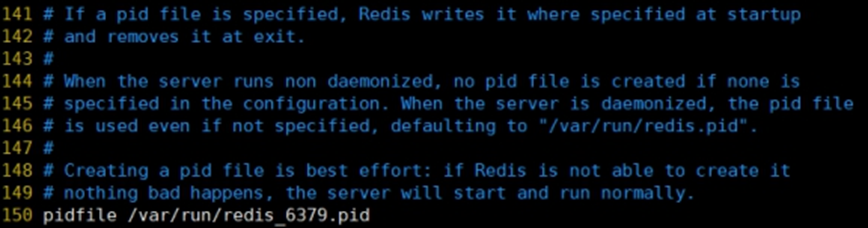

# 二、Redis 概述安装

-   Redis是一个开源的 key-value 存储系统
-   和 Memcached 类似，它支持存储的 value 类型相对更多，包括 string(字符串)、list(链表)、set(集合)、zset(sorted set --有序集合)和 hash（哈希类型）
-   这些数据类型都支持 push/pop、add/remove 及取交集并集和差集及更丰富的操作，而且这些操作都是原子性的
-   在此基础上，Redis支持各种不同方式的排序
-   与memcached一样，为了保证效率，数据都是缓存在内存中
-   区别的是Redis会周期性的把更新的数据写入磁盘或者把修改操作写入追加的记录文件
-   并且在此基础上实现了master-slave(主从)同步

## 2.1 应用场景

### 2.1.1 配合关系型数据库做高速缓存

-   高频次，热门访问的数据，降低数据库 IO
-   分布式架构，做 session 共享


### 2.1.2 多样的数据结构存储持久化数据


## 2.2 Redis 安装

### 2.2.1 安装目录 /usr/local/bin

-   redis-benchmark:性能测试工具
-   redis-check-aof：修复有问题的AOF文件
-   redis-check-dump：修复有问题的dump.rdb文件
-   redis-sentinel：Redis集群使用
-   redis-server：Redis服务器启动命令
-   redis-cli：客户端，操作入口

### 2.2.2 前台启动


```shell
redis-server # 命令行窗口不能关闭，否则服务器停止
```

### 2.2.3 后台启动

#### 2.2.3.1 备份 redis.conf

拷贝一份 redis.conf 

```shell
cp /opt/redis-3.2.5/redis.conf /myredis
```

#### 2.2.5.2 修改后台启动设置 

128: daemonize no 改成 yes，让服务在后台启动

#### 2.2.5.3 Redis 启动

```shell
redis-server /myredis/redis.conf
ps -ef | grep redis
```

#### 2.2.5.4 客户端访问

```shell
redis-cli
```

#### 2.2.5.5 Redis 关闭

```shell
redis-cli shutdown
也可进入终端再关闭
```

### 2.2.4 Redis 相关知识

-   端口 6379
-   默认存在16个数据库，下标从0开始，初始默认使用0号库；使用命令 select \<dbid> 来切换数据库: select 8
-   所有库使用同样的密码
-   dbsize 查看当前数据库的 key 的数量
-   flushdb 清空当前库；flushall 通杀全部库

Redis是**单线程+多路IO复用技术**

多路复用是指使用一个线程来检查多个文件描述符（Socket）的就绪状态，比如调用select和poll函数，传入多个文件描述符，如果有一个文件描述符就绪，则返回，否则阻塞直到超时。得到就绪状态后真正的操作可以在同一个线程里执行，也可以启动线程执行（比如使用线程池）

串行  vs  多线程+锁（memcached） vs  单线程+多路IO复用(Redis)

（与Memcache三点不同: 支持多数据类型，支持持久化，单线程+多路IO复用）

# 三、常用五大数据类型

## 3.1 Redis 键(key)

```shell
key * # 查看当前库所有key
exists key # 判断某个key是否存在
type key # 查看你的key是什么类型
del key # 删除指定的key数据
unlink key # 根据value选择非阻塞删除
	仅将keys从keyspace元数据中删除，真正的删除会在后续异步操作。
expire key 10 # 10秒钟：为给定的key设置过期时间
ttl key # 查看还有多少秒过期，-1表示永不过期，-2表示已过期
select # 命令切换数据库
dbsize # 查看当前数据库的key的数量
flushdb # 清空当前库
flushall # 通杀全部库
```

## 3.2 Redis 字符串（String）

### 3.2.1 简介

-   String类型是**二进制安全**的。意味着Redis的String可以包含任何数据。比如jpg图片或者序列化的对象。
-   String类型是Redis最基本的数据类型，一个Redis中字符串value最多可以是512M

### 3.2.2 常用命令

````shell
set <key> <value> # 添加键值对
```
*NX：当数据库中key不存在时，可以将key-value添加数据库
*XX：当数据库中key存在时，可以将key-value添加数据库，与NX参数互斥
*EX：key的超时秒数
*PX：key的超时毫秒数，与EX互斥
*表示非必选
```
````

```shell
get <key> # 查询对应键值
append <key> <value> # 将给定的<value>追加到原值的末尾，字符串拼接
strlen <key> # 获得值的长度
setnx <key> <value> # 只有在 key 不存在时，设置 key 的值

incr  <key>
	# 将 key 中储存的数字值增1
	# 只能对数字值操作，如果为空，新增值为1
decr  <key>
	# 将 key 中储存的数字值减1
	# 只能对数字值操作，如果为空，新增值为-1
incrby / decrby <key><strip> # 将 key 中储存的数字值增减。自定义步长。
```

```shell
mset <key1> <value1> <key2> <value2> # 同时设置一个或多个 key-value对  
mget <key1> <key2> <key3> # 同时获取一个或多个 value  
msetnx <key1> <value1> <key2> <value2> # 同时设置一个或多个 key-value 对，当且仅当所有给定 key 都不存在。原子性，有一个失败则都失败
```

```shell
getrange <key> <起始位置> <结束位置> # 获得值的范围，类似java中的substring，前包，后包
setrange <key> <起始位置> <value> # 用 <value> 覆写<key>所储存的字符串值，从<起始位置>开始(索引从0开始)。
setex <key> <过期时间> <value> # 设置键值的同时，设置过期时间，单位秒。
getset <key> <value> # 以新换旧，设置了新值同时获得旧值。
```

### 3.2.3 数据结构

String 的数据结构为**简单动态字符串**(Simple Dynamic String,缩写SDS)。是可以修改的字符串，内部结构实现上类似于 Java 的 ArrayList，采用预分配冗余空间的方式来减少内存的频繁分配。


如图中所示，内部为当前字符串实际分配的空间 capacity 一般要高于实际字符串长度 len。当字符串长度小于1M时，扩容都是加倍现有的空间，如果超过1M，扩容时一次只会多扩1M的空间。需要注意的是字符串最大长度为512M。

## 3.3 Redis 列表（List）

### 3.3.1 简介

Redis 列表是简单的**字符串列表**，按照**插入顺序排序**。你可以添加一个元素到列表的头部（左边）或者尾部（右边）。它的底层实际是个双向链表，对两端的操作性能很高，通过索引下标的操作中间的节点性能会较差。


### 3.3.2 常用命令

```shell
lpush/rpush <key> <value1> <value2> <value3> # 从左边/右边插入一个或多个值
lpop/rpop <key> # 从左边/右边吐出一个值。值在键在，值光键亡
rpoplpush <key1> <key2> # 从<key1>列表右边吐出一个值，插到<key2>列表左边。(rpoplpush是一个命令而不是两个)
lrange <key> <start> <stop> # 按照索引下标获得元素(从左到右)
lrange mylist 0 -1 # 0左边第一个，-1右边第一个，（0-1表示获取所有）
lindex <key> <index> # 按照索引下标获得元素(从左到右)
llen <key> # 获得列表长度 
linsert <key> before <value> <newvalue> # 在<value>的后面插入<newvalue>插入值
lrem <key> <n> <value> # 从左边删除n个value值(从左到右)
lset <key> <index> <value> #将列表key下标为index的值替换成value
```

### 3.3.3 数据结构

List 的数据结构为快速链表 quickList。首先在列表元素较少的情况下会使用一块连续的内存存储，这个结构是ziplist，也即是压缩列表。它将所有的元素紧挨着一起存储，分配的是一块连续的内存。当数据量比较多的时候才会改成quicklist。因为普通的链表需要的附加指针空间太大，会比较浪费空间。比如这个列表里存的只是int类型的数据，结构上还需要两个额外的指针prev和next。


Redis将链表和ziplist结合起来组成了quicklist。也就是将多个ziplist使用双向指针串起来使用。这样既满足了快速的插入删除性能，又不会出现太大的空间冗余。

## 3.4 Redis 集合（Set）

### 3.4.1 简介

Redis set对外提供的功能与list类似是一个列表的功能，特殊之处在于set是可以**自动排重**的，当你需要存储一个列表数据，又不希望出现重复数据时，set是一个很好的选择，并且set提供了判断某个成员是否在一个set集合内的重要接口，这个也是list所不能提供的。

Redis的Set是String类型的无序集合。它底层其实是一个value为null的hash表，所以添加，删除，查找的**复杂度都是**O(1)。

### 3.4.2 常用命令

```shell
sadd <key> <value1> <value2> # 将一个或多个 member 元素加入到集合 key 中，已经存在的 member 元素将被忽略
smembers <key> # 取出该集合的所有值。
sismember <key> <value> # 判断集合<key>是否为含有该<value>值，有1，没有0
scard <key> # 返回该集合的元素个数。
srem <key> <value1> <value2> # 删除集合中的某个元素。
spop <key> # 随机从该集合中吐出一个值,会删除
srandmember <key> <n> # 随机从该集合中取出n个值。不会从集合中删除 。
smove <source> <destination> # value把集合中一个值从一个集合移动到另一个集合
sinter <key1> <key2> # 返回两个集合的交集元素。
sunion <key1> <key2> # 返回两个集合的并集元素。
sdiff <key1> <key2> # 返回两个集合的差集元素(key1中的，不包含key2中的)
```

### 3.4.3 数据结构

Set数据结构是dict字典，字典是用哈希表实现的。

Java中HashSet的内部实现使用的是HashMap，只不过所有的value都指向同一个对象。Redis的set结构也是一样，它的内部也使用hash结构，所有的value都指向同一个内部值。

## 3.5 Redis 哈希（Hash）

### 3.5.1 简介

Redis hash是一个string类型的 field 和 value 的映射表，hash特别适合用于存储对象。

类似Java里面的Map<String,Object>

### 3.5.2 常用命令

```shell
hset <key> <field> <value> # 给<key>集合中的 <field>键赋值<value>
hget <key1> <field> # 从<key1>集合<field>取出value 
hmset <key1> <field1> <value1> <field2> <value2> # 批量设置hash的值
hexists <key1> <field> # 查看哈希表 key 中，给定域 field 是否存在。 
hkeys <key> # 列出该hash集合的所有field
hvals <key> # 列出该hash集合的所有value
hincrby/hindecrby <key> <field> <increment> # 为哈希表 key 中的域 field 的值加上增量 1   -1
hsetnx <key> <field> <value> # 将哈希表 key 中的域 field 的值设置为 value ，当且仅当域 field 不存在。
```

### 3.5.3 数据结构

Hash类型对应的数据结构是两种：ziplist（压缩列表），hashtable（哈希表）。当field-value长度较短且个数较少时，使用ziplist，否则使用hashtable。

## 3.6 Redis 有序集合 Zset（Sorted set）

### 3.6.1 简介

Redis有序集合zset与普通集合set非常相似，是一个没有重复元素的字符串集合。

不同之处是有序集合的每个成员都关联了一个评分（score）,这个评分（score）被用来按照从最低分到最高分的方式排序集合中的成员。集合的成员是唯一的，但是评分可以是重复了 。

因为元素是有序的, 所以你也可以很快的根据评分（score）或者次序（position）来获取一个范围的元素。

访问有序集合的中间元素也是非常快的，因此你能够使用有序集合作为一个没有重复成员的智能列表。

### 3.6.2 常用命令

```shell
zadd <key> <score1> <value1> <score2> <value2> # 将一个或多个 member 元素及其 score 值加入到有序集 key 当中。
zrange <key> <start> <stop> [WITHSCORES]  # 返回有序集 key 中，下标在<start><stop>之间的元素，带 WITHSCORES，可以让分数一起和值返回到结果集。
zrangebyscore key min max [withscores] [limit offset count] # 返回有序集 key 中，所有 score 值介于 min 和 max 之间(包括等于 min 或 max )的成员。有序集成员按 score 值递增(从小到大)次序排列。 
zrevrangebyscore key max min [withscores] [limit offset count] # 同上，改为从大到小排列。 
zincrby <key> <increment> <value>  # 为元素的score加上增量
zrem <key> <value> # 删除该集合下，指定值的元素 
zcount <key> <min> <max> # 统计该集合，分数区间内的元素个数 
zrank <key> <value> # 返回该值在集合中的排名，从0开始。
```

### 3.6.3 数据结构

SortedSet(zset)是Redis提供的一个非常特别的数据结构，一方面它等价于Java的数据结构Map<String, Double>，可以给每一个元素value赋予一个权重score，另一方面它又类似于TreeSet，内部的元素会按照权重score进行排序，可以得到每个元素的名次，还可以通过score的范围来获取元素的列表。

zset底层使用了两个数据结构

（1）hash，hash的作用就是关联元素value和权重score，保障元素value的唯一性，可以通过元素value找到相应的score值。

（2）跳跃表，跳跃表的目的在于给元素value排序，根据score的范围获取元素列表。

 

### 3.6.4 跳跃表

1、简介

有序集合在生活中比较常见，例如根据成绩对学生排名，根据得分对玩家排名等。对于有序集合的底层实现，可以用数组、平衡树、链表等。数组不便元素的插入、删除；平衡树或红黑树虽然效率高但结构复杂；链表查询需要遍历所有效率低。Redis采用的是跳跃表。跳跃表效率堪比红黑树，实现远比红黑树简单。

2、实例

对比有序链表和跳跃表，从链表中查询出51

（1）  有序链表                            

要查找值为51的元素，需要从第一个元素开始依次查找、比较才能找到。共需要6次比较。

（2）  跳跃表

从第2层开始，1节点比51节点小，向后比较。

21节点比51节点小，继续向后比较，后面就是NULL了，所以从21节点向下到第1层

在第1层，41节点比51节点小，继续向后，61节点比51节点大，所以从41向下

在第0层，51节点为要查找的节点，节点被找到，共查找4次。

 

#  四、Redis 配置文件介绍

## 4.1 Units 单位

配置大小单位，开头定义了一些基本的度量单位，只支持bytes，不支持bit，大小写不敏感

 


## 4.2 INCLUDES


类似 JSP 中的 INCLUDE，多实例的情况可以把公用的配置文件内容提取出来

## 4.3 网络相关配置

### 4.3.1 bind

默认情况 bind = 127.0.0.1 只能接受本机的访问请求

不写的情况下，无限制接受任何 ip 地址的访问

如果开启了 protected-mode，那么在没有设定 bind ip 且没有设密码的情况下，Redis只允许接收本机的响应


禁用掉 bind，保存配置，停止服务，重启查看进程


不再是本机访问，而是任意 ip 可以访问

### 4.3.2 protected-mode

本机访问保护模式

### 4.3.3  Port

端口号 ，默认6379

### 4.3.4 tcp-backlog

设置tcp的backlog，backlog其实是一个连接队列，backlog队列总和=未完成三次握手队列 + 已经完成三次握手队列。

在高并发环境下你需要一个高backlog值来避免慢客户端连接问题。

注意Linux内核会将这个值减小到/proc/sys/net/core/somaxconn的值（128），所以需要确认增大/proc/sys/net/core/somaxconn和/proc/sys/net/ipv4/tcp_max_syn_backlog（128）两个值来达到想要的效果


### 4.3.5 timeout

一个空闲的客户端维持多少秒会关闭，0表示关闭该功能。


### 4.3.6  tcp-keepalive

对访问客户端的一种心跳检测，每个n秒检测一次。

单位为秒，如果设置为0，则不会进行Keepalive检测，建议设置成60 


## 4.4 GENERAL

### 4.4.1 daemonize

是否为后台进程，建议设置为yes

守护进程，后台启动


### 4.4.2 pidfile

存放pid文件的位置，每个实例会产生一个不同的pid文件



### 4.4.3 loglevel

指定日志记录级别，Redis总共支持四个级别：debug、verbose、notice、warning，默认为**notice**

四个级别根据使用阶段来选择，生产环境选择notice 或者warning


### 4.4.4 logfile

日志文件名称


### 4.4.5 database 16

设定库的数量 默认16，默认数据库为0，可以使用SELECT \<dbid>命令在连接上指定数据库id


## 4.5 SECURITY

### 4.5.1 设置密码


访问密码的查看、设置和取消

在命令中设置密码只是临时的。重启redis服务，密码就还原了，如需永久设置，需要在配置文件中进行设置


## 4.6 LIMITS 限制

### 4.6.1 maxclients

设置 redis 同时可以与多少个客户端进行连接

默认情况下为 10000 个客户端。

如果达到了此限制，redis 则会拒绝新的连接请求，并且向这些连接请求方发出 “max number of clients reached” 以作回应。


### 4.6.2 maxmemory

设置 redis 可以使用的内存量。一旦到达内存使用上限，redis将会试图移除内部数据，移除规则可以通过 maxmemory-policy 来指定。建议**必须设置**，否则，将内存占满，造成服务器宕机

如果 redis 无法根据移除规则来移除内存中的数据，或者设置了“不允许移除”，那么 redis 则会针对那些需要申请内存的指令返回错误信息，比如 SET、LPUSH 等。

但是对于无内存申请的指令，仍然会正常响应，比如 GET 等。如果你的  redis 是主 redis（说明你的 redis 有从 redis），那么在设置内存使用上限时，需要在系统中留出一些内存空间给同步队列缓存，只有在你设置的是“不移除”的情况下，才不用考虑这个因素。


### 4.6.3 maxmemory-policy

- volatile-lru：使用LRU算法移除key，只对设置了过期时间的键；（最近最少使用）
- allkeys-lru：在所有集合key中，使用LRU算法移除key
- volatile-random：在过期集合中移除随机的key，只对设置了过期时间的键
- allkeys-random：在所有集合key中，移除随机的key
- volatile-ttl：移除那些TTL值最小的key，即那些最近要过期的key
- noeviction：不进行移除。针对写操作，只是返回错误信息


### 4.6.4 maxmemory-samples

设置样本数量，LRU算法和最小TTL算法都并非是精确的算法，而是估算值，所以你可以设置样本的大小，redis 默认会检查这么多个 key 并选择其中LRU的那个。

一般设置 3 到 7 的数字，数值越小样本越不准确，但性能消耗越小


# 五、Redis 的发布和订阅

## 5.1 what is pub/sub

Redis 发布订阅 (pub/sub) 是一种消息通信模式：发送者 (pub) 发送消息，订阅者 (sub) 接收消息。

Redis 客户端可以订阅任意数量的频道。

## 5.2 Redis 的发布和订阅

1. 客户端可以订阅频道


2. 当这个频道发布消息后，消息就会发送给订阅的客户端


## 5.3 发布订阅命令实现

1. 打开一个客户端订阅 channel1

	```shell
	SUBSCRIBE channel1 # 订阅 channel1 话题
	```

	

2. 打开另一个客户端，给channel1发布消息hello

	```shell
	publish channel1 hello
	```

	

	返回值 1 是订阅者数量

3. 第一个客户端接收到消息

	

	发布的消息没有持久化，如果在订阅的客户端收不到hello，只能收到订阅后发布的消息

# 六、Redis 新数据类型

## 6.1 Bitmaps

### 6.1.1 简介

现代计算机用二进制（位） 作为信息的基础单位， 1个字节等于8位， 例如“abc”字符串是由3个字节组成， 但实际在计算机存储时将其用二进制表示， “abc”分别对应的ASCII码分别是97、 98、 99， 对应的二进制分别是01100001、 01100010和01100011，如下图


合理地使用、操作位能够有效地提高内存使用率和开发效率。

Redis提供了Bitmaps这个“数据类型”可以实现对位的操作：

1. Bitmaps本身不是一种数据类型，实际上它就是字符串（key-value），但是它可以对字符串的位进行操作。

2. Bitmaps单独提供了一套命令，所以在Redis中使用Bitmaps和使用字符串的方法不太相同。 可以把Bitmaps想象成一个以位为单位的数组，数组的每个单元只能存储0和1，数组的下标在Bitmaps中叫做偏移量。

	

### 6.1.2 命令

1. setbit

	```shell
	setbit <key> <offset> <value> # 设置某个偏移量的值（0 or 1），偏移量从 0 开始
	```

	每个独立用户是否访问过网站存放在Bitmaps中，将访问的用户记做1，没有访问的用户记做0， 用偏移量作为用户的id。

	设置键的第 offset 个位的值（从0算起），假设现在有20个用户，userid=1，6，11，15，19的用户对网站进行了访问，那么当前Bitmaps初始化结果如图

	

	在第一次初始化Bitmaps时， 假如偏移量非常大， 那么整个初始化过程执行会比较慢， 可能会造成Redis的阻塞。

2.   getbit

     ```shell
     getbit <key> <offset> # 获取 Bitmaps 中某个偏移的值
     ```

     

     100的偏移值不存在所以返回0

3.   bitcount

     统计**字符串**被设置为1的bit数。一般情况下，给定的整个字符串都会被进行计数，通过指定额外的 start 或 end 参数，可以让计数只在特定的位上进行。start 和 end 参数的设置，都可以使用负数值：比如 -1 表示最后一个位，而 -2 表示倒数第二个位，start、end 是指**bit组的字节的下标数**，二者皆包含。

     ```shell
     bitcount key [start end]
     ```

     redis的setbit设置或清除的是bit位置，而bitcount计算的是byte位置。

4.   bitop

     ```shell
     bitop and(or/not/xor) <destkey> [key ...]
     ```

     bitop是一个复合操作， 它可以做多个 Bitmaps 的 and（交集) 、 or（并集）、not（非）、xor（异或）操作并将结果保存在 destkey 中

## 6.2 HyperLogLog

### 6.2.1 简介

在工作当中，我们经常会遇到与统计相关的功能需求，比如统计网站PV（PageView页面访问量）,可以使用Redis的incr、incrby轻松实现。

但像UV（UniqueVisitor，独立访客）、独立IP数、搜索记录数等需要去重和计数的问题如何解决？这种求集合中不重复元素个数的问题称为基数问题。

解决基数问题有很多种方案：

（1）数据存储在MySQL表中，使用distinct count计算不重复个数

（2）使用Redis提供的hash、set、bitmaps等数据结构来处理

以上的方案结果精确，但随着数据不断增加，导致占用空间越来越大，对于非常大的数据集是不切实际的。

能否能够降低一定的精度来平衡存储空间？Redis推出了HyperLogLog

Redis HyperLogLog 是用来做基数统计的算法，HyperLogLog 的优点是，在输入元素的数量或者体积非常非常大时，计算基数所需的空间总是固定的、并且是很小的。

在 Redis 里面，每个 HyperLogLog 键只需要花费 12 KB 内存，就可以计算接近 2^64 个不同元素的基数。这和计算基数时，元素越多耗费内存就越多的集合形成鲜明对比。

但是，因为 HyperLogLog 只会根据输入元素来计算基数，而不会储存输入元素本身，所以 HyperLogLog 不能像集合那样，返回输入的各个元素。

什么是基数?

比如数据集 {1, 3, 5, 7, 5, 7, 8}， 那么这个数据集的基数集为 {1, 3, 5 ,7, 8}, 基数(不重复元素)为5。 基数估计就是在误差可接受的范围内，快速计算基数。

### 6.2.2 命令

1.   pfadd

     ```shell
     pfadd <key> <element> [element ...] # 添加指定元素到 HyperLogLog 中
     ```

     

     将所有元素添加到指定HyperLogLog数据结构中。如果执行命令后HLL估计的近似基数发生变化，则返回1，否则返回0。

2.   pfcount

     ```shell
     pfcount <key> [key ...] # 计算 HLL 的近似基数，可以计算多个 HLL
     ```

     

3.   pfmerge

     ```shell
     pfmerge <destkey> <sourcekey> [sourcekey ...] # 将一个或多个HLL合并后的结果存储在另一个 HLL 中，比如每月活跃用户可以使用每天的活跃用户来合并计算可得
     ```

     


## 6.3 Geospatial

### 6.3.1 简介

Redis 3.2 中增加了对GEO类型的支持。GEO，Geographic，地理信息的缩写。该类型，就是元素的2维坐标，在地图上就是经纬度。redis基于该类型，提供了经纬度设置，查询，范围查询，距离查询，经纬度Hash等常见操作。

### 6.3.2 命令

1.   geoadd

     ```shell
     geoadd <key> <longitude> <latitude> <member> [longitude latitude member...] # 添加地理位置（经度，纬度，名称）
     ```

     

     -   两极无法直接添加，一般会下载城市数据，直接通过 Java 程序一次性导入
     -   有效的经度从 -180 度到 180 度。有效的纬度从 -85.05112878 度到 85.05112878 度
     -   当坐标位置超出指定范围时，该命令将会返回一个错误
     -   已经添加的数据，是无法再次往里面添加的

2.   geopos

     ```shell
     geopos <key> <member> [member ...] # 获得指定地区的坐标
     ```

     

3.   geodist

     ```shell
     geodist <key> <member1> <member2> [m|km|ft|mi] # 获取两个位置之间的直线距离
     ```

     

     

     -   m 表示单位为米[默认值]。
     -   km 表示单位为千米。
     -   mi 表示单位为英里。
     -   ft 表示单位为英尺。

4.   georadius

     ```shell
     georadius <key> <longitude> <latitude> radius m|km|ft|mi  # 以给定的经纬度为中心，找出某一半径内的元素
     ```

     

# 七、Redis_Jedis_测试

## 7.1 Jedis 所需要的 jar 包

```xml
<dependency>
	<groupId>redis.clients</groupId>
	<artifactId>jedis</artifactId>
	<version>3.2.0</version>
</dependency>
```

## 7.2 连接 Redis 注意事项

禁用Linux的防火墙：Linux(CentOS7)里执行命令

```shell
systemctl stop/disable firewalld.service
```

redis.conf中注释掉bind 127.0.0.1 ,然后 protected-mode no

## 7.3 Jedis 常用操作

### 7.3.1 **创建动态的工程**

### 7.3.2 创建测试程序

 ```java
 package com.atguigu.jedis;  
 import redis.clients.jedis.Jedis;  
 public class Demo01 {  
     public static void main(String[] args) {  
         Jedis jedis = new Jedis("192.168.137.3",6379);  
         String pong = jedis.ping();  
         System.out.println("连接成功："+pong);  
         jedis.close();  
     }  
 }
 ```

## 7.4 测试相关数据类型

### 7.4.1  **Jedis-API:  Key**

 ```java
 jedis.set("k1",  "v1");  
 jedis.set("k2",  "v2");  
 jedis.set("k3",  "v3");  
 Set<String> keys = jedis.keys("*");  
 System.out.println(keys.size());  
 for (String key : keys) {  
 	System.out.println(key);  
 }  
 System.out.println(jedis.exists("k1"));  
 System.out.println(jedis.ttl("k1"));         
 System.out.println(jedis.get("k1"));  
 ```

### 7.4.2 Jedis-API:  String

  ```java
  jedis.mset("str1","v1","str2","v2","str3","v3"); 
  System.out.println(jedis.mget("str1","str2","str3"));  
  ```

### 7.4.3 Jedis-API:  List

```java
List<String> list = jedis.lrange("mylist",0,-1);  
for (String element : list) {  
	System.out.println(element);  
}  
```

### 7.4.4 Jedis-API: Set

```java
jedis.sadd("orders",  "order01");  
jedis.sadd("orders",  "order02");  
jedis.sadd("orders",  "order03");  
jedis.sadd("orders",  "order04");  
Set<String> smembers = jedis.**smembers**("orders");  
for (String order : smembers) {  
	System.out.println(order);  
}  
jedis.srem("orders",  "order02");  
```

### 7.4.5 Jedis-API:  hash

 ```java
 jedis.hset("hash1","userName","lisi");  
 System.out.println(jedis.hget("hash1","userName"));  
 Map<String,String> map = new HashMap<String,String>(); 
 map.put("telphone","13810169999");  
 map.put("address","atguigu");  
 map.put("email","abc@163.com");  
 jedis.hmset("hash2",map);  
 List<String> result = jedis.hmget("hash2",  "telphone","email");  
 for (String element : result) {  
     System.out.println(element);  
 }  
 ```

### 7.4.6 Jedis-API:  Zset

```java
jedis.zadd("zset01",  100d, "z3");  
jedis.zadd("zset01", 90d,  "l4");  
jedis.zadd("zset01", 80d,  "w5");  
jedis.zadd("zset01", 70d,  "z6");     
Set<String> zrange = jedis.zrange("zset01", 0, -1);  
for (String e : zrange) {  
    System.out.println(e);  
}  
```

# 十、Redis 事务 锁机制

## 10.1 事务的定义

Redis事务是一个单独的隔离操作：事务中的所有命令都会序列化、按顺序地执行。事务在执行的过程中，不会被其他客户端发送来的命令请求所打断。

Redis事务的主要作用就是串联多个命令防止别的命令插队。

## 10.2 multi、exec、discard 命令

从输入 Multi 命令开始，输入的命令都会依次进入命令队列中，但不会执行，直到输入 exec 后，Redis会将之前的命令队列中的命令依次执行。

组队的过程中可以通过 discard 来放弃组队。 


组队成功，提交成功


组队阶段报错，提交失败


组队成功，提交有成功有失败情况

## 10.3 事务的错误处理

组队中某个命令出现了报告错误，执行时整个的所有队列都会被取消


如果执行阶段某个命令报出了错误，则**只有报错的命令不会被执行**，而其他的命令都会执行，不会回滚


## 10.5 事务冲突的问题


### 10.5.2 悲观锁


**悲观锁(Pessimistic Lock)**, 顾名思义，就是很悲观，每次去拿数据的时候都认为别人会修改，所以每次在拿数据的时候都会上锁，这样别人想拿这个数据就会block直到它拿到锁。**传统的关系型数据库里边就用到了很多这种锁机制**，比如**行锁**，**表锁**等，**读锁**，**写锁**等，都是在做操作之前先上锁

### 10.5.3 乐观锁


**乐观锁(Optimistic Lock),** 顾名思义，就是很乐观，每次去拿数据的时候都认为别人不会修改，所以不会上锁，但是**在更新的时候会判断一下在此期间别人有没有去更新这个数据，可以使用版本号等机制**。**乐观锁适用于多读的应用类型，这样可以提高吞吐量**。Redis就是利用这种 check-and-set 机制实现事务的。

### 10.5.4 WATCH key [key ...]

在执行multi之前，先执行watch key1 [key2],可以监视一个(或多个) key ，如果在事务执行之前这个(或这些) key 被其他命令所改动，那么事务将被打断。


### 10.5.5 unwatch

取消 WATCH 命令对所有 key 的监视。

如果在执行 WATCH 命令之后，EXEC 命令或 DISCARD 命令先被执行了的话，那么就不需要再执行 UNWATCH 了

## 10.6 Redis 事务三特性

- 单独的隔离操作

	事务中的所有命令都会序列化、按顺序地执行。事务在执行的过程中，不会被其他客户端发送来的命令请求所打断

- 没有隔离级别的概念

	队列中的命令没有提交之前都不会实际被执行，因为事务提交前任何指令都不会被实际执行

- 不保证原子性

	事务中如果有一条命令执行失败，其后的命令仍然会被执行，没有回滚 

# 十二、Redis 持久化之 RDB

## 12.1 总体介绍

[官网介绍](http://www.redis.io)

Redis 提供了 2 个不同形式的持久化方式

- RDB (Redis DataBase)
- AOF (Append Of File)

## 12.2 RDB

在指定的时间间隔内将内存中的数据集快照写入磁盘，也就是行话讲的Snapshot 快照，它恢复时是将快照文件直接读到内存里

Redis会单独创建（fork）一个子进程来进行持久化，会先将数据写入到 一个临时文件中，待持久化过程都结束了，再用这个临时文件替换上次持久化好的文件。 整个过程中，主进程是不进行任何IO操作的，这就确保了极高的性能 如果需要进行大规模数据的恢复，且对于数据恢复的完整性不是非常敏感，那RDB方式要比AOF方式更加的高效。**RDB的缺点是最后一次持久化*后*的数据可能丢失。**

Fork的作用是复制一个与当前进程一样的进程。新进程的所有数据（变量、环境变量、程序计数器等） 数值都和原进程一致，但是是一个全新的进程，并作为原进程的子进程

在Linux程序中，fork()会产生一个和父进程完全相同的子进程，但子进程在此后多会exec系统调用，出于效率考虑，Linux中引入了“**写时复制技术**”

**一般情况父进程和子进程会共用同一段物理内存**，只有进程空间的各段的内容要发生变化时，才会将父进程的内容复制一份给子进程。

### 12.2.5 RDB 持久化流程


### 12.2.6 dump.rdb 文件

在 redis.conf 中配置文件名称，默认为 dump.rdb


rdb 文件的保存路径，也可以修改。默认为 Redis 启动时命令行所在的目录下

### 12.2.8 如何触发 RDB 快照

#### 12.2.8.1 配置文件中默认的快照配置


#### 12.2.8.2 命令 save & bgsave

**save ：save时只管保存，其它不管，全部阻塞。手动保存。不建议**。

**bgsave：Redis会在后台异步进行快照操作，快照同时还可以响应客户端请求。**

可以通过 lastsave 命令获取最后一次成功执行快照的时间

#### 12.2.8.3 flushall 命令

执行 flushall 命令，也会产生 dump.rdb 文件，但里面是空的，无意义

#### 12.2.8.5 Save

格式：save 秒钟 写操作次数

RDB 是整个内存的压缩过的 Snapshot，RDB 的数据结构，可以配置复合的快照触发条件，

默认是1分钟内改了1万次，或5分钟内改了10次，或15分钟内改了1次。

禁用

不设置save指令，或者给save传入空字符串

#### 12.2.8.6 stop-writes-on-bgsave-error


当 Redis 无法写入磁盘的话，直接关掉 Redis 的写操作。推荐yes.

#### 12.2.8.7 rdbcompression 压缩文件


对于存储到磁盘中的快照，可以设置是否进行压缩存储。如果是的话，redis 会采用LZF算法进行压缩。

如果你不想消耗 CPU 来进行压缩的话，可以设置为关闭此功能。推荐yes

#### 12.2.8.8 rdbchecksum 检查完整性


在存储快照后，还可以让redis使用CRC64算法来进行数据校验，

但是这样做会增加大约10%的性能消耗，如果希望获取到最大的性能提升，可以关闭此功能

推荐yes

#### 12.2.8.9 rdb 的备份

先通过 config get dir 查询 rdb 文件的目录 

将*.rdb的文件拷贝到别的地方

rdb的恢复

- 关闭Redis
- 先把备份的文件拷贝到工作目录下 cp dump2.rdb dump.rdb
- 启动Redis, 备份数据会直接加载

### 12.2.9 优势

- 适合大规模的数据恢复
- 对数据完整性和一致性要求不高更适合使用
- 节省磁盘空间
- 恢复速度快


### 12.2.10 劣势

- Fork的时候，内存中的数据被克隆了一份，大致2倍的膨胀性需要考虑
- 虽然 Redis 在 fork 时使用了**写时拷贝技术**,但是如果数据庞大时还是比较消耗性能。
- 在备份周期在一定间隔时间做一次备份，所以如果 Redis 意外 down 掉的话，就会丢失最后一次快照后的所有修改。

### 12.2.11 如何停止

动态停止RDB：redis-cli config set save ""#save后给空值，表示禁用保存策略


# 十三、Redis 持久化之 AOF

## 13.1 AOF(Append Only File)

以**日志**的形式来记录每个写操作（增量保存），将Redis执行过的所有写指令记录下来(**读操作不记录**)， **只许追加文件但不可以改写文件**，redis启动之初会读取该文件重新构建数据，换言之，redis 重启的话就根据日志文件的内容将写指令从前到后执行一次以完成数据的恢复工作

### 13.1.2 AOF 持久化流程

1. 客户端的请求写命令会被append追加到AOF缓冲区内
2. AOF缓冲区根据AOF持久化策略[always,everysec,no]将操作sync同步到磁盘的AOF文件中
3. AOF文件大小超过重写策略或手动重写时，会对AOF文件rewrite重写，压缩AOF文件容量
4. Redis服务重启时，会重新load加载AOF文件中的写操作达到数据恢复的目的


