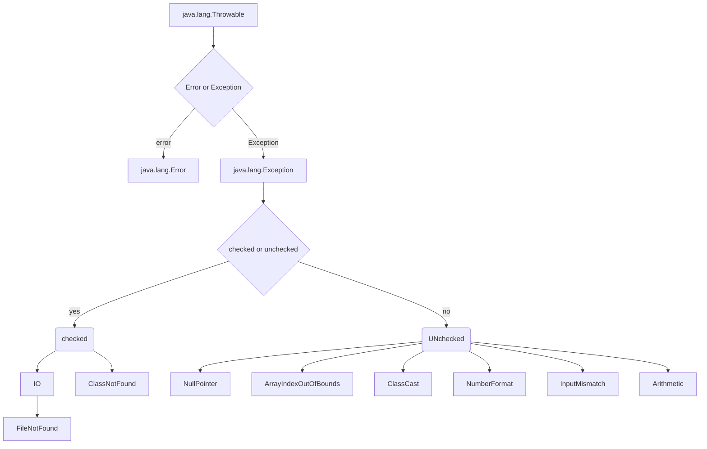
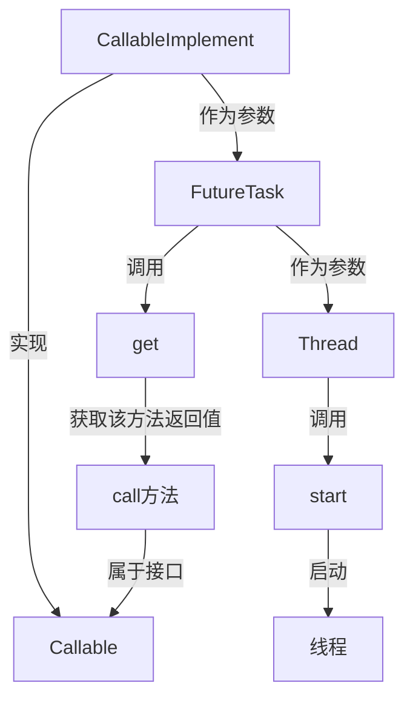

# Java

## 属性分类

###  属性（成员变量） vs  局部变量

1. 相同点：

    1.1  定义变量的格式：数据类型  变量名 = 变量值

    1.2  先声明，后使用

    1.3  变量都有其对应的作用域 

2. 不同点：

    2.1  在类中声明的位置的不同

    ​      - 属性：直接定义在类的一对{}内

    ​      - 局部变量：声明在方法内、方法形参、代码块内、构造器形参、构造器内部的变量

​		2.2 关于权限修饰符的不同

​             - 属性：可以在声明属性时，指明其权限，使用权限修饰符。

​             - 常用的权限修饰符：private、public、缺省、protected  --->封装性

​             目前，大家声明属性时，都使用缺省就可以了。

​             - 局部变量：不可以使用权限修饰符。

​		2.3 默认初始化值的情况：

​             - 属性：类的属性，根据其类型，都有默认初始化值。

​                       整型（byte、short、int、long）：0

​                       浮点型（float、double）：0.0

​                       字符型（char）：0  （或'\u0000'）

​                       布尔型（boolean）：false

​                       引用数据类型（类、数组、接口）：null

​              - 局部变量：**没有默认初始化值**。

​                         意味着，我们在调用局部变量之前，一定要显式赋值

​                         特别地：形参在调用时，我们赋值即可

​		2.4 在内存中加载的位置：

​				- 属性：加载到堆空间中（非static）

​				- 局部变量：加载到栈空间

### 静态属性 vs 非静态属性

非静态属性又叫实例变量

实例变量：当我们创建了类的多个对象，每个对象都独立有一套类中的非静态属性。修改其中一个对象的非静态属性时，不会影响其他对象。

静态变量：类的多个对象共享同一个静态变量

-   静态变量随着类的加载而加载，可以通过"类名.静态变量"来调用
-   静态变量的加载要早于对象的创建（在类的加载中的准备阶段）

## 创建内部类的方式

```java
class Person{
    //静态成员内部类
    static class Dog{}
    //非静态成员内部类
    class Bird{}
    public void method(){
        //局部内部类
        class AA{}
    }
    {
        //局部内部类
        class BB{}
    }
    public Person(){
        //局部内部类
        class CC{}
    }
}
```

```java
Person.Dog dog = new Person.Dog(); //静态
dog.show();
//创建Bird实例(非静态的成员内部类):
//Person.Bird bird = new Person.Bird();//错误的
Person p = new Person();
Person.Bird bird = p.new Bird();//非静态
```

## 异常体系结构



## 线程的创建和使用

###  方式一：继承于Thread类

1. 创建一个继承于Thread类的子类

2. 重写Thread类中的run()方法  -->将此线程执行的操作声明在run()中

3. 创建子类对象

4. 通过对象调用start()：①启动当前线程 ②调用当前线程的run()--->调用了Runnable类型的tarket的run()

    问题一：我们不能通过直接调用run()方法启动线程（这时run()的执行仍然在主线程中)

    问题二：再启动一个线程时不能重复通过start()启动线程（start()只能调用一次），只能重新创建一个子类对象

###  方式二：实现Runnable接口

1. 创建一个实现了Runnable接口的类
2. 实现类去实现Runnable中的抽象方法：run()
3. 创建实现类的对象
4. 将此对象作为参数传递到Thread类的构造器中，创建Thread类的对象
5. 通过Thread类的对象调用start()

**JDK5.0新增线程创建方式**

### 方式三：实现Callable接口

1. 创建一个实现Callable的实现类
2. 实现call()方法，将此线程需要执行的操作声明在call()中
3. 创建Callable接口实现类的对象
4. 将此Callable接口实现类的对象作为参数传递到FutureTask构造器中，创建FutureTask的对象
5. 将FutureTask的对象作为参数传递到Thread类的构造器中，创建Thread对象，并调用start()  ==这里是线程启动==
6. 获取Callable中call方法的返回值（使用futureTask.get()）
7. get()返回值即为FutureTask构造器参数Callable实现类重写的call()的返回值。 ==get()并不是启动线程的方法，只是获取call()的返回值==



> 如何理解实现Callable接口的方式创建多线程比实现Runnable接口创建多线程方式强大？
>
> 1. call()可以有返回值的
> 2. call()可以抛出异常，被外面的操作捕获，获取异常的信息
> 3. Callable是支持泛型的

### 方式四：使用线程池

经常创建和销毁、使用量特别大的资源，比如并发情况下的线程，对性能影响很大

提前创建好多个线程，放入线程池中，使用时直接获取，使用完放回池中。可以避免频繁创建销毁、实现重复利用。类似生活中的公共交通工具

**好处**

1. 提高响应速度（减少了创建新线程的时间）

2. 降低资源消耗（重复利用线程池中线程，不需要每次都创建）

3. 便于线程管理：

    corePoolSize：核心池的大小

    maximumPoolSize：最大线程数

    keepAliveTime：线程没有任务时最多保持多长时间后会终止

    .......

### 比较创建线程的两种方式

比较创建线程的两种方式

开发中：优先选择：实现Runnable接口的方式

原因：

1. 实现的方式没有类的单继承性的局限性

2. 实现的方式更适合来处理多个线程有共享数据的情况。

联系：public class Thread implements Runnable //实际上Thread也实现了Runnable接口

相同点：两种方式都需要重写run(),将线程要执行的逻辑声明在run()中。


## 线程的同步

当一个线程操作共享数据的时候，其它线程不能参与进来，直到线程操作完成共享数据，其他线程才可以操作共享数据。即使当前线程出现阻塞，也不能被改变。

在Java中，我们通过同步机制，来解决线程的安全问题。

### 方式一：同步代码块

```java
synchronized(同步监视器){
		//需要被同步的代码
}
```

1. 操作共享数据的代码，即为需要被同步的代码。  -->不能包含代码多了，也不能包含代码少了。

2. 共享数据：多个线程共同操作的变量。

3. 同步监视器，俗称：锁。**任何一个类的对象，都可以充当锁**。要求：多个线程必须要共用同一把锁。

    补充：在实现Runnable接口创建多线程的方式中，我们可以考虑使用this充当同步监视器；在继承Thread类创建多线程的方式中，慎用this充当同步监视器

### 方式二：同步方法

如果操作共享数据的代码完整的声明在一个方法中，我们不妨将此方法声明同步的。

关于同步方法的总结：同步方法仍然涉及到同步监视器，只是不需要我们显式的声明。

-   非静态的同步方法，同步监视器是：this
-   静态的同步方法，同步监视器是：当前类本身

### 方式三：Lock锁

​	从JDK 5.0开始，Java提供了更强大的线程同步机制——通过显式定义同步锁对象来实现同步。同步锁使用Lock对象充当。

1. 实例化ReentrantLock
2. 调用锁定方法lock()
3. 调用解锁方法：unlock()

> 面试题：synchronized 与 Lock的异同？
>
> 相同：二者都可以解决线程安全问题
>
> 不同：synchronized机制在执行完相应的同步代码以后，自动的释放同步监视器
>
> ​		  Lock需要手动的启动同步（lock()），同时结束同步也需要手动的实现（unlock()）
>
> 优先使用顺序:
>
> Lock->同步代码块（已经进入了方法体，分配了相应资源） ->  同步方法（在方法体之外）

**同步的方式，解决了线程的安全问题。---好处**

**操作同步代码时，只能有一个线程参与，其他线程等待。相当于是一个单线程的过程，效率低。 ---局限性**


## 线程的几种状态

|     状态     | 说明                                                         |
| :----------: | :----------------------------------------------------------- |
|     NEW      | 当线程被创建后，如通过`new Thread()`，它处于新建状态。此时，线程已经被分配了必要的资源，但还没有开始执行。 |
|   RUNNABLE   | 当调用线程的`start()`方法后，线程进入可运行状态。在这个状态下，线程可能正在运行也可能正在等待获取 CPU 时间片，具体取决于线程调度器的调度策略。 |
|   BLOCKED    | 线程在试图获取一个锁以进入同步块/方法时，如果锁被其他线程持有，线程将进入阻塞状态，直到它获取到锁。 |
|   WAITING    | 线程进入等待状态是因为调用了如下方法之一：`Object.wait()`或`LockSupport.park()`。在等待状态下，线程需要其他线程显式地唤醒，否则不会自动执行。 |
| TIME_WAITING | 当线程调用带有超时参数的方法时，如`Thread.sleep(long millis)`、`Object.wait(long timeout)` 或`LockSupport.parkNanos()`，它将进入超时等待状态。线程在指定的等待时间过后会自动返回可运行状态。 |
|  TERMINATED  | 当线程的`run()`方法执行完毕后，或者因为一个未捕获的异常终止了执行，线程进入终止状态。一旦线程终止，它的生命周期结束，不能再被重新启动。 |

## String不同拼接操作的对比

1. 常量与常量的拼接结果在常量池。且常量池中不会存在相同内容的常量

2. 只要其中有一个是变量，结果就在堆中
3. 如果拼接的结果调用intern()方法，返回值就在常量池中


## Java 集合框架


在 Java 中，常用的集合类有 ArrayList、LinkedList、HashMap、LinkedHashMap 等。

1.  ArrayList：ArrayList 可以看作是一个动态数组，它可以在运行时动态扩容。**优点是访问速度快，可以通过索引直接查到元素。缺点是插入和删除元素可能需要移动元素，效率就会降低。**
2.  LinkedList：LinkedList 是一个双向链表，它**适合频繁的插入和删除操作。** **优点是插入和删除元素的时候只需要改变节点的前后指针，缺点是访问元素时需要遍历链表。**
3.  HashMap：HashMap 是一个基于哈希表的键值对集合。优点是插入、删除和查找元素的速度都很快。缺点是它**不保留键值对的插入顺序。**
4.  LinkedHashMap：LinkedHashMap 在 HashMap 的基础上增加了一个双向链表来保持键值对的插入顺序。


-   线程安全：Vector、Hashtable、ConcurrentHashMap、CopyOnWriteArrayList、ConcurrentLinkedQueue、ArrayBlockingQueue、LinkedBlockingQueue 这些都是线程安全的

-   LinkedList 更利于增删不是体现在时间复杂度上，因为二者增删的时间复杂度都是 O(n)，都需要遍历列表（LinkedList 需要找到增删的位置）；而是体现在增删的效率上，因为 LinkedList 的增删只需要改变引用，而 ArrayList 的增删可能需要移动元素。
-   ArrayList 是基于数组的，是一块连续的内存空间。

### ArrayList 和 Vector 的区别

Vector 是 JDK 1.0 的产物，已经不推荐使用，仍然保留是因为 Java 希望向后兼容

ArrayList 是 JDK 1.2 时引入的，用于替代 Vector 作为主要的**非同步动态数组实现**。因为 Vector 所有的方法都使用 synchronized 关键字进行了同步，单线程环境下效率较低。


## 红黑树

### 红黑树插入（构建）


### 红黑树的删除


## Java 并发

### 原子性、可见性、有序性的理解

原子性、有序性、可见性是并发编程中非常重要的基础概念，JMM 的很多技术都是围绕着这三大特性展开。

- **原子性**：原子性指的是一个操作是不可分割、不可中断的，要么全部执行并且执行的过程不会被任何因素打断，要么就全不执行。
- **可见性**：可见性指的是一个线程修改了某一个共享变量的值时，其它线程能够立即知道这个修改。
- **有序性**：有序性指的是对于一个线程的执行代码，从前往后依次执行，单线程下可以认为程序是有序的，但是并发时有可能会发生指令重排。

> 分析下面几行代码的原子性？

```java
int i = 2;
int j = i;
i++;
i = i + 1;
```

- 第 1 句是基本类型赋值，是原子性操作。
- 第 2 句先读 i 的值，再赋值到 j，两步操作，不能保证原子性。
- 第 3 和第 4 句其实是等效的，先读取 i 的值，再+1，最后赋值到 i，三步操作了，不能保证原子性。

> 原子性、可见性、有序性都应该怎么保证呢？

- 原子性：JMM 只能保证基本的原子性，如果要保证一个代码块的原子性，需要使用`synchronized `。
- 可见性：Java 是利用`volatile`关键字来保证可见性的，除此之外，`final`和`synchronized`也能保证可见性。
- 有序性：`synchronized`或者`volatile`都可以保证多线程之间操作的有序性。


### synchronized 怎么使用

synchronized 可以用在方法和代码块中。

①、修饰方法

synchronized 修饰方法时，JVM 会通过 `ACC_SYNCHRONIZED` **标记符**来实现同步

```java
public synchronized void increment() {
    this.count++;
}
```

当在方法声明中使用了 synchronized 关键字，就表示该方法是同步的，也就是说，线程在执行这个方法的时候，其他线程不能同时执行，需要等待锁释放。

如果是**静态方法**的话，**锁的是这个类的 Class 对象**，因为静态方法是属于类级别的。

```java
public static synchronized void increment() {
    count++;
}
```

②、修饰代码块

synchronized 修饰代码块时，JVM 会通过 `monitorenter`、`monitorexit` 两个指令来实现同步：

- `monitorenter` 指向同步代码块的开始位置
- `monitorexit` 指向同步代码块的结束位置。

```java
public void increment() {
    synchronized (this) {
        this.count++;
    }
}
```

同步代码块可以减少需要同步的代码量，颗粒度更低，更灵活。synchronized 后面的括号中指定了要锁定的对象，可以是 this，也可以是其他对象。

### synchronized 锁住的是？

monitorenter、monitorexit 或者 ACC_SYNCHRONIZED 都是**基于 Monitor 实现**的。

实例对象结构里有对象头，对象头里面有一块结构叫 Mark Word，Mark Word 指针指向了 **monitor**

所谓的 Monitor 其实是一种**同步工具**，也可以说是一种**同步机制**。在 Java 虚拟机（HotSpot）中，Monitor 是由**ObjectMonitor** 实现的，可以叫做内部锁，或者 Monitor 锁。

ObjectMonitor 的工作原理：

- ObjectMonitor 有两个队列：\_WaitSet、_EntryList，用来保存 ObjectWaiter 对象列表。
- _owner，获取 Monitor 对象的线程进入 _owner 区时， _count + 1。如果线程调用了 wait() 方法，此时会释放 Monitor 对象， _owner 恢复为空， _count - 1。同时该等待线程进入 _WaitSet 中，等待被唤醒。

处于等待状态的线程会被加入到 \_WairSet

处于等待锁 block 状态的线程，会被加入到 \_EntryList

所以我们就知道了，**同步是锁住的什么东西**：

- monitorenter，在判断拥有同步标识 ACC_SYNCHRONIZED 抢先进入此方法的线程会优先拥有 Monitor 的 owner ，此时计数器 +1。
- monitorexit，当执行完退出后，计数器 -1，归 0 后被其他进入的线程获得。

#### 会不会牵扯到 os 层面呢？

会，synchronized 升级为重量级锁时，依赖于操作系统的互斥量（mutex）来实现，mutex 用于保证任何给定时间内，只有一个线程可以执行某一段特定的代码段。

#### synchronized 怎么保证可见性？

- 线程加锁前，将**清空工作内存中共享变量的值**，从而使用共享变量时需要从主内存中重新读取最新的值。
- 线程加锁后，其它线程无法获取主内存中的共享变量。
- 线程解锁前，必须把共享变量的最新值刷新到主内存中

#### synchronized 怎么保证有序性？

synchronized 同步的代码块，具有排他性，一次只能被一个线程拥有，所以 synchronized 保证同一时刻，代码是单线程执行的。

因为 as-if-serial 语义的存在，**单线程的程序能保证最终结果是有序的**，但是**不保证不会指令重排**。

所以 synchronized 保证的有序是**执行结果的有序性**，而不是防止指令重排的有序性。

#### synchronized 怎么实现可重入的呢？

可重入意味着同一个线程可以多次获得同一个锁，而不会被阻塞。具体来说，如果一个线程已经持有某个锁，那么它可以再次进入该锁保护的代码块或方法，而不会被阻塞。

synchronized 之所以支持可重入，是因为 Java 的对象头包含了一个 Mark Word，用于存储对象的状态，包括锁信息。

当一个线程获取对象锁时，JVM 会将该线程的 ID 写入 Mark Word，并将锁计数器设为 1。

如果一个线程尝试再次获取已经持有的锁，JVM 会检查 Mark Word 中的线程 ID。如果 ID 匹配，表示的是同一个线程，锁计数器递增。

当线程退出同步块时，锁计数器递减。如果计数器值为零，JVM 将锁标记为未持有状态，并清除线程 ID 信息。

### 锁升级，synchronized 优化

Java 对象头里的 `Mark Word` 会记录锁的状态，一共有四种状态：

①、无锁状态，在这个状态下，没有线程试图获取锁。

②、偏向锁，当第一个线程访问同步块时，锁会进入偏向模式。Mark Word 会被设置为偏向模式，并且存储了获取它的线程 ID。

偏向锁的目的是消除同一线程的后续锁获取和释放的开销。如果同一线程再次请求锁，就无需再次同步。

③、当有多个线程竞争锁，但没有锁竞争的强烈迹象（即线程交替执行同步块）时（多个线程在不同时段获取同一把锁），偏向锁会升级为轻量级锁。

线程尝试通过[CAS 操作](https://javabetter.cn/thread/cas.html)（Compare-And-Swap）将对象头的 Mark Word 替换为指向锁记录的指针。如果成功，当前线程获取轻量级锁；如果失败，说明有竞争。

当一个线程尝试获取轻量级锁时，它会在自己的栈帧中创建一个锁记录（Lock Record），然后尝试使用 CAS 操作将对象头的 Mark Word 替换为指向锁记录的指针。

如果成功，该线程持有锁；如果失败，表示有其他线程竞争，锁会升级为重量级锁。

当线程尝试获取轻量级锁失败时，它会进行自旋，即循环检查锁是否可用，以避免立即进入阻塞状态。

自旋的次数不是固定的，而是根据之前在同一个锁上的自旋时间和锁的状态动态调整的。

④、重量级锁，当锁竞争激烈时，轻量级锁会膨胀为重量级锁。

重量级锁通过将对象头的 Mark Word 指向监视器（Monitor）对象来实现，该对象包含了锁的持有者、锁的等待队列等信息。


[图像链接](https://cdn.tobebetterjavaer.com/tobebetterjavaer/images/sidebar/sanfene/javathread-37.png)


## 其他

-   一个Java应用程序java.exe，其实至少有三个线程：**main()主线程，gc()垃圾回收线程，异常处理线程**。当然如果发生异常，会影响主线程


# 数据库

## SQL 语言分类

**DDL（Data Definition Languages、数据定义语言）**，这些语句定义了不同的数据库、表、视图、索引等数据库对象，还可以用来创建、删除、修改数据库和数据表的结构

**DML（Data Manipulation Language、数据操作语言）**，用于添加、删除、更新和查询数据库记录，并检查数据完整性。

**DCL（Data Control Language、数据控制语言）**，用于定义数据库、表、字段、用户的访问权限和安全级别。

## ORM 思想

- 一个数据表对应一个 java 类
- 表中的一条记录对应 java 类的一个对象
- 表中的一个字段对应 java 类的一个属性

## 事务的 ACID 属性

1. **原子性（Atomicity）**
    原子性是指事务是一个不可分割的工作单位，事务中的操作要么都发生，要么都不发生。 

2. **一致性（Consistency）**
    事务必须使数据库从一个一致性状态变换到另外一个一致性状态。

3. **隔离性（Isolation）**
    事务的隔离性是指一个事务的执行不能被其他事务干扰，即一个事务内部的操作及使用的数据对并发的其他事务是隔离的，并发执行的各个事务之间不能互相干扰。

4. **持久性（Durability）**
    持久性是指一个事务一旦被提交，它对数据库中数据的改变就是永久性的，接下来的其他操作和数据库故障不应该对其有任何影响。

## 数据库的并发问题

- 对于同时运行的多个事务, 当这些事务访问数据库中相同的数据时, 如果没有采取必要的隔离机制, 就会导致各种并发问题:
    - **脏读**: 对于两个事务 T1, T2, T1 读取了已经被 T2 更新但还**没有被提交**的字段。之后, 若 T2 回滚, T1读取的内容就是临时且无效的。
    - **不可重复读**: 对于两个事务T1, T2, T1 读取了一个字段, 然后 T2 **更新**了该字段。之后, T1再次读取同一个字段, 值就不同了。
    - **幻读**: 对于两个事务T1, T2, T1 从一个表中读取了一个字段, 然后 T2 在该表中**插入**了一些新的行。之后, 如果 T1 再次读取同一个表, 就会多出几行。

- **数据库事务的隔离性**: 数据库系统必须具有隔离并发运行各个事务的能力, 使它们不会相互影响, 避免各种并发问题。

- 一个事务与其他事务隔离的程度称为隔离级别。数据库规定了多种事务隔离级别, 不同隔离级别对应不同的干扰程度, **隔离级别越高, 数据一致性就越好, 但并发性越弱。**

## 数据库中的四种隔离级别

1.   **未提交读（Read uncommitted）**

     这种事务隔离级别下，select 语句不加锁，事务中修改的数据，即使没有提交，对其他事务也都是可见的。此时，可能读取到不一致的数据，即“脏读 ”。这是**并发最高，一致性最差**的隔离级别。

2.   **不可重复读/提交读/读已提交（Read committed）**

     一个事务从开始直到提交之前，所做的任何修改对其他事务都是不可见的。

     大多数数据库系统的默认隔离级别都是提交读（但Mysql不是）。提交读满足前面提到的隔离性的简单定义：一个事务开始时，只能“看见”已经提交的事务所做的修改。**可避免脏读，无法避免不可重复读发生**。

     因为两次执行同样的查询，可能会得到不一样的结果，这个级别有时候也叫做不可重复读（nonrepeatable read）

3.   **可重复读（Repeatable read）**

     该级别保证了在同一个事务中多次读取同样记录的结果是一致的，事务中未提交的数据对其他事务是不可见的，**解决 脏读 、不可重复读 的问题**，是**MySql默认隔离级别**。

4.   **串行化（Serializable）**

     可串行化是最高的隔离级别。它通过强制事务串行执行，避免了**脏读、不可重复读、幻读**的问题。

     简单来说，**可串行化会在读取的每一行数据上都加上锁**，所以可能导致大量的超时和锁争用问题。实际应用中也很少用到这个隔离级别，只有在非常需要确保数据的一致性而且可以接受没有并发的情况下，才考虑用该级别。

     以 **锁表** 的方式，使得其他的线程只能在锁外等待。

以上四种隔离级别最高的是 Serializable 级别，最低的是 Read uncommitted 级别，当然级别越高，执行效率就越低。像 Serializable 这样的级别，就是以 锁表 的方式，使得其他的线程只能在锁外等待，所以平时选用何种隔离级别应该根据实际情况。SQL Server默认的隔离级别为rcommitted，MySQL默认的隔离级别为 Repeatable read, Oracle默认隔离级别为 Read committed。

SQL Server和MySQL数据库支持上面四种隔离级别，而 Oracle数据库只支持 Serializable (串行化) 级别和 Read committed (读已提交) 这两种级别。 


# OS

## 进程和线程

进程是**操作系统资源分配**的最小单位，它包括了程序、数据和进程控制块等

线程是 **CPU 分配资源**的基本单位

一个进程可以有多个线程


一个进程中可以有多个线程，多个线程共用进程的堆和方法区（Java 虚拟机规范中的一个定义，JDK 8 以后的实现为元空间）资源，但是每个线程都会有自己的程序计数器和栈

## 线程创建方式


- 继承 Thread 类，重写 `run()`方法，调用 `start()`方法启动线程\

	```java
	class ThreadTask extends Thread {
	    public void run() {
	        System.out.println("看完二哥的 Java 进阶之路，上岸了!");
	    }
	
	    public static void main(String[] args) {
	        ThreadTask task = new ThreadTask();
	        task.start();
	    }
	}
	```
	
	由于 Java 不支持多重继承，所以如果类已经继承了另一个类，就不能使用这种方法了

- 实现 Runnable 接口，重写 `run()` 方法，然后创建 Thread 对象，将 Runnable 对象作为参数传递给 Thread 对象，调用 `start()` 方法启动线程

	```java
	class RunnableTask implements Runnable {
	    public void run() {
	        System.out.println("看完二哥的 Java 进阶之路，上岸了!");
	    }
	
	    public static void main(String[] args) {
	        RunnableTask task = new RunnableTask();
	        Thread thread = new Thread(task);
	        thread.start();
	    }
	}
	```

- 实现 Callable 接口，重写 `call()` 方法，然后创建 FutureTask 对象，参数为 Callable 对象；紧接着创建 Thread 对象，参数为 FutureTask 对象，调用 `start()` 方法启动线程

	```java
	class CallableTask implements Callable<String> {
	    public String call() {
	        return "看完二哥的 Java 进阶之路，上岸了!";
	    }
	
	    public static void main(String[] args) throws ExecutionException, InterruptedException {
	        CallableTask task = new CallableTask();
	        FutureTask<String> futureTask = new FutureTask<>(task);
	        Thread thread = new Thread(futureTask);
	        thread.start();
	        System.out.println(futureTask.get());
	    }
	}
	```
	
	这种方法的优点是可以获取线程的执行结果


# JVM

## 概念

1. 逃逸分析：意味着如果某些方法中的对象引用没有被返回或者未被方法体外使用（也就是未逃逸出去），那么对象可以直接在栈上分配内存

2. 内存溢出：是指当程序请求分配内存时，由于没有足够的内存空间满足其需求，从而触发的错误。在 Java 中，这种情况会抛出 OutOfMemoryError。

	内存溢出可能是由于内存泄漏导致的，也可能是因为程序一次性尝试分配大量内存，内存直接就干崩溃了导致的。

3. [内存泄漏](#内存泄漏的可能原因)：是指程序在使用完内存后，未能释放已分配的内存空间，导致这部分内存无法再被使用。随着时间的推移，内存泄漏会导致可用内存逐渐减少，最终可能导致内存溢出。

	在 Java 中，内存泄漏通常发生在长期存活的对象持有短期存活对象的引用，而长期存活的对象又没有及时释放对短期存活对象的引用，从而导致短期存活对象无法被回收。

4. 对象引用：

	

	- **强引用**是最传统的`引用`的定义，是指在程序代码之中普遍存在的引用赋值，无论任何情况下，只要强引用关系还存在，垃圾收集器就永远不会回收掉被引用的对象。

	- **软引用**是用来描述一些还有用，但非必须的对象。只被软引用关联着的对象，在**系统将要发生内存溢出异常前，会把这些对象列进回收范围之中进行第二次回收**，如果这次回收还没有足够的内存，才会抛出内存溢出异常。在 JDK 1.2 版之后提供了 **SoftReference** 类来实现软引用。

		```java
		Object obj = new Object();
		ReferenceQueue queue = new ReferenceQueue();
		SoftReference reference = new SoftReference(obj, queue);
		//强引用对象滞空，保留软引用
		obj = null;
		```

	- **弱引用**也是用来描述那些非必须对象，但是它的强度比软引用更弱一些，**被弱引用关联的对象只能生存到下一次垃圾收集发生为止**。当垃圾收集器开始工作，无论当前内存是否足够，都会回收掉只被弱引用关联的对象。在 JDK 1.2 版之后提供了 WeakReference 类来实现弱引用。

		```java
		Object obj = new Object();
		ReferenceQueue queue = new ReferenceQueue();
		WeakReference reference = new WeakReference(obj, queue);
		//强引用对象滞空，保留软引用
		obj = null;
		```

	- **虚引用**也称为“幽灵引用”或者“幻影引用”，它是最弱的一种引用关系。一个对象是否有虚引用的存在，完全不会对其生存时间构成影响，也无法通过虚引用来取得一个对象实例。**为一个对象设置虚引用关联的唯一目的只是为了能在这个对象被收集器回收时收到一个系统通知**。在 JDK 1.2 版之后提供了 PhantomReference 类来实现虚引用。

		```java
		Object obj = new Object();
		ReferenceQueue queue = new ReferenceQueue();
		PhantomReference reference = new PhantomReference(obj, queue);
		//强引用对象滞空，保留软引用
		obj = null;
		```

5. **垃圾回收**（Garbage Collection，GC）：就是对内存堆中已经死亡的或者长时间没有使用的对象进行清除和回收。

6. Minor GC： 也称为 Young GC，是指发生在**年轻代**（Young Generation）的垃圾收集。年轻代包含 Eden 区以及两个 Survivor 区。

7. Major GC： 也称为 Old GC，主要指的是发生在**老年代**的垃圾收集。CMS 收集器的特有行为。

8. Mixed GC： 是 G1 垃圾收集器特有的一种 GC 类型，它在一次 GC 中同时**清理年轻代和部分老年代**。

9. Full GC： 是最彻底的垃圾收集，涉及**整个 Java 堆和方法区（或元空间）**。它是最耗时的 GC，通常在 JVM 压力很大时发生。

## [说一下 JDK1.6、1.7、1.8 内存区域的变化？](https://javabetter.cn/sidebar/sanfene/jvm.html#_4-说一下-jdk1-6、1-7、1-8-内存区域的变化)

JDK1.6、1.7/1.8 内存区域发生了变化，主要体现在方法区的实现：

- JDK1.6 使用永久代实现方法区：


- JDK1.7 时发生了一些变化，将**字符串常量池、静态变量**，存放在**堆**上


- 在 JDK1.8 时彻底干掉了永久代，而在直接内存中划出一块区域作为**元空间**，运行时常量池、类常量池都移动到元空间。


## 内存泄漏的可能原因


## [能详细说一下 CMS 收集器的垃圾收集过程吗？](https://javabetter.cn/sidebar/sanfene/jvm.html#_29-能详细说一下-cms-收集器的垃圾收集过程吗)

三分恶面渣逆袭：Concurrent Mark Sweep收集器运行示意图

CMS（Concurrent Mark Sweep）分 4 大步进行垃圾收集：

- **初始标记**（Initial Mark）：**标记所有从 GC Roots 直接可达的对象**，这个阶段需要 STW，但速度很快。
- **并发标记**（Concurrent Mark）：从初始标记的对象出发，遍历所有对象，标记所有可达的对象。这个阶段是并发进行的。
- **重新标记**（Remark）：完成剩余的标记工作，包括处理并发阶段遗留下来的少量变动，这个阶段通常需要短暂的 STW 停顿。
- **并发清除**（Concurrent Sweep）：清除未被标记的对象，回收它们占用的内存空间。

## [G1 垃圾收集器了解吗？](https://javabetter.cn/sidebar/sanfene/jvm.html#_30-g1-垃圾收集器了解吗)

G1（Garbage-First Garbage Collector）在 JDK 1.7 时引入，在 JDK 9 时取代 CMS 成为了默认的垃圾收集器。

G1 把 Java 堆划分为多个大小相等的独立区域（Region），每个区域都可以扮演新生代（Eden 和 Survivor）或老年代的角色。

同时，G1 还有专门为大对象设计的 Region，叫 Humongous 区。大对象的判定规则是，如果一个大对象超过了一个 Region 大小的 **50%**，比如每个 Region 是 2M，只要一个对象超过了 1M，就会被放入 Humongous 中。

有梦想的肥宅：G1 收集器

这种区域化管理使得 G1 可以更灵活地进行垃圾收集，只回收部分区域而不是整个新生代或老年代。

G1 收集器的运行过程大致可划分为这几个步骤：

①、**初始标记**，标记从 GC Root 开始直接关联的可达对象。这一步需要暂停所有应用线程。

②、**并发标记**，G1 通过并发标记的方式找出堆中的垃圾对象。并发标记阶段与应用线程同时执行，不会导致应用线程暂停。

③、**混合收集**，在并发标记完成后，G1 会计算出哪些区域的回收价值最高（也就是包含最多垃圾的区域），然后优先回收这些区域。这种回收方式包括了部分新生代区域和老年代区域。

选择回收成本低而收益高的区域进行回收，可以提高回收效率和减少停顿时间。

④、**可预测的停顿**，G1 在垃圾回收期间仍然需要「Stop the World」。不过，G1 在停顿时间上添加了预测机制，用户可以 JVM 启动时指定期望停顿时间，G1 会尽可能地在这个时间内完成垃圾回收。

⑤、**筛选回收**，根据标记结果，选择多个 Region 构成回收集（Collection Set, CSet），将回收集中存活的对象复制到空的Region 中，然后清理掉这些旧 Region 的全部空间。这一步也需要暂停所有应用线程。


## CMS 和 G1

|      特性      |                CMS                |               G1               |
| :------------: | :-------------------------------: | :----------------------------: |
|    设计目标    |            低停顿时间             |        可预测的停顿时间        |
|     并发性     |                是                 |               是               |
|    内存碎片    |         是，容易产生碎片          | 否，通过区域划分和压缩减少碎片 |
|    收集代数    |          年轻代和老年代           |  整个堆，但区分年轻代和老年代  |
|    并发阶段    |        并发标记、并发清理         |  并发标记、并发清理、并发回收  |
|  停顿时间预测  |             较难预测              |       可配置停顿时间目标       |
| 容易出现的问题 | 内存碎片、Concurrent Mode Failure |       较少出现长时间停顿       |

CMS 适用于对延迟敏感的应用场景，主要目标是减少停顿时间，但容易产生内存碎片。G1 则提供了更好的停顿时间预测和内存压缩能力，适用于大内存和多核处理器环境。

## [类加载的过程知道吗？](https://javabetter.cn/sidebar/sanfene/jvm.html#_45-类加载的过程知道吗)

> 推荐阅读：[一文彻底搞懂 Java 类加载机制](https://javabetter.cn/jvm/class-load.html)

类加载过程有：载入、验证、准备、解析、初始化。这 5 个阶段一般是顺序发生的，但在动态绑定的情况下，解析阶段会发生在初始化阶段之后。

**载入过程**中，JVM 需要做三件事情：


1）通过一个类的全限定名来获取定义此类的二进制字节流。

2）将这个字节流所代表的静态存储结构转化为方法区的运行时数据结构。

3）在内存中生成一个代表这个类的 `java.lang.Class` 对象，作为方法区这个类的各种数据的访问入口。

**载入阶段**结束后，JVM 外部的二进制字节流就按照虚拟机所设定的格式存储在方法区（逻辑概念）中了，方法区中的数据存储格式完全由虚拟机自行实现。

JVM 会在**验证阶段**对二进制字节流进行校验，只有符合 JVM 字节码规范的才能被 JVM 正确执行。

JVM 会在**准备阶段**对类变量（也称为静态变量，[static 关键字](https://javabetter.cn/oo/static.html)修饰的变量）分配内存并初始化，初始化为数据类型的默认值，如 0、0L、null、false 等。

**解析阶段**是虚拟机将常量池内的符号引用替换为直接引用的过程。解析动作主要针对类或接口、字段、类方法、接口方法、成员方法等。

**初始化阶段**是类加载过程的最后一步。在准备阶段，类变量已经被赋过默认初始值了，而在初始化阶段，类变量将被赋值为代码期望赋的值。

换句话说，初始化阶段是执行类的构造方法（[javap](https://javabetter.cn/jvm/bytecode.html) 中看到的 `<clinit>()` 方法）的过程。

## [类加载器有哪些？](https://javabetter.cn/sidebar/sanfene/jvm.html#_46-类加载器有哪些)

类加载器（ClassLoader）用于动态加载 Java 类到 Java 虚拟机中。主要有四种类加载器：

①、**启动类加载器**（Bootstrap ClassLoader）负责加载 JVM 的核心类库，如 rt.jar 和其他核心库位于`JAVA_HOME/jre/lib`目录下的类。

②、**扩展类加载器**(Extension ClassLoader)：由`sun.misc.Launcher$ExtClassLoader`（或其它类似实现）实现。负责加载`JAVA_HOME/jre/lib/ext`目录下，或者由系统属性`java.ext.dirs`指定位置的类库。

③、**应用程序类加载器**（Application ClassLoader）：由`sun.misc.Launcher$AppClassLoader`（或其它类似实现）实现。

负责加载系统类路径（classpath）上的类库，通常是我们在开发 Java 应用程序时的主要类加载器。

我们编写的任何类都是由应用程序类加载器加载的，除非显式使用自定义类加载器。

④、**用户自定义类加载器** (User-Defined ClassLoader)，我们可以通过继承`java.lang.ClassLoader`类来创建自己的类加载器。

这种类加载器通常用于加载网络上的类、执行热部署（动态加载和替换应用程序的组件）或为了安全目的自定义类的加载方式。

## [什么是双亲委派模型？](https://javabetter.cn/sidebar/sanfene/jvm.html#_47-什么是双亲委派模型)

双亲委派模型（Parent Delegation Model）是 Java 类加载机制中的一个重要概念。这种模型指的是一个类加载器在尝试加载某个类时，首先会将加载任务委托给其父类加载器去完成。

只有当父类加载器无法完成这个加载请求（即它找不到指定的类）时，子类加载器才会尝试自己去加载这个类。

三分恶面渣逆袭：双亲委派模型

- 当一个类加载器需要加载某个类时，它首先会请求其父类加载器加载这个类。
- 这个过程会一直向上递归，也就是说，从子加载器到父加载器，再到更上层的加载器，一直到最顶层的启动类加载器（Bootstrap ClassLoader）。
- 启动类加载器会尝试加载这个类。如果它能够加载这个类，就直接返回；如果它不能加载这个类（因为这个类不在它的搜索范围内），就会将加载任务返回给委托它的子加载器。
- 子加载器接着尝试加载这个类。如果子加载器也无法加载这个类，它就会继续向下传递这个加载任务，依此类推。
- 这个过程会继续，直到某个加载器能够加载这个类，或者所有加载器都无法加载这个类，最终抛出 ClassNotFoundException。

# Spring

## 概念

1. **IoC**（控制反转，Inversion of Control）：就是由容器来控制对象的生命周期和对象之间的关系。也就是说，**控制对象生命周期的不再是引用它的对象，而是容器**，这就叫**控制反转**。它**降低了对象之间的耦合度**，**使得程序更加灵活**，**更加易于维护**。
2. **DI**（依赖注入，Dependency Injection）：有人说 IoC 和 DI 是一回事，有人说 IoC 是思想，DI 是 IoC 的实现。
3. **AOP**，也就是 Aspect-oriented Programming，译为面向切面编程，是 Spring 中最重要的核心概念之一。AOP 就是**把一些业务逻辑中的相同代码抽取到一个独立的模块中**，让业务逻辑更加清爽。

## Spring 中 Bean 的实例化方式

在 Spring 中，Bean 的实例化方式主要有以下几种：

1. **通过构造方法实例化**： 这是最常见的方式，直接在 Spring 配置文件中定义 Bean，并通过构造方法进行实例化。例如：

	```xml
	<bean id="exampleBean" class="com.example.MyClass"/>
	```

2. **通过静态工厂方法实例化**： 这种方式通过调用一个静态工厂方法来实例化 Bean。需要在配置文件中指定 `factory-method` 属性。例如：

	```xml
	<bean id="exampleBean" class="com.example.MyFactory" factory-method="createInstance"/>
	```

3. **通过实例工厂方法实例化**： 这种方式使用一个实例工厂方法来实例化 Bean，需要在配置文件中指定 `factory-bean` 和 `factory-method` 属性。例如：

	```xml
	<bean id="factoryBean" class="com.example.MyFactory"/>
	<bean id="exampleBean" factory-bean="factoryBean" factory-method="createInstance"/>
	```

4. **通过 FactoryBean 接口实例化**： 实现 `FactoryBean` 接口的类可以用来创建复杂的 Bean 实例。例如：

	```java
	public class MyFactoryBean implements FactoryBean<MyClass> {
	    @Override
	    public MyClass getObject() throws Exception {
	        return new MyClass();
	    }
	
	    @Override
	    public Class<?> getObjectType() {
	        return MyClass.class;
	    }
	
	    @Override
	    public boolean isSingleton() {
	        return true;
	    }
	}
	```

	在配置文件中：

	```xml
	<bean id="exampleBean" class="com.example.MyFactoryBean"/>
	```

## [能说一下 Spring Bean 生命周期吗？](https://javabetter.cn/sidebar/sanfene/spring.html#_9-能说一下-spring-bean-生命周期吗)

推荐阅读：[三分恶：Spring Bean 生命周期，好像人的一生](https://mp.weixin.qq.com/s/zb6eA3Se0gQoqL8PylCPLw)

在 Spring 中，基本容器 BeanFactory 和扩展容器 ApplicationContext 的实例化时机不太一样，**BeanFactory 采用的是延迟初始化的方式**，也就是说，只有在第一次 `getBean()` 获取 Bean 的时候，才会实例化 Bean。

而 **ApplicationContext 会在启动时预先创建并初始化所有的 Bean**，并且包含了 BeanFactory 的所有功能，还增加了国际化支持、事件传播等功能。在 Spring Boot 项目中，一般使用的是 ApplicationContext。

Spring 中 Bean 的生命周期大致分为四个阶段：**实例化**（Instantiation）、**属性赋值**（Populate）、**初始化**（Initialization）、**销毁**（Destruction）。


- **实例化**：Spring 容器根据 Bean 的定义创建 Bean 的实例，相当于执行构造方法，也就是 new 一个对象。
- **属性赋值**：相当于执行 setter 方法为字段赋值。
- **初始化**：初始化阶段允许执行自定义的逻辑，比如设置某些必要的属性值、开启资源、执行预加载操作等，以确保 Bean 在使用之前是完全配置好的。
- **销毁**：相当于执行 `= null`，释放资源。

## [AOP 有哪些核心概念？](https://javabetter.cn/sidebar/sanfene/spring.html#aop-有哪些核心概念)

- **切面**（Aspect）：类是对物体特征的抽象，切面就是对横切关注点的抽象
- **连接点**（Join Point）：被拦截到的点，因为 Spring 只支持方法类型的连接点，所以在 Spring 中，连接点指的是被拦截到的方法，实际上连接点还可以是字段或者构造方法
- **切点**（Pointcut）：对连接点进行拦截的定位
- **通知**（Advice）：指拦截到连接点之后要执行的代码，也可以称作**增强**
- **目标对象** （Target）：代理的目标对象
- **引介**（introduction）：一种特殊的增强，可以动态地为类添加一些属性和方法
- **织入**（Weabing）：织入是将增强添加到目标类的具体连接点上的过程。可以分为 3 种类型的织入：

①、编译期织入：切面在目标类编译时被织入。

②、类加载期织入：切面在目标类加载到 JVM 时被织入。需要特殊的类加载器，它可以在目标类被引入应用之前增强该目标类的字节码。

③、运行期织入：切面在应用运行的某个时刻被织入。一般情况下，在织入切面时，AOP 容器会为目标对象动态地创建一个代理对象。Spring AOP 就是以这种方式织入切面。

**Spring 采用运行期织入**，而 AspectJ 采用编译期织入和类加载器织入。

## [AOP 有哪些环绕方式？](https://javabetter.cn/sidebar/sanfene/spring.html#aop-有哪些环绕方式)

AOP 一般有 **5 种**环绕方式：

- 前置通知 (@Before)
- 返回通知 (@AfterReturning)
- 异常通知 (@AfterThrowing)
- 后置通知 (@After)
- 环绕通知 (@Around)


------


# Redis

## 概念

1.   RDB 持久化通过创建数据集的快照（snapshot）来工作，在指定的时间间隔内将 Redis 在某一时刻的数据状态保存到磁盘的一个 RDB 文件中。

2.   AOF 持久化通过记录每个写操作命令并将其追加到 AOF 文件中来工作，恢复时通过重新执行这些命令来重建数据集。

3.   **主从复制**（Master-Slave Replication）：允许一个 Redis 服务器（主节点）将数据复制到一个或多个 Redis 服务器（从节点）。这种方式可以**实现读写分离，适合读多写少**的场景。

4.   **哨兵模式**（Sentinel）：用于监控主节点和从节点的状态，**实现自动故障转移和系统消息通知**。如果主节点发生故障，哨兵可以自动将一个从节点升级为新的主节点，保证系统的可用性。

5.   **集群模式**（Cluster）：Redis 集群通过分片的方式存储数据，每个节点存储数据的一部分，用户请求可以并行处理。集群模式支持自动分区、故障转移，并且可以在不停机的情况下进行节点增加或删除。

6.   **缓存击穿**是指某一个或少数几个数据被高频访问，当这些数据在缓存中过期的那一刻，大量请求就会直接到达数据库，导致数据库瞬间压力过大。

7.   **缓存穿透**是指查询不存在的数据，由于缓存没有命中（因为数据根本就不存在），请求每次都会穿过缓存去查询数据库。如果这种查询非常频繁，就会给数据库造成很大的压力。

8.   **缓存雪崩**是指在某一个时间点，由于大量的缓存数据同时过期或缓存服务器突然宕机了，导致所有的请求都落到了数据库上（比如 MySQL），从而对数据库造成巨大压力，甚至导致数据库崩溃的现象。

9.   Redis 过期数据回收策略

     -   惰性删除：当某个键被访问时，如果发现它已经过期，Redis 会立即删除该键。这意味着如果一个已过期的键从未被访问，它不会被自动删除，可能会占用额外的内存。

     -   定期删除：Redis 会定期随机测试一些键，并删除其中已过期的键。这个过程是 Redis 内部自动执行的，旨在减少过期键对内存的占用。可以通过 `config get hz` 命令查看当前的 hz 值。

         

## [ RDB](https://javabetter.cn/sidebar/sanfene/redis.html#说一下-rdb)

RDB 持久化通过创建数据集的快照（snapshot）来工作，在指定的时间间隔内将 Redis 在某一时刻的数据状态保存到磁盘的一个 RDB 文件中。

可通过 save 和 bgsave 命令两个命令来手动触发 RDB 持久化操作：


**①、save 命令**：会同步地将 Redis 的所有数据保存到磁盘上的一个 RDB 文件中。这个操作会阻塞所有客户端请求直到 RDB 文件被完全写入磁盘。

当 Redis 数据集较大时，使用 SAVE 命令会导致 Redis 服务器停止响应客户端的请求。

不推荐在生产环境中使用，除非数据集非常小，或者可以接受服务暂时的不可用状态。

**②、bgsave 命令**：会在后台异步地创建 Redis 的数据快照，并将快照保存到磁盘上的 RDB 文件中。这个命令会立即返回，Redis 服务器可以继续处理客户端请求。

在 BGSAVE 命令执行期间，Redis 会继续响应客户端的请求，对服务的可用性影响较小。快照的创建过程是由一个子进程完成的，主进程不会被阻塞。是在生产环境中执行 RDB 持久化的推荐方式。

以下场景会自动触发 RDB 持久化：

①、在 Redis 配置文件（通常是 redis.conf）中，可以通过`save <seconds> <changes>`指令配置自动触发 RDB 持久化的条件。这个指令可以设置多次，每个设置定义了一个时间间隔（秒）和该时间内发生的变更次数阈值。

```shell
save 900 1
save 300 10
save 60 10000
```

这意味着：

-   如果至少有 1 个键被修改，900 秒后自动触发一次 RDB 持久化。
-   如果至少有 10 个键被修改，300 秒后自动触发一次 RDB 持久化。
-   如果至少有 10000 个键被修改，60 秒后自动触发一次 RDB 持久化。

满足以上任一条件，RDB 持久化就会被自动触发。

②、当 Redis 服务器通过 SHUTDOWN 命令正常关闭时，如果没有禁用 RDB 持久化，Redis 会自动执行一次 RDB 持久化，以确保数据在下次启动时能够恢复。

③、在 Redis 复制场景中，当一个 Redis 实例被配置为从节点并且与主节点建立连接时，它可能会根据配置接收主节点的 RDB 文件来初始化数据集。这个过程中，主节点会在后台自动触发 RDB 持久化，然后将生成的 RDB 文件发送给从节点。

## AOF

1）当 AOF 持久化功能被启用时（通过在配置文件中设置 appendonly 参数为 yes 来启用），Redis 服务器会将接收到的**所有写命令（比如 SET, LPUSH, SADD 等修改数据的命令）追加到 AOF 缓冲区**（buffer）的末尾。

2）为了将缓冲区中的命令持久化到磁盘中的 AOF 文件，Redis 提供了几种不同的同步策略：

-   always：每次写命令都会同步到 AOF 文件，这提供了最高的数据安全性，但可能因为磁盘 I/O 的延迟而影响性能。
-   everysec（默认）：每秒同步一次，这是一种折衷方案，提供了较好的性能和数据安全性。如果系统崩溃，最多可能丢失最后一秒的数据。
-   no：只会在 AOF 关闭或 Redis 关闭时执行， 或由操作系统内核触发。在这种模式下，如果发生宕机，那么丢失的数据量由操作系统内核的缓存冲洗策略决定。

3）随着操作的不断执行，AOF 文件会不断增长，为了减小 AOF 文件大小，Redis 可以重写 AOF 文件：

-   重写过程不会解析原始的 AOF 文件，而是将当前内存中的数据库状态转换为一系列写命令，然后保存到一个新的 AOF 文件中。
-   AOF 重写操作由 BGREWRITEAOF 命令触发，它会创建一个子进程来执行重写操作，因此不会阻塞主进程。
-   重写过程中，新的写命令会继续追加到旧的 AOF 文件中，同时也会被记录到一个缓冲区中。一旦重写完成，Redis 会将这个缓冲区中的命令追加到新的 AOF 文件中，然后切换到新的 AOF 文件上，以确保数据的完整性。

4）当 Redis 服务器启动时，如果配置为使用 AOF 持久化方式，它会读取 AOF 文件中的所有命令并重新执行它们，以恢复数据库的状态。

## [Redis 的数据恢复？](https://javabetter.cn/sidebar/sanfene/redis.html#_11-redis-的数据恢复)

当 Redis 发生了故障，可以从 RDB 或者 AOF 中恢复数据。

恢复的过程也很简单，把 RDB 或者 AOF 文件拷贝到 Redis 的数据目录下，如果使用 AOF 恢复，配置文件开启 AOF，然后启动 redis-server 即可。


**Redis** 启动时加载数据的流程：

1.  AOF 持久化开启且存在 AOF 文件时，优先加载 AOF 文件。
2.  AOF 关闭或者 AOF 文件不存在时，加载 RDB 文件。
3.  加载 AOF/RDB 文件成功后，Redis 启动成功。
4.  AOF/RDB 文件存在错误时，Redis 启动失败并打印错误信息。

## [Redis 报内存不足怎么处理？](https://javabetter.cn/sidebar/sanfene/redis.html#_34-redis-报内存不足怎么处理)

Redis 内存不足有这么几种处理方式：

-   修改配置文件 redis.conf 的 maxmemory 参数，增加 Redis 可用内存
-   也可以通过命令 set maxmemory 动态设置内存上限
-   修改内存淘汰策略，及时释放内存空间
-   使用 Redis 集群模式，进行横向扩容。
