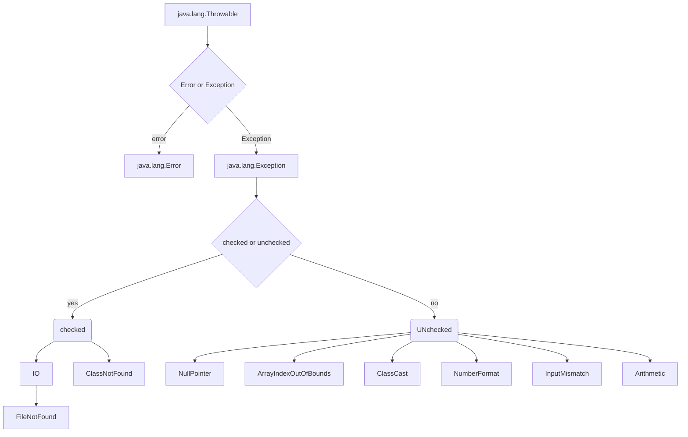
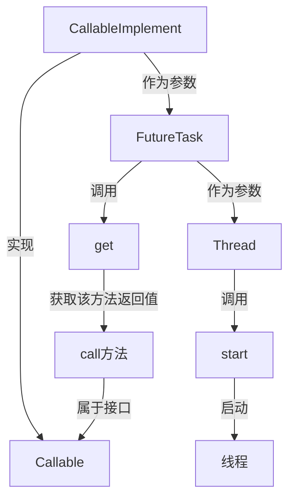

# Java

## 属性分类

###  属性（成员变量） vs  局部变量

1. 相同点：

    1.1  定义变量的格式：数据类型  变量名 = 变量值

    1.2  先声明，后使用

    1.3  变量都有其对应的作用域 

2. 不同点：

    2.1  在类中声明的位置的不同

    ​      - 属性：直接定义在类的一对{}内

    ​      - 局部变量：声明在方法内、方法形参、代码块内、构造器形参、构造器内部的变量

​		2.2 关于权限修饰符的不同

​             - 属性：可以在声明属性时，指明其权限，使用权限修饰符。

​             - 常用的权限修饰符：private、public、缺省、protected  --->封装性

​             目前，大家声明属性时，都使用缺省就可以了。

​             - 局部变量：不可以使用权限修饰符。

​		2.3 默认初始化值的情况：

​             - 属性：类的属性，根据其类型，都有默认初始化值。

​                       整型（byte、short、int、long）：0

​                       浮点型（float、double）：0.0

​                       字符型（char）：0  （或'\u0000'）

​                       布尔型（boolean）：false

​                       引用数据类型（类、数组、接口）：null

​              - 局部变量：**没有默认初始化值**。

​                         意味着，我们在调用局部变量之前，一定要显式赋值

​                         特别地：形参在调用时，我们赋值即可

​		2.4 在内存中加载的位置：

​				- 属性：加载到堆空间中（非static）

​				- 局部变量：加载到栈空间

### 静态属性 vs 非静态属性

非静态属性又叫实例变量

实例变量：当我们创建了类的多个对象，每个对象都独立有一套类中的非静态属性。修改其中一个对象的非静态属性时，不会影响其他对象。

静态变量：类的多个对象共享同一个静态变量

-   静态变量随着类的加载而加载，可以通过"类名.静态变量"来调用
-   静态变量的加载要早于对象的创建（在类的加载中的准备阶段）

## 创建内部类的方式

```java
class Person{
    //静态成员内部类
    static class Dog{}
    //非静态成员内部类
    class Bird{}
    public void method(){
        //局部内部类
        class AA{}
    }
    {
        //局部内部类
        class BB{}
    }
    public Person(){
        //局部内部类
        class CC{}
    }
}
```

```java
Person.Dog dog = new Person.Dog(); //静态
dog.show();
//创建Bird实例(非静态的成员内部类):
//Person.Bird bird = new Person.Bird();//错误的
Person p = new Person();
Person.Bird bird = p.new Bird();//非静态
```

## 异常体系结构



## 线程的创建和使用

###  方式一：继承于Thread类

1. 创建一个继承于Thread类的子类

2. 重写Thread类中的run()方法  -->将此线程执行的操作声明在run()中

3. 创建子类对象

4. 通过对象调用start()：①启动当前线程 ②调用当前线程的run()--->调用了Runnable类型的tarket的run()

    问题一：我们不能通过直接调用run()方法启动线程（这时run()的执行仍然在主线程中)

    问题二：再启动一个线程时不能重复通过start()启动线程（start()只能调用一次），只能重新创建一个子类对象

###  方式二：实现Runnable接口

1. 创建一个实现了Runnable接口的类
2. 实现类去实现Runnable中的抽象方法：run()
3. 创建实现类的对象
4. 将此对象作为参数传递到Thread类的构造器中，创建Thread类的对象
5. 通过Thread类的对象调用start()

**JDK5.0新增线程创建方式**

### 方式三：实现Callable接口

1. 创建一个实现Callable的实现类
2. 实现call()方法，将此线程需要执行的操作声明在call()中
3. 创建Callable接口实现类的对象
4. 将此Callable接口实现类的对象作为参数传递到FutureTask构造器中，创建FutureTask的对象
5. 将FutureTask的对象作为参数传递到Thread类的构造器中，创建Thread对象，并调用start()  ==这里是线程启动==
6. 获取Callable中call方法的返回值（使用futureTask.get()）
7. get()返回值即为FutureTask构造器参数Callable实现类重写的call()的返回值。 ==get()并不是启动线程的方法，只是获取call()的返回值==



> 如何理解实现Callable接口的方式创建多线程比实现Runnable接口创建多线程方式强大？
>
> 1. call()可以有返回值的
> 2. call()可以抛出异常，被外面的操作捕获，获取异常的信息
> 3. Callable是支持泛型的

### 方式四：使用线程池

经常创建和销毁、使用量特别大的资源，比如并发情况下的线程，对性能影响很大

提前创建好多个线程，放入线程池中，使用时直接获取，使用完放回池中。可以避免频繁创建销毁、实现重复利用。类似生活中的公共交通工具

**好处**

1. 提高响应速度（减少了创建新线程的时间）

2. 降低资源消耗（重复利用线程池中线程，不需要每次都创建）

3. 便于线程管理：

    corePoolSize：核心池的大小

    maximumPoolSize：最大线程数

    keepAliveTime：线程没有任务时最多保持多长时间后会终止

    .......

### 比较创建线程的两种方式

比较创建线程的两种方式

开发中：优先选择：实现Runnable接口的方式

原因：

1. 实现的方式没有类的单继承性的局限性

2. 实现的方式更适合来处理多个线程有共享数据的情况。

联系：public class Thread implements Runnable //实际上Thread也实现了Runnable接口

相同点：两种方式都需要重写run(),将线程要执行的逻辑声明在run()中。


## 线程的同步

当一个线程操作共享数据的时候，其它线程不能参与进来，直到线程操作完成共享数据，其他线程才可以操作共享数据。即使当前线程出现阻塞，也不能被改变。

在Java中，我们通过同步机制，来解决线程的安全问题。

### 方式一：同步代码块

```java
synchronized(同步监视器){
		//需要被同步的代码
}
```

1. 操作共享数据的代码，即为需要被同步的代码。  -->不能包含代码多了，也不能包含代码少了。

2. 共享数据：多个线程共同操作的变量。

3. 同步监视器，俗称：锁。**任何一个类的对象，都可以充当锁**。要求：多个线程必须要共用同一把锁。

    补充：在实现Runnable接口创建多线程的方式中，我们可以考虑使用this充当同步监视器；在继承Thread类创建多线程的方式中，慎用this充当同步监视器

### 方式二：同步方法

如果操作共享数据的代码完整的声明在一个方法中，我们不妨将此方法声明同步的。

关于同步方法的总结：同步方法仍然涉及到同步监视器，只是不需要我们显式的声明。

-   非静态的同步方法，同步监视器是：this
-   静态的同步方法，同步监视器是：当前类本身

### 方式三：Lock锁

​	从JDK 5.0开始，Java提供了更强大的线程同步机制——通过显式定义同步锁对象来实现同步。同步锁使用Lock对象充当。

1. 实例化ReentrantLock
2. 调用锁定方法lock()
3. 调用解锁方法：unlock()

> 面试题：synchronized 与 Lock的异同？
>
> 相同：二者都可以解决线程安全问题
>
> 不同：synchronized机制在执行完相应的同步代码以后，自动的释放同步监视器
>
> ​		  Lock需要手动的启动同步（lock()），同时结束同步也需要手动的实现（unlock()）
>
> 优先使用顺序:
>
> Lock->同步代码块（已经进入了方法体，分配了相应资源） ->  同步方法（在方法体之外）

**同步的方式，解决了线程的安全问题。---好处**

**操作同步代码时，只能有一个线程参与，其他线程等待。相当于是一个单线程的过程，效率低。 ---局限性**

## String不同拼接操作的对比

1. 常量与常量的拼接结果在常量池。且常量池中不会存在相同内容的常量

2. 只要其中有一个是变量，结果就在堆中
3. 如果拼接的结果调用intern()方法，返回值就在常量池中

## 其他

-   一个Java应用程序java.exe，其实至少有三个线程：**main()主线程，gc()垃圾回收线程，异常处理线程**。当然如果发生异常，会影响主线程


# 数据库

## SQL 语言分类

**DDL（Data Definition Languages、数据定义语言）**，这些语句定义了不同的数据库、表、视图、索引等数据库对象，还可以用来创建、删除、修改数据库和数据表的结构

**DML（Data Manipulation Language、数据操作语言）**，用于添加、删除、更新和查询数据库记录，并检查数据完整性。

**DCL（Data Control Language、数据控制语言）**，用于定义数据库、表、字段、用户的访问权限和安全级别。